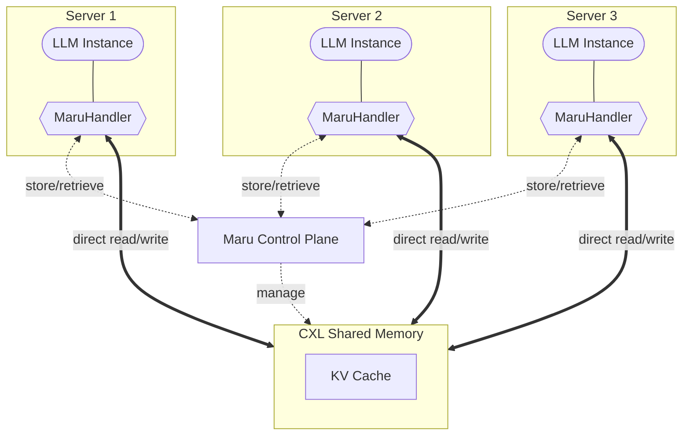

<p align="center">
  
</p>

<h3 align="center">Maru: High-Performance KV Cache Storage Engine on CXL Shared Memory</h3>

<p align="center">
  <a href="https://xcena-dev.github.io/maru/"></a>
  <a href="https://opensource.org/licenses/Apache-2.0"></a>
</p>

**Maru** is a high-performance **KV cache storage engine built on CXL shared memory**, designed for LLM inference scenarios where multiple instances need to share a KV cache with minimal latency.

Every existing KV cache sharing solution assumes that sharing means transferring — copying data across the network, byte by byte. As models get larger and contexts get longer, that assumption becomes a structural bottleneck. Maru rejects the premise entirely: **don't move data, share the memory.** Instances read and write KV cache data directly in CXL shared memory. Only lightweight metadata (tens of bytes) travels between components.

The left shows how KV cache is shared without Maru; the right shows how it works with Maru. No copies — just direct access to CXL shared memory.

<p align="center">
  
</p>

| [**Documentation**](https://xcena-dev.github.io/maru/) |

## Why Maru?

- **Zero-Copy Sharing** — Transfer-based systems — whether CPU-mediated or GPU-direct — require the receiver to allocate staging buffers and move data across an interconnect. Maru eliminates this entire path: every instance reads from the same shared memory region directly. No buffer allocation, no data copy, no serialization.

- **Scales with Context Length and Concurrency** — Network-based sharing degrades as contexts grow and more consumers hit the same KV. Maru never fans out KV payloads — scaling is bounded by shared-memory bandwidth, not network transfer.

- **Higher Hardware Utilization** — Instead of duplicating KV caches per instance, all instances draw from a shared CXL pool. Less duplication means more usable memory and higher effective cache capacity.

- **Lower System Energy** — Eliminating bulk data transfer cuts NIC and CPU power draw. Shorter data paths also reduce GPU idle time per request.

## Overview


> **Control Plane** (dashed arrows) — KV metadata operations and region allocation.
>
> **Data Plane** (solid arrows) — direct access to CXL shared memory, zero-copy. The data path is identical regardless of control plane mode.

## Quick Start

### System Components

Maru consists of two server components and a client library:

| Component | Role | Package |
|-----------|------|---------|
| **Resource Manager** | Manages the CXL memory pool | `maru-resource-manager` (C++) |
| **Metadata Server** | Manages KV metadata | `maru-server` (Python) |
| **MaruHandler** | Client library embedded in LLM instances | `maru` Python package |

All components run on the same machine in a single-node setup. For multi-node deployment, see the [installation guide](https://xcena-dev.github.io/maru/source/getting_started/installation.html#multi-node-configuration).


### Prerequisites

- OS: Ubuntu 24.04 LTS+
- Python: 3.12+
- gcc: 13.3.0+, cmake: 3.28.3+
- CXL DAX device (`/dev/dax*`) or emulation environment

```bash
sudo apt-get update
sudo apt-get install -y python3 python3-venv python3-pip git \
    build-essential cmake libnuma-dev
```

### Installation

```bash
git clone https://github.com/xcena-dev/maru
cd maru

python3 -m venv .venv
source .venv/bin/activate
./install.sh
```

### 1. Start the Resource Manager

The resource manager must be running before any other Maru service.

**Production** — start as a systemd daemon:

```bash
# Default (127.0.0.1:9850)
sudo systemctl start maru-resource-manager

# With custom host/port
sudo systemctl edit maru-resource-manager

[Service]
ExecStart=
ExecStart=/usr/local/bin/maru-resource-manager --host <ip> --port <port>

sudo systemctl restart maru-resource-manager
```

**Development/debugging** — run directly with custom options:

```bash
# Default (127.0.0.1:9850)
sudo maru-resource-manager --log-level debug

# With custom host/port
sudo maru-resource-manager --host <ip> --port <port> --log-level debug
```

> If you change the RM port, pass the same address to `maru-server`: `maru-server --rm-address 127.0.0.1:9851`

### 2. Start the Metadata Server

```bash
# Default (127.0.0.1:5555, connects to resource manager at 127.0.0.1:9850)
maru-server

# With custom host/port
maru-server --host <ip> --port <port>

# With custom resource manager address (default: 127.0.0.1:9850)
maru-server --rm-address <rm-ip>:<rm-port>
```

### Basic Usage

```python
from maru import MaruConfig, MaruHandler

config = MaruConfig(
    server_url="tcp://localhost:5555",
    pool_size=1024 * 1024 * 100,  # 100MB
)

with MaruHandler(config) as handler:
    data = b"A" * (1024 * 1024)  # 1MB KV chunk

    # 1. Allocate a page in CXL shared memory
    handle = handler.alloc(size=len(data))

    # 2. Write directly to CXL memory (mmap — no intermediate buffer)
    handle.buf[:] = data

    # 3. Register the key — only metadata (key → region, offset) is sent
    handler.store(key=42, handle=handle)

    # Retrieve: returns a memoryview pointing into CXL memory
    result = handler.retrieve(key=42)
    assert result is not None
    assert bytes(result.view[:5]) == b"AAAAA"
```

## LMCache Integration

Maru is configured as a native [LMCache](https://github.com/LMCache/LMCache) storage backend via the `maru_path` and `maru_pool_size` config fields. It supports both **P2P KV cache sharing** and **disaggregated prefill** scenarios.

```yaml
# LMCache config
maru_path: "maru://localhost:${MARU_SERVER_PORT}"
maru_pool_size: 4
```

For details on LMCache integration, see the [documentation](https://xcena-dev.github.io/maru/source/integration/lmcache.html).


## Tools

- **[pool_monitor](tools/)** — Real-time pool usage monitor (`top`-style TUI, CSV export)

## License

Copyright 2026 [XCENA Inc.](https://xcena.com) Licensed under the Apache License 2.0.
