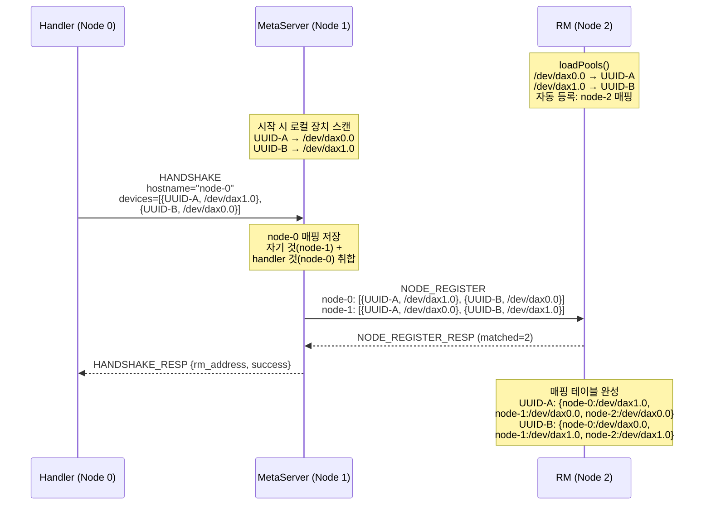
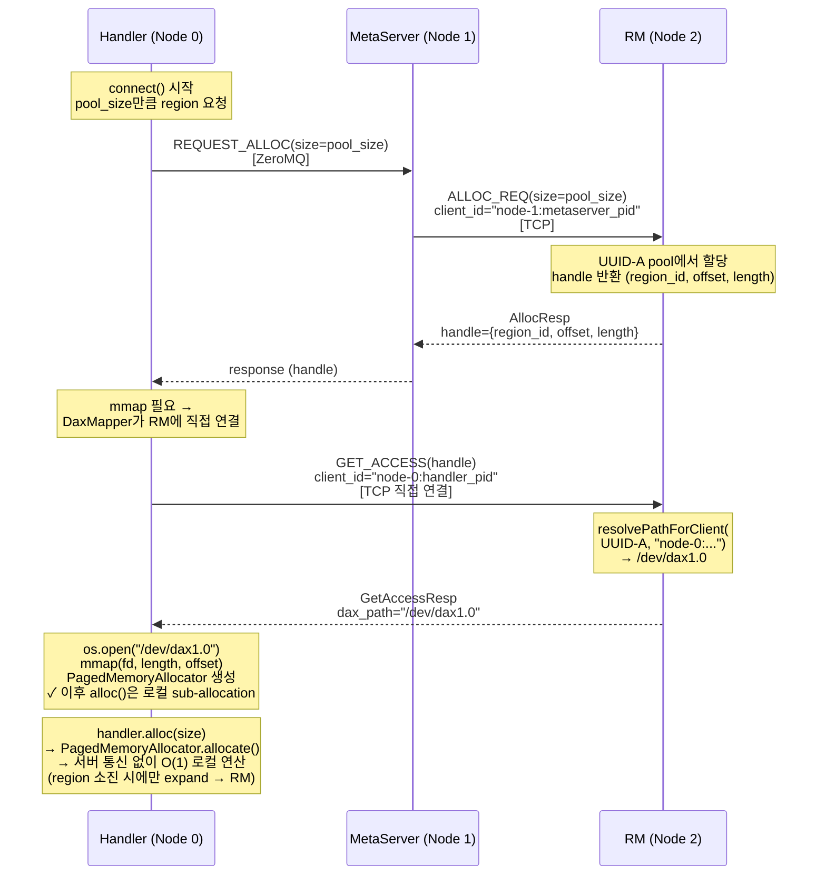

# Multi-Node CXL Device Mapping Design

## Problem

CXL switch 환경에서 동일한 물리 CXL 장치가 노드마다 다른 `/dev/daxX.Y` 경로로 보인다.

```
Physical Device A:  Node 0 → /dev/dax0.0,  Node 1 → /dev/dax1.0
Physical Device B:  Node 0 → /dev/dax1.0,  Node 1 → /dev/dax0.0
Physical Device C:  Node 0 → /dev/dax2.0,  Node 1 → /dev/dax2.0
```

현재 maru는 `dax_path` 문자열을 device identity로 사용하기 때문에, resource manager가 반환한 경로를 다른 노드에서 그대로 mmap하면 잘못된 물리 장치에 접근하게 된다.

## Solution: Device UUID + Server-Side Path Resolution

각 CXL 장치에 고유 UUID를 기록하고, resource manager가 클라이언트의 hostname을 보고 올바른 로컬 경로로 변환하여 응답한다. **클라이언트(handler) 코드 변경 없음** — UUID는 RM 내부 개념.

## Deployment Topology

어떤 토폴로지에서든 동작하도록 설계한다:

```
예시 1: RM과 MetaServer 분리
  Node 0: handler
  Node 1: handler + MetaServer
  Node 2: RM

예시 2: RM과 MetaServer 같은 노드
  Node 0: handler
  Node 1: handler + MetaServer + RM
```

**연결 경로:**

```
handler (Node 0) ─── ZeroMQ ──→ MetaServer (Node 1) ─── TCP ──→ RM (Node 2)
handler (Node 1) ─── ZeroMQ ──→ MetaServer (Node 1) ─── TCP ──→ RM (Node 2)
```

## Design Details

### 1. Device Header

각 CXL 장치(DEV_DAX)의 첫 번째 alignment 블록에 헤더를 기록한다.

```
Offset  Size  Field
──────  ────  ─────────────────────────────
0       8B    magic       "MARUDEV\0"
8       4B    version     1
12      16B   uuid        UUID v4 (128-bit, RFC 4122)
28      4B    reserved
```

- 헤더는 32바이트. 동적 할당의 시작 offset은 PoolManager가 `alignBytes`(보통 2MB)로 정렬하므로 헤더 크기와 무관.
- UUID는 RM 시작 시 자동 생성 (헤더 없는 장치 감지 시).
- 매직 넘버 불일치 시 초기화되지 않은 장치로 간주.
- 향후 CXL RPC 구현 시, 이 헤더는 고정 영역(~2.25MB)의 맨 앞에 통합된다.

**초기화 도구:**

```bash
# 장치에 UUID 헤더 기록 (1회)
maru-init-device /dev/dax0.0

# 기존 UUID 확인
maru-init-device --show /dev/dax0.0
# → UUID: 550e8400-e29b-41d4-a716-446655440000

# UUID 강제 재생성
maru-init-device --force /dev/dax0.0
```

### 2. Node Registration (HANDSHAKE 확장 + MetaServer 취합)

handler → MetaServer 간 기존 HANDSHAKE에 장치 목록을 실어 보내고, MetaServer가 모든 노드의 매핑을 취합하여 RM에 등록한다.

**등록 흐름:**

```
handler (Node 0)              MetaServer (Node 1)              RM (Node 2)
─────────────────             ──────────────────              ──────────
                               시작 시:
                               로컬 장치 스캔 → UUID 읽기
                               자체 매핑 저장:
                                 node-1: {UUID-A: /dev/dax0.0,
                                          UUID-B: /dev/dax1.0}

HANDSHAKE ───────────────────→
  hostname="node-0"            handler 매핑 저장:
  devices=[                      node-0: {UUID-A: /dev/dax1.0,
    {UUID-A, /dev/dax1.0},               UUID-B: /dev/dax0.0}
    {UUID-B, /dev/dax0.0}
  ]                            전체 취합 → NODE_REGISTER ───→
                                 node-0: [{UUID-A, /dev/dax1.0},
                      ←─ resp     {UUID-B, /dev/dax0.0}]       매핑 테이블 저장:
                                 node-1: [{UUID-A, /dev/dax0.0},  UUID-A:
                                  {UUID-B, /dev/dax1.0}]           node-0: /dev/dax1.0
                                                                   node-1: /dev/dax0.0
                                                                   node-2: /dev/dax0.0
                                                                 UUID-B:
                                                                   node-0: /dev/dax0.0
                                                                   node-1: /dev/dax1.0
                                                                   node-2: /dev/dax1.0
```

**새 handler가 나중에 접속하면:**
1. HANDSHAKE로 장치 목록 전달
2. MetaServer가 해당 노드 매핑 추가
3. MetaServer → RM: NODE_REGISTER 재전송 (업데이트)

**HANDSHAKE 확장 (handler → MetaServer, ZeroMQ RPC):**

```
기존 HANDSHAKE 요청:
  (empty)

변경 후 HANDSHAKE 요청:
  hostname: str                   "node-0"          (필수)
  devices: [                      로컬 장치 스캔 결과 (필수, CXL 장치 없으면 빈 리스트)
    { uuid: str, dax_path: str },
    { uuid: str, dax_path: str },
    ...
  ]

기존 HANDSHAKE 응답:
  { "success": true, "rm_address": "..." }

변경 후 HANDSHAKE 응답:
  { "success": true, "rm_address": "..." }   ← 변경 없음
```

**NODE_REGISTER RPC (MetaServer → RM, TCP binary IPC):**

```
NODE_REGISTER_REQ:
  num_nodes: uint32
  nodes[]:
    node_id_len: uint16
    node_id: bytes                hostname
    num_devices: uint32
    devices[]:
      uuid_len: uint16
      uuid: bytes                 "550e8400-e29b-..."
      path_len: uint16
      local_dax_path: bytes       "/dev/dax1.0"

NODE_REGISTER_RESP:
  status: int32
  matched: uint32                 RM이 알고 있는 UUID와 매치된 수
  total: uint32                   등록 요청된 장치 총 수
```

### 3. Resource Manager 내부 변경

**PoolState 확장:**

```cpp
struct PoolState {
    uint32_t poolId;
    std::string devPath;      // RM 로컬 경로 (기존)
    std::string deviceUuid;   // NEW: 헤더에서 읽은 UUID
    uint64_t totalSize;       // header_size만큼 차감
    uint64_t freeSize;
    uint64_t alignBytes;
    DaxType type;
    std::vector<Extent> freeList;
};
```

**Node Mapping Table:**

```cpp
// device_uuid → { hostname → local_dax_path }
std::map<std::string, std::map<std::string, std::string>> nodeMappings_;
```

**Path Resolution (핵심 로직):**

```cpp
std::string PoolManager::resolvePathForClient(
    const std::string &deviceUuid,
    const std::string &clientId)
{
    std::string hostname = extractHostname(clientId);  // "node-1:12345" → "node-1"

    // 로컬 클라이언트 → RM의 devPath 그대로
    if (hostname == localHostname()) {
        auto *pool = findPoolByUuid(deviceUuid);
        return pool ? pool->devPath : "";
    }

    // 원격 클라이언트 → 등록된 매핑에서 조회
    auto it = nodeMappings_.find(deviceUuid);
    if (it != nodeMappings_.end()) {
        auto nodeIt = it->second.find(hostname);
        if (nodeIt != it->second.end()) {
            return nodeIt->second;
        }
    }
    return "";  // 미등록 노드 → 에러
}
```

**`loadPoolFromDevice()` 변경:**

```cpp
int PoolManager::loadPoolFromDevice(...) {
    // 1. 헤더 읽기 (NEW)
    DeviceHeader hdr;
    if (readDeviceHeader(path, &hdr) != 0) {
        logf(LogLevel::Error,
             "Device %s: no valid header. Run maru-init-device first.",
             path.c_str());
        return -EINVAL;
    }

    // 2. 할당 가능 영역 = 헤더 이후부터
    uint64_t allocatableSize = devSize - hdr.headerSize;
    pool.deviceUuid = hdr.uuid;
    pool.freeList.push_back(Extent{hdr.headerSize, allocatableSize});

    // 3. 자기 노드 매핑 자동 등록
    nodeMappings_[hdr.uuid][localHostname()] = path;
}
```

**Alloc/GetAccess 응답 시 경로 변환:**

```cpp
// request_handler.cpp — handleAlloc, handleGetAccess 모두 적용
if (status == 0) {
    std::string clientPath = pm_.resolvePathForClient(
        selectedPool->deviceUuid, ctx.client_id);
    if (clientPath.empty()) {
        result.resp.status = -ENOENT;  // 미등록 노드
    } else {
        result.devicePath = clientPath;  // 변환된 경로 반환
    }
}
```

### 4. Allocation Flow (End-to-End)

#### Startup: 노드 등록



#### Allocation: handler(Node 0)가 connect() 시 초기 region 할당

connect() 시 `pool_size` 만큼 대량 선할당하고, 이후 alloc()은 로컬 sub-allocation (서버 통신 없음).



### 5. client_id와 경로 변환

MetaServer가 RM에 ALLOC을 요청할 때 client_id는 MetaServer의 hostname이다 (`"node-1:pid"`). 이건 MetaServer가 할당을 소유·관리하는 주체이므로 정상적인 동작이다.

경로 변환은 **handler가 직접 RM에 GET_ACCESS를 요청할 때** 일어난다. 현재 아키텍처에서 handler의 DaxMapper는 RM에 직접 TCP 연결하므로, GET_ACCESS의 client_id는 handler 자신의 hostname이 된다 (`"node-0:pid"`). RM은 이를 보고 올바른 노드의 경로를 반환한다.

```
ALLOC:       MetaServer → RM   client_id="node-1:pid"  → 할당 소유권 (경로 변환 불필요)
GET_ACCESS:  Handler → RM      client_id="node-0:pid"  → 경로 변환 (올바른 로컬 경로 반환)
```

**향후 고려사항:** dual-path를 제거하고 모든 통신을 MetaServer 경유로 변경할 경우, GET_ACCESS도 MetaServer를 거치게 되므로 handler의 hostname을 별도로 전달하는 메커니즘이 필요해진다 (e.g. ALLOC_REQ에 `on_behalf_of` 필드 추가).

## Breaking Changes

- **Device header 자동 생성**: RM 시작 시 DEV_DAX 장치에 32B 헤더 자동 기록 (기존 데이터의 첫 32바이트 덮어쓰기 — 신규 배포 전제)
- **HANDSHAKE 프로토콜 변경**: hostname + devices 필드 필수 (기존 handler 코드 수정 필요)

## 변경 범위

| 레이어 | 파일 | 변경 내용 |
|--------|------|----------|
| **신규** | `device_header.h/cpp` | UUID 헤더 읽기/쓰기, 매직 검증 |
| **신규** | `maru-init-device` (CLI) | 장치 초기화 도구 |
| **C++ RM** | `pool_manager.h/cpp` | PoolState에 uuid 추가, 헤더 읽기, free list 오프셋 조정, 매핑 테이블, `resolvePathForClient()` |
| **C++ RM** | `request_handler.cpp` | alloc/getAccess 응답 시 경로 변환 호출 |
| **C++ RM** | `tcp_server.cpp` | NODE_REGISTER 메시지 핸들링 |
| **IPC** | `ipc.h`, `ipc.py` | NODE_REGISTER 메시지 타입 추가 |
| **Python** | `handler.py` | HANDSHAKE 시 로컬 장치 스캔 + UUID 읽기 + 목록 전송 |
| **Python** | `server.py` | HANDSHAKE에서 handler 장치 목록 수집, 취합 후 NODE_REGISTER → RM |
| **Python** | `rpc_handler_mixin.py` | HANDSHAKE 핸들러 확장 (장치 목록 수신) |

**변경 불필요:** client.py (mmap 로직), AllocResp 와이어 포맷, 커넥터 (vLLM/SGLang)

## Design Decisions

| # | 질문 | 결정 |
|---|------|------|
| 1 | UUID 자동 초기화 vs 수동 초기화 | **자동 초기화** — RM이 헤더 없는 장치를 만나면 UUID 자동 생성/기록. 핫플러그 없으므로 시작 시 1회면 충분. |
| 2 | FS_DAX 지원 | **DEV_DAX만 대상** — FS_DAX는 기존 동작 유지. `resolvePathForClient()`에서 `deviceUuid`가 비어있으면 경로 변환 skip. |
| 3 | 헤더 크기 | **32바이트** — 동적 할당 alignment는 PoolManager가 처리. 향후 CXL RPC 고정 영역에 통합. |
| 4 | 미등록 노드 처리 | **에러 반환** — `resolvePathForClient()`가 빈 문자열 반환 시 `-ENOENT`. |

## Open Questions

1. **Single-path 리팩토링 시 client_id** — 향후 dual-path를 제거하고 모든 통신을 MetaServer 경유로 변경할 경우, GET_ACCESS의 client_id를 handler hostname으로 전달하는 메커니즘 필요 (e.g. `on_behalf_of` 필드).

---

## Implementation Plan

### Phase 1: Device Header (C++)

RM이 DEV_DAX 장치에서 UUID를 읽고/쓰는 기능.

**1-1. `device_header.h/cpp` 신규 생성**

```
maru_resource_manager/src/device_header.h
maru_resource_manager/src/device_header.cpp
```

- `DeviceHeader` 구조체 (magic, version, uuid)
- `readDeviceHeader(const std::string &devPath, DeviceHeader &out)` — 장치 mmap → 헤더 읽기 → magic 검증
- `writeDeviceHeader(const std::string &devPath, const DeviceHeader &hdr)` — 장치 mmap → 헤더 쓰기
- `generateUuid()` — UUID v4 생성 (랜덤)
- magic: `"MARUDEV\0"` (8바이트), version: `1`

**1-2. `pool_manager.cpp` 수정 — `loadPoolFromDevice()`**

- DEV_DAX 장치 로드 시 `readDeviceHeader()` 호출
- magic 불일치 → `writeDeviceHeader()`로 자동 초기화 (UUID 생성)
- `PoolState.deviceUuid` 필드 추가 및 저장
- free list 시작: `Extent{HEADER_SIZE, size - HEADER_SIZE}` (HEADER_SIZE=32)
- FS_DAX: 헤더 로직 skip, `deviceUuid = ""`

**1-3. `pool_manager.h` 수정 — PoolState 확장**

- `std::string deviceUuid` 필드 추가
- `PoolState *findPoolByUuid(const std::string &uuid)` 메서드 추가

**검증:** RM 빌드 + 기존 테스트 통과, 장치 로드 시 UUID 읽기/자동 생성 확인

### Phase 2: Node Mapping Table & Path Resolution (C++)

RM 내부에 노드별 경로 매핑 테이블과 변환 로직 추가.

**2-1. `pool_manager.h/cpp` — 매핑 테이블**

- `nodeMappings_`: `map<string, map<string, string>>` (uuid → {hostname → local_dax_path})
- `loadPoolFromDevice()`에서 자기 노드 자동 등록: `nodeMappings_[uuid][localHostname()] = devPath`
- `registerNode(nodeId, vector<{uuid, path}>)` — 원격 노드 매핑 등록/업데이트
- `resolvePathForClient(deviceUuid, clientId)` — hostname 추출 → 매핑 조회 → 로컬 경로 반환

**2-2. `request_handler.cpp` — alloc/getAccess 응답 시 경로 변환**

- `handleAlloc()`: 할당 후 `resolvePathForClient()` 호출하여 `result.devicePath` 설정
- `handleGetAccess()`: 동일하게 경로 변환 적용
- `deviceUuid`가 비어있으면 (FS_DAX) 기존 경로 그대로 반환

**검증:** 단일 노드에서 경로가 기존과 동일하게 반환되는지 확인 (regression 없음)

### Phase 3: NODE_REGISTER RPC (C++ + Python)

MetaServer → RM 간 노드 매핑 등록 프로토콜.

**3-1. `ipc.h` — 메시지 타입 추가**

- `MsgType::NODE_REGISTER_REQ`, `MsgType::NODE_REGISTER_RESP` 추가

**3-2. `tcp_server.cpp` — NODE_REGISTER 핸들링**

- payload 파싱: num_nodes → 각 node의 {node_id, devices[{uuid, path}]}
- `handler_.handleNodeRegister()` 호출
- 응답: status + matched count

**3-3. `request_handler.h/cpp` — `handleNodeRegister()`**

- `pm_.registerNode()` 호출하여 매핑 테이블 업데이트
- matched 수 계산 (RM이 알고 있는 UUID와 매치된 수)

**3-4. `ipc.py` — Python 측 NODE_REGISTER 메시지**

- `NodeRegisterReq` / `NodeRegisterResp` dataclass
- `pack()` / `unpack()` 구현

**3-5. `client.py` (MaruShmClient) — `register_node()` 메서드**

- NODE_REGISTER_REQ 전송 + 응답 수신

**검증:** MaruShmClient에서 register_node() 호출 → RM 매핑 테이블 업데이트 확인

### Phase 4: HANDSHAKE 확장 + MetaServer 취합 (Python)

Handler → MetaServer HANDSHAKE에 장치 목록 포함, MetaServer가 취합하여 RM에 등록.

**4-1. `handler.py` — HANDSHAKE 시 장치 목록 전송**

- `connect()` 시 로컬 DEV_DAX 장치 스캔 + UUID 읽기
- 장치 스캔: `/sys/bus/dax/devices` 읽기 → `/dev/daxX.Y` 목록
- UUID 읽기: 각 장치 mmap → 헤더 32바이트 → magic 검증 → UUID 추출
- HANDSHAKE 요청에 `hostname` + `devices` 필드 추가

**4-2. `rpc_handler_mixin.py` — HANDSHAKE 핸들러 확장**

- `_handle_handshake()`: 요청에서 hostname + devices 추출
- MetaServer 내부에 노드별 매핑 저장

**4-3. `server.py` — MetaServer 취합 + NODE_REGISTER**

- 자기 노드 장치 스캔 (시작 시)
- handler HANDSHAKE마다: 해당 노드 매핑 추가 → 전체 매핑 취합 → RM에 NODE_REGISTER 전송
- `AllocationManager` 또는 별도 `MaruShmClient` 인스턴스를 통해 RM과 통신

**4-4. 장치 스캔 유틸리티 (공통 모듈)**

- `maru_shm/device_scanner.py` (신규): `scan_dax_devices()`, `read_device_uuid(path)` 
- C++ 헤더와 동일한 magic/version/uuid 파싱 로직
- handler.py와 server.py 양쪽에서 사용

**검증:** 
- handler 접속 시 HANDSHAKE에 장치 목록 포함 확인
- MetaServer가 RM에 NODE_REGISTER 전송 확인
- RM 매핑 테이블에 모든 노드 등록 확인

### Phase 5: 통합 테스트

**5-1. 단위 테스트**

- `test_device_header.cpp` — 헤더 읽기/쓰기/자동 초기화 (mock device 사용)
- `test_pool_manager_uuid.cpp` — UUID 로딩, findPoolByUuid, resolvePathForClient
- `test_node_register.py` — NODE_REGISTER pack/unpack roundtrip
- `test_device_scanner.py` — Python 장치 스캔 + UUID 읽기
- `test_handshake_devices.py` — HANDSHAKE 장치 목록 포함 확인

**5-2. 통합 테스트 (multi-node 시뮬레이션)**

- mock으로 2개 노드 시뮬레이션: 같은 UUID, 다른 dax_path
- handler(node-0) → MetaServer(node-1) → RM(node-2) 전체 flow
- GET_ACCESS 시 올바른 노드 경로 반환 확인
