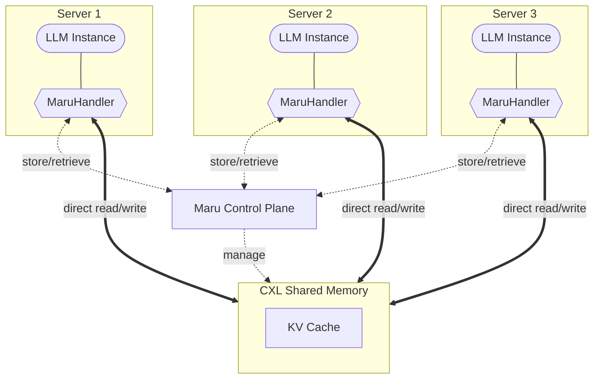
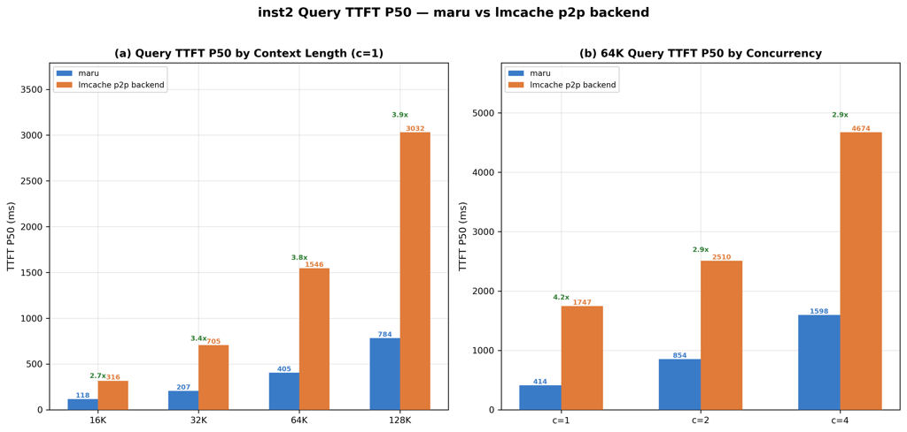

# Maru

**Maru** is a high-performance **KV cache storage engine built on CXL shared memory**, designed for LLM inference scenarios where multiple instances need to share a KV cache with minimal latency.

Every existing KV cache sharing solution assumes that sharing means transferring — copying data across the network, byte by byte. As models get larger and contexts get longer, that assumption becomes a structural bottleneck. Maru rejects the premise entirely: **don't move data, share the memory.** Instances read and write KV cache data directly in CXL shared memory. Only lightweight metadata (tens of bytes) travels between components.

The left shows how KV cache is shared without Maru; the right shows how it works with Maru. No copies — just direct access to CXL shared memory.

<div style="overflow:hidden;">
<div style="display:flex; justify-content:space-around; margin-bottom:4px;">
<strong>Without Maru</strong>
<strong>With Maru</strong>
</div>

</div>

## Key Features

- **Zero-Copy Sharing** — Transfer-based systems — whether CPU-mediated or GPU-direct — require the receiver to allocate staging buffers and move data across an interconnect. Maru eliminates this entire path: every instance reads from the same shared memory region directly. No buffer allocation, no data copy, no serialization.

- **Scales with Context Length and Concurrency** — Network-based sharing degrades as contexts grow and more consumers hit the same KV. Maru never fans out KV payloads — scaling is bounded by shared-memory bandwidth, not network transfer.

- **Higher Hardware Utilization** — Instead of duplicating KV caches per instance, all instances draw from a shared CXL pool. Less duplication means more usable memory and higher effective cache capacity.

- **Lower System Energy** — Eliminating bulk data transfer cuts NIC and CPU power draw. Shorter data paths also reduce GPU idle time per request.

---

## Architecture



See {doc}`Architecture Overview <source/design_doc/architecture_overview>` for the full design.  

---

## Benchmark



*P2P KV cache reuse, meta-llama/Llama-3.1-8B-Instruct, single-node. TTFT P50 (ms), lower is better. Multi-node results coming soon.*

See {doc}`full benchmark results <source/performance/lmcache>` for detailed TTFT, concurrency, and power efficiency comparisons.

---

::::admonition Name

<br>

:::{image} source/image/maru.png
:width: 250px
:alt: Maru
:align: center
:::

<br>

Maru (/mɑːruː/) — named after the *maru* (마루), the central open floor in traditional Korean architecture where all rooms connect and people freely gather and share.
::::

---

## Getting Started

- {doc}`Installation <source/getting_started/installation>`
- {doc}`Quick Start <source/getting_started/quick_start>`
- {doc}`Architecture Overview <source/design_doc/architecture_overview>`

```{toctree}
:maxdepth: 2
:caption: Getting Started
:hidden:

Installation <source/getting_started/installation>
Quickstart <source/getting_started/quick_start>
More Examples <source/getting_started/examples/index>
```

```{toctree}
:maxdepth: 2
:caption: Design Docs
:hidden:

Architecture Overview <source/design_doc/architecture_overview>
Memory Model <source/design_doc/memory_model>
KV Cache Management <source/design_doc/kv_cache_management>
Consistency and Safety <source/design_doc/consistency_and_safety>
```

```{toctree}
:maxdepth: 2
:caption: Integration
:hidden:

LMCache Integration <source/integration/lmcache>
```

```{toctree}
:maxdepth: 1
:caption: API Reference
:hidden:

Python API <source/api_reference/api>
Configuration <source/api_reference/config>
```

## Future Work

- **NUMA node support for CXL memory** — Currently Maru requires CXL memory to be exposed as devdax devices (`/dev/dax*`). We plan to support CXL memory mapped as NUMA nodes, enabling broader hardware compatibility and simplified deployment.

- **Direct integration with inference frameworks** — Native KV cache connectors for vLLM and SGLang, enabling zero-copy shared memory without intermediate middleware dependencies.

- **CXL-based Near Data Processing (NDP)** — Offloading KV cache operations — such as compression/decompression, prefix matching, and eviction scoring — to compute-capable CXL devices, reducing host CPU overhead and data movement.

```{toctree}
:maxdepth: 1
:caption: Performance
:hidden:

LMCache Benchmark <source/performance/lmcache>
```

```{toctree}
:caption: Contact
:hidden:

Contact Us <https://xcena.com/Contact>
```