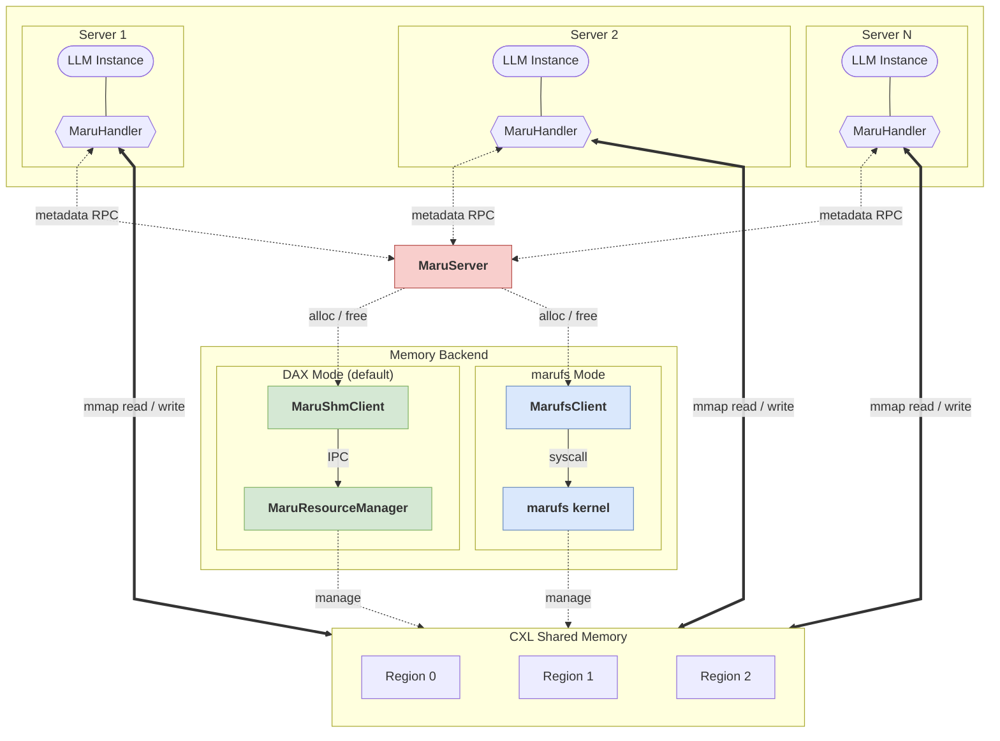
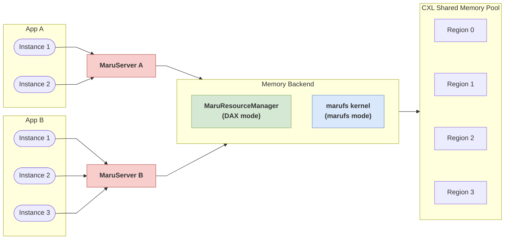
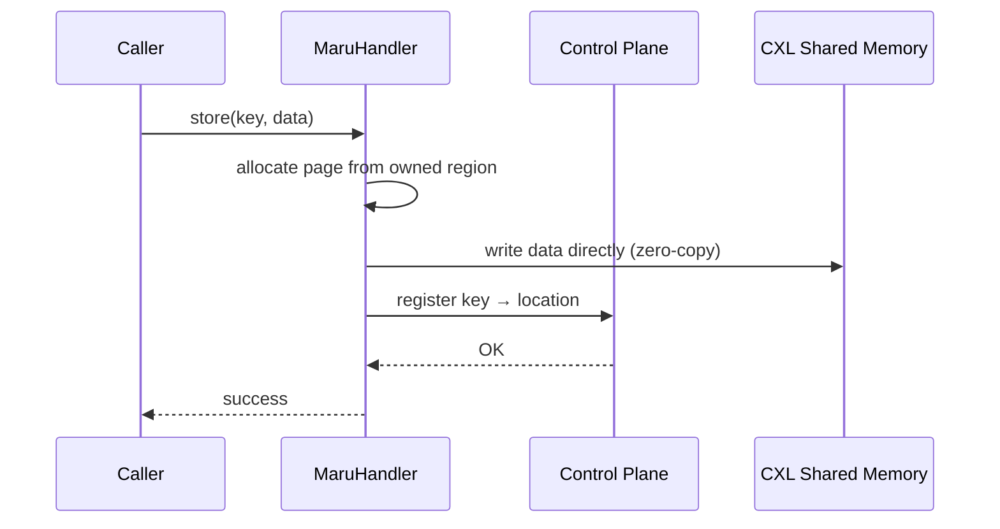
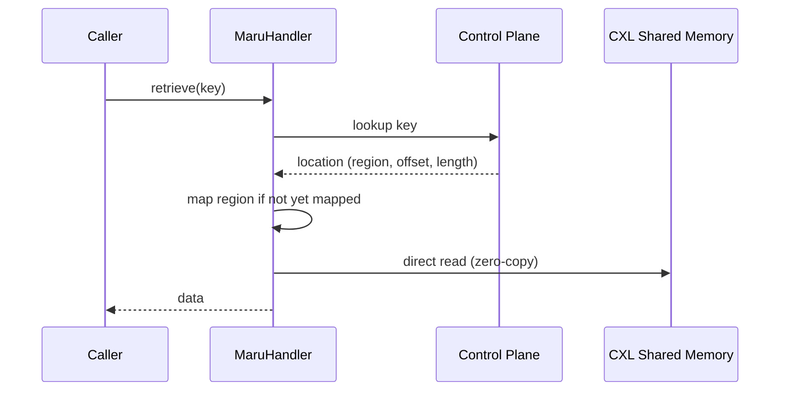
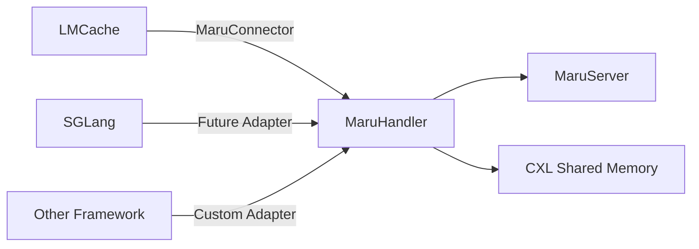

# Architecture Overview

Maru manages KV cache data in CXL shared memory, enabling cross-instance sharing across multiple nodes without data transfer.

---

## System Architecture



> **Control Plane** (dashed arrows) — KV metadata operations and region allocation.
>
> **Data Plane** (solid arrows) — direct access to CXL shared memory, zero-copy. The data path is identical regardless of control plane mode.

The system has three layers:

| Layer | Role | Components |
|-------|------|------------|
| **Client** | KV operations, page allocation, region mapping | MaruHandler |
| **Metadata** | Key registry, allocation lifecycle | MaruServer |
| **Memory** | Physical region alloc/free, mmap | MaruShmClient → MaruResourceManager (DAX mode) |
| | | MarufsClient → marufs kernel (marufs mode) |

Both the server (AllocationManager) and clients (DaxMapper) use the same memory backend. The backend is selected by the server's `mount_path` configuration: when set, `MarufsClient` is used; otherwise, `MaruShmClient` communicates with `MaruResourceManager`. In marufs mode, MaruResourceManager is not used — the marufs kernel manages CXL memory directly. The choice is transparent to MaruHandler and all upper layers.

---

## Key Design Properties

**Zero-copy data path.** Clients access KV data directly in shared memory — no server process ever touches the data path (dashed arrows in the diagram). The only traffic on the control plane is lightweight metadata; the data itself never moves. This strict control/data plane separation means data-path performance is bounded by memory bandwidth, not by software overhead.

**Per-application control plane.** Each application group runs its own MaruServer for metadata isolation (e.g., app A with 2 instances, app B with 3 instances). In DAX mode, a single MaruResourceManager manages the shared memory pool across all groups. In marufs mode, the marufs kernel manages CXL memory directly.



**Pluggable memory backend.** The data access layer is isolated behind the `DaxMapper` abstraction, so the memory backend can change without affecting the control plane or upper layers. The default backend (`MaruShmClient`) accesses CXL devices directly via DAX. When the server is configured with a marufs mount path, `MarufsClient` is selected instead, accessing CXL memory through the marufs VFS — adding kernel-level permission control (via `perm_set_default` / `perm_grant`) without changing the data flow.

**Capability-based memory access.** In DAX mode, clients never open shared memory devices directly — the Resource Manager acts as a capability broker, issuing authorized handles that grant access to specific memory regions. In marufs mode, the kernel enforces access control via `perm_set_default` and `perm_grant`, restricting which processes can open and mmap region files. In both cases, clients are decoupled from the underlying memory technology.

---

## Data Flow

### Store



Data is written to shared memory **before** the key is registered. Other instances can never observe a partial write — the key only becomes visible after the data is fully committed.

### Retrieve (cross-instance)



Every retrieve requires one metadata lookup via the control plane. Once a region is mapped, the mapping is cached for subsequent accesses to the same region — only the first access to a given region incurs the mmap cost.

---

## Extensibility

MaruHandler is **framework-independent**. Its interface operates on string keys and memory views — a minimal, framework-neutral contract. Any inference framework can integrate with Maru by writing a thin adapter layer (typically under 200 lines) that converts framework-specific cache keys to strings and delegates to MaruHandler's store/retrieve API.



> **See also:** [LMCache Integration](../integration/lmcache.md),
> [MaruHandler Design](maru_handler.md)

```{toctree}
:hidden:

Maru Handler <maru_handler>
Maru Server <maru_server>
Maru Resource Manager <maru_resource_manager>
Maru FS <maru_fs>
```
