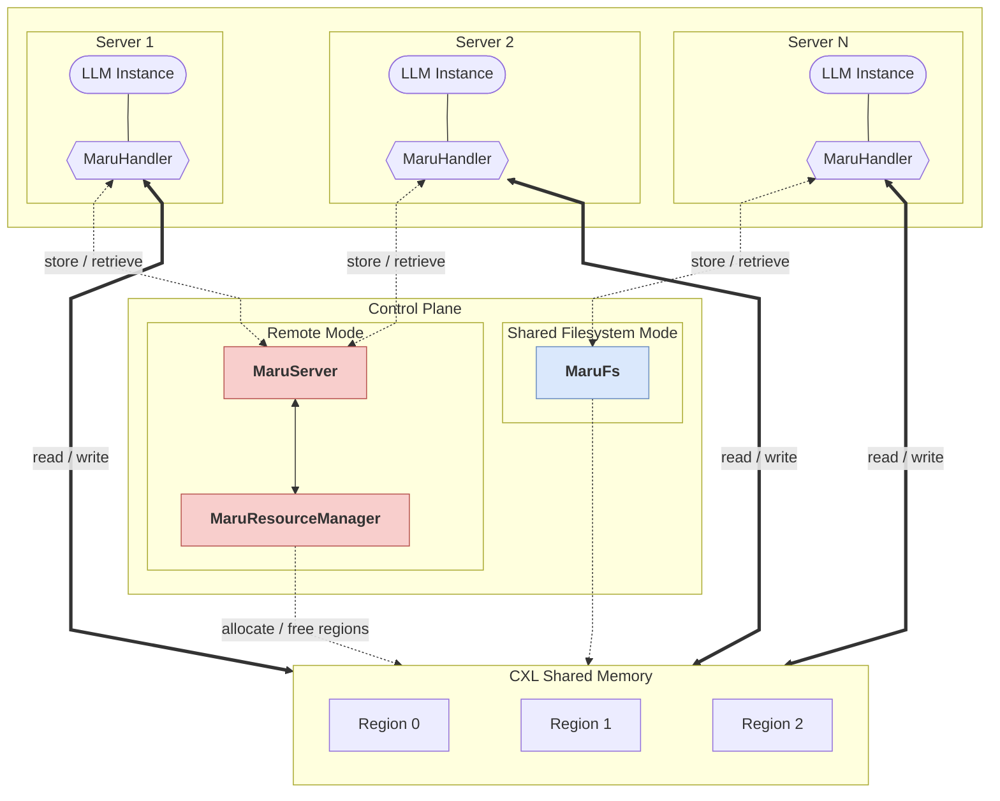
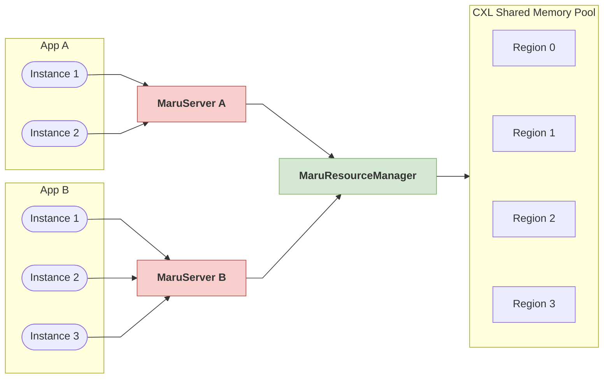
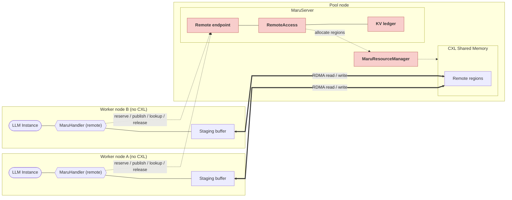
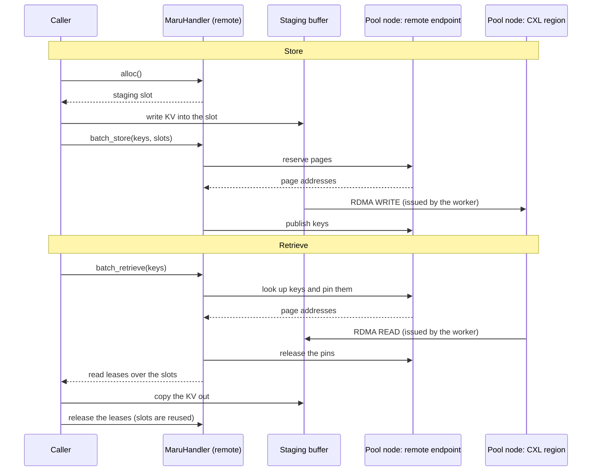
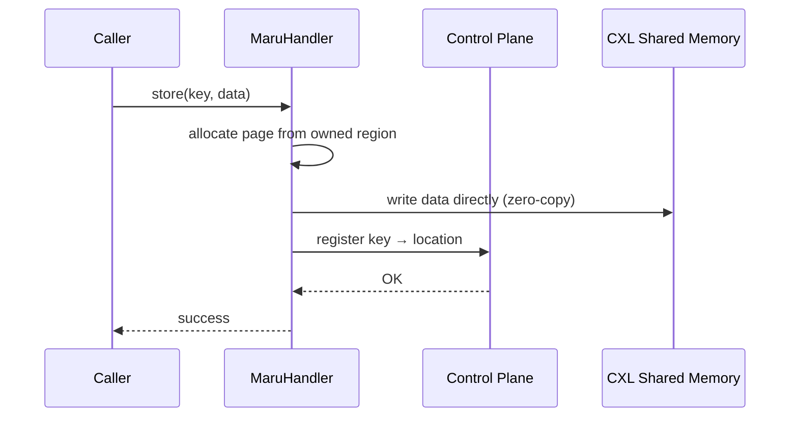
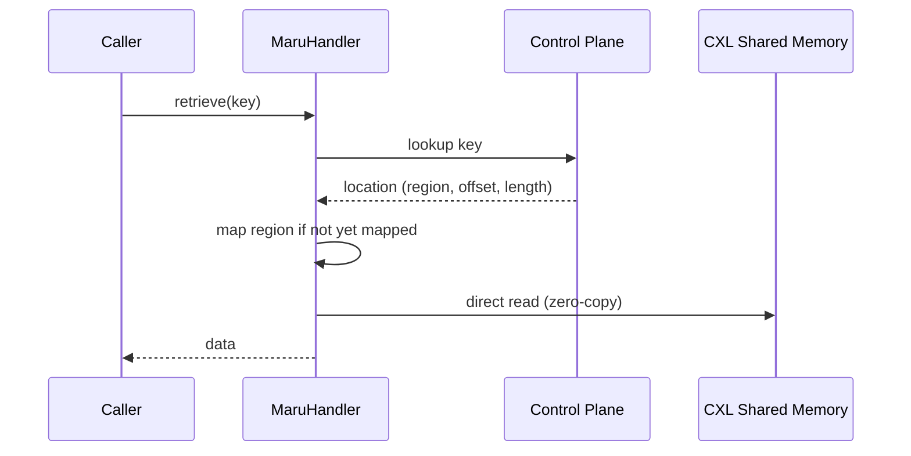
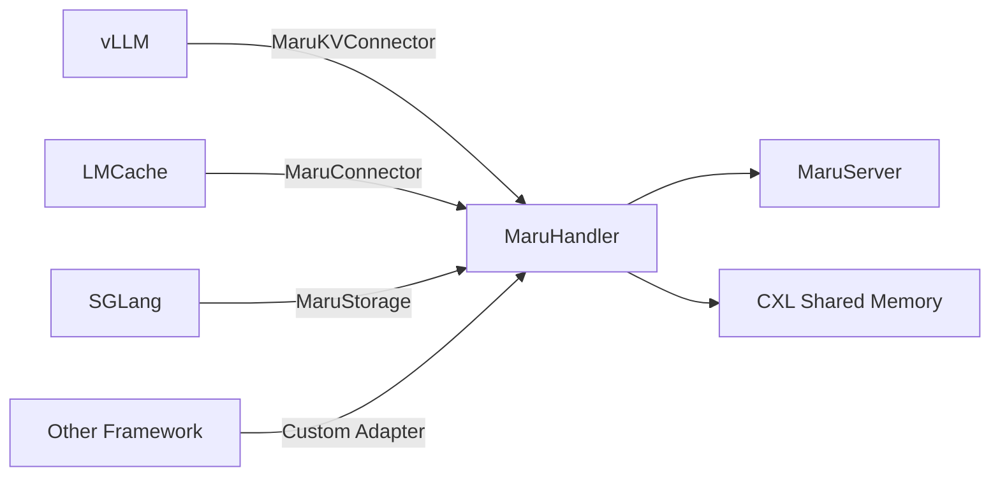

# Architecture Overview

Maru manages KV cache data in CXL shared memory, enabling cross-instance sharing across multiple nodes without data transfer. This page describes nodes attached to the CXL device, which is what the default storage backend (`cxl`) uses. Nodes without CXL reach a pool node's CXL memory over RDMA through the remote CXL pool, the storage backend `remote` (see {ref}`Storage Backends <storage-backends>` below); it is unrelated to the control plane's Remote mode below.

---

## System Architecture


```mermaid
%%{ init: { "flowchart": { "curve": "linear" } } }%%
flowchart TB
    subgraph Instances[" "]
        direction LR
        subgraph SN["Server N"]
            direction TB
            V1(["LLM Instance"])
            H1{{"MaruHandler"}}
            V1 --- H1
        end
        subgraph S2["Server 2"]
            direction TB
            V2(["LLM Instance"])
            H2{{"MaruHandler"}}
            V2 --- H2
        end
        subgraph S1["Server 1"]
            direction TB
            V3(["LLM Instance"])
            H3{{"MaruHandler"}}
            V3 --- H3
        end
    end

    subgraph ControlPlane["Control Plane"]
        direction LR
        subgraph Remote["Remote Mode"]
            direction TB
            MS["MaruServer"]:::maru
            D["MaruResourceManager"]:::maru
            MS <--> D
        end
        subgraph Filesystem["Shared Filesystem Mode"]
            direction TB
            FS["MaruFs"]:::fs
        end
    end

    H1 <-.->|"store / retrieve"| FS
    H2 <-.->|"store / retrieve"| MS
    H3 <-.->|"store / retrieve"| MS

    subgraph CXL["CXL Shared Memory"]
        direction LR
        R0["Region 0"] ~~~ R1["Region 1"] ~~~ R2["Region 2"]
    end

    D -.->|"allocate / free regions"| CXL
    FS -.-> CXL

    H1 <==>|"read / write"| CXL
    H2 <==>|"read / write"| CXL
    H3 <==>|"read / write"| CXL

    classDef maru fill:#f8cecc,stroke:#b85450,font-weight:bold
    classDef fs fill:#dae8fc,stroke:#6c8ebf,font-weight:bold
```

> **Control Plane** (dashed arrows) — KV metadata operations and region allocation.
>
> **Data Plane** (solid arrows) — direct access to CXL shared memory, zero-copy. With the default `cxl` storage backend, the data path is identical regardless of control plane mode.

The system has three layers:

| Layer | Role | Components |
|-------|------|------------|
| **Client** | KV operations, page allocation, region mapping | MaruHandler |
| **Metadata** | Key registry, allocation lifecycle | MaruServer (Remote) / marufs (Filesystem) |
| **Memory** | Shared memory pool, capability issuance, crash recovery | MaruResourceManager (Remote) / marufs (Filesystem) |

---

## Key Design Properties

**Zero-copy data path.** Clients access KV data directly in shared memory — no server process ever touches the data path (dashed arrows in the diagram). The only traffic on the control plane is lightweight metadata; the data itself never moves. This strict control/data plane separation means data-path performance is bounded by memory bandwidth, not by software overhead. The remote CXL pool keeps the separation across nodes: workers move KV bytes with one-sided RDMA between their staging buffer and the pool, so no server process copies them either.

**Per-application control plane.** Each application group runs its own metadata service for isolation (e.g., app A with 2 instances, app B with 3 instances). A single Resource Manager manages the shared memory pool across all groups. The diagram below illustrates this in Remote mode:


```mermaid
%%{ init: { "flowchart": { "curve": "linear" } } }%%
flowchart LR
    subgraph AppA["App A"]
        direction TB
        A1(["Instance 1"])
        A2(["Instance 2"])
    end

    subgraph AppB["App B"]
        direction TB
        B1(["Instance 1"])
        B2(["Instance 2"])
        B3(["Instance 3"])
    end

    MSA["MaruServer A"]:::maru
    MSB["MaruServer B"]:::maru
    RM["MaruResourceManager"]:::rm

    A1 & A2 --> MSA
    B1 & B2 & B3 --> MSB
    MSA & MSB --> RM

    subgraph CXL["CXL Shared Memory Pool"]
        direction TB
        R0["Region 0"] ~~~ R1["Region 1"] ~~~ R2["Region 2"] ~~~ R3["Region 3"]
    end

    RM --> CXL

    classDef maru fill:#f8cecc,stroke:#b85450,font-weight:bold
    classDef rm fill:#d5e8d4,stroke:#82b366,font-weight:bold
```

**Pluggable control plane.** The control plane is isolated behind a stable interface, so its implementation can change without affecting the data path. Remote mode (current) uses a centralized MaruServer + MaruResourceManager. Shared Filesystem mode (in development) replaces both with MaruFs, enforcing memory access control at the kernel level for stronger security than user-space RPC.

**Capability-based memory access.** Clients never open shared memory devices directly. The Resource Manager acts as a capability broker, issuing authorized handles that grant access to specific memory regions (the Memory layer in the diagram). This confines hardware access to a single trusted process and decouples clients from the underlying memory technology.

---

(storage-backends)=
## Storage Backends

`MaruConfig.storage_backend` decides where a handler keeps KV bytes. Everything above describes the default, `cxl`. The other backends keep the same `store`/`retrieve` API but hand out read leases instead of shared mappings: a read returns a view that the caller releases after copying it.

| Backend | Where KV bytes live | Who can read them | Data path |
|---------|---------------------|-------------------|-----------|
| `cxl` (default) | CXL shared memory attached to the node | Every instance that uses the same MaruServer, on nodes attached to the CXL device | Direct load/store on mapped regions, zero-copy |
| `cpu` | The worker's own DRAM | Only the engine that stored them | Host copies; MaruServer (`--cpu-only`) tracks locations and capacity |
| `mixed` | The worker's DRAM and CXL regions it owns | Only the engine that stored them | Host copies to either pool, in a configured write and read order |
| `remote` | A CXL pool on another node (the pool node) | Every engine that reaches the pool node over RDMA and uses the same cache namespace and model | One-sided RDMA (NIXL) between a local staging buffer and the pool |

### Remote CXL pool

The name is unrelated to the **Remote mode** of the control plane above. Remote mode says how the control plane is built (MaruServer and the resource manager over RPC, as opposed to Shared Filesystem mode); the remote CXL pool is a storage backend, and its pool node runs a Remote mode MaruServer.

The `remote` backend lets nodes without CXL share one node's CXL memory. Only the pool node has the CXL device. Its MaruServer opens a remote endpoint (`--remote-bind`) next to its usual RPC endpoint, and a component inside it, RemoteAccess, allocates remote regions from the resource manager, maps them and registers them with the node's RDMA NIC. A worker keeps the vLLM connector (`MaruKVConnector`) and its MaruHandler, configured with `storage_backend="remote"`; it opens no DAX device and runs no MaruServer of its own. The SGLang and LMCache adapters use the `cxl` backend only.


```mermaid
%%{ init: { "flowchart": { "curve": "linear" } } }%%
flowchart LR
    subgraph WA["Worker node A (no CXL)"]
        direction TB
        IA(["LLM Instance"])
        HA{{"MaruHandler (remote)"}}
        SA["Staging buffer"]
        IA --- HA --- SA
    end
    subgraph WB["Worker node B (no CXL)"]
        direction TB
        IB(["LLM Instance"])
        HB{{"MaruHandler (remote)"}}
        SB["Staging buffer"]
        IB --- HB --- SB
    end
    subgraph PN["Pool node"]
        direction TB
        subgraph MSP["MaruServer"]
            direction TB
            EP["Remote endpoint"]:::maru
            RA["RemoteAccess"]:::maru
            LED["KV ledger"]:::maru
            EP --- RA --- LED
        end
        RMP["MaruResourceManager"]:::maru
        subgraph CXLP["CXL Shared Memory"]
            RR["Remote regions"]
        end
    end

    HA & HB -.->|"reserve / publish / lookup / release"| EP
    SA & SB <==>|"RDMA read / write"| RR
    RA -.->|"allocate regions"| RMP
    RMP -.-> CXLP

    classDef maru fill:#f8cecc,stroke:#b85450,font-weight:bold
```

> **Control** (dashed arrows) — small requests from each worker to the pool node's remote endpoint, and region allocation on the pool node.
>
> **Data** (thick arrows) — KV bytes, moved by the worker's NIC directly between its staging buffer and the pool's registered regions. Neither MaruServer nor the resource manager copies them. Thin solid lines only connect the parts of one process.


```mermaid
sequenceDiagram
    participant C as Caller
    participant H as MaruHandler (remote)
    participant S as Staging buffer
    participant EP as Pool node: remote endpoint
    participant P as Pool node: CXL region

    Note over C,P: Store
    C->>H: alloc()
    H-->>C: staging slot
    C->>S: write KV into the slot
    C->>H: batch_store(keys, slots)
    H->>EP: reserve pages
    EP-->>H: page addresses
    S->>P: RDMA WRITE (issued by the worker)
    H->>EP: publish keys
    Note over C,P: Retrieve
    C->>H: batch_retrieve(keys)
    H->>EP: look up keys and pin them
    EP-->>H: page addresses
    P->>S: RDMA READ (issued by the worker)
    H->>EP: release the pins
    H-->>C: read leases over the slots
    C->>S: copy the KV out
    C->>H: release the leases (slots are reused)
```

As on a CXL-attached node, data is written before its key is published, so other engines never observe a partial write. A pinned key is not evicted while a worker reads it. RemoteAccess records remote keys in MaruServer's own KV ledger, so remote state and the ledger start and end together with the MaruServer process. When the pool fills up, RemoteAccess evicts the least recently read remote keys; keys that local clients on the pool node store in their own regions are never evicted by it.

The pool's control channel is not authenticated, and its RDMA metadata exposes the registered regions, so run it only inside a trusted cluster network. For configuration and a runnable example, see [vLLM](../integration/vllm.md) and the [vLLM examples](../getting_started/examples/vllm/index.md).

---

## Data Flow

### Store


```mermaid
sequenceDiagram
    participant C as Caller
    participant H as MaruHandler
    participant CP as Control Plane
    participant CXL as CXL Shared Memory

    C->>H: store(key, data)
    H->>H: allocate page from owned region
    H->>CXL: write data directly (zero-copy)
    H->>CP: register key → location
    CP-->>H: OK
    H-->>C: success
```

Data is written to shared memory **before** the key is registered. Other instances can never observe a partial write — the key only becomes visible after the data is fully committed.

### Retrieve (cross-instance)


```mermaid
sequenceDiagram
    participant C as Caller
    participant H as MaruHandler
    participant CP as Control Plane
    participant CXL as CXL Shared Memory

    C->>H: retrieve(key)
    H->>CP: lookup key
    CP-->>H: location (region, offset, length)
    H->>H: map region if not yet mapped
    H->>CXL: direct read (zero-copy)
    H-->>C: data
```

These flows are those of the `cxl` backend; the remote CXL pool's flows are shown above. Every retrieve requires one metadata lookup via the control plane. Once a region is mapped, the mapping is cached for subsequent accesses to the same region — only the first access to a given region incurs the mmap cost.

---

## Extensibility

MaruHandler is **framework-independent**. Its interface operates on string keys and memory views — a minimal, framework-neutral contract. Any inference framework can integrate with Maru by writing a thin adapter layer (typically under 200 lines) that converts framework-specific cache keys to strings and delegates to MaruHandler's store/retrieve API.


```mermaid
graph LR
    V[vLLM] -->|MaruKVConnector| D[MaruHandler]
    A[LMCache] -->|MaruConnector| D
    B[SGLang] -->|MaruStorage| D
    C[Other Framework] -->|Custom Adapter| D
    D --> E[MaruServer]
    D --> F[CXL Shared Memory]
```

> **See also:** [vLLM](../integration/vllm.md),
> [LMCache](../integration/lmcache.md),
> [SGLang HiCache](../integration/sglang.md),
> [MaruHandler Design](maru_handler.md)

```{toctree}
:hidden:

Maru Handler <maru_handler>
Maru Server <maru_server>
Maru Resource Manager <maru_resource_manager>
Maru FS <maru_fs>
```
