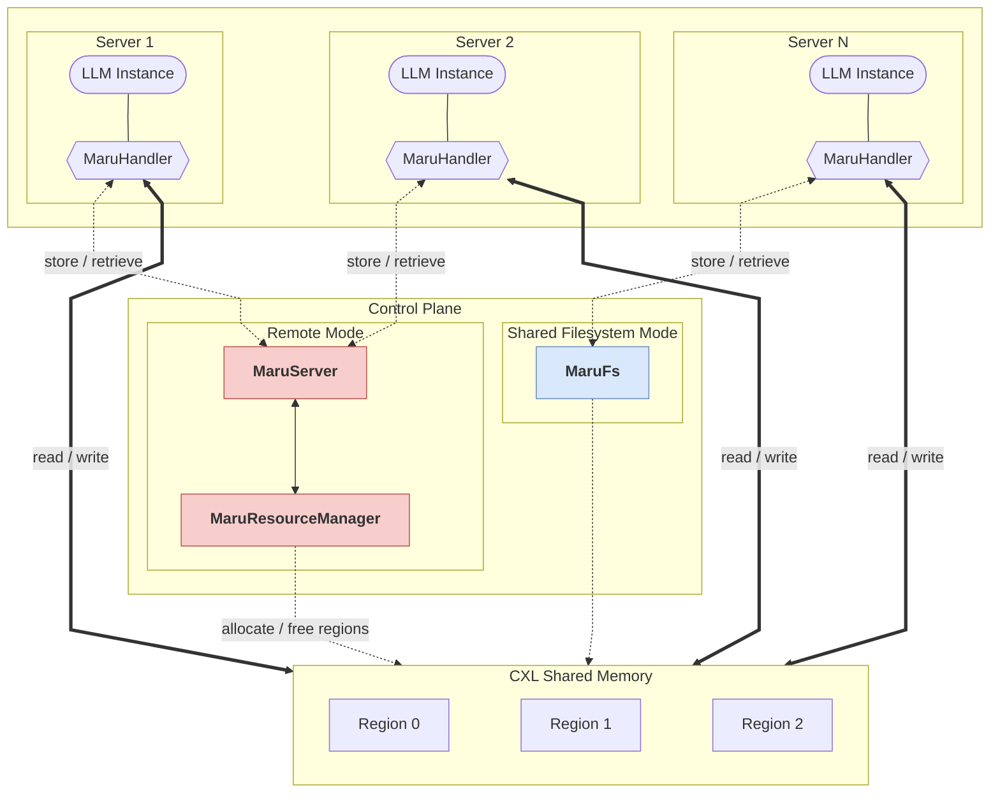
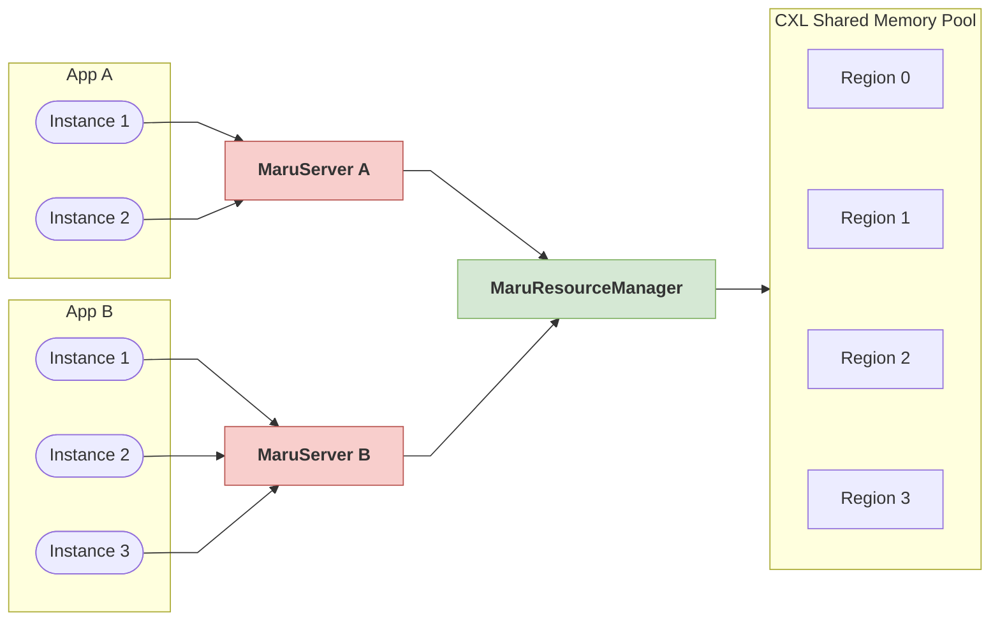
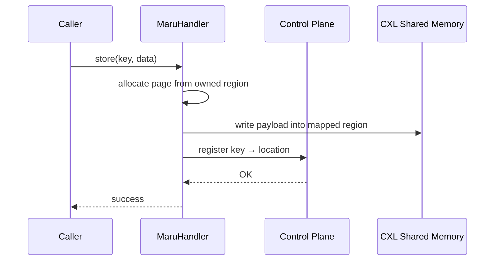
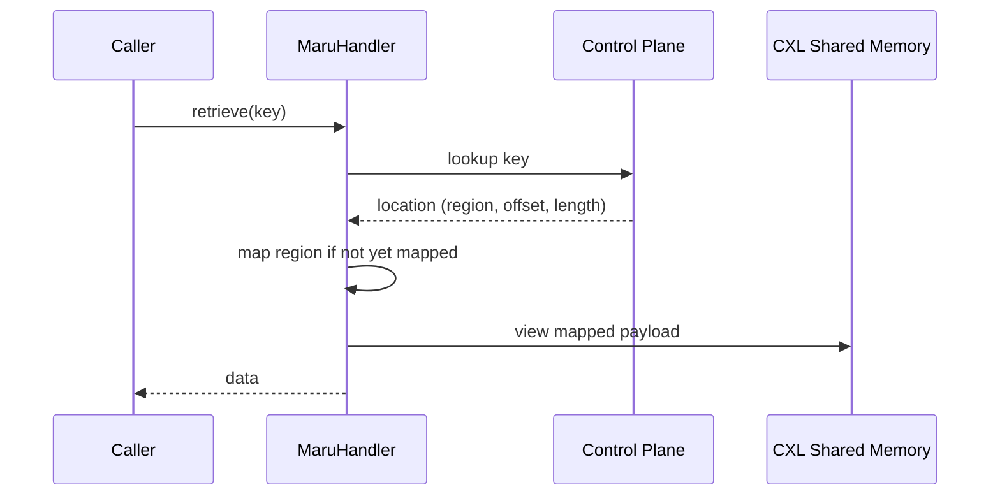
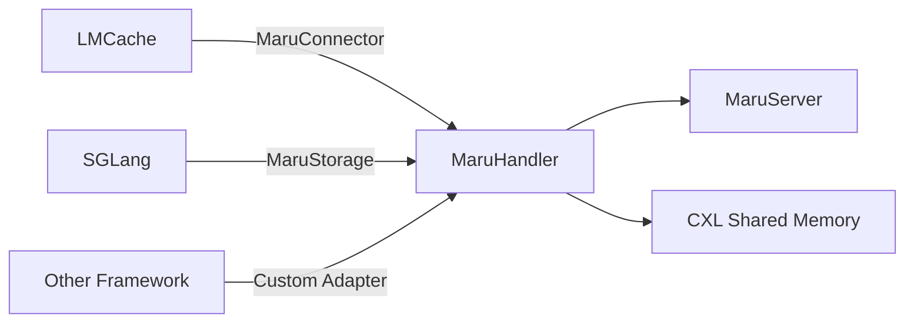

# Architecture Overview

Maru manages shared KV storage with two access paths. CXL-attached nodes map the pool directly with `cxl`, while nodes without CXL read and write a memory node's pool over RDMA with `remote_cxl`. GPU transfers copy bytes in both cases.

---

## System Architecture

The diagram below shows the `cxl` backend and its control plane alternatives. The `remote_cxl` backend uses worker-side staging and a memory-node agent, as the Remote CXL section describes.


```mermaid
%%{ init: { "flowchart": { "curve": "linear" } } }%%
flowchart TB
    subgraph Instances[" "]
        direction LR
        subgraph SN["Server N"]
            direction TB
            V1(["LLM Instance"])
            H1{{"MaruHandler"}}
            V1 --- H1
        end
        subgraph S2["Server 2"]
            direction TB
            V2(["LLM Instance"])
            H2{{"MaruHandler"}}
            V2 --- H2
        end
        subgraph S1["Server 1"]
            direction TB
            V3(["LLM Instance"])
            H3{{"MaruHandler"}}
            V3 --- H3
        end
    end

    subgraph ControlPlane["Control Plane"]
        direction LR
        subgraph Remote["Remote Mode"]
            direction TB
            MS["MaruServer"]:::maru
            D["MaruResourceManager"]:::maru
            MS <--> D
        end
        subgraph Filesystem["Shared Filesystem Mode"]
            direction TB
            FS["MaruFs"]:::fs
        end
    end

    H1 <-.->|"store / retrieve"| FS
    H2 <-.->|"store / retrieve"| MS
    H3 <-.->|"store / retrieve"| MS

    subgraph CXL["CXL Shared Memory"]
        direction LR
        R0["Region 0"] ~~~ R1["Region 1"] ~~~ R2["Region 2"]
    end

    D -.->|"allocate / free regions"| CXL
    FS -.-> CXL

    H1 <==>|"read / write"| CXL
    H2 <==>|"read / write"| CXL
    H3 <==>|"read / write"| CXL

    classDef maru fill:#f8cecc,stroke:#b85450,font-weight:bold
    classDef fs fill:#dae8fc,stroke:#6c8ebf,font-weight:bold
```

> **Control Plane** (dashed arrows) — KV metadata operations and region allocation.
>
> **Data Plane** (solid arrows) — direct access to mapped CXL memory with `cxl`. GPU transfers still copy bytes. The control plane alternatives in this diagram share that data path; `remote_cxl` uses a different payload path.

The system has three layers:

| Layer | Role | Components |
|-------|------|------------|
| **Client** | KV operations, page allocation, region mapping (with `remote_cxl`, the remote CXL agent on the memory node maps regions) | MaruHandler; remote CXL agent (`remote_cxl`) |
| **Metadata** | Key registry, allocation lifecycle | MaruServer (Remote) / marufs (Filesystem) |
| **Memory** | Shared memory pool, capability issuance, crash recovery | MaruResourceManager (Remote) / marufs (Filesystem) |

---

## Key Design Properties

**Payload bypasses the metadata server.** With `cxl`, a CPU reader can view a mapped KV object without an additional host copy. This avoids sending that payload between compute nodes over an RDMA or IP network, but CPU writes and GPU ↔ CXL transfers still move bytes. With `remote_cxl`, a worker copies KV between GPU memory and CPU DRAM staging, and its NIC transfers the bytes between staging and the memory node's CXL. MaruServer and the remote CXL agent do not relay the payload. Mapping, registration, metadata RPC, copies and transfer scheduling still consume time; the control/data plane split alone does not establish a latency, scaling or energy advantage.

**Per-application control plane.** Each application group runs its own metadata service for isolation (e.g., app A with 2 instances, app B with 3 instances). A single Resource Manager manages the shared memory pool across all groups. The diagram below illustrates this in Remote mode:


```mermaid
%%{ init: { "flowchart": { "curve": "linear" } } }%%
flowchart LR
    subgraph AppA["App A"]
        direction TB
        A1(["Instance 1"])
        A2(["Instance 2"])
    end

    subgraph AppB["App B"]
        direction TB
        B1(["Instance 1"])
        B2(["Instance 2"])
        B3(["Instance 3"])
    end

    MSA["MaruServer A"]:::maru
    MSB["MaruServer B"]:::maru
    RM["MaruResourceManager"]:::rm

    A1 & A2 --> MSA
    B1 & B2 & B3 --> MSB
    MSA & MSB --> RM

    subgraph CXL["CXL Shared Memory Pool"]
        direction TB
        R0["Region 0"] ~~~ R1["Region 1"] ~~~ R2["Region 2"] ~~~ R3["Region 3"]
    end

    RM --> CXL

    classDef maru fill:#f8cecc,stroke:#b85450,font-weight:bold
    classDef rm fill:#d5e8d4,stroke:#82b366,font-weight:bold
```

**Pluggable control plane.** The control plane is isolated behind a stable interface, so its implementation can change without affecting the data path. Remote mode (current) uses a centralized MaruServer + MaruResourceManager. Shared Filesystem mode (in development) replaces both with MaruFs, enforcing memory access control at the kernel level for stronger security than user-space RPC.

**Region handles.** The Resource Manager issues handles for allocated regions. With `cxl`, the Handler checks a handle and opens the DAX device to map that region on its own node. With `remote_cxl`, the memory node's agent performs the mapping and NIC registration; the worker uses the returned RDMA access information. The worker therefore needs no local DAX device for that backend.

---

## Data Flow

These sequences describe the directly mapped `cxl` backend. The Remote CXL section below describes the additional staging, RDMA completion and lease lifetimes of `remote_cxl`.

### Store


```mermaid
sequenceDiagram
    participant C as Caller
    participant H as MaruHandler
    participant CP as Control Plane
    participant CXL as CXL Shared Memory

    C->>H: store(key, data)
    H->>H: allocate page from owned region
    H->>CXL: write payload into mapped region
    H->>CP: register key → location
    CP-->>H: OK
    H-->>C: success
```

Data is written to shared memory **before** the key is registered. Other instances can never observe a partial write — the key only becomes visible after the data is fully committed.

### Retrieve (cross-instance)


```mermaid
sequenceDiagram
    participant C as Caller
    participant H as MaruHandler
    participant CP as Control Plane
    participant CXL as CXL Shared Memory

    C->>H: retrieve(key)
    H->>CP: lookup key
    CP-->>H: location (region, offset, length)
    H->>H: map region if not yet mapped
    H->>CXL: view mapped payload
    H-->>C: data
```

Every retrieve requires one metadata lookup via the control plane. Once a region is mapped, the mapping is cached for subsequent accesses to the same region — only the first access to a given region incurs the mmap cost.

---

## Remote CXL: CXL Memory of Other Nodes over RDMA

LLM instances on nodes without CXL use the `remote_cxl` storage backend: their
KV cache stays in the CXL memory of *memory nodes* and moves over RDMA. The
three layers and the resource flow stay as above: the Resource Manager gives
regions to MaruServer, and MaruServer gives them to each MaruHandler, one when
its storage session opens and one more whenever its regions are full. One step
moves: mapping a region. One-sided RDMA reaches only memory that a process on
the target node has mapped and registered with that node's NIC, and a node
without CXL cannot map the region itself. A **remote CXL agent** on every memory
node is that process: it maps the regions Handlers ask for and registers them
with the node's NIC (the job DaxMapper does inside a Handler on a CXL-attached
node), and returns each region's address and remote key. The Handler then reads and
writes a region with one-sided RDMA between its staging buffer and the region,
and the bytes go from NIC to NIC without passing through a process on the
memory node.

![The nodes of a remote_cxl deployment. GPU worker nodes without CXL, outside the pool, run vLLM with MaruKVConnector and MaruHandler (remote_cxl backend) and have a NIC. The metadata node runs maru-server, one per app per pool, which the Handler reaches with the storage session RPC for regions and keys. The memory nodes form the RDMA memory pool: one of them runs the resource-manager, which MaruServer asks to allocate and free regions, and every one runs a remote CXL agent. The agent's RegionMapService answers the Handler's map request with region R's address and remote key, checks R's handle with the resource manager, maps R from the CXL memory and registers it with the memory node's NIC. KV bytes go from the Handler through the worker's NIC to the memory node's NIC with one-sided RDMA READ and WRITE, and from there into region R.](../image/remote_cxl_overview.png)


How the properties above carry over:

- **Data path.** No Maru process is on it: the worker's NIC and the memory
  node's NIC move the bytes. One copy is added, between the GPU and the
  worker's staging buffer. The remote CXL agent uses CPU when it maps a
  region and while a worker sets up its RDMA connection. It does not busy-poll
  while idle; periodic sweeps still progress UCX and check regions.
- **Capability-based access.** The remote CXL agent is the process that opens
  the DAX device on a memory node, and it checks a handle with the Resource
  Manager (`HOLD`, a `GET_ACCESS` that also keeps the region's range out of
  use until the agent lets go of it) before it maps a region. Who may ask it is bound as
  who may open a DAX device is: it listens on the node's RDMA network address,
  and every connection proves the remote CXL agent key, a file that only the
  users running workers and maru-server can read. A reader gets a read handle,
  which maps a region but cannot release it.

  
- **Region lifetime.** A region goes back to the Resource Manager only after
  its remote CXL agent has deregistered it from the NIC, so an RDMA WRITE of the old
  owner that is still in flight fails at the NIC instead of landing in the
  next owner's KV. When a worker leaves, MaruServer keeps its regions that hold
  keys, as it keeps a cxl Handler's regions while keys refer to them, and gives
  them back when the pool needs the space.

The {ref}`MaruHandler <maru-handler-remote-cxl>` and
{ref}`MaruServer <maru-server-remote-cxl>` designs describe the parts; the
[vLLM integration](../integration/vllm.md) guide shows how to run it.

---

## Extensibility

MaruHandler is **framework-independent**. Its interface operates on string keys and memory views — a minimal, framework-neutral contract. Any inference framework can integrate with Maru by writing a thin adapter layer (typically under 200 lines) that converts framework-specific cache keys to strings and delegates to MaruHandler's store/retrieve API.


```mermaid
graph LR
    A[LMCache] -->|MaruConnector| D[MaruHandler]
    B[SGLang] -->|MaruStorage| D
    C[Other Framework] -->|Custom Adapter| D
    D --> E[MaruServer]
    D --> F[CXL Shared Memory]
```

> **See also:** [LMCache](../integration/lmcache.md),
> [SGLang HiCache](../integration/sglang.md),
> [MaruHandler Design](maru_handler.md)

```{toctree}
:hidden:

Maru Handler <maru_handler>
Maru Server <maru_server>
Maru Resource Manager <maru_resource_manager>
Maru FS <maru_fs>
```
