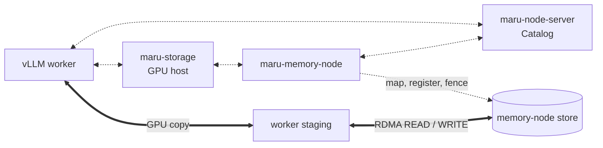
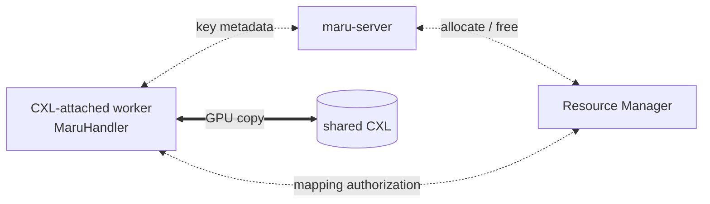

# Architecture Overview

**Maru** stores reusable KV cache in shared memory for LLM inference. The native vLLM connector supports node-owned DRAM, local CXL and remote memory through `maru_node`. Each node serves one store. The directly mapped `cxl` backend also supports LMCache and SGLang.

| Path | Storage and GPU access | Services |
|---|---|---|
| `maru_node`, `dram` | Node-owned DRAM, mapped by local workers | `maru-node-server` and GPU-host `maru-storage` |
| `maru_node`, `local_cxl` | Node-owned CXL, mapped by local workers | Catalog, `maru-storage` and Resource Manager |
| `maru_node`, `remote` | GPU ↔ worker staging ↔ RDMA ↔ memory-node DRAM or CXL | Catalog, GPU-host `maru-storage` and `maru-memory-node`; CXL needs Resource Manager |
| `cxl` | GPU ↔ directly mapped shared CXL | `maru-server` and Resource Manager |

KV payloads bypass metadata services. Remote workers issue RDMA READ and WRITE directly through their own registered staging. Memory nodes own the remote pages and publish keys only after COMMIT. Reads do not create cached copies on GPU nodes.


```mermaid
flowchart LR
    W["vLLM worker"] <-.-> C["maru-node-server<br/>Catalog"]
    W <-.-> G["maru-storage<br/>GPU host"]
    G <-.-> M["maru-memory-node"]
    M <-.-> C
    W <==>|"GPU copy"| S["worker staging"]
    S <==>|"RDMA READ / WRITE"| P[("memory-node store")]
    M -.->|"map, register, fence"| P
```

Compatible engines reuse keys within the selected store and namespace. GPU-local stores skip new writes when full; memory nodes use a shared LRU. GPU copies and RDMA staging still move bytes. Node components use the same release, and their Catalog is separate from the `cxl` registry.

## Directly mapped CXL

With `cxl`, `MaruHandler` owns regions allocated through `maru-server` and the Resource Manager. Workers map those regions and publish key locations after writing their payload. Other CXL-attached workers can map the same regions to retrieve keys.

| Component | Role |
|---|---|
| `MaruHandler` | Region mapping, page allocation and application API |
| `maru-server` | Key registry and region allocation coordination |
| Resource Manager | Physical CXL regions, authorization, holds and allocation recovery |
| `maru_kv_ops` | GPU copies between stored objects and vLLM's paged KV cache |


```mermaid
flowchart LR
    W["CXL-attached worker<br/>MaruHandler"] <-.->|"key metadata"| S["maru-server"]
    S <-.->|"allocate / free"| R["Resource Manager"]
    W <-.->|"mapping authorization"| R
    W <==>|"GPU copy"| P[("shared CXL")]
```

The CXL pool can span hosts attached through a CXL switch. Host-cache visibility depends on the platform; see {doc}`consistency_and_safety` and {doc}`../getting_started/bios_setup`.

## Node-owned stores

`maru-storage` owns one GPU-node store. Workers attach over its local socket and receive pool descriptors, page size, credit and transfer settings. The Catalog tracks published objects and source pins. A worker with `dram` or `local_cxl` maps the node pool; a worker with `remote` directly accesses memory-node pages through RDMA staging.

`maru-memory-node` owns DRAM or local CXL pages and their read and write registrations. Write registration is per vLLM instance within a GPU-node run. The service revokes only that domain's registration before reclaiming its unconfirmed writes; source pins protect pages being read. Memory-node extension hooks provide advisory hints and memory-generation checks.

Node-local sharing is limited to workers that can map that node's pools. Remote sharing uses a common memory node, Catalog and compatible namespace. A GPU service accepts one memory endpoint; memory nodes own separate regions.

See {doc}`node_storage_service` for data flows, configuration, capacity and lifetime rules, and {doc}`memory_node` for the memory-node service.

## Integrations

The native {doc}`vLLM connector <../integration/vllm>` selects either `maru_node` or `cxl`. {doc}`LMCache <../integration/lmcache>` and {doc}`SGLang HiCache <../integration/sglang>` use the directly mapped CXL adapter. {doc}`Dynamo <../integration/dynamo>` uses its selected vLLM connector.

## Identity and trust

Keys name immutable payloads. The node namespace must identify the exact weights revision and compatible KV geometry. The Catalog, pool registration, pool generation and service run identify a location; a byte offset alone is insufficient.

Remote services mutually authenticate with a deployment key, and workers receive RDMA metadata from their GPU service. This is a trusted deployment: possession of memory registration metadata is not general tenant isolation. CXL access also depends on DAX permissions and Resource Manager authorization. Metadata heartbeat success does not establish payload availability or GPU-copy completion.

```{toctree}
:hidden:

Maru Handler <maru_handler>
Maru Server <maru_server>
Maru Resource Manager <maru_resource_manager>
```
