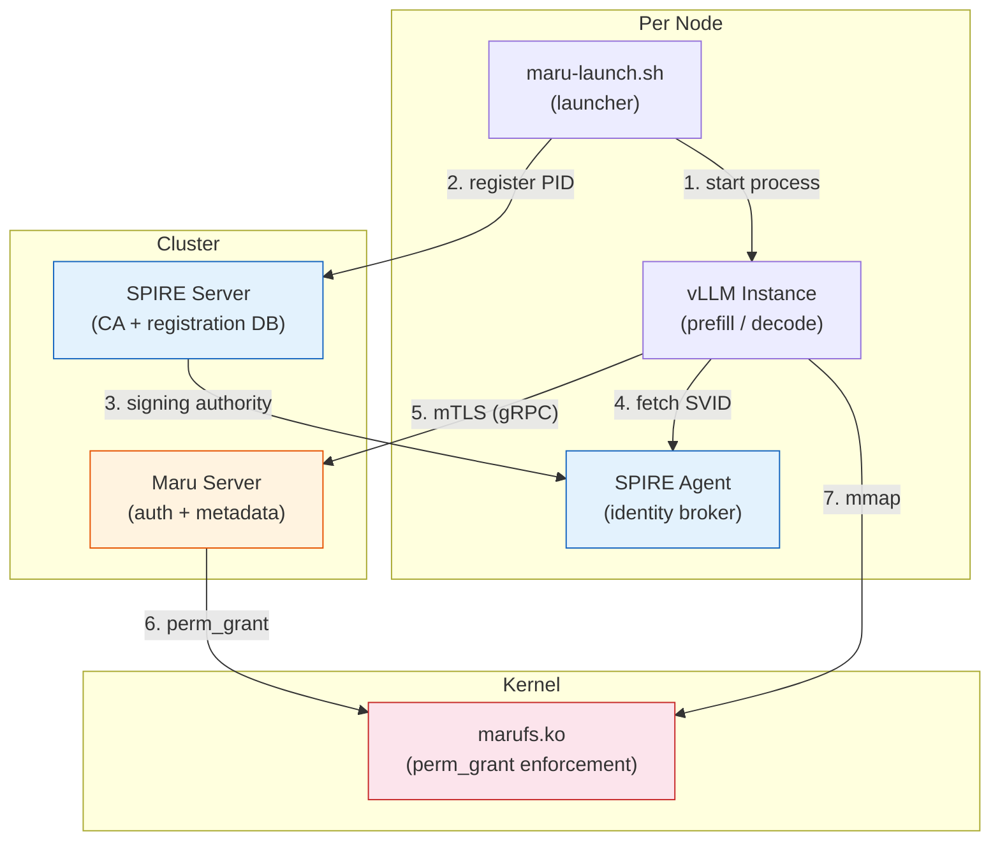
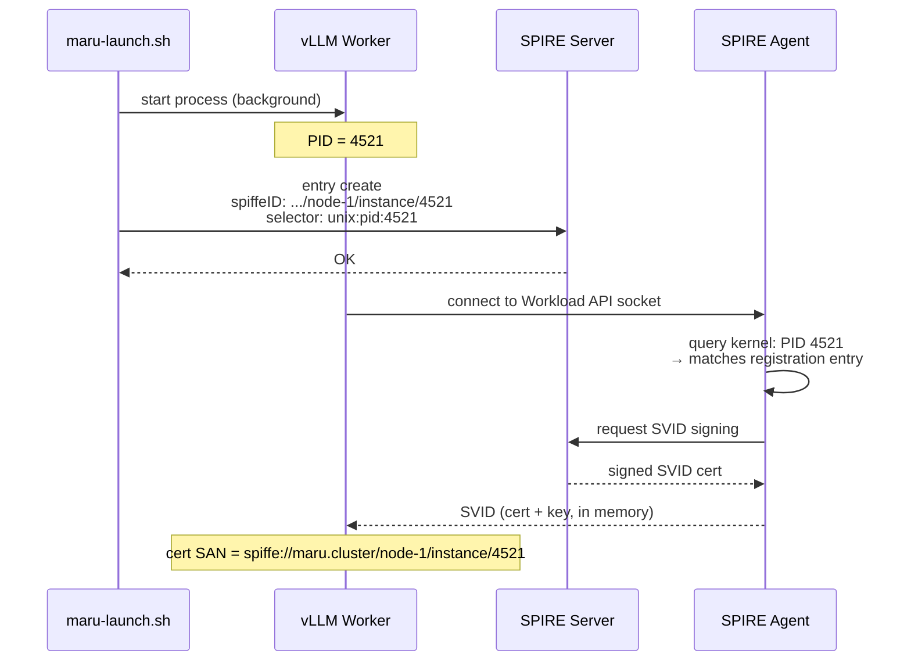
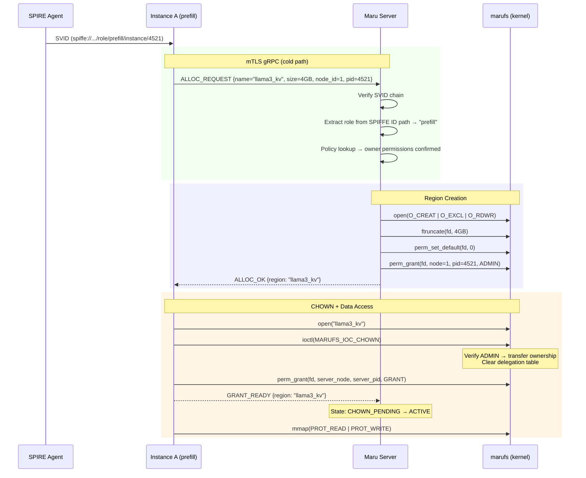
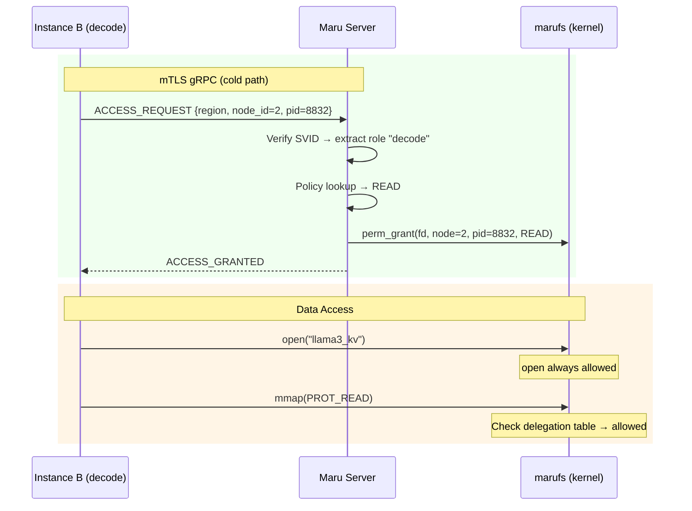
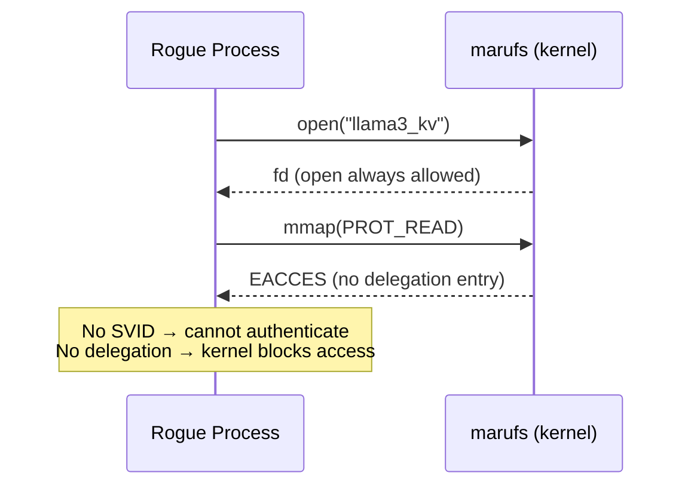
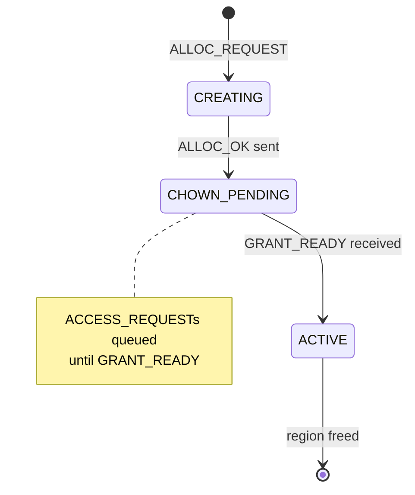
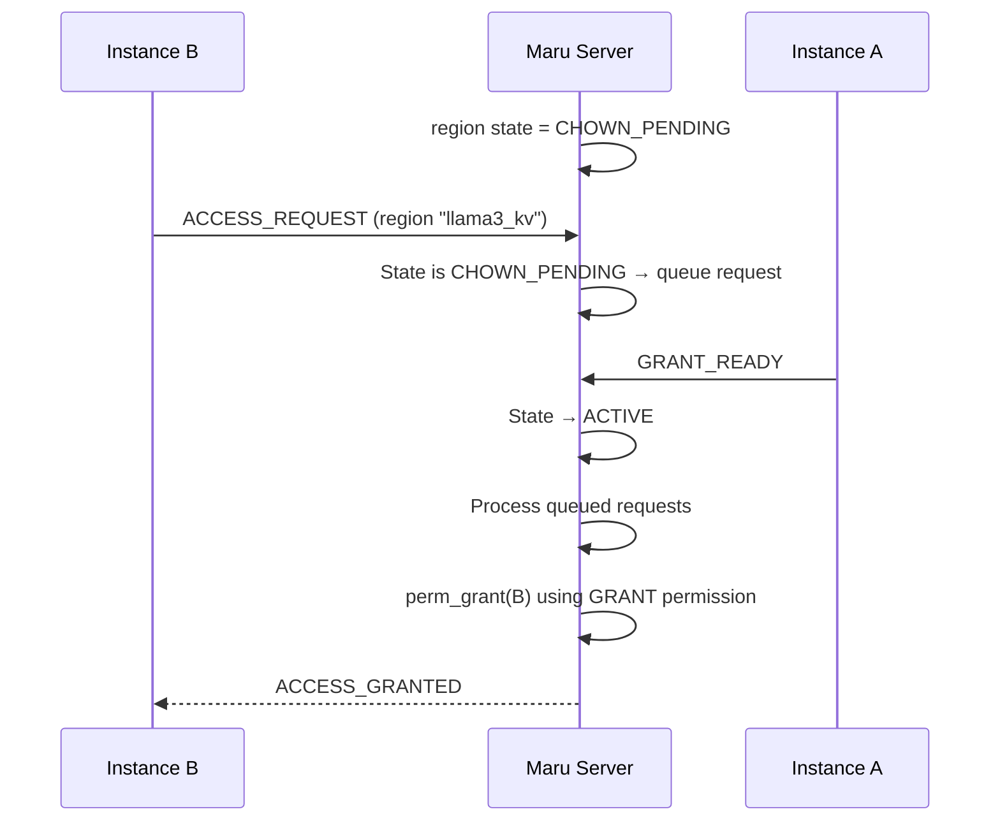
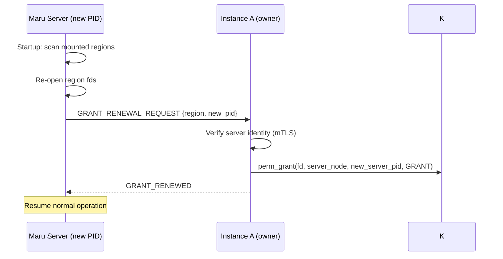

# Authentication & Authorization Implementation Plan

> **Status**: Design proposal. Based on [Confluence: Maru Server Auth Sequence](https://metisx.atlassian.net/wiki/spaces/KVC/pages/1860894738) with SPIRE integration refinements.

---

## 1. Architecture Overview



### Layer Separation

| Layer | Role | Component |
|-------|------|-----------|
| **Identity** | "This process is a legitimate maru workload" | SPIRE (SVID cert) |
| **Authentication** | "Verify identity via mTLS" | Maru Server (gRPC) |
| **Authorization** | "Determine permissions from policy" | Maru Server (policy table) |
| **Enforcement** | "Allow/deny mmap based on delegation table" | marufs kernel (perm_grant) |

### Transport Separation

| Path | Transport | Auth | Purpose |
|------|-----------|------|---------|
| **Cold** | gRPC + mTLS | SVID cert | ALLOC_REQUEST, ACCESS_REQUEST, GRANT_READY |
| **Hot** | ZMQ (existing) | None needed | lookup_kv, register_kv, exists_kv, batch_* |

Cold path handles authentication (infrequent, at connection time). Hot path handles KV metadata (frequent, every operation). Kernel enforces region-level access regardless of transport.

---

## 2. SPIRE Integration

### Why SPIRE

| Concern | Direct cert issuance | SPIRE |
|---------|---------------------|-------|
| Key on disk | Yes — `chmod 600` protection | **No — memory delivery only** |
| Per-process identity | Requires per-process uid | **unix:pid selector** |
| Cert rotation | Manual (cron / admin) | **Automatic (1h TTL)** |
| Revocation | CRL/OCSP | **Short TTL = implicit revocation** |
| Process attestation | None — cert holder = identity | **Kernel-level (pid, binary hash)** |

### Per-Process SVID Issuance

SPIRE registration entry uses `unix:pid` selector for per-process identity binding:



### Identity Config

Each instance has an identity config file specifying its role and node. Both the identity config and the launcher script must be owned by root with restricted permissions to prevent tampering:

```bash
chown root:root identity.yaml maru-launch.sh
chmod 600 identity.yaml     # root-only read (contains role assignment)
chmod 755 maru-launch.sh    # root-only write, all can execute
```

```yaml
# identity.yaml
node_id: 1
role: prefill
user: maru
```

### Launcher Script

```bash
# Usage:
sudo maru-launch.sh identity.yaml -- --model meta-llama/Llama-3-70B --tp 4 --port 8000
sudo maru-launch.sh identity.yaml -- --model meta-llama/Llama-3-70B --port 8001
```

```bash
#!/bin/bash
# /usr/local/bin/maru-launch.sh
#
# Launches vLLM worker with SPIRE identity registration.
# Identity (role, node_id, user) is read from a YAML config file.
# Must be run as root (for sudo -u).

set -euo pipefail

IDENTITY_FILE=$1
shift  # remove config path
shift  # remove "--"

# Parse identity config (requires yq)
NODE_ID=$(yq '.node_id' "$IDENTITY_FILE")
ROLE=$(yq '.role' "$IDENTITY_FILE")
MARU_USER=$(yq '.user // "maru"' "$IDENTITY_FILE")

# Start worker as non-root user
sudo -u "$MARU_USER" /usr/bin/vllm-worker "$@" &
PID=$!

# Forward signals to worker and cleanup SPIRE entry
cleanup() {
    spire-server entry delete -spiffeID \
      "spiffe://maru.cluster/node-${NODE_ID}/role/${ROLE}/instance/${PID}" 2>/dev/null
    kill -TERM "$PID" 2>/dev/null
    wait "$PID" 2>/dev/null
}
trap cleanup SIGTERM SIGINT

# Register SPIRE entry for this specific PID
spire-server entry create \
  -spiffeID "spiffe://maru.cluster/node-${NODE_ID}/role/${ROLE}/instance/${PID}" \
  -parentID "spiffe://maru.cluster/agent/node-${NODE_ID}" \
  -selector "unix:pid:${PID}"

# Wait for worker to finish
wait $PID
EXIT_CODE=$?

# Cleanup (if not already done by trap)
spire-server entry delete -spiffeID \
  "spiffe://maru.cluster/node-${NODE_ID}/role/${ROLE}/instance/${PID}" 2>/dev/null

exit $EXIT_CODE
```

- Identity config (`identity.yaml`): 역할, 노드, 실행 유저를 한 파일에 정의
- 실행 인자는 `--` 뒤에 자유롭게 전달
- 스크립트는 root로 실행, worker는 config의 `user`로 실행

### SPIFFE ID Convention

```
spiffe://maru.cluster/node-{node_id}/role/{role}/instance/{pid}

Examples:
  spiffe://maru.cluster/node-1/role/prefill/instance/4521
  spiffe://maru.cluster/node-2/role/decode/instance/8832
  spiffe://maru.cluster/node-1/role/admin/instance/1234
```

Role is encoded in the SPIFFE ID path. Maru Server extracts it during mTLS verification.

---

## 3. Authentication Flow

### Step 1: Region Alloc + Auth + Ownership Transfer (Owner)



### Step 2: Reader Access



### Step 3: Unauthorized Process Blocked



---

## 4. Maru Server Components

| Component | Description |
|-----------|-------------|
| **gRPC mTLS Server** | Verifies SVID cert chain against SPIRE trust bundle |
| **Role Extractor** | Parses SPIFFE ID path → extracts role |
| **Policy Table** | role → permissions mapping (YAML config) |
| **fd Manager** | Keeps region fds open for perm_grant (GRANT permission, not owner) |
| **Region State Machine** | CHOWN_PENDING → ACTIVE (queues ACCESS_REQUESTs until GRANT_READY) |
| **ZMQ RPC Server** | Existing metadata operations (unchanged) |

### Policy Table

```yaml
# /etc/maru/policy.yaml
roles:
  prefill:
    perms: [READ, WRITE, DELETE, ADMIN, IOCTL]
  decode:
    perms: [READ]
  admin:
    perms: [READ, WRITE, DELETE, ADMIN, IOCTL, GRANT]
```

### Region State Machine



---

## 5. CHOWN Race Condition Mitigation

Between CHOWN (clears delegation table) and GRANT_READY (server regains GRANT), the server cannot grant to readers.

### Solution: Server-Side Request Queuing



Timeout: if GRANT_READY not received within 30s, region enters error state and is cleaned up.

---

## 6. Server Restart Recovery

After restart, server has a new PID → old GRANT delegation is invalid.

### Recovery Protocol



If owner (Instance A) is also dead → region enters deferred freeing. New allocations use new regions.

---

## 7. Infrastructure Requirements

| Component | Per-cluster | Per-node | Notes |
|-----------|------------|----------|-------|
| SPIRE Server | 1 (or HA pair) | — | CA + registration DB |
| SPIRE Agent | — | 1 | Workload API socket |
| Maru Server | 1 per app group | — | Auth + metadata |
| Node attestation | — | join_token or x509pop | Bare-metal bootstrap |
| Trust bundle | auto-distributed | auto-cached | By SPIRE |

### SPIRE Agent Configuration

```hcl
agent {
    trust_domain = "maru.cluster"
    server_address = "spire-server:8081"
}

plugins {
    NodeAttestor "join_token" {
        plugin_data {}
    }
    WorkloadAttestor "unix" {
        plugin_data {
            discover_workload_path = true
        }
    }
}
```

---

## 8. Migration Path

### Phase 1: Direct Cert + perm_grant (no SPIRE)

- Admin generates certs with `spiffe://` SAN format
- Maru Server verifies via trust bundle
- Proves the auth flow end-to-end

### Phase 2: SPIRE Integration

- Deploy SPIRE Server + Agents
- Replace direct certs with SVID issuance
- Add maru-launch.sh for per-PID registration
- Server verification code unchanged (same SAN format)

### Phase 3: Dynamic Scaling

- K8s SPIRE Controller for automatic entry management
- Pod label-based selectors replace PID-based
- Horizontal scaling without admin intervention
