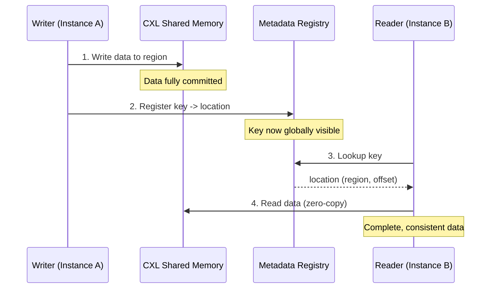
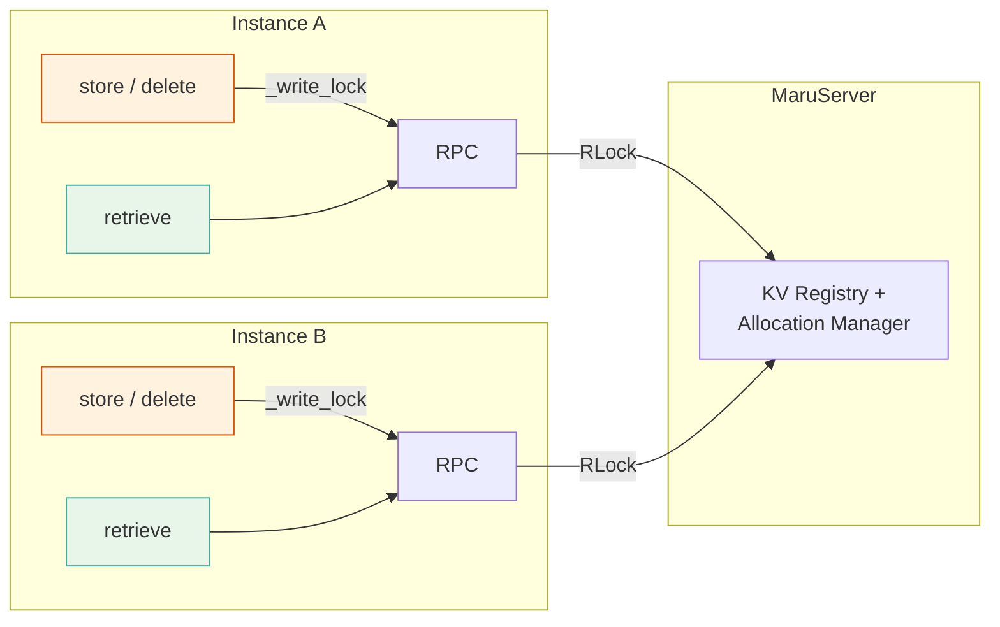
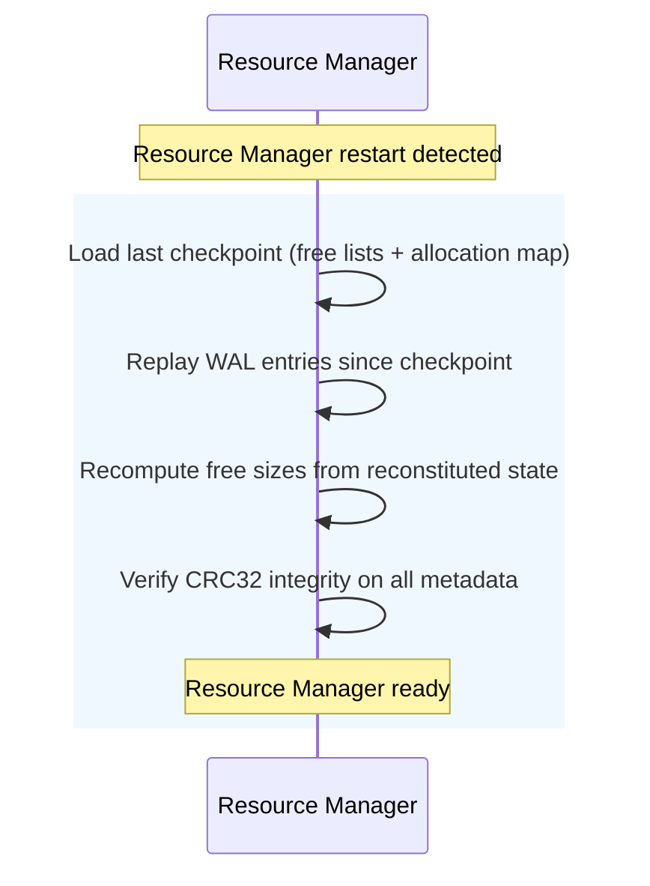

# Consistency and Safety

---

## 1. Data Visibility

Maru provides **strong consistency** for store operations: once `store()` returns
successfully, the stored data is immediately retrievable by any other instance.

This relies on **write-then-register** ordering. The handler always
completes these steps in sequence:

1. **Write** — copy data into the CXL memory region.
2. **Register** — notify the metadata registry that the key now maps to that
   location.

Because registration only occurs after the write is fully committed to shared
memory, no reader can ever observe a partial or in-progress write. The key simply
does not exist in the registry until the data is complete.

The visibility point is when `register_kv` RPC completes. The server holds the
key in an in-memory registry protected by a lock, ensuring that concurrent
lookups always see a fully committed entry or no entry at all.

> **See also:** [MaruHandler Architecture](maru_handler.md) -- store/retrieve data flows

---

## 2. Concurrency

Maru serializes at two levels:

- **Client**: `_write_lock` serializes all writes (store, delete) within a
  single handler instance. Retrieve is lock-free.
- **Server**: A single `RLock` serializes all metadata mutations (register,
  delete, ref-count updates) across instances.

These two locks, combined with write-then-register ordering (Section 1),
produce the following guarantees:

| Scenario | Behavior |
|----------|----------|
| Same-key store (cross-instance) | First registration wins; losing writer frees its page |
| Different-key store (cross-instance) | Parallel — independent pages, independent server calls |
| Store within one instance | Serialized by client write lock |
| Store + retrieve (same key) | No partial read — key invisible until data committed |
| Concurrent retrieve | Lock-free on client; shared mappings need no synchronization |

---

## 3. Crash Recovery

Maru is designed so that metadata can be reconstructed after a crash. The
recovery strategy differs by component.

### 3.1 Recovery Sequence

**Resource Manager** persists every allocation and free operation to a
write-ahead log (WAL) before modifying in-memory state. Every 100 operations,
a checkpoint is taken: free lists and the global allocation map are saved with
CRC32 integrity verification. On restart, the last checkpoint is loaded and
any subsequent WAL entries are replayed, fully reconstructing the allocation
state.

### 3.2 Client Crash Recovery

When a client process terminates unexpectedly (crash, kill, network partition),
its allocated memory regions must be reclaimed to prevent leaks.

| Component | Detection | Reclamation |
|-----------|-----------|-------------|
| Resource Manager | Reaper polls process liveness every 1 second | Orphaned regions returned to free list; WAL records the free operation |
| MaruServer | Deferred freeing state machine | Region freed only when both owner disconnected **and** KV reference count reaches zero |

The reaper defends against PID reuse by caching each client's process start
time at allocation time. If the PID is recycled by the OS, the start-time
mismatch triggers reclamation.

> **See also:** [MaruResourceManager Architecture](maru_resource_manager.md) -- WAL + Checkpoint, Reaper;
> [MaruServer Architecture](maru_server.md) -- Deferred Freeing State Machine

---

## 4. Failure Modes

| Failure | Impact | Recovery | Data Loss |
|---------|--------|----------|-----------|
| Client crash | Owned regions orphaned; keys become stale | Reaper + deferred freeing | None |
| Resource Manager crash | New region allocation blocked | WAL + checkpoint replay on restart | None |
| Network partition (client-server) | Affected client cannot store/retrieve | Client reconnects when network recovers | None |
| CXL device failure | All data on the device is lost | Not supported -- no cross-device replication | **Total** |

