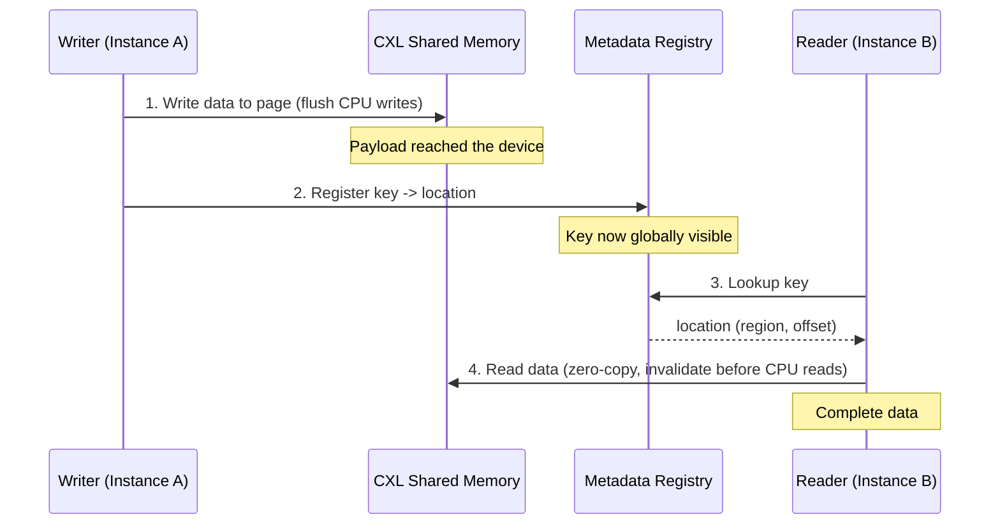
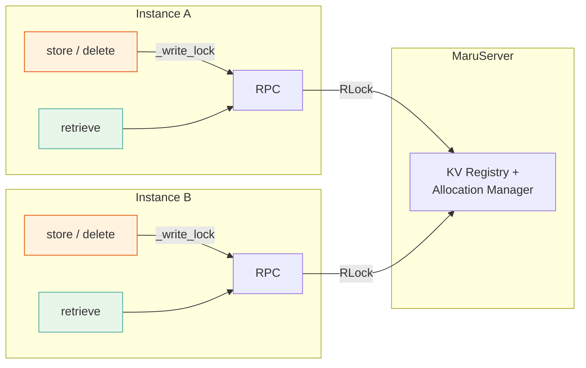
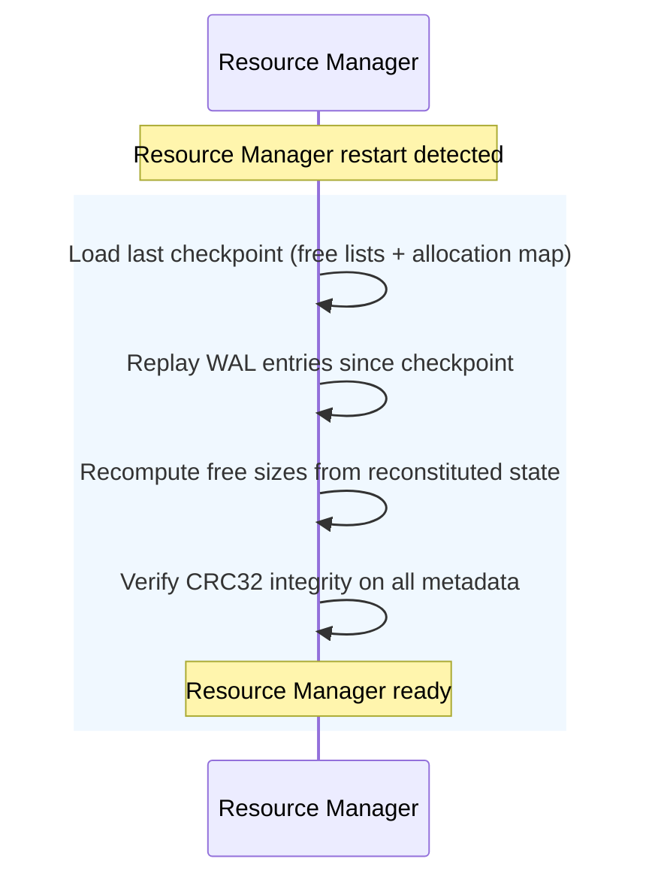

# Consistency and Safety

---

## 1. Data Visibility

Maru publishes an object's location after the writer finishes writing its
payload. Once `store()` returns successfully, other instances can look up that
location through the metadata server.

This relies on **write-then-register** ordering. Every store completes these steps in sequence:

1. **Write** — the caller writes the payload into a page from `alloc()`, by CPU through `handle.buf` or by GPU DMA.
2. **Register** — `store()` records in the metadata registry that the key now maps to that page.

The caller must finish its write before calling `store()`. Publishing only after the write completes prevents readers from discovering an in-progress object through the registry, provided the written data is visible to the reader (see {ref}`cross-host-visibility`).

```mermaid
sequenceDiagram
    participant W as Writer (Instance A)
    participant CXL as CXL Shared Memory
    participant Meta as Metadata Registry
    participant R as Reader (Instance B)

    W->>CXL: 1. Write data to page (flush CPU writes)
    Note over CXL: Payload reached the device
    W->>Meta: 2. Register key -> location
    Note over Meta: Key now globally visible

    R->>Meta: 3. Lookup key
    Meta-->>R: location (region, offset)
    R->>CXL: 4. Read data (zero-copy, invalidate before CPU reads)
    Note over R: Complete data
```

The visibility point is when `register_kv` RPC completes. The server holds the
key in an in-memory registry protected by a lock, ensuring that concurrent
lookups always see a fully committed entry or no entry at all.

(cross-host-visibility)=
### Cross-Host Visibility

The ordering above assumes that writes reach the shared memory device and readers cannot consume stale host-cache copies. On a non-coherent multi-host CXL platform, metadata ordering alone does not establish those conditions. See {doc}`../getting_started/bios_setup` for the platform settings that GPU DMA writes depend on.

On Intel GNR, the BIOS option `Allocating Write Flows` controls where device writes to CXL memory, such as GPU DMA writes, land. With the default `Allocating` policy, a write can stay in the writing host's cache, so other hosts read stale data. `Non-Allocating` stops these writes from allocating new lines in the host cache. It does not change lines the host already caches, for example after CPU access to the same memory, so CPU access still needs the explicit write-back and invalidation below.

CPU access to a shared payload can leave cached copies that other hosts do not invalidate, so CPU writers and readers must write back and invalidate explicitly. `flush_range` from `maru_shm._cxl_flush` does both: it runs `clflush` over each cache line of the buffer, then `mfence`.

1. **Writer:** write the payload to `handle.buf`, call `flush_range(handle.buf)`, then `store()`.
2. **Reader:** `retrieve()`, call `flush_range(result.view)` to drop local cached copies, then read `result.view`.

The {doc}`../getting_started/quick_start` producer and consumer follow this pattern. The CPU-based `examples/basic/producer.py` and `consumer.py` are single-host examples and do not flush.

For multi-node use, validate the deployed transfer path across repeated updates and memory reuse, including any CPU access performed by the runtime or driver.

> **See also:** [MaruHandler Architecture](maru_handler.md)

---

## 2. Concurrency

Maru serializes at two levels:

```mermaid
flowchart LR
    subgraph Instance_A["Instance A"]
        SA["store / delete"] -->|"_write_lock"| RPC_A["RPC"]
        RA["retrieve"] --> RPC_A
    end

    subgraph Instance_B["Instance B"]
        SB["store / delete"] -->|"_write_lock"| RPC_B["RPC"]
        RB["retrieve"] --> RPC_B
    end

    subgraph Server["MaruServer"]
        RPC_A & RPC_B -->|"RLock"| Meta["KV Registry +\nAllocation Manager"]
    end

    style SA fill:#fff3e0,stroke:#e65100
    style SB fill:#fff3e0,stroke:#e65100
    style RA fill:#e8f5e9,stroke:#4a9
    style RB fill:#e8f5e9,stroke:#4a9
```

- **Client**: `_write_lock` serializes all writes (store, delete) within a
  single handler instance. Retrieve is lock-free.
- **Server**: A single `RLock` serializes all metadata mutations (register,
  delete, ref-count updates) across instances.

These two locks, combined with write-then-register ordering (Section 1),
produce the following guarantees:

| Scenario | Behavior |
|----------|----------|
| Same-key store (cross-instance) | First registration wins; losing writer frees its page |
| Different-key store (cross-instance) | Parallel — independent pages, independent server calls |
| Store within one instance | Serialized by client write lock |
| Store + retrieve (same key) | No partial read — key invisible until data committed |
| Concurrent retrieve | Lock-free on client; shared mappings need no synchronization |

---

## 3. Crash Recovery

Maru is designed so that metadata can be reconstructed after a crash. The
recovery strategy differs by component.

### 3.1 Recovery Sequence

```mermaid
sequenceDiagram
    participant RM as Resource Manager

    Note over RM: Resource Manager restart detected

    rect rgb(240, 248, 255)
        RM->>RM: Load last checkpoint (free lists + allocation map)
        RM->>RM: Replay WAL entries since checkpoint
        RM->>RM: Recompute free sizes from reconstituted state
        RM->>RM: Verify CRC32 integrity on all metadata
        Note over RM: Resource Manager ready
    end
```

**Resource Manager** persists every allocation and free operation to a
write-ahead log (WAL) before modifying in-memory state. Every 100 operations,
a checkpoint is taken: free lists and the global allocation map are saved with
CRC32 integrity verification. On restart, the last checkpoint is loaded and
any subsequent WAL entries are replayed, fully reconstructing the allocation
state.

### 3.2 Client Crash Recovery

When a client process terminates unexpectedly (crash, kill, network partition),
its allocated memory regions must be reclaimed to prevent leaks.

| Component | Detection | Reclamation |
|-----------|-----------|-------------|
| Resource Manager | Reaper polls process liveness every 1 second | Orphaned regions returned to free list; WAL records the free operation |
| MaruServer | Deferred freeing state machine | Region freed only when both owner disconnected **and** KV reference count reaches zero |

The reaper defends against PID reuse by caching each client's process start
time at allocation time. If the PID is recycled by the OS, the start-time
mismatch triggers reclamation.

> **See also:** [MaruResourceManager Architecture](maru_resource_manager.md),
> [MaruServer Architecture](maru_server.md)

---

## 4. Failure Modes

| Failure | Impact | Recovery | Data Loss |
|---------|--------|----------|-----------|
| Client crash | Owned regions orphaned; keys become stale | Reaper + deferred freeing | None |
| Resource Manager crash | New region allocation blocked | WAL + checkpoint replay on restart | None |
| Network partition (client-server) | Affected client cannot store/retrieve | Client reconnects when network recovers | None |
| CXL device failure | All data on the device is lost | Not supported -- no cross-device replication | **Total** |
