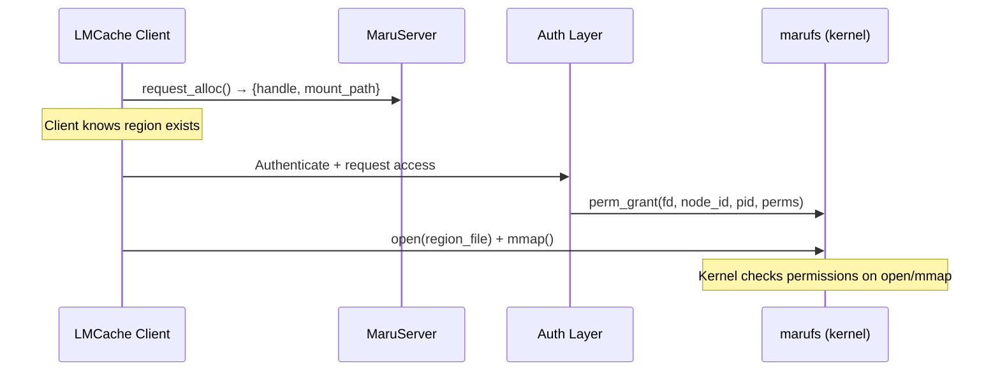
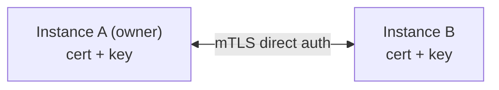
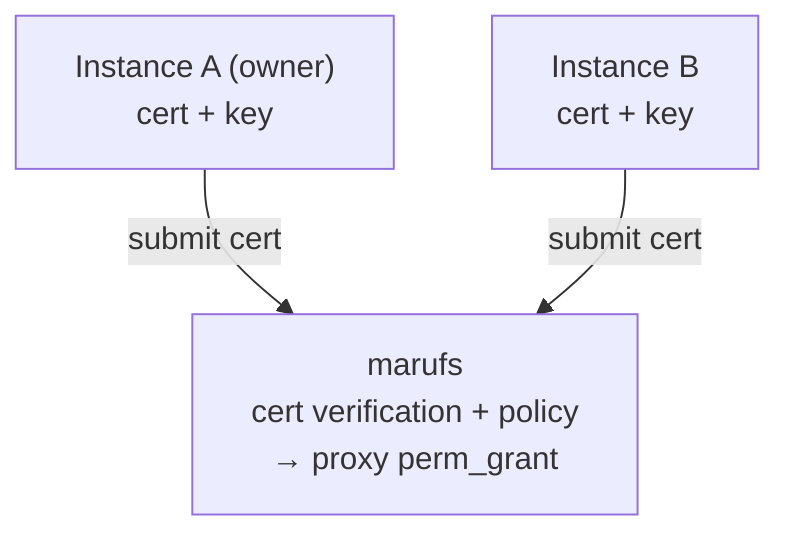
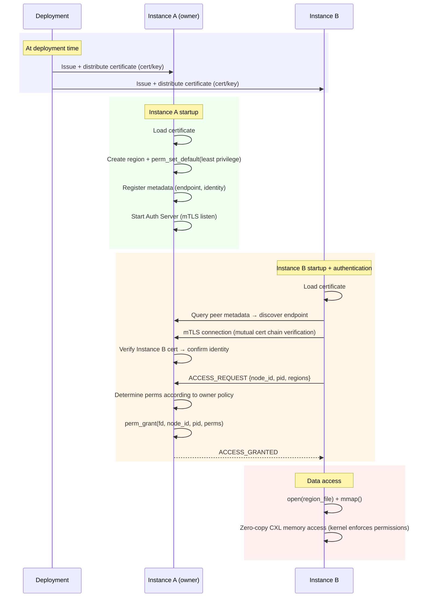
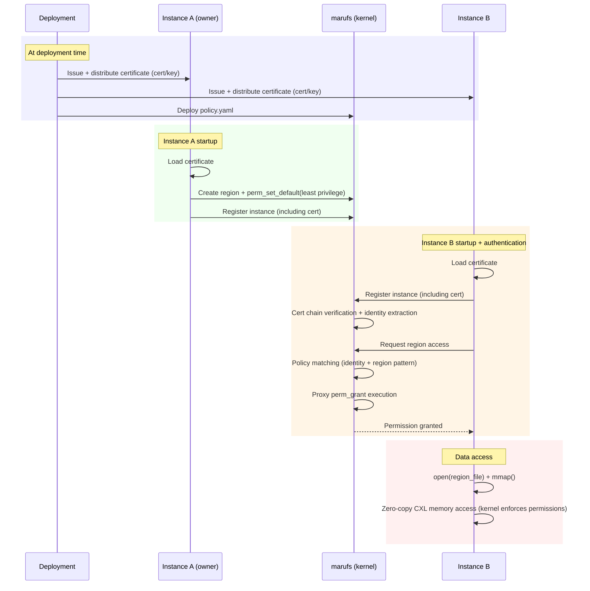

# marufs Instance Authentication and Authorization System Design

> **Status**: Design proposal. Not yet implemented. Current Hybrid mode uses `perm_set_default(PERM_ALL)` — all processes have full access to all regions.

- marufs kernel module supports per-region permission enforcement via `perm_grant` and `perm_set_default` ioctl
- The inter-instance permission delegation mechanism (who grants what to whom) is the subject of this design document
- Design an authentication and authorization system based on pre-provisioned X.509 certificates

---

## 1. Background

### Current State (Hybrid Mode)

In the current Hybrid mode (RPC server + marufs VFS backend):

- **Server-side**: `AllocationManager` creates regions via `MarufsClient.alloc()`, which calls `perm_set_default(PERM_ALL)` — granting all permissions to every process by default
- **Client-side**: `DaxMapper` opens and mmaps region files — no authentication required
- **No access control enforcement**: Any process that can reach the marufs mount point can open and mmap any region

This is acceptable for single-tenant deployments but insufficient for multi-tenant or security-sensitive environments.

### Security Requirements

KV cache contains user prompts and model response state. Sharing without authentication risks data leakage and cache poisoning.

- **Authentication**: Verify that the requesting instance is a legitimate vLLM instance in the cluster
- **Authorization**: Grant only the necessary permissions to authenticated instances (read-only instances do not need write permissions)
- **Least privilege**: Set region default permissions to minimum, grant individually after authentication (current `PERM_ALL` default needs improvement)
- **Certificate-based identity**: X.509 certificate-based mutual authentication — industry standard (K8s, Service Mesh, gRPC)

### Threat Model

| Threat | Mitigation |
|--------|------------|
| **Unauthenticated access** — external process hijacks KV cache region | Individual grant after authentication |
| **Identity spoofing** — impersonating another instance | X.509 chain verification + kernel `(node_id, pid, birth_time)` dual verification |
| **Privilege escalation** — read-only instance overwrites cache | Kernel enforces only `perm_grant`-ed permissions |
| **Certificate compromise** — cert/key leaked externally | Expiration limits + revocation (CRL/OCSP) + kernel process verification |
| **Man-in-the-middle** — eavesdropping/tampering auth traffic (Option A) | mTLS encrypted channel + mutual certificate verification |
| **Process impersonation** — privilege hijacking on the same node | Kernel `pid + birth_time` identification + automatic GC on termination |

### Out of Scope

- Certificate issuance/renewal infrastructure (delegated to existing PKI infrastructure)
- Certificate/key file protection (delegated to existing OS security mechanisms)
- CXL hardware physical security

---

## 2. Overview

### Goals

- Authentication and authorization for CXL region access between vLLM instances
- Support two authentication models:
  - **Option A (P2P)**: Direct mTLS between instances — owner decides permissions based on its own policy
  - **Option B (marufs-mediated)**: marufs acts as proxy authenticator + automatically grants permissions according to pre-defined policy

### Integration with Current Architecture

In Hybrid mode, the authentication flow would be added between the RPC alloc response and the client-side mmap:



The key change from current behavior: `perm_set_default(PERM_ALL)` would be replaced with `perm_set_default(PERM_READ)` or even no default permissions, requiring explicit grants after authentication.

### Architecture

#### Option A: P2P mTLS



#### Option B: marufs-mediated



### Trust Model

| Layer | Role |
|-------|------|
| **Instance cert** | Identity included in SAN. Proves identity during authentication. Chain verification prevents forgery |
| **marufs kernel** | Process identification via `(node_id, pid, birth_time)` + permission enforcement |

Certificates prove the process's identity, and the kernel enforces access permissions.

### Authentication Model Comparison

| | Option A: P2P | Option B: marufs-mediated |
|---|---|---|
| **Auth entity** | Each instance (owner) | marufs (filesystem) |
| **Policy location** | Inside owner code | marufs config file (pre-defined) |
| **Auth Server** | 1 per owner | Not required (marufs acts as proxy) |
| **perm_grant caller** | Owner process | marufs (kernel) |
| **Pros** | Owner has fine-grained control | Operationally simple, centralized policy management |
| **Cons** | Each instance needs Auth Server implementation | Policy changes require marufs config update |

---

## 3. Authentication Flows

### Option A: P2P mTLS

Instance B connects directly to Instance A (owner) via mTLS, authenticates, and obtains permissions. Permission mapping is determined by the owner according to its own policy and is not specified in this document.



### Option B: marufs-mediated

marufs acts as a proxy authenticator. Instances do not need to implement an Auth Server — they simply register with marufs, and the kernel automatically grants permissions according to pre-defined policy.

**Pre-defined Policy:**

```yaml
# /etc/maru/policy.yaml
policy:
  # identity → accessible region patterns + permissions
  instance-a:
    - pattern: "maru_*"
      perms: [READ, WRITE, ADMIN, IOCTL]
  instance-b:
    - pattern: "maru_*"
      perms: [READ, WRITE, IOCTL]
```



**Advantages:**
- No Auth Server implementation required — automatic permission grant upon registration
- Centralized policy management — cluster-wide consistency guaranteed
- Even if the owner is offline, permissions can be granted to existing regions based on policy
