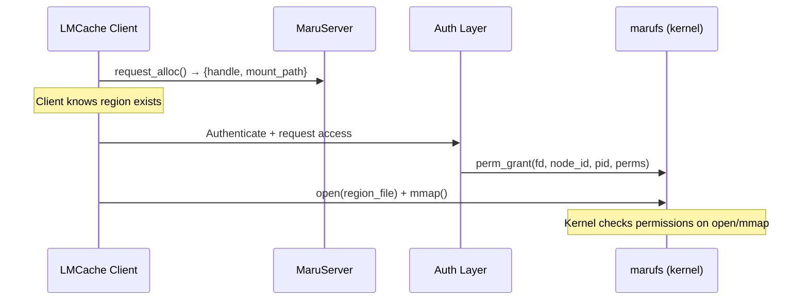
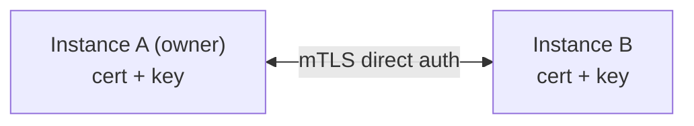
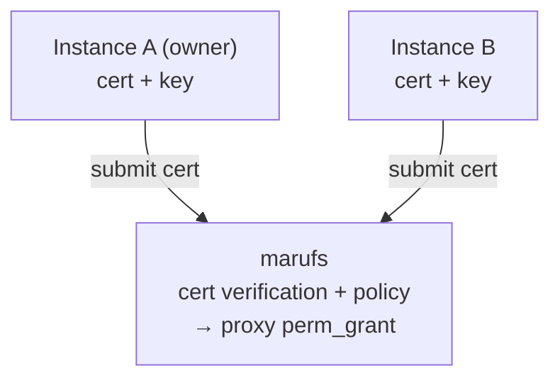
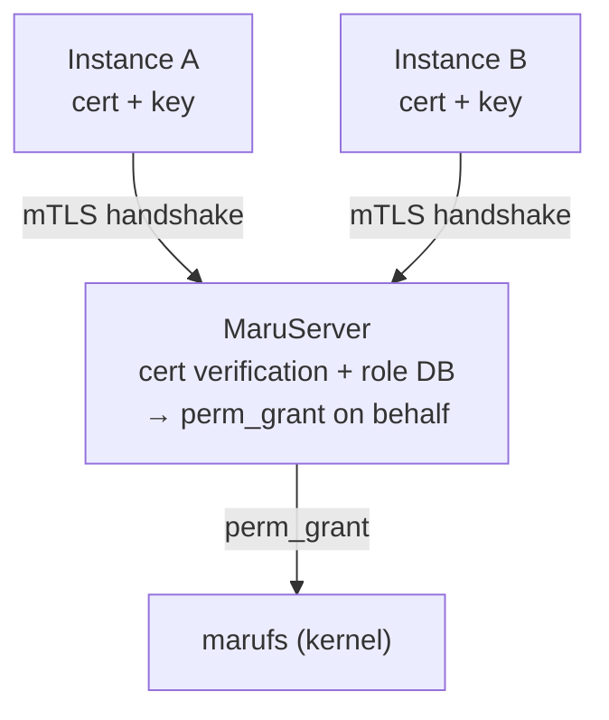
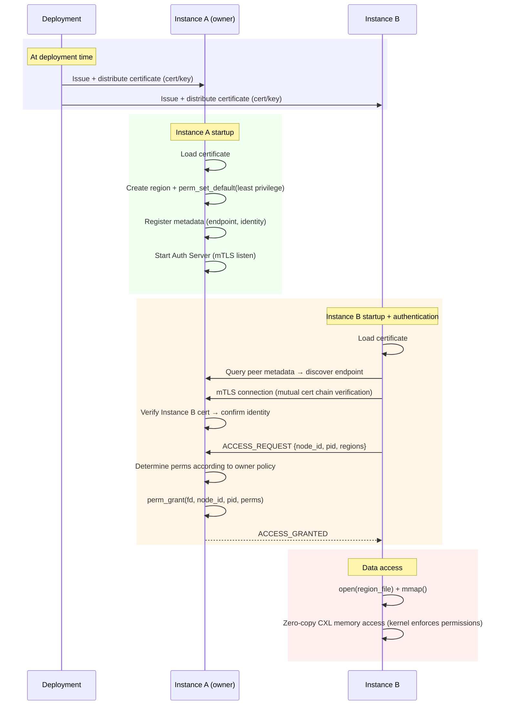
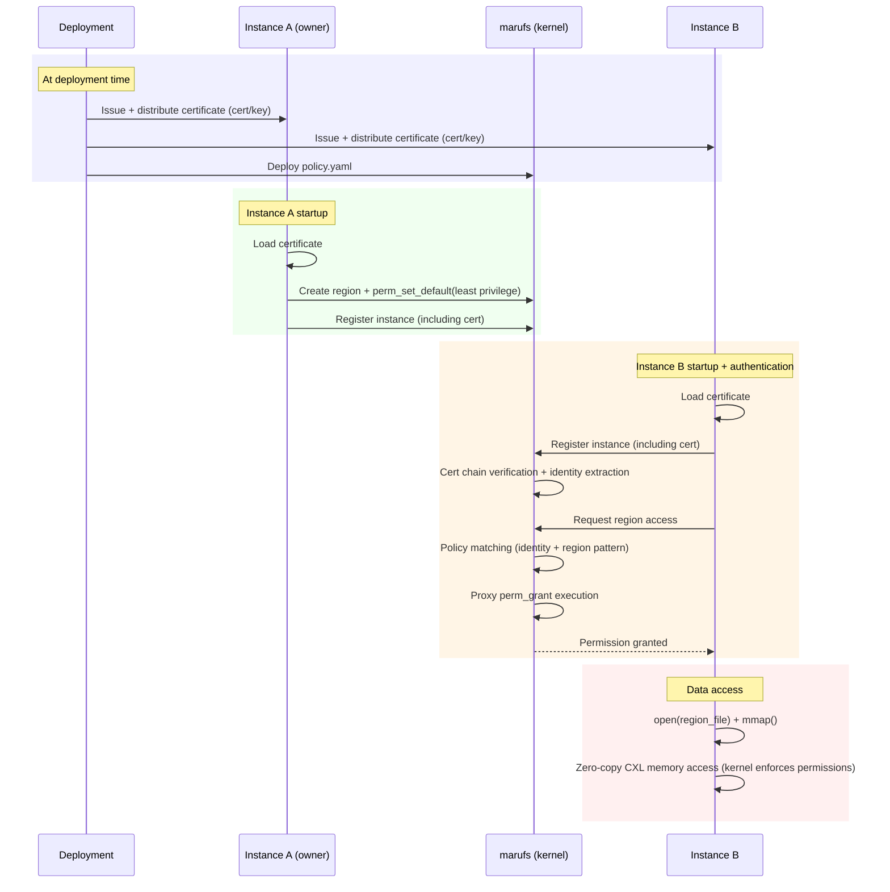
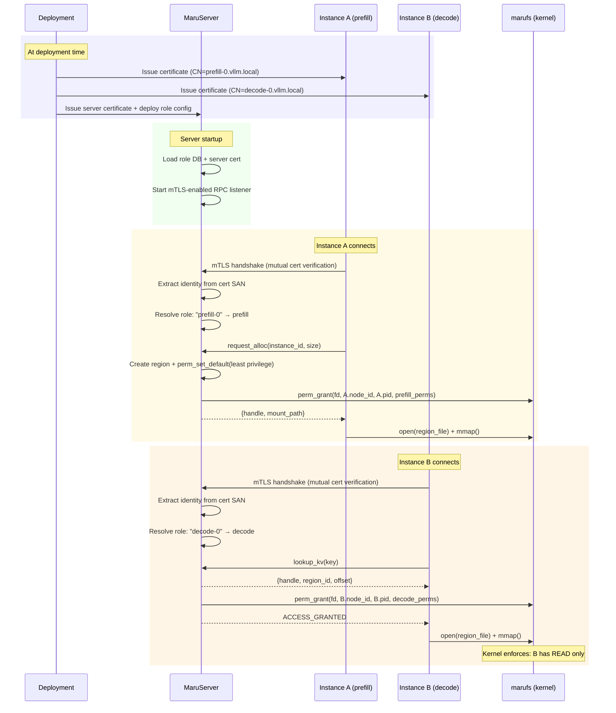

# marufs Instance Authentication and Authorization System Design

> **Status**: Design proposal. Not yet implemented. Current Hybrid mode uses `perm_set_default(PERM_ALL)` — all processes have full access to all regions.

- marufs kernel module supports per-region permission enforcement via `perm_grant` and `perm_set_default` ioctl
- The inter-instance permission delegation mechanism (who grants what to whom) is the subject of this design document
- Design an authentication and authorization system based on pre-provisioned X.509 certificates

---

## 1. Background

### Current State (Hybrid Mode)

In the current Hybrid mode (RPC server + marufs VFS backend):

- **Server-side**: `AllocationManager` creates regions via `MarufsClient.alloc()`, which calls `perm_set_default(PERM_ALL)` — granting all permissions to every process by default
- **Client-side**: `DaxMapper` opens and mmaps region files — no authentication required
- **No access control enforcement**: Any process that can reach the marufs mount point can open and mmap any region

This is acceptable for single-tenant deployments but insufficient for multi-tenant or security-sensitive environments.

### Security Requirements

KV cache contains user prompts and model response state. Sharing without authentication risks data leakage and cache poisoning.

- **Authentication**: Verify that the requesting instance is a legitimate vLLM instance in the cluster
- **Authorization**: Grant only the necessary permissions to authenticated instances (read-only instances do not need write permissions)
- **Least privilege**: Set region default permissions to minimum, grant individually after authentication (current `PERM_ALL` default needs improvement)
- **Certificate-based identity**: X.509 certificate-based mutual authentication — industry standard (K8s, Service Mesh, gRPC)

### Threat Model

| Threat | Mitigation |
|--------|------------|
| **Unauthenticated access** — external process hijacks KV cache region | Individual grant after authentication |
| **Identity spoofing** — impersonating another instance | X.509 chain verification + kernel `(node_id, pid, birth_time)` dual verification |
| **Privilege escalation** — read-only instance overwrites cache | Kernel enforces only `perm_grant`-ed permissions |
| **Certificate compromise** — cert/key leaked externally | Expiration limits + revocation (CRL/OCSP) + kernel process verification |
| **Man-in-the-middle** — eavesdropping/tampering auth traffic (Option A/C) | mTLS encrypted channel + mutual certificate verification |
| **Server compromise** — attacker controls MaruServer (Option C) | Server can grant permissions but cannot bypass kernel enforcement on existing grants; blast radius limited to new grant decisions. mTLS prevents impersonation of server itself |
| **Process impersonation** — privilege hijacking on the same node | Kernel `pid + birth_time` identification + automatic GC on termination |

### Out of Scope

- Certificate issuance/renewal infrastructure (delegated to existing PKI infrastructure)
- Certificate/key file protection (delegated to existing OS security mechanisms)
- CXL hardware physical security

---

## 2. Decision Points

The following decisions must be resolved before selecting an authentication model. Each decision constrains which options are feasible.

### DP-1. Permission Authority — who grants access?

| | Owner-controlled | Centrally-controlled |
|---|---|---|
| **Who calls `perm_grant`** | Region owner process | MaruServer (Option C) or marufs kernel (Option B) |
| **Policy location** | Inside each owner instance | Central config or role DB |
| **Region ownership** | Transferred to client via `chown` | Retained by server (no `chown`) |
| **Implication** | Each owner must implement auth logic | Single point of policy enforcement |
| **Options** | A | B, C |

This is the primary fork — all other decisions follow from it.

### DP-2. Cert Verification Plane — where is X.509 verified?

| | User-space | Kernel-space |
|---|---|---|
| **Implementation** | Standard TLS libraries (OpenSSL, rustls) | Kernel X.509 subsystem or custom verification in `marufs.ko` |
| **Complexity** | Low — well-understood, mature libraries | High — kernel crypto API, limited debugging, CRL/OCSP harder |
| **Cert rotation** | Process restart or hot-reload | Kernel module reload or ioctl-based update |
| **Options** | A, C | B |

Kernel-space cert verification (Option B) has significantly higher implementation complexity. If the team does not want to maintain kernel-level crypto, Option B is ruled out.

### DP-3. Permission Lifecycle — grant-only or grant + revoke?

| | Grant-only | Grant + Revoke |
|---|---|---|
| **Behavior** | Once granted, permission persists until region is freed | Authority can revoke access at any time |
| **Stale permissions** | Possible — scaled-down instances retain access | Cleaned up on revoke |
| **Complexity** | Simple — no state tracking of active grants | Requires tracking grantees and open fds for `perm_revoke` |
| **Use case** | Single-tenant, static clusters | Multi-tenant, dynamic scaling (pod autoscale) |
| **Options** | A, B, C (all support grant) | C (server retains fds, natural revoke point) |

If revocation is required, Option C is the most natural fit — the server already retains region fds and can issue `perm_revoke` when instances disconnect or roles change.

### DP-4. Auth Failure Mode — fail-closed or fail-open?

| | Fail-closed | Fail-open |
|---|---|---|
| **When auth authority is down** | New grants blocked, new clients cannot access regions | Cached policy allows grants to continue |
| **Existing mmaps** | Unaffected (kernel enforces, no runtime auth check) | Unaffected |
| **Security posture** | Stronger — no unauthorized access possible | Weaker — stale cache could grant outdated permissions |
| **Availability impact** | New instances cannot start sharing until auth recovers | New instances can start with cached roles |
| **Options** | B (kernel always available), C (server-dependent) | C (with policy cache) |

Option A is immune to this — each owner handles its own auth independently (no central SPOF). Option B runs in-kernel, so auth authority is always available as long as the node is up. Option C must choose between fail-closed (default) and fail-open (requires policy cache design).

### Decision Matrix

| Decision | Option A (P2P) | Option B (marufs) | Option C (Server) |
|---|---|---|---|
| DP-1 Authority | Owner | Kernel | Server |
| DP-2 Cert plane | User-space | Kernel-space | User-space |
| DP-3 Revoke | Not needed (owner controls) | Possible (kernel) | Natural fit (server holds fds) |
| DP-4 Failure mode | No SPOF | Always available | Must decide (fail-closed recommended) |

---

## 3. Overview

### Goals

- Authentication and authorization for CXL region access between vLLM instances
- Support three authentication models:
  - **Option A (P2P)**: Direct mTLS between instances — owner decides permissions based on its own policy
  - **Option B (marufs-mediated)**: marufs acts as proxy authenticator + automatically grants permissions according to pre-defined policy
  - **Option C (Server-mediated)**: MaruServer acts as central auth authority — authenticates instances, manages roles, and grants permissions on their behalf

### Integration with Current Architecture

In Hybrid mode, the authentication flow would be added between the RPC alloc response and the client-side mmap:



The key change from current behavior: `perm_set_default(PERM_ALL)` would be replaced with `perm_set_default(PERM_READ)` or even no default permissions, requiring explicit grants after authentication.

### Architecture

#### Option A: P2P mTLS



#### Option B: marufs-mediated



#### Option C: Server-mediated



### Trust Model

| Layer | Role |
|-------|------|
| **Instance cert** | Identity included in SAN. Proves identity during authentication. Chain verification prevents forgery |
| **MaruServer** | (Option C) Central auth authority — verifies certs, manages role-to-permission mapping, calls `perm_grant` on behalf of instances |
| **marufs kernel** | Process identification via `(node_id, pid, birth_time)` + permission enforcement |

Certificates prove the process's identity. In Options A/B the owner or kernel grants permissions directly; in Option C the server acts as a trusted intermediary. In all cases, the kernel enforces access permissions.

### Authentication Model Comparison

| | Option A: P2P | Option B: marufs-mediated | Option C: Server-mediated |
|---|---|---|---|
| **Auth entity** | Each instance (owner) | marufs (filesystem) | MaruServer |
| **Policy location** | Inside owner code | marufs config file (pre-defined) | Server role DB (runtime-mutable) |
| **Auth Server** | 1 per owner | Not required (marufs acts as proxy) | MaruServer (already exists) |
| **perm_grant caller** | Owner process | marufs (kernel) | MaruServer process |
| **Cert verification** | Owner verifies peer cert | Kernel verifies cert | Server verifies cert on mTLS handshake |
| **Role management** | N/A (owner decides) | Static policy file | Dynamic — RBAC via server API |
| **Pros** | Owner has fine-grained control | Operationally simple, centralized policy management | Reuses existing RPC infra, dynamic role updates without restart, natural fit for Hybrid mode |
| **Cons** | Each instance needs Auth Server implementation | Policy changes require marufs config update, kernel complexity | Server is SPOF for auth (not for data), requires mTLS on ZMQ |

---

## 4. Authentication Flows

### Option A: P2P mTLS

Instance B connects directly to Instance A (owner) via mTLS, authenticates, and obtains permissions. Permission mapping is determined by the owner according to its own policy and is not specified in this document.



### Option B: marufs-mediated

marufs acts as a proxy authenticator. Instances do not need to implement an Auth Server — they simply register with marufs, and the kernel automatically grants permissions according to pre-defined policy.

**Pre-defined Policy:**

```yaml
# /etc/maru/policy.yaml
policy:
  # identity → accessible region patterns + permissions
  instance-a:
    - pattern: "maru_*"
      perms: [READ, WRITE, ADMIN, IOCTL]
  instance-b:
    - pattern: "maru_*"
      perms: [READ, WRITE, IOCTL]
```



**Advantages:**
- No Auth Server implementation required — automatic permission grant upon registration
- Centralized policy management — cluster-wide consistency guaranteed
- Even if the owner is offline, permissions can be granted to existing regions based on policy

### Option C: Server-mediated

MaruServer acts as the central authentication and authorization authority. Instances authenticate to the server via mTLS during the RPC handshake, and the server manages a role database that maps identities to permission sets. When a client requests access to a region, the server verifies the client's role and calls `perm_grant` on its behalf.

This option reuses the existing MaruServer RPC infrastructure — no additional Auth Server or kernel-level cert handling is needed. Role assignments can be updated at runtime via a server management API, without restarting instances or redeploying config files.

**Role Database:**

```yaml
# Server-side role configuration (loaded at startup, updatable via API)
roles:
  prefill:
    description: "Prefill instance — owns regions, full access"
    perms: [READ, WRITE, DELETE, ADMIN, IOCTL]
  decode:
    description: "Decode instance — read-only consumer"
    perms: [READ]
  admin:
    description: "Cluster admin — full access + management"
    perms: [READ, WRITE, DELETE, ADMIN, IOCTL]

# Identity-to-role binding (cert SAN → role)
bindings:
  "CN=prefill-*.vllm.local": prefill
  "CN=decode-*.vllm.local": decode
  "CN=admin.vllm.local": admin
```



**Advantages:**
- Reuses existing MaruServer + ZMQ RPC infrastructure — minimal new components
- Dynamic role management — update bindings without restart via management API
- Natural fit for Hybrid mode — server already brokers metadata, extending to auth is incremental
- Centralized audit trail — all auth decisions logged in one place
- No kernel-level cert handling complexity (unlike Option B)

**Ownership Model:**

In Options A/B, `alloc()` calls `chown` to transfer POSIX ownership of the region file to the client process. In Option C, the server must **not** `chown` — it retains ownership of all regions so that it keeps `PERM_ADMIN` and can call `perm_grant` / `perm_revoke` at any time. Clients access regions exclusively through explicit grants. This is a key design difference: the server is the sole owner, clients are grantees.

This also means the server must keep region file descriptors open for the lifetime of the region (needed for `perm_grant` ioctl). The fd is already held in `MarufsClient._fd_cache` during the region's lifetime, so no additional mechanism is required.

**Disadvantages:**
- MaruServer becomes SPOF for authentication (data path remains independent — existing mmaps continue to work even if server goes down)
- Requires mTLS support on the ZMQ transport layer (CurveZMQ or ZMQ over TLS)
- Server must not `chown` regions — changes the ownership model from "transfer to client" to "server retains, client is grantee"

**Comparison with Options A/B:**

Option C is best suited for deployments that already use MaruServer in Hybrid mode and want centralized auth without kernel-level complexity (Option B) or per-instance Auth Server overhead (Option A). The tradeoff is that auth availability depends on the server process — but since the server is already required for metadata operations in Hybrid mode, this does not introduce a new dependency.
