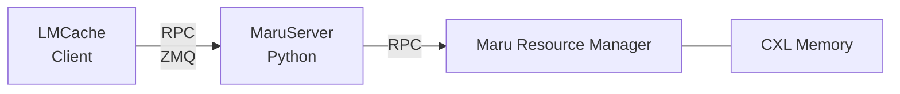
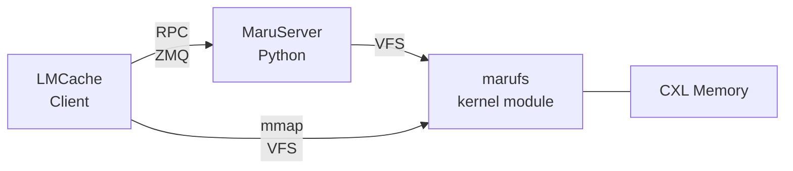
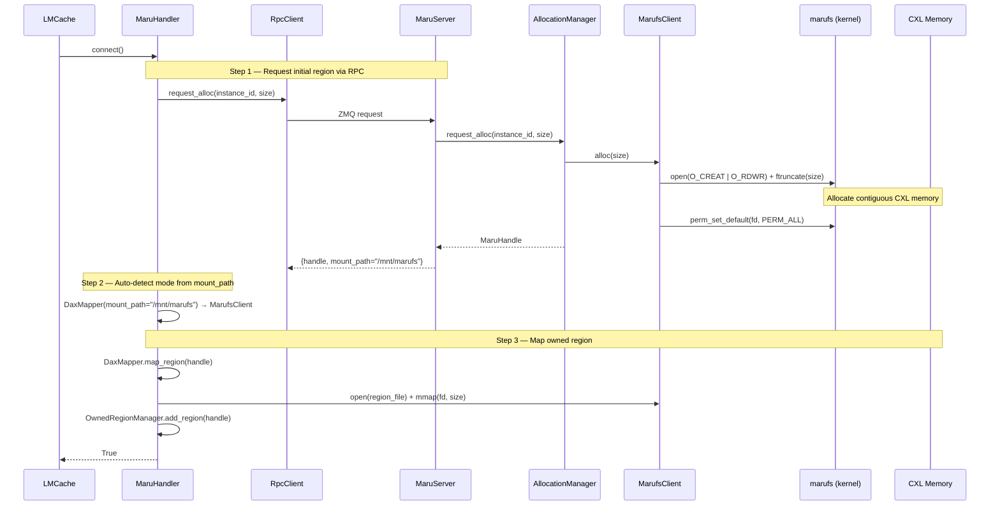
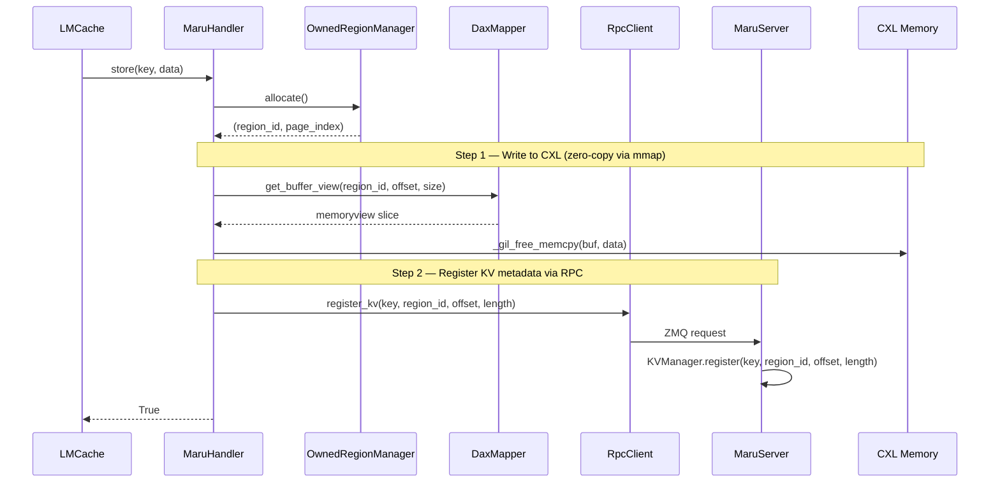
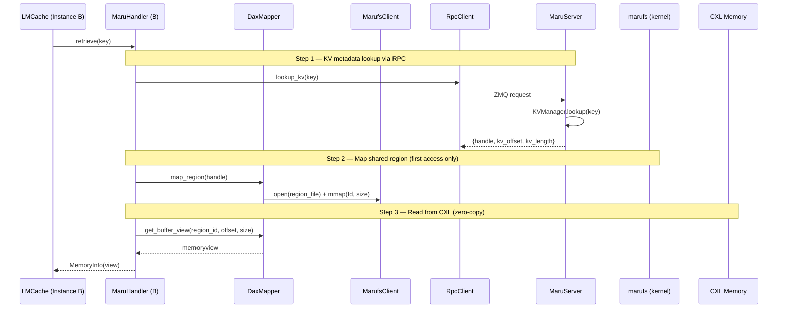
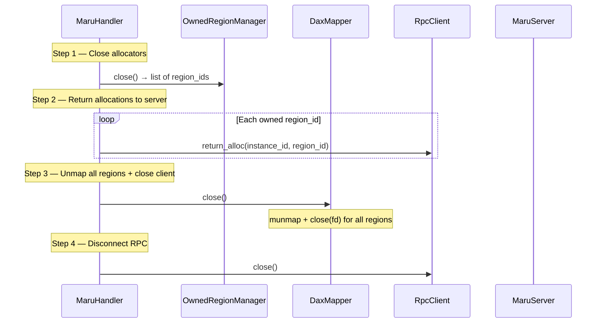
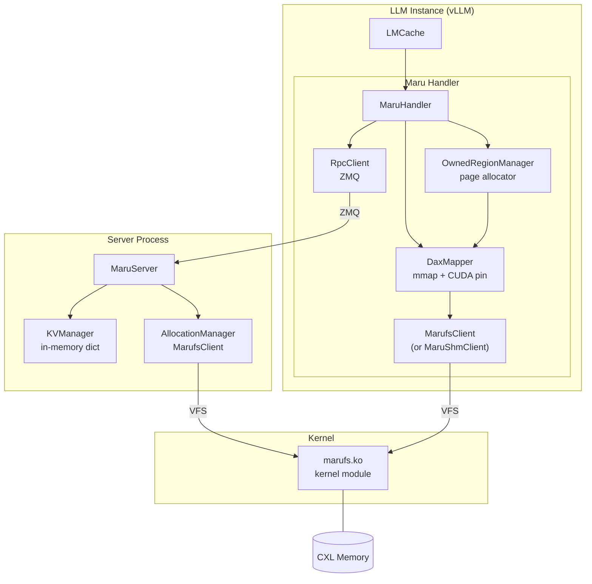
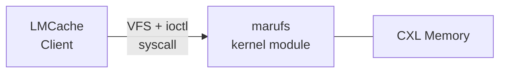

# marufs — Shared Filesystem Mode

> **Status**: VFS backend mode implemented and operational. Full serverless mode (ioctl global index) is planned.

## Motivation

Maru's architecture separates the **data plane** (direct zero-copy access to CXL shared memory) from the **control plane** (KV metadata registry and region lifecycle management). The control plane is pluggable — its implementation can change without affecting how data is read or written.

The first control plane implementation, **Remote mode (DAX)**, uses a centralized MaruServer and Maru Resource Manager communicating over RPC, with clients directly `mmap`-ing `/dev/dax` devices:



### Why a filesystem?

The fundamental limitation of DAX mode is **security**. Clients access CXL shared memory by directly `mmap`-ing `/dev/dax` devices. The Linux DAX driver provides no isolation — any process that can open the device has unrestricted read-write access to the entire CXL memory pool. There is no way to enforce per-region or per-instance access control at the hardware or driver level.

Moving access control into the kernel is necessary. A **filesystem** is the right choice because Maru's data model maps naturally onto it: each CXL memory region is a file, and each file has its own inode. The VFS layer already provides per-inode ownership, permission checks on `open` and `mmap`, and fd-scoped access — exactly the per-region security granularity Maru needs.

The underlying `/dev/dax` device is still used — but only the marufs kernel module accesses it directly. User-space processes access CXL memory through marufs region files instead, and the kernel mediates every `open`, `mmap`, and `ioctl`.

### DAX Mode Limitations

| Label | Problem | Description |
|-------|---------|-------------|
| **M1** | **No access control** | `/dev/dax` direct mmap — no per-region security enforcement |
| **M2** | **Multi-process management** | MaruServer and Maru Resource Manager must be deployed separately |
| **M3** | **Single-node only** | DAX mode assumes all instances share one CXL pool behind a single Resource Manager |

---

## Current Implementation: Hybrid Mode (RPC + marufs VFS)

The current marufs integration uses a **hybrid architecture**: MaruServer remains the control plane (KV metadata and allocation management), while marufs provides the data plane as a VFS backend replacing the DAX device path.



### What marufs does in Hybrid Mode

marufs serves as the **memory backend** — it replaces `/dev/dax` direct access with kernel-mediated file operations:

| Operation | DAX Mode | marufs Hybrid Mode |
|-----------|----------|-------------------|
| Region allocation | RPC → Resource Manager → `/dev/dax` handle | `open(O_CREAT)` + `ftruncate(size)` + `perm_set_default(PERM_ALL)` |
| Region mapping | MaruShmClient → Resource Manager → `/dev/dax` mmap | `open(region_file)` + `mmap(fd, size)` |
| Region deletion | RPC → Resource Manager | `close(fd)` + `unlink(path)` |
| KV metadata | MaruServer KVManager (in-memory dict) | MaruServer KVManager (in-memory dict) — **same** |
| Access control | None (`/dev/dax` wide open) | Kernel VFS permission checks on `open`/`mmap` |

Key point: **KV metadata management stays in MaruServer** — the ioctl global index is not used. marufs only provides the VFS layer for CXL memory access.

### Mode Auto-Detection

The server signals its backend mode via the `mount_path` field in `request_alloc` RPC response:

- `mount_path = None` → DAX mode (client uses MaruShmClient)
- `mount_path = "/mnt/marufs"` → marufs mode (client uses MarufsClient)

Clients don't need any configuration change — DaxMapper automatically selects the appropriate backend.

### Component Mapping

| Component | DAX Mode | marufs Hybrid Mode |
|-----------|----------|-------------------|
| **MaruServer** | KVManager + AllocationManager(MaruShmClient) | KVManager + AllocationManager(**MarufsClient**) |
| **DaxMapper** | MaruShmClient | **MarufsClient** (auto-detected) |
| **RPC** | ZMQ client-server | ZMQ client-server — **same** |
| **OwnedRegionManager** | PagedMemoryAllocator | PagedMemoryAllocator — **same** |
| **MaruHandler** | Same handler | Same handler — **same** |

---

## Operation Flows (Hybrid Mode)

### Init (connect)



### Store (saving KV cache)



### Retrieve (cross-instance KV cache lookup)



Subsequent accesses to the same region reuse the cached mmap (0 open/mmap overhead).

### Close / Cleanup



---

## Component Overview (Hybrid Mode)



---

## Future: Full Serverless Mode

The planned evolution replaces MaruServer entirely with marufs kernel ioctl operations:



This would address the remaining limitations:

| Feature | Hybrid Mode (current) | Full Serverless (planned) |
|---------|----------------------|--------------------------|
| KV metadata | MaruServer KVManager (RPC) | Kernel global hash table (ioctl) |
| Region allocation | MaruServer AllocationManager (RPC) | POSIX VFS (open + ftruncate) |
| Server process | Required | Not required |
| Metadata lookup | RPC round-trip | Single ioctl syscall |
| Batch operations | RPC batch | ioctl batch (up to 32/call) |

### Kernel Global Hash Table (planned)

The kernel maintains a **global hash table** in CXL memory for O(1) KV metadata lookup:

- **O(1) lookup**: A single ioctl call returns `(region_name, byte_offset)`
- **Lock-free concurrency**: CAS-based hash table allows safe multi-instance concurrent access
- **Global search**: One ioctl searches across all regions — no region scanning needed
- **Batch operations**: Up to 32 keys per ioctl call for both lookup and registration

---

## Kernel Interface Reference

The marufs kernel module exposes its interface through standard VFS operations (open, close, mmap, unlink) and a set of ioctl commands. In Hybrid mode, only VFS operations and `perm_set_default` are used. The global hash table ioctls are reserved for the full serverless mode.

### VFS Operations (used in Hybrid Mode)

| Operation | Usage |
|-----------|-------|
| `open(O_CREAT \| O_RDWR)` | Create region file (server-side allocation) |
| `ftruncate(fd, size)` | Set region size |
| `open(O_RDWR)` | Open existing region (client-side mapping) |
| `mmap(fd, size, prot)` | Map region into process address space |
| `munmap(addr, size)` | Unmap region |
| `close(fd)` | Close file descriptor |
| `unlink(path)` | Delete region file |

### ioctl Commands

<details>
<summary>ioctl Command Table (click to expand)</summary>

| ioctl | nr | Direction | Size | Used in Hybrid | Description |
|-------|----|-----------|------|:-:|-------------|
| `MARUFS_IOC_PERM_SET_DEFAULT` | 13 | `_IOW` | 16B | **Yes** | Set default permissions for new accessors |
| `MARUFS_IOC_PERM_GRANT` | 10 | `_IOW` | 16B | No | Grant permissions to specific process |
| `MARUFS_IOC_NAME_OFFSET` | 1 | `_IOW` | 80B | No | Register name-ref in global hash table |
| `MARUFS_IOC_FIND_NAME` | 2 | `_IOWR` | 144B | No | Global name lookup → (region_name, offset) |
| `MARUFS_IOC_CLEAR_NAME` | 3 | `_IOW` | 80B | No | Remove name-ref from global hash table |
| `MARUFS_IOC_BATCH_FIND_NAME` | 4 | `_IOWR` | 16B | No | Batch name lookup (up to 32/call) |
| `MARUFS_IOC_BATCH_NAME_OFFSET` | 6 | `_IOWR` | 16B | No | Batch name-ref registration (up to 32/call) |

Magic byte: `0x58` (ASCII `'X'`).

</details>

<details>
<summary>Key Structures (click to expand)</summary>

```c
#define MARUFS_NAME_MAX 63    // max name length

struct marufs_name_offset_req {           // 80 bytes
    char     name[MARUFS_NAME_MAX + 1];   // 64B — key string
    __le64   offset;                      // 8B  — byte offset in region
    __le64   name_hash;                   // 8B  — pre-computed hash (0 = djb2 fallback)
};

struct marufs_find_name_req {             // 144 bytes
    char     name[MARUFS_NAME_MAX + 1];         // 64B — input: search key
    char     region_name[MARUFS_NAME_MAX + 1];  // 64B — output: region filename
    __le64   offset;                            // 8B  — output: byte offset
    __le64   name_hash;                         // 8B  — pre-computed hash
};

struct marufs_perm_req {                  // 16 bytes
    __le32   node_id;                     // CXL node ID
    __le32   pid;                         // target process ID
    __le32   perms;                       // permission flags
    __le32   reserved;                    // alignment padding
};
```

</details>

<details>
<summary>Permission Flags (click to expand)</summary>

| Flag | Value | Description |
|------|-------|-------------|
| `PERM_READ` | `0x0001` | Read access |
| `PERM_WRITE` | `0x0002` | Write access |
| `PERM_DELETE` | `0x0004` | Delete access |
| `PERM_ADMIN` | `0x0008` | Permission management — required for `perm_grant` and `perm_set_default` |
| `PERM_IOCTL` | `0x0010` | ioctl access |
| `PERM_ALL` | `0x001F` | All permissions |

</details>

---

## Known Issues

### 1. No exclusive open on `/dev/dax`

The Linux DAX device driver does not support exclusive open — multiple processes can open the same `/dev/dax` device simultaneously, bypassing marufs's permission model.

**Workaround:** Restrict `/dev/dax` device file permissions to root only (`chmod 600 /dev/dax*`). Only the marufs kernel module (running in kernel context) accesses the DAX device directly; user-space processes access CXL memory through marufs region files, where kernel-level permission enforcement applies.

### 2. `cudaHostRegister` requires read-write mapping

CUDA does not support `cudaHostRegisterReadOnly` — `cudaHostRegister` requires the host memory region to be mapped with both read and write permissions (`PROT_READ | PROT_WRITE`).

**Current behavior:** In Hybrid mode, all regions are mapped with `PROT_READ | PROT_WRITE` and `perm_set_default(PERM_ALL)` is set at allocation time. This allows any process to read and write any region. Fine-grained permission control is planned for the full serverless mode.

### 3. CXL pool fragmentation

Region creation and deletion over time can fragment the CXL memory pool. Within a region, page-level allocation/free does not cause external fragmentation (pages are fixed-size). However, at the pool level, repeated region create/delete cycles can leave the CXL address space fragmented, making it impossible to allocate large contiguous regions even when total free memory is sufficient.
