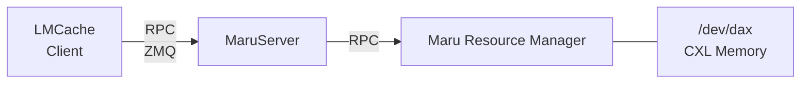
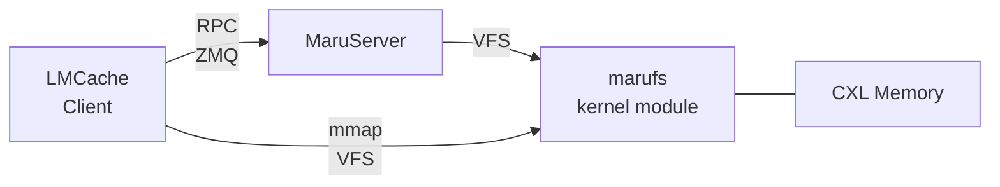
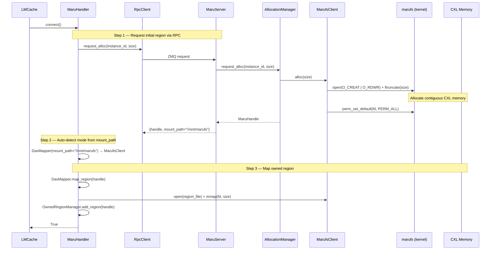
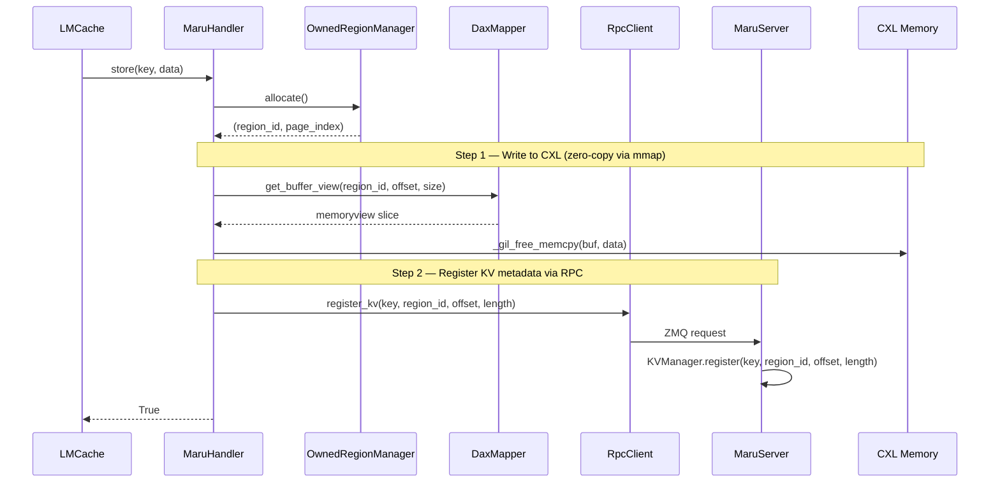
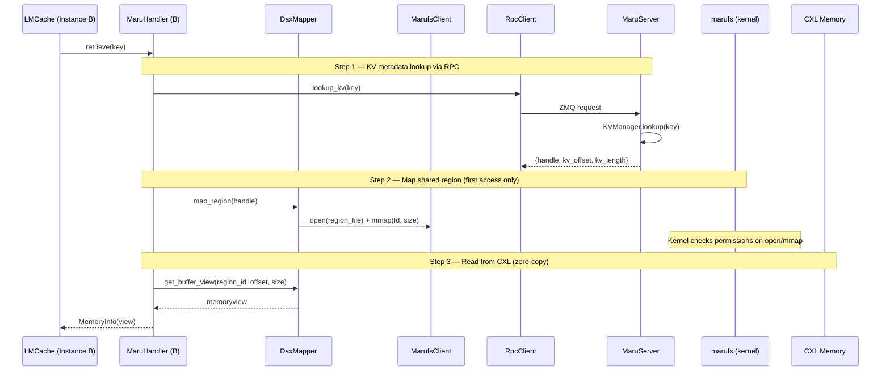
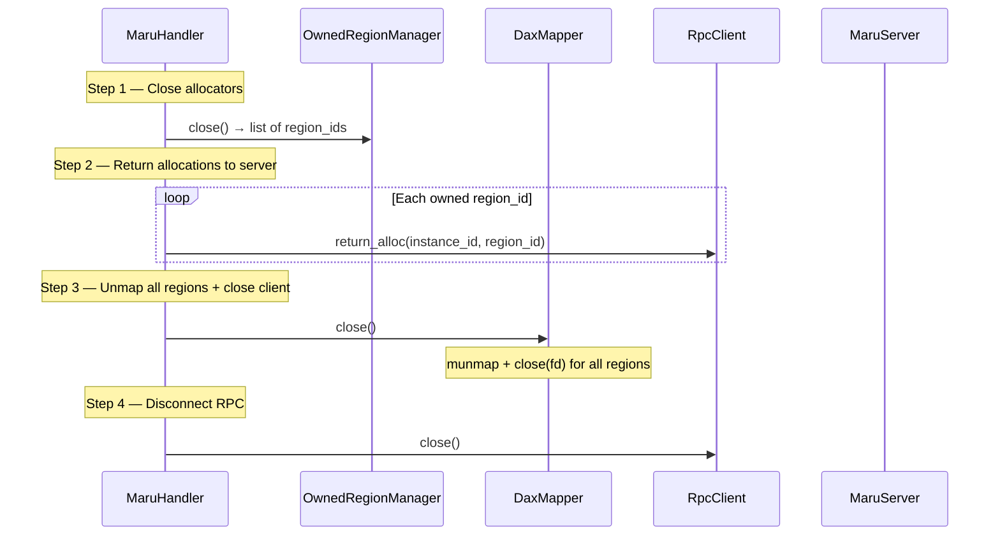
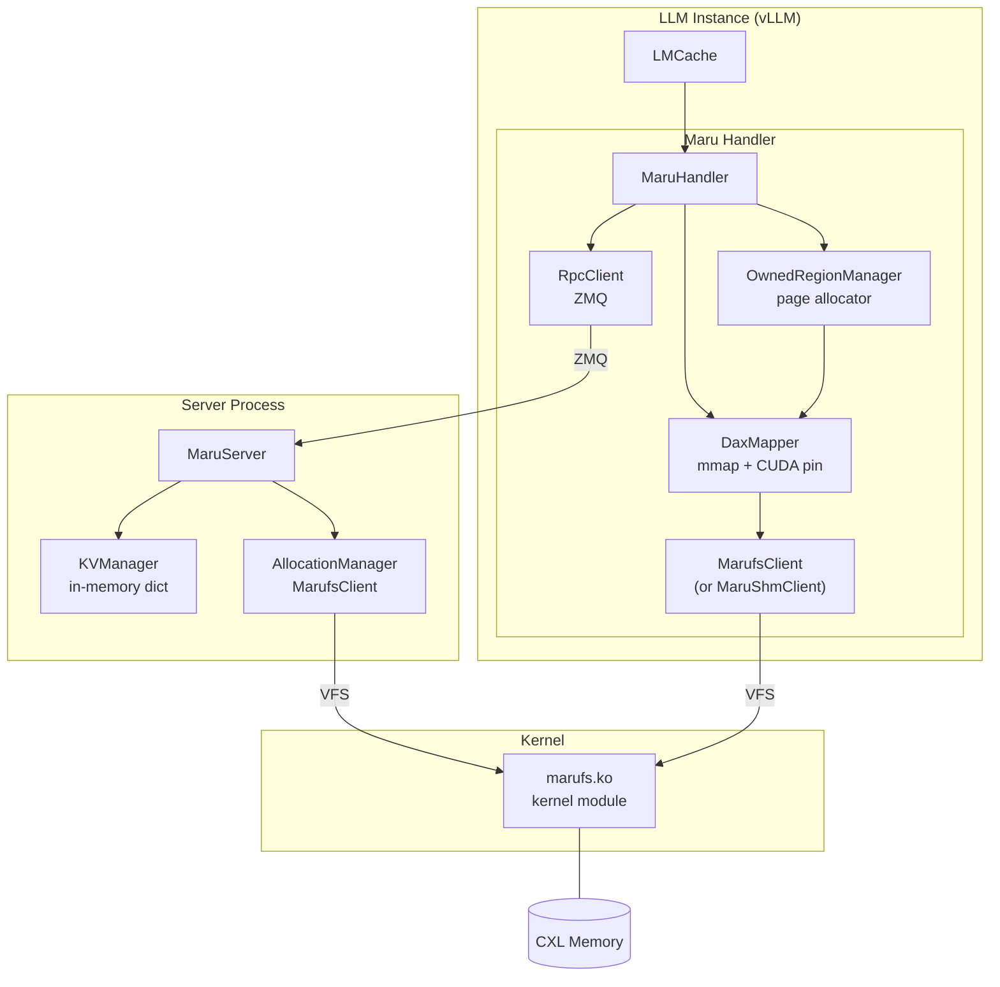

# marufs — Shared Filesystem Mode

> **Status**: VFS backend mode implemented and operational.

## Motivation

Maru's architecture separates the **data plane** (direct zero-copy access to CXL shared memory) from the **control plane** (KV metadata registry and region lifecycle management).

The first data plane implementation, **DAX mode**, uses MaruShmClient to access CXL memory via `/dev/dax` devices through the Maru Resource Manager daemon:



### Why a filesystem?

The fundamental limitation of DAX mode is **security**. Clients access CXL shared memory by directly `mmap`-ing `/dev/dax` devices. The Linux DAX driver provides no isolation — any process that can open the device has unrestricted read-write access to the entire CXL memory pool. There is no way to enforce per-region or per-instance access control at the hardware or driver level.

A **filesystem** is the right solution because Maru's data model maps naturally onto it: each CXL memory region is a file, and each file has its own inode. The VFS layer already provides per-inode ownership, permission checks on `open` and `mmap`, and fd-scoped access — exactly the per-region security granularity Maru needs.

The underlying `/dev/dax` device is still used — but only the marufs kernel module accesses it directly. User-space processes access CXL memory through marufs region files, and the kernel mediates every `open`, `mmap`, and `ioctl`.

### DAX Mode Limitations

| Label | Problem | Description |
|-------|---------|-------------|
| **M1** | **No access control** | `/dev/dax` direct mmap — no per-region security enforcement |
| **M2** | **Multi-process management** | MaruServer and Maru Resource Manager must be deployed separately |

**marufs mode** replaces the DAX device path with a kernel filesystem, enabling **per-region kernel-level access control** while keeping the same RPC control plane.



---

## Architecture

### What changes from DAX mode

| Concern | DAX Mode | marufs Mode |
|---------|----------|-------------|
| Region allocation | MaruShmClient → Resource Manager → `/dev/dax` | MarufsClient → `open(O_CREAT)` + `ftruncate(size)` |
| Region mapping | MaruShmClient.mmap() → Resource Manager | MarufsClient → `open(region_file)` + `mmap(fd)` |
| Region deletion | MaruShmClient → Resource Manager | `close(fd)` + `unlink(path)` |
| Access control | **None** (`/dev/dax` wide open) | **Kernel VFS** — per-region permission checks on `open`/`mmap` |
| Server process | MaruServer + Resource Manager | MaruServer only (Resource Manager 불필요) — **addresses M2** |
| KV metadata | MaruServer KVManager | MaruServer KVManager — **동일** |

### Mode Auto-Detection

Server signals its backend mode via the `mount_path` field in `request_alloc` RPC response:

- `mount_path = None` → DAX mode (client uses MaruShmClient)
- `mount_path = "/mnt/marufs"` → marufs mode (client uses MarufsClient)

Clients don't need any configuration change — DaxMapper automatically selects the appropriate backend based on server response.

### Component Mapping

| Component | DAX Mode | marufs Mode |
|-----------|----------|-------------|
| **MaruServer** | AllocationManager(MaruShmClient) | AllocationManager(**MarufsClient**) |
| **DaxMapper** | MaruShmClient | **MarufsClient** (auto-detected) |
| **RPC** | ZMQ client-server | ZMQ client-server — 동일 |
| **OwnedRegionManager** | PagedMemoryAllocator | PagedMemoryAllocator — 동일 |
| **MaruHandler** | Same handler | Same handler — 동일 |

---

## Kernel-level Access Control — addresses M1

DAX mode has no access control — any process can mmap `/dev/dax`. marufs moves access control into the kernel:

- **Per-region permissions**: Each region file has its own permission state, enforced by the kernel on `open` and `mmap`
- **Owner identification**: Each region tracks its owner by `(node_id, pid, birth_time)` triple. The kernel verifies the caller's identity on every access
- **Permission flags**: `PERM_READ`, `PERM_WRITE`, `PERM_DELETE`, `PERM_ADMIN`, `PERM_IOCTL` — enforced at the VFS layer
- **Default permissions**: Set at region creation via `perm_set_default` ioctl. Current implementation uses `PERM_ALL` for simplicity; future work will implement least-privilege defaults with explicit grants
- **Explicit grant model**: `perm_grant(node_id, pid, perms)` allows fine-grained per-process permission delegation. Requires `PERM_ADMIN`
- **`PERM_ADMIN` delegation**: Owners implicitly hold all permissions. A process that receives `PERM_ADMIN` via grant can itself grant permissions to other processes

### Current Permission Model

In the current implementation, `perm_set_default(PERM_ALL)` is called during region allocation — all processes can access all regions. This is acceptable for single-tenant deployments.

### Planned Permission Model

For multi-tenant or security-sensitive environments, the planned model is:

1. Region created with `perm_set_default(PERM_READ)` or no default permissions
2. Authenticated instances receive explicit `perm_grant` after certificate verification
3. See [mTLS Authentication Guide](mtls_auth_guide.md) for the authentication design

---

## Operation Flows

### Init (connect)



### Store (saving KV cache)



### Retrieve (cross-instance KV cache lookup)



Subsequent accesses to the same region reuse the cached mmap (0 open/mmap overhead).

### Close / Cleanup



---

## Component Overview



---

## Kernel Interface Reference

### VFS Operations

| Operation | Usage |
|-----------|-------|
| `open(O_CREAT \| O_RDWR)` | Create region file (server-side allocation) |
| `ftruncate(fd, size)` | Set region size |
| `open(O_RDWR)` | Open existing region (client-side mapping) |
| `mmap(fd, size, prot)` | Map region into process address space |
| `munmap(addr, size)` | Unmap region |
| `close(fd)` | Close file descriptor |
| `unlink(path)` | Delete region file |

### Permission ioctl

| ioctl | Description |
|-------|-------------|
| `MARUFS_IOC_PERM_SET_DEFAULT` | Set default permissions for new accessors |
| `MARUFS_IOC_PERM_GRANT` | Grant permissions to specific process (node_id, pid) |

<details>
<summary>Permission Flags (click to expand)</summary>

| Flag | Value | Description |
|------|-------|-------------|
| `PERM_READ` | `0x0001` | Read access |
| `PERM_WRITE` | `0x0002` | Write access |
| `PERM_DELETE` | `0x0004` | Delete access |
| `PERM_ADMIN` | `0x0008` | Permission management — required for `perm_grant` and `perm_set_default` |
| `PERM_IOCTL` | `0x0010` | ioctl access |
| `PERM_ALL` | `0x001F` | All permissions |

</details>

<details>
<summary>Permission Structures (click to expand)</summary>

```c
struct marufs_perm_req {                  // 16 bytes
    __le32   node_id;                     // CXL node ID
    __le32   pid;                         // target process ID
    __le32   perms;                       // permission flags
    __le32   reserved;                    // alignment padding
};
```

</details>

---

## On-disk Layout

marufs presents CXL shared memory as a flat directory of region files:

```
/mnt/marufs/                          ← mount point
├── region_0                          ← owned region (instance A)
├── region_1                          ← owned region (instance A, 2nd)
├── region_2                          ← owned region (instance B)
└── ...
```

Each region file is a physically contiguous CXL memory allocation. A single region holds multiple KV cache entries, each identified by a byte offset within the region. Region files are created with `open(O_CREAT) + ftruncate(size)` and memory-mapped directly for zero-copy access.

---

## Known Issues

### 1. No exclusive open on `/dev/dax`

The Linux DAX device driver does not support exclusive open — multiple processes can open the same `/dev/dax` device simultaneously, bypassing marufs's permission model.

**Workaround:** Restrict `/dev/dax` device file permissions to root only (`chmod 600 /dev/dax*`). Only the marufs kernel module (running in kernel context) accesses the DAX device directly; user-space processes access CXL memory through marufs region files.

### 2. `cudaHostRegister` requires read-write mapping

CUDA does not support `cudaHostRegisterReadOnly` — `cudaHostRegister` requires `PROT_READ | PROT_WRITE`.

**Current behavior:** All regions are mapped with `PROT_READ | PROT_WRITE`. Fine-grained read-only mapping for shared regions is planned.

### 3. CXL pool fragmentation

Region creation and deletion over time can fragment the CXL memory pool. Within a region, page-level allocation/free does not cause external fragmentation (pages are fixed-size). However, at the pool level, repeated region create/delete cycles can fragment the CXL address space.
