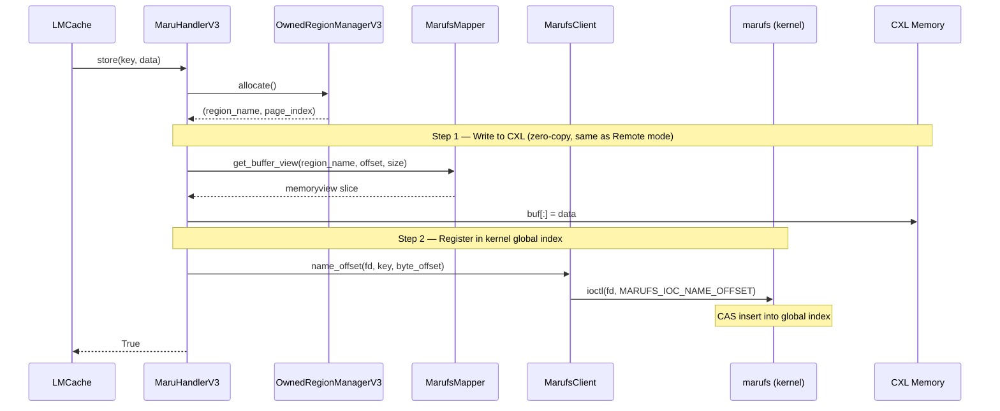
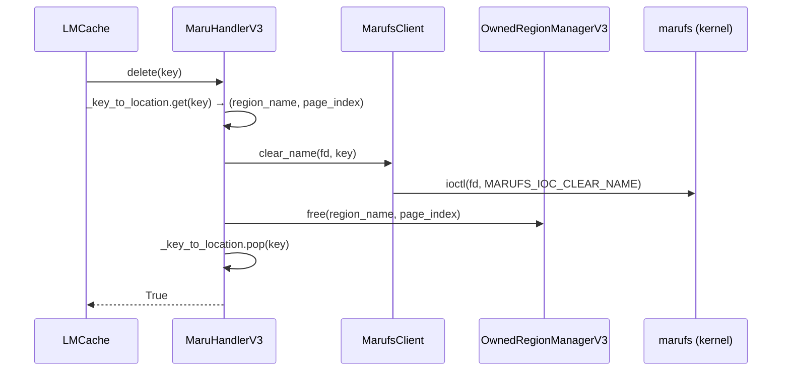

# marufs — Shared Filesystem Mode

> **Status**: Under active development, release coming soon.

## Motivation

Maru's architecture separates the **data plane** (direct zero-copy access to CXL shared memory) from the **control plane** (KV metadata registry and region lifecycle management). The control plane is pluggable — its implementation can change without affecting how data is read or written.

The first control plane implementation, **Remote mode**, uses a centralized MaruServer and Maru Resource Manager communicating over RPC:

```
┌─────────────┐     RPC      ┌─────────────┐     RPC      ┌──────────────────────┐
│  LMCache    │ ──────────── │  MaruServer  │ ──────────── │ Maru Resource Manager│
│  (Client)   │   (ZMQ)      │  (Python)    │              │         │
└─────────────┘              └─────────────┘              └──────────────────────┘
```

While functional, this design carries operational burdens:

| Problem | Description |
|---------|-------------|
| **Multi-process management** | MaruServer and Maru Resource Manager must be deployed and monitored separately |
| **RPC overhead** | Every KV lookup and region allocation goes through network serialization |
| **Single point of failure** | If MaruServer crashes, all KV metadata is lost |
| **User-space access control** | Memory access control is enforced in user-space RPC, which is weaker than kernel-level enforcement |
| **IPC complexity** | Multi-hop RPC protocol between MaruServer and Resource Manager is hard to debug and maintain |

**Shared Filesystem mode (marufs)** is the second control plane implementation. It replaces all server-side processes with a single Linux kernel filesystem module (`marufs.ko`), enforcing memory access control at the kernel level for stronger security than user-space RPC.

```
┌─────────────┐   VFS + ioctl   ┌─────────────────┐
│  LMCache    │ ──────────────── │  marufs (kernel) │ ─── CXL Memory
│  (Client)   │   (syscall)      │                  │
└─────────────┘                  └─────────────────┘
```

The data plane remains identical — clients still access CXL memory directly via mmap. Only the control plane changes.

---

## Key Improvements over Remote Mode

### 1. Serverless Control Plane

Three separate server-side processes are consolidated into a single kernel module:

| Remote Mode Component | Role | Filesystem Mode Replacement |
|-------------|------|---------------|
| MaruServer (KVManager) | KV metadata registry | marufs global partitioned index (ioctl) |
| MaruServer (AllocationManager) | Region allocation tracking | POSIX VFS (`open` / `ftruncate` / `unlink`) |
| Maru Resource Manager | CXL memory pool, GC | marufs kernel module (GC kthread) |
| MaruShmClient (RPC) | Region handle issuance, memory mapping | MarufsClient (VFS + ioctl) |

Deployment is as simple as loading `marufs.ko` and mounting. No server processes to manage.

### 2. Kernel-level Access Control

Remote mode enforces memory access control in user-space via RPC — any process that can reach the server can potentially bypass authorization. Filesystem mode moves access control into the kernel:

- **Permission flags** (`PERM_READ`, `PERM_WRITE`, `PERM_DELETE`, `PERM_ADMIN`, `PERM_IOCTL`) are enforced at the VFS layer
- **Default permissions** are set at region creation via `perm_set_default`
- The kernel mediates all region access — no way to bypass without kernel privilege

### 3. Kernel-managed Global KV Index

In Remote mode, KV metadata lives in a Python dictionary inside MaruServer — volatile and bottlenecked by RPC.

In Filesystem mode, the kernel maintains a **global partitioned index** directly in CXL memory:

- **O(1) lookup**: A single ioctl call returns `(region_name, byte_offset)`
- **Lock-free concurrency**: CAS-based hash table allows safe multi-instance concurrent access
- **Global search**: One ioctl searches across all regions — no region scanning needed
- **Batch operations**: Up to 512 keys per ioctl call for bulk lookup/registration

### 4. File-based Region Management

Region lifecycle is handled through ordinary file operations, eliminating the RPC round-trips:

| Operation | Remote Mode | Filesystem Mode |
|-----------|-------------|-----------------|
| Create region | RPC → MaruServer → Resource Manager | `open(O_CREAT)` + `ftruncate(size)` |
| Delete region | RPC → MaruServer → Resource Manager | `unlink(path)` |
| List regions | RPC → MaruServer | `listdir(mount_path)` |
| Map region | RPC → Resource Manager → handle → mmap | `open()` → `mmap()` |

---

## Data Flows

The data plane (zero-copy mmap access to CXL memory) is shared across both modes. The diagrams below show Filesystem mode's control plane interactions.

### Store (saving KV cache)



### Retrieve (cross-instance KV cache lookup)


Subsequent retrievals of the same key hit the local cache (0 ioctl).
Subsequent accesses to the same region reuse the cached mmap (0 open/mmap).

### Delete



### Close / Cleanup


---

## Component Overview

Filesystem mode introduces three components that replace their Remote mode counterparts:

| Component | Replaces | Role |
|-----------|----------|------|
| **MarufsClient** | RpcClient + MaruShmClient | Wraps kernel filesystem interface — region CRUD via VFS, global index operations via ioctl, permission management. Caches file descriptors internally and validates region names against path traversal. |
| **MarufsMapper** | DaxMapper | Memory-mapping lifecycle manager. All regions are mapped with CUDA pinning for owned regions; shared region size is auto-detected via fstat. Performs bulk unmap on close. |
| **OwnedRegionManagerV3** | OwnedRegionManager | Page-level allocator for multiple owned regions, using the same O(1) free-list strategy as Remote mode. Allocation follows the same fast-path: active region → scan others → create new. |

---

## Concurrency Guarantees

All components are thread-safe. Write operations (store, delete, region map/unmap, allocation/free) are serialized. Read operations (retrieve, buffer view access) are lock-free. This follows the same concurrency model as Remote mode.

> **See also:** [Consistency and Safety](consistency_and_safety.md)

---

## Kernel Interface Reference

The marufs kernel module exposes its interface through standard VFS operations (open, close, mmap, unlink) and a set of ioctl commands for global index and permission management.

<details>
<summary>ioctl Command Table (click to expand)</summary>

| ioctl | nr | Direction | Size | Description |
|-------|----|-----------|------|-------------|
| `MARUFS_IOC_NAME_OFFSET` | 1 | `_IOW` | 80B | Register name-ref in global index |
| `MARUFS_IOC_FIND_NAME` | 2 | `_IOWR` | 144B | Global name lookup → (region_name, offset) |
| `MARUFS_IOC_CLEAR_NAME` | 3 | `_IOW` | 80B | Remove name-ref from global index |
| `MARUFS_IOC_BATCH_FIND_NAME` | 4 | `_IOWR` | 16B | Batch name lookup (up to 512/call) |
| `MARUFS_IOC_DAX_MMAP` | 5 | `_IOWR` | 16B | DAX mmap |
| `MARUFS_IOC_BATCH_NAME_OFFSET` | 6 | `_IOWR` | 16B | Batch name-ref registration (up to 512/call) |
| `MARUFS_IOC_PERM_GRANT` | 10 | `_IOW` | 16B | Grant permissions |
| `MARUFS_IOC_PERM_REVOKE` | 11 | `_IOW` | 16B | Revoke permissions |
| `MARUFS_IOC_PERM_SET_DEFAULT` | 13 | `_IOW` | 16B | Set default permissions |
| `MARUFS_IOC_DMABUF_EXPORT` | 0x50 | `_IOWR` | 16B | DMA-BUF export |

Magic byte: `0x58` (ASCII `'X'`).

</details>

<details>
<summary>Key Structures (click to expand)</summary>

```c
#define MARUFS_NAME_MAX 63    // max name length

struct marufs_name_offset_req {           // 80 bytes
    char     name[MARUFS_NAME_MAX + 1];   // 64B — key string
    __le64   offset;                      // 8B  — byte offset in region
    __le64   name_hash;                   // 8B  — pre-computed hash (0 = djb2 fallback)
};

struct marufs_find_name_req {             // 144 bytes
    char     name[MARUFS_NAME_MAX + 1];         // 64B — input: search key
    char     region_name[MARUFS_NAME_MAX + 1];  // 64B — output: region filename
    __le64   offset;                            // 8B  — output: byte offset
    __le64   name_hash;                         // 8B  — pre-computed hash
};

struct marufs_perm_req {                  // 16 bytes
    __le32   node_id;                     // CXL node ID
    __le32   pid;                         // target process ID
    __le32   perms;                       // permission flags
    __le32   reserved;                    // alignment padding
};
```

</details>

<details>
<summary>Batch Structures (click to expand)</summary>

```c
struct marufs_batch_find_entry {          // per-entry
    char     name[MARUFS_NAME_MAX + 1];
    char     region_name[MARUFS_NAME_MAX + 1];
    __le64   offset;
    __le64   name_hash;
    __le32   status;                      // 0 = found, -ENOENT = not found
    __u8     _pad[4];
};

struct marufs_batch_find_req {            // header (16B)
    __le32   count;                       // number of entries
    __le32   found;                       // output: number found
    __le64   entries;                     // pointer to entry array
};
```

Batch limit: **512 entries** per ioctl call. The Python client automatically splits larger batches.

</details>

<details>
<summary>Permission Flags (click to expand)</summary>

| Flag | Value | Description |
|------|-------|-------------|
| `PERM_READ` | `0x0001` | Read access |
| `PERM_WRITE` | `0x0002` | Write access |
| `PERM_DELETE` | `0x0004` | Delete access |
| `PERM_ADMIN` | `0x0008` | Admin access |
| `PERM_IOCTL` | `0x0010` | ioctl access |
| `PERM_ALL` | `0x001F` | All permissions |

</details>
