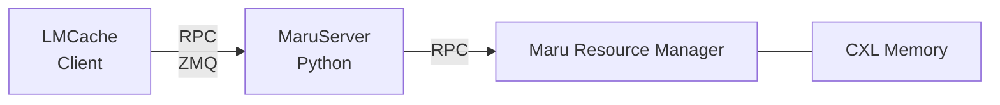
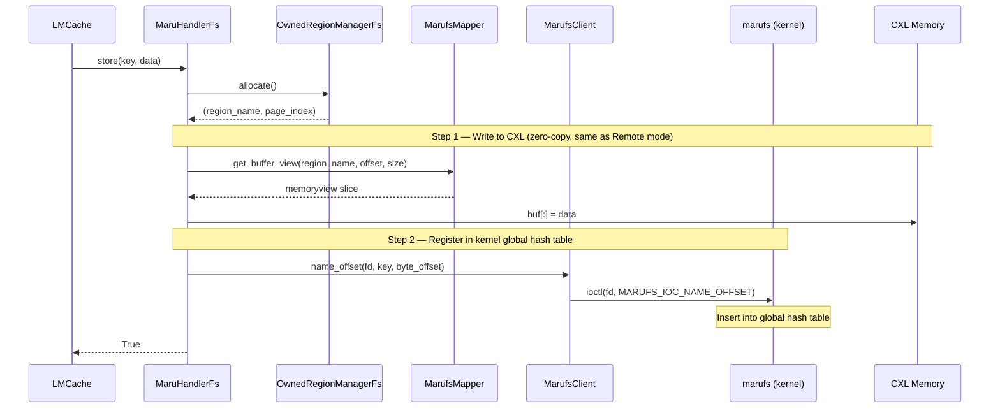
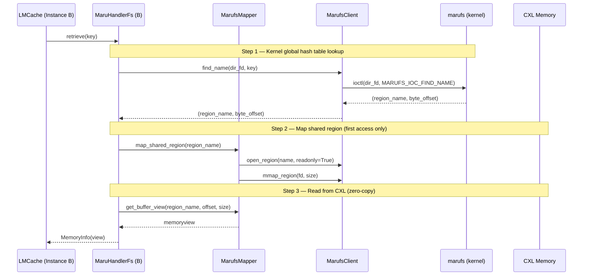
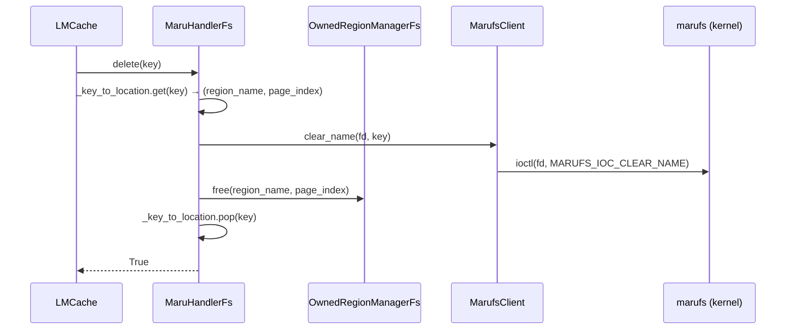
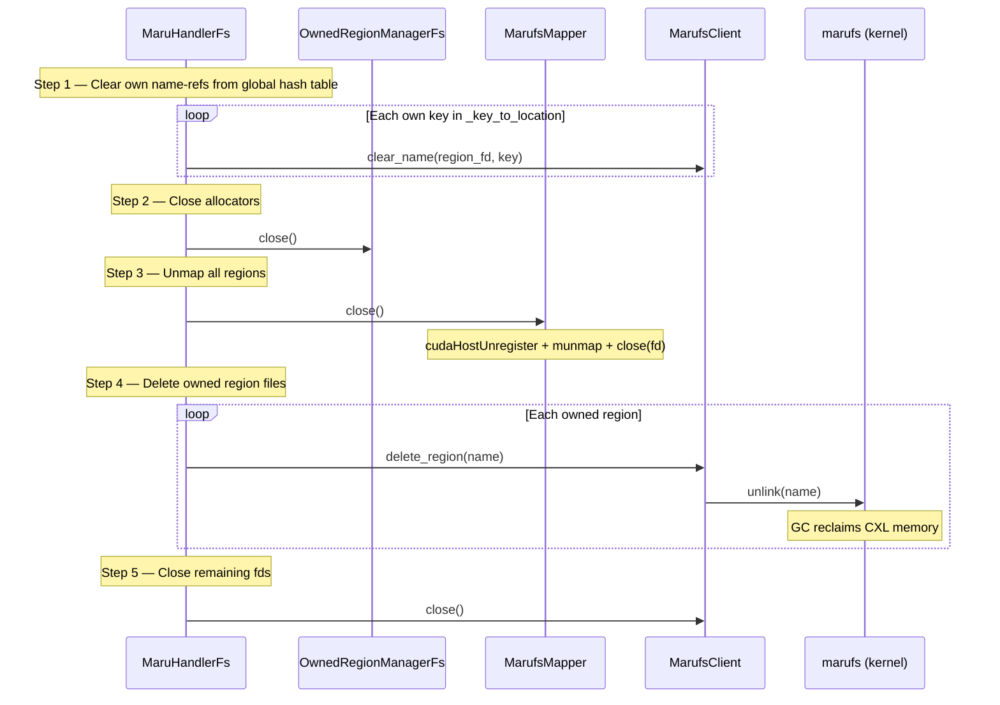

# marufs — Shared Filesystem Mode

> **Status**: Under active development, release coming soon.

## Motivation

Maru's architecture separates the **data plane** (direct zero-copy access to CXL shared memory) from the **control plane** (KV metadata registry and region lifecycle management). The control plane is pluggable — its implementation can change without affecting how data is read or written.

The first control plane implementation, **Remote mode**, uses a centralized MaruServer and Maru Resource Manager communicating over RPC:



### Why a filesystem?

The fundamental limitation of Remote mode is **security**. In Remote mode, clients access CXL shared memory by directly `mmap`-ing `/dev/dax` devices. The Linux DAX driver provides no isolation — any process that can open the device has unrestricted read-write access to the entire CXL memory pool. There is no way to enforce per-region or per-instance access control at the hardware or driver level. The RPC endpoint is equally open: any process that can reach MaruServer can read, write, or delete any KV entry and region without authentication or authorization.

Moving access control into the kernel is necessary, but the question is *how* — a custom character device (`/dev/maru`) could also interpose the kernel. The reason a **filesystem** is the right choice is that Maru's data model maps naturally onto it: each CXL memory region is a file, and each file has its own inode. The VFS layer already provides per-inode ownership, permission checks on `open` and `mmap`, and fd-scoped access — exactly the per-region security granularity Maru needs. A character device offers only device-level access control (can open `/dev/maru` or not); implementing per-region permissions on top of a single chardev would mean reinventing the inode permission infrastructure that VFS already provides.

The underlying `/dev/dax` device is still used — but only the marufs kernel module accesses it directly. User-space processes access CXL memory through marufs region files instead, and the kernel mediates every `open`, `mmap`, and `ioctl` — enforcing per-region ownership and permission checks that cannot be bypassed without kernel privilege.

In summary, Remote mode has the following limitations — including the security problem described above:

| Label | Problem | Description |
|-------|---------|-------------|
| **M1** | **No access control** | `/dev/dax` direct mmap and unauthenticated RPC — no per-region security enforcement possible |
| **M2** | **Multi-process management** | MaruServer and Maru Resource Manager must be deployed and monitored separately |
| **M3** | **RPC overhead** | Every KV lookup and region allocation goes through multi-hop RPC serialization (Client → MaruServer → Resource Manager), adding latency and debugging complexity |
| **M4** | **Single-node only** | Remote mode assumes all instances share one CXL pool behind a single MaruServer; there is no built-in mechanism for cross-node KV sharing or federated metadata |

**Shared Filesystem mode (marufs)** is the second control plane implementation. It replaces all server-side processes with a single Linux kernel filesystem module (`marufs.ko`), enforcing memory access control at the kernel level.


The data plane remains identical — clients still access CXL memory directly via mmap. Only the control plane changes.

---

## Key Improvements over Remote Mode

### 1. Serverless Control Plane — addresses M2 multi-process management, M3 RPC overhead

Three separate server-side processes are consolidated into a single kernel module:

| Remote Mode Component | Role | Filesystem Mode Replacement |
|-------------|------|---------------|
| MaruServer (KVManager) | KV metadata registry | marufs global hash table (ioctl) |
| MaruServer (AllocationManager) | Region allocation tracking | POSIX VFS (`open` / `ftruncate` / `unlink`) |
| Maru Resource Manager | CXL memory pool, GC | marufs kernel module (GC kthread) |
| MaruShmClient (RPC) | Region handle issuance, memory mapping | MarufsClient (VFS + ioctl) |

### 2. Kernel-level Access Control — addresses M1 no access control

Remote mode enforces memory access control in user-space via RPC — any process that can reach the server can potentially bypass authorization. Filesystem mode moves access control into the kernel:

- **Owner identification**: Each region tracks its owner by `(node_id, pid, birth_time)` triple. The kernel verifies the caller's identity on every access — a process cannot impersonate another instance even if it knows the region name.
- **Permission flags** (`PERM_READ`, `PERM_WRITE`, `PERM_DELETE`, `PERM_ADMIN`, `PERM_IOCTL`) are enforced at the VFS layer
- **Explicit grant model**: Non-owner access requires an explicit `perm_grant(node_id, pid, perms)` call from a process that holds `PERM_ADMIN`. Default permissions for new accessors are set via `perm_set_default`.
- **`PERM_ADMIN` delegation**: Owners implicitly hold all permissions including `PERM_ADMIN`. A process that receives `PERM_ADMIN` via grant can itself grant permissions to other processes, enabling delegation chains.
- **Default permissions** are set at region creation via `perm_set_default`
- The kernel mediates all region access — no way to bypass without kernel privilege

### 3. Kernel-managed Global KV Index — addresses M3 RPC overhead, M4 single-node only

In Remote mode, KV metadata lives in a Python dictionary inside MaruServer — volatile and bottlenecked by RPC.

In Filesystem mode, the kernel maintains a **global hash table** directly in CXL memory:

- **O(1) lookup**: A single ioctl call returns `(region_name, byte_offset)`
- **Lock-free concurrency**: CAS-based hash table allows safe multi-instance concurrent access
- **Global search**: One ioctl searches across all regions — no region scanning needed
- **Batch operations**: Up to 32 keys per ioctl call for both lookup and registration

### 4. File-based Region Management — addresses M2 multi-process management, M3 RPC overhead

Region lifecycle is handled through ordinary file operations, eliminating the RPC round-trips:

| Operation | Remote Mode | Filesystem Mode |
|-----------|-------------|-----------------|
| Create region | RPC → MaruServer → Resource Manager | `open(O_CREAT)` + `ftruncate(size)` |
| Delete region | RPC → MaruServer → Resource Manager | `unlink(path)` |
| List regions | RPC → MaruServer | `listdir(mount_path)` |
| Map region | RPC → Resource Manager → handle → mmap | `open()` → `mmap()` |

---

## Metadata Structure and KV Cache Lookup

### On-disk Layout

marufs presents CXL shared memory as a flat directory of region files:

```
/mnt/marufs/                          ← mount point
├── maru_a1b2c3d4e5f6_0000           ← owned region (instance A, 1st region)
├── maru_a1b2c3d4e5f6_0001           ← owned region (instance A, 2nd region)
├── maru_f7e8d9c0b1a2_0000           ← owned region (instance B)
└── ...
```

Each region file is a physically contiguous CXL memory allocation. A single region holds multiple KV cache entries, each identified by a byte offset within the region. Region files are created with `open(O_CREAT) + ftruncate(size)` and memory-mapped directly for zero-copy access.

### Global Hash Table

The kernel maintains a **global hash table** in CXL memory that serves both filesystem metadata and KV cache metadata in a single unified structure. The same hash table, same entry layout, and same lookup path are shared by:

1. **File lookup (VFS path)** — `open()`, `stat()`, `ls` etc. The kernel's `marufs_lookup()` hashes the filename to find the region's inode.
2. **Name-ref lookup (ioctl path)** — `MARUFS_IOC_FIND_NAME` / `MARUFS_IOC_NAME_OFFSET`. Applications register and query KV cache key → (region, offset) mappings.

Each name-ref entry contains:

```
┌──────────────────────────────────────────────────────────────────────┐
│  name-ref entry                                                      │
├───────────────────┬──────────────────────┬──────────────┬────────────┤
│ name (64B)        │ region_name (64B)    │ offset (8B)  │ hash (8B)  │
│ KV cache key      │ owning region file   │ byte offset  │ shard key  │
│ e.g. "model@1@0  │ e.g. "maru_a1b2c3   │ in region    │ for index  │
│  @3f8a...@fp16"   │  d4e5f6_0000"        │              │ partition  │
└───────────────────┴──────────────────────┴──────────────┴────────────┘
```

- **name**: The KV cache key string (`{model}@{token_range}@{world_id}@{chunk_hash}@{dtype}`). Keys ≤ 63 bytes are stored directly; longer keys are truncated with a SHA-256 hash suffix (`prefix#hash16`).
- **region_name**: The region file that holds the data.
- **offset**: Byte offset within the region where the data starts.
- **hash** (`name_hash`): Pre-computed hash used for shard selection. Upper 16 bits determine the index partition for concurrent access. Derived from `chunk_hash` field in the key with bit spreading to ensure non-zero upper bits.

---

## Data Flows

The data plane (zero-copy mmap access to CXL memory) is shared across both modes. The diagrams below show Filesystem mode's control plane interactions.

### Store (saving KV cache)



### Retrieve (cross-instance KV cache lookup)



Subsequent accesses to the same region reuse the cached mmap (0 open/mmap).

### Delete



### Close / Cleanup



---

## Component Overview

Filesystem mode introduces three components that replace their Remote mode counterparts:

| Component | Replaces | Role |
|-----------|----------|------|
| **OwnedRegionManagerFs** | OwnedRegionManager | Page-level allocator for multiple owned regions, using the same O(1) free-list strategy as Remote mode. Allocation follows the same fast-path: active region → scan others → create new. |
| **MarufsMapper** | DaxMapper | Memory-mapping lifecycle manager. All regions are mapped with CUDA pinning for owned regions; shared region size is auto-detected via fstat. Performs bulk unmap on close. |
| **MarufsClient** | RpcClient + MaruShmClient | Wraps kernel filesystem interface — region CRUD via VFS, global hash table operations via ioctl, permission management. Caches file descriptors internally and validates region names against path traversal. |

---

## Concurrency Guarantees

All components are thread-safe. Write operations (store, delete, region map/unmap, allocation/free) are serialized. Read operations (retrieve, buffer view access) are lock-free. This follows the same concurrency model as Remote mode.

> **See also:** [Consistency and Safety](consistency_and_safety.md) — detailed concurrency semantics and guarantees across both modes

---

## Kernel Interface Reference

The marufs kernel module exposes its interface through standard VFS operations (open, close, mmap, unlink) and a set of ioctl commands for global hash table and permission management.

<details>
<summary>ioctl Command Table (click to expand)</summary>

| ioctl | nr | Direction | Size | Description |
|-------|----|-----------|------|-------------|
| `MARUFS_IOC_NAME_OFFSET` | 1 | `_IOW` | 80B | Register name-ref in global hash table |
| `MARUFS_IOC_FIND_NAME` | 2 | `_IOWR` | 144B | Global name lookup → (region_name, offset) |
| `MARUFS_IOC_CLEAR_NAME` | 3 | `_IOW` | 80B | Remove name-ref from global hash table |
| `MARUFS_IOC_BATCH_FIND_NAME` | 4 | `_IOWR` | 16B | Batch name lookup (up to 32/call) |
| `MARUFS_IOC_BATCH_NAME_OFFSET` | 6 | `_IOWR` | 16B | Batch name-ref registration (up to 32/call) |
| `MARUFS_IOC_PERM_GRANT` | 10 | `_IOW` | 16B | Grant permissions |
| `MARUFS_IOC_PERM_SET_DEFAULT` | 13 | `_IOW` | 16B | Set default permissions |

Magic byte: `0x58` (ASCII `'X'`).

</details>

<details>
<summary>Key Structures (click to expand)</summary>

```c
#define MARUFS_NAME_MAX 63    // max name length

struct marufs_name_offset_req {           // 80 bytes
    char     name[MARUFS_NAME_MAX + 1];   // 64B — key string
    __le64   offset;                      // 8B  — byte offset in region
    __le64   name_hash;                   // 8B  — pre-computed hash (0 = djb2 fallback)
};

struct marufs_find_name_req {             // 144 bytes
    char     name[MARUFS_NAME_MAX + 1];         // 64B — input: search key
    char     region_name[MARUFS_NAME_MAX + 1];  // 64B — output: region filename
    __le64   offset;                            // 8B  — output: byte offset
    __le64   name_hash;                         // 8B  — pre-computed hash
};

struct marufs_perm_req {                  // 16 bytes
    __le32   node_id;                     // CXL node ID
    __le32   pid;                         // target process ID
    __le32   perms;                       // permission flags
    __le32   reserved;                    // alignment padding
};
```

</details>

<details>
<summary>Batch Structures (click to expand)</summary>

```c
struct marufs_batch_find_entry {          // per-entry
    char     name[MARUFS_NAME_MAX + 1];
    char     region_name[MARUFS_NAME_MAX + 1];
    __le64   offset;
    __le64   name_hash;
    __le32   status;                      // 0 = found, -ENOENT = not found
    __u8     _pad[4];
};

struct marufs_batch_find_req {            // header (16B)
    __le32   count;                       // number of entries
    __le32   found;                       // output: number found
    __le64   entries;                     // pointer to entry array
};
```

Batch limit: **32 entries** per ioctl call (configurable in the kernel module). The Python client automatically splits larger batches.

</details>

<details>
<summary>Permission Flags (click to expand)</summary>

| Flag | Value | Description |
|------|-------|-------------|
| `PERM_READ` | `0x0001` | Read access |
| `PERM_WRITE` | `0x0002` | Write access |
| `PERM_DELETE` | `0x0004` | Delete access |
| `PERM_ADMIN` | `0x0008` | Permission management — required for `perm_grant` and `perm_set_default` |
| `PERM_IOCTL` | `0x0010` | ioctl access |
| `PERM_ALL` | `0x001F` | All permissions |

</details>

---

## Known Issues

### 1. No exclusive open on `/dev/dax`

The Linux DAX device driver does not support exclusive open — multiple processes can open the same `/dev/dax` device simultaneously, bypassing marufs's permission model.

**Workaround:** Restrict `/dev/dax` device file permissions to root only (`chmod 600 /dev/dax*`). Only the marufs kernel module (running in kernel context) accesses the DAX device directly; user-space processes access CXL memory through marufs region files, where kernel-level permission enforcement applies.

### 2. `cudaHostRegister` requires read-write mapping

CUDA does not support `cudaHostRegisterReadOnly` — `cudaHostRegister` requires the host memory region to be mapped with both read and write permissions (`PROT_READ | PROT_WRITE`).

**Workaround:** When granting shared region access to a consumer instance, both `PERM_READ` and `PERM_WRITE` are granted, and the region is mmap'd with `PROT_READ | PROT_WRITE`. This means a consumer holds write permission to another instance's owned region at the mmap level. While marufs's ioctl-level operations (store/delete) are still gated by the handler logic, a buggy consumer could theoretically corrupt shared data through direct memory writes. This trade-off is accepted for CUDA compatibility until `cudaHostRegisterReadOnly` or an equivalent mechanism becomes available.

### 3. Cross-node duplicate key in prefix caching

In multi-node prefix caching, multiple nodes may independently compute and store the same KV cache key (e.g., a shared prompt prefix). The global hash table maps each name to exactly one `(region_name, offset)` — the second `NAME_OFFSET` ioctl silently overwrites the first entry, leaving the original node's page allocated but unreferenced (memory leak on that node).

**Approach:** Include node-identifying information in the key name (e.g., `"{original_key}:{instance_id}"`) so that each node's entry is distinct in the global hash table. This avoids kernel changes while keeping keys unique. The alternative — allowing the global hash table to store multiple entries per name (`FIND_NAME` returning an array) — would require significant kernel UAPI changes and is considered overkill for this use case.

### 4. CXL pool fragmentation

Region creation and deletion over time can fragment the CXL memory pool. Within a region, page-level allocation/free does not cause external fragmentation (pages are fixed-size and non-contiguous allocation is fine). However, at the pool level, repeated region create/delete cycles can leave the CXL address space fragmented, making it impossible to allocate large contiguous regions even when total free memory is sufficient.
