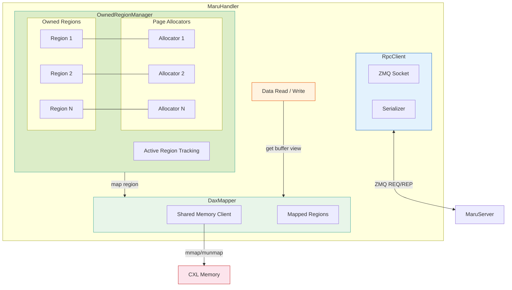
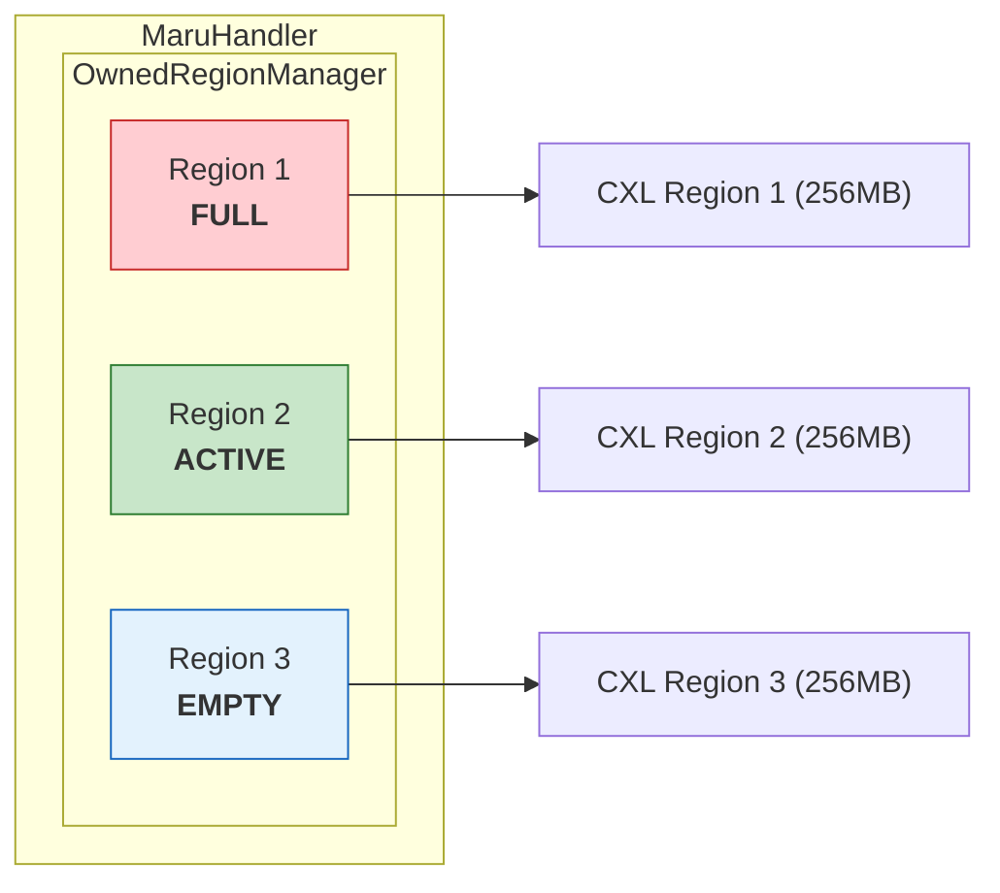
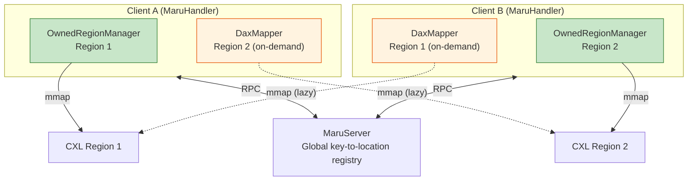
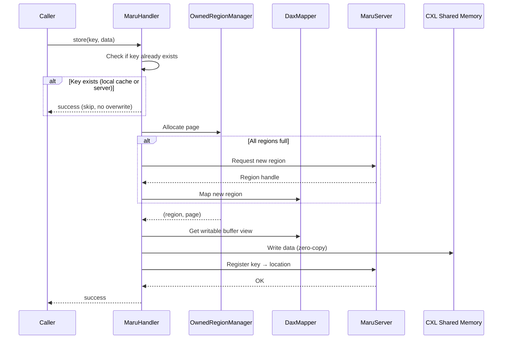
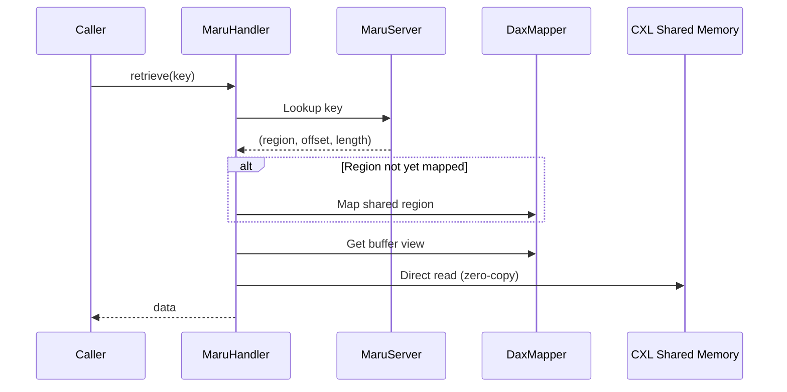
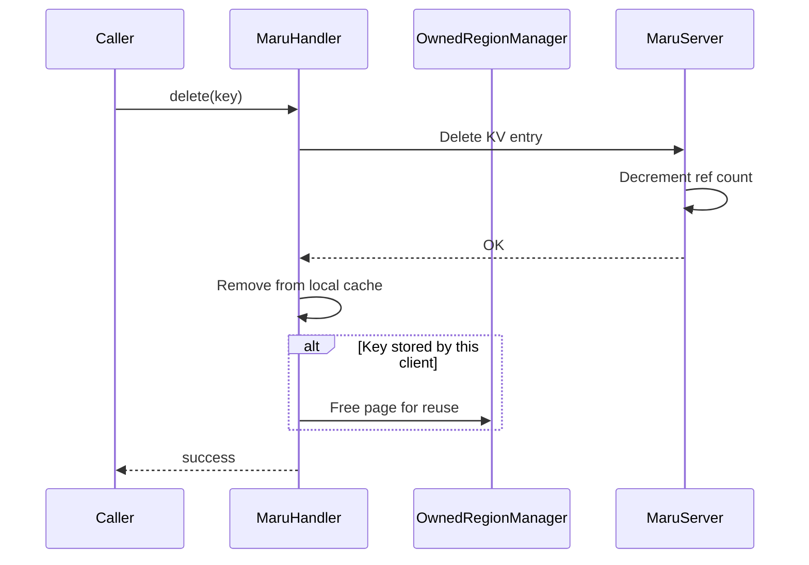

# MaruHandler Architecture

The `MaruHandler` is the client-side library that applications (e.g., LMCache/vLLM) use to interact with Maru. It serves two roles:

1. **KV cache client** — provides `store`/`retrieve`/`exists`/`delete` APIs.
2. **Memory manager** — owns CXL memory regions, manages paged allocation within them, and auto-expands when space runs out.

Data flows directly between the handler and CXL shared memory via memory-mapped regions — neither the MaruServer nor the resource manager is involved in the data path.

## 1. Component Hierarchy



**MaruHandler** orchestrates the overall data flow. It is the sole owner of `RpcClient` and coordinates region expansion, deallocation, shared region mapping, and data read/write.

**RpcClient** handles all communication with the MaruServer over ZeroMQ. It serializes requests using a binary header plus MessagePack payload, and supports both synchronous and asynchronous modes. The handler is the sole owner of the RPC client — no other component communicates with the server directly.

**DaxMapper** manages the mmap/munmap lifecycle of CXL regions. It creates mapped region objects that provide buffer views for direct memory access. It performs bulk unmap of all regions (both owned and shared) on `close()`.

**OwnedRegionManager** tracks the set of regions owned by this client. Each region is paired 1:1 with a page allocator that manages free pages. The manager exposes add, allocate, and free operations, and returns all region IDs on `close()` so the handler can release them back to the MaruServer.

---

## 2. Memory Management

Each CXL region is divided into fixed-size pages. A page allocator tracks free pages using a free-list, providing O(1) allocation and deallocation.

```
Region (e.g. 256 MB)
│
├── Page 0   ← KV Entry A
├── Page 1   ← KV Entry B
├── Page 2   ← (free)
├── Page 3   ← KV Entry C
├── ...
└── Page N-1
```

### Multi-Region Expansion

A single handler can own multiple CXL regions. When the active region runs out of free pages, the OwnedRegionManager scans other owned regions. If all are full, the handler requests a new region from the MaruServer.



The allocation strategy follows a fast-path pattern: try the active region first, scan other regions if it is full, and expand via RPC only as a last resort.

---

## 3. Owned vs Shared Regions

Each handler owns one or more regions for writing, and may map other clients' regions on demand for cross-instance retrieval.



Owned regions are mapped during connection or region expansion, and managed by OwnedRegionManager with a page allocator for each. Shared regions are mapped by DaxMapper on demand during retrieve, when the requested key resides in another client's region. On `close()`, owned regions are returned to the MaruServer, while all mapped regions (both owned and shared) are bulk-unmapped by DaxMapper.

---

## 4. Data Flows

### 4.1 Store



If the key already exists (in the local cache or on the server), the store is **skipped without overwrite** — same key implies same content (content-addressed). Otherwise, data is written to shared memory **before** the key is registered. Other instances can never observe a partial write — the key only becomes visible after the data is fully committed.

### 4.2 Retrieve



If the region is owned by this client, it is already mapped and can be used directly. If the region belongs to another client, DaxMapper maps it on demand. The region mapping is cached for subsequent accesses.

### 4.3 Delete



> **See also:** [Architecture Overview](architecture_overview.md) — system-level data flows;
> [Memory Model](memory_model.md) — page allocation and region lifecycle;
> [KV Cache Management](kv_cache_management.md) — key semantics and location model;
> [Consistency and Safety](consistency_and_safety.md) — write-then-register ordering guarantees
