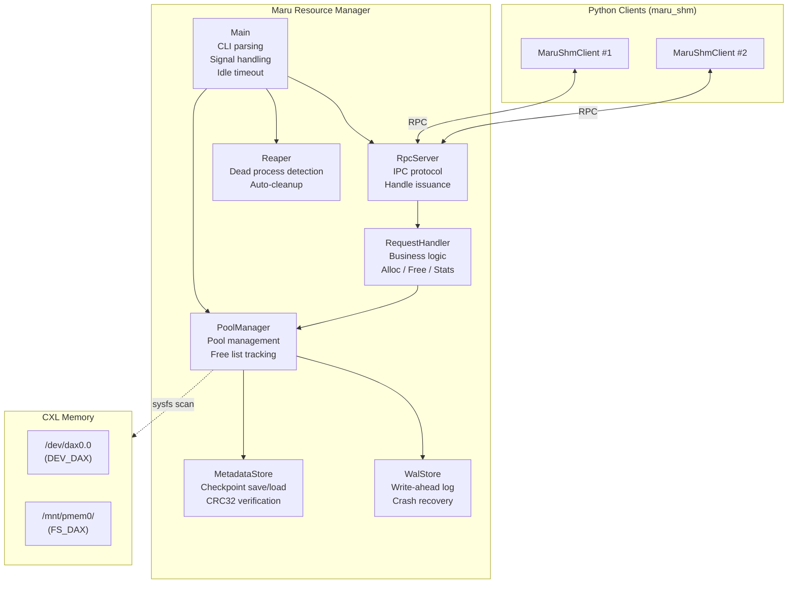

# MaruResourceManager Architecture

The `MaruResourceManager` is a server that manages physical CXL DAX device pools for the Maru system. It provides memory allocation, deallocation, and region handle issuance to clients via RPC. It handles two device types — DEV_DAX (character devices) and FS_DAX (filesystem-backed DAX mounts) — and ensures durability through write-ahead logging and periodic checkpoints. A background reaper automatically reclaims leaked allocations from terminated client processes.

## 1. Component Architecture



`PoolManager` is the central component that owns all shared state — pool metadata, allocation maps, and free lists. It performs device discovery by scanning sysfs for DEV_DAX and FS_DAX devices, and supports hot-plug via signal-triggered rescans.

`RpcServer` accepts client connections and dispatches requests to `RequestHandler`. It handles transport concerns including client identity verification and file descriptor passing.

`RequestHandler` contains all business logic — allocation, deallocation, fd lookup, and stats queries. It depends only on `PoolManager` and has no transport code, enabling reuse with future transport layers.

`Reaper` runs a background thread that periodically detects terminated client processes and reclaims their leaked allocations through `PoolManager`.

`MetadataStore` persists per-pool free lists and the global allocation map as checkpoint files with integrity verification. `WalStore` provides crash recovery by recording every allocation and free operation to a write-ahead log before modifying in-memory state.

---

## 2. Lifecycle

The binary is installed via `./install.sh`, which builds it with cmake and places it at `/usr/local/bin/maru-resource-manager`. The resource manager is designed to require no manual management — it starts and stops automatically based on demand.

**Auto-start:** When `AllocationManager` initializes (as part of `MaruServer` startup), it calls `MaruShmClient._ensure_resource_manager()`. This method checks if the resource manager is already running; if not, it starts the binary in the background and waits for the socket to become available. A file lock prevents multiple processes from starting it simultaneously.

**Crash recovery:** Every `MaruShmClient._connect()` call that fails triggers `_ensure_resource_manager()`, which restarts the binary. The resource manager recovers its previous state from the WAL on startup.

**Server registration:** After auto-start, the `MaruServer` registers itself via `REGISTER_SERVER_REQ`. This adds its PID to a tracked set, preventing idle shutdown while the server is running. On graceful shutdown, `UNREGISTER_SERVER_REQ` removes it. If a server crashes without unregistering, the Reaper detects the dead PID and removes it automatically.

**Idle shutdown:** The main loop checks both registered server count and active allocation count. When both are zero for `--idle-timeout` seconds (default: 60), the server flushes its state to disk and shuts down gracefully. The next `MaruServer` startup will auto-start it again.

---

## 3. IPC Protocol

All messages use a fixed-size binary header containing protocol version, message type, and payload length, followed by a type-specific payload.

| Type | Direction | Description |
|------|-----------|-------------|
| `ALLOC_REQ` / `ALLOC_RESP` | client ↔ server | Allocate shared memory; response includes a region handle |
| `FREE_REQ` / `FREE_RESP` | client ↔ server | Free allocation (requires valid auth token) |
| `REGISTER_SERVER_REQ` / `RESP` | client ↔ server | Register caller's PID as an active server (prevents idle shutdown) |
| `GET_FD_REQ` / `GET_FD_RESP` | client ↔ server | Request access to an existing allocation (requires valid auth token) |
| `UNREGISTER_SERVER_REQ` / `RESP` | client ↔ server | Unregister caller's PID (allows idle shutdown) |
| `STATS_REQ` / `STATS_RESP` | client ↔ server | Query per-pool statistics |
| `ERROR_RESP` | server → client | Error with status code and message |

Every allocation returns a **Handle** containing the region ID (globally unique), mmap offset, allocation length, and a cryptographic auth token. The Handle serves as both the allocation identifier and the authorization credential — clients must present it for free and access operations.

The `ALLOC_RESP` includes an `accessType` field (`LOCAL=0`, `REMOTE=1`) to distinguish local fd-based access from future remote memory access mechanisms.

The `STATS_RESP` returns per-pool statistics. Each pool entry contains:

| Field | Type | Description |
|-------|------|-------------|
| `pool_id` | uint32 | Pool identifier |
| `dax_type` | enum | `DEV_DAX` (character device) or `FS_DAX` (filesystem DAX) |
| `total_size` | uint64 | Total pool capacity in bytes |
| `free_size` | uint64 | Currently available space in bytes |
| `align_bytes` | uint64 | Alignment requirement in bytes |

Stats can be queried via `MaruShmClient.stats()` in Python or the `maru_test_client stats` CLI tool.

---

## 4. Memory Management

Each discovered CXL device becomes a **pool** with a sorted free list of extents (offset + length pairs). The allocation algorithm uses **first-fit with alignment**: it scans the free list for the first extent that can accommodate the aligned request size, splits the extent into residual fragments if needed, and returns a Handle pointing to the allocated region.

For **DEV_DAX** pools, a single character device (`/dev/daxX.Y`) is shared by all allocations. The Handle's offset field contains the real byte offset within the device. For **FS_DAX** pools, each allocation creates a dedicated file (`<mountpoint>/maru_<regionId>.dat`) of the requested size, and the Handle's offset is always zero. The file is unlinked on free.

All allocation sizes are rounded up to the pool's alignment boundary. For DEV_DAX, the alignment is read from the sysfs `align` attribute (typically 2 MiB). For FS_DAX, it is determined from the block device's logical block size, with a 2 MiB minimum.

---

## 5. Persistence & Recovery

The Resource Manager ensures durability through a combination of write-ahead logging and periodic checkpoints.

Every allocation and free operation is first appended to the **WAL** before modifying in-memory state. Periodically, a **checkpoint** is triggered: per-pool free lists and the global allocation map are saved atomically. The WAL is then cleared.

On startup, the **recovery sequence** proceeds as: (1) scan for current hardware, (2) initialize pools with device sizes, (3) restore state from the last checkpoint, (4) replay any WAL records written since that checkpoint, and (5) recompute free sizes from the reconstituted free lists.

---

## 6. Reaper

The Reaper periodically checks the liveness of each allocation's owner process. If the process no longer exists, its allocations are reclaimed — extents are returned to the free list and the allocation is removed from the map. It also removes dead PIDs from the registered server set, ensuring idle shutdown proceeds after a server crash.

To defend against **PID reuse**, the server caches each client's process start time at allocation time. If the OS reports the process as alive but the current start time differs from the cached value, the PID has been recycled by the kernel, and the allocations are reclaimed.

---

## 7. Security

Every allocation receives a **cryptographic auth token** derived from the Handle fields and a server-side secret. Free and access requests must present a valid token; invalid tokens are rejected.

The secret is generated on first start and persisted to the state directory. On restart, if allocations exist from a previous run, the secret is loaded; if it is missing, startup is aborted to prevent token verification failures.

**Owner verification** ensures that non-root clients can only free their own allocations — the owner PID is recorded at allocation time and must match the freeing client's PID.

---

## 8. Server Configuration

The server is configured via CLI arguments. Under normal usage these are not needed — `MaruServer` auto-starts the resource manager with defaults.

| Option | Default | Description |
|--------|---------|-------------|
| `--socket-path` | `/tmp/maru-resourced/maru-resourced.sock` | RPC socket path |
| `--state-dir` | `/var/lib/maru-resourced` | State directory for WAL and checkpoints |
| `--log-level` | `info` | Log level: `debug`, `info`, `warn`, `error` |
| `--idle-timeout` | `60` | Auto-shutdown after N seconds idle (0 to disable) |

```bash
# Manual start with custom configuration
maru-resource-manager --socket-path /var/run/maru/maru.sock \
                      --state-dir /var/lib/maru \
                      --log-level debug \
                      --idle-timeout 120
```
