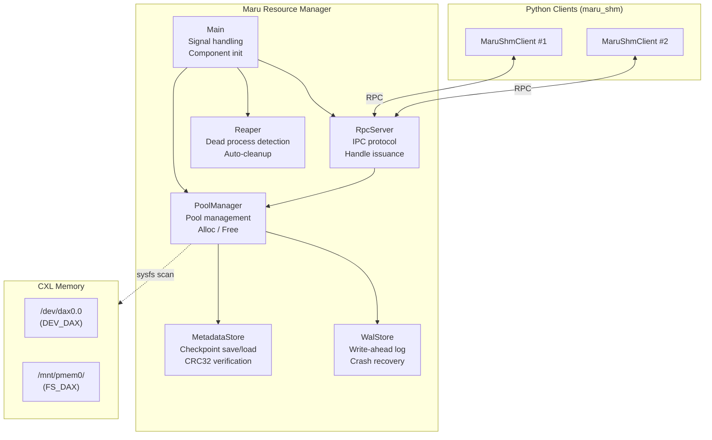

# MaruResourceManager Architecture

The `MaruResourceManager` is a server that manages physical CXL DAX device pools for the Maru system. It provides memory allocation, deallocation, and region handle issuance to clients via RPC. It handles two device types — DEV_DAX (character devices) and FS_DAX (filesystem-backed DAX mounts) — and ensures durability through write-ahead logging and periodic checkpoints. A background reaper automatically reclaims leaked allocations from terminated client processes.

## 1. Component Architecture

`PoolManager` is the central component that owns all shared state — pool metadata, allocation maps, and free lists. It performs device discovery by scanning sysfs for DEV_DAX and FS_DAX devices, and supports hot-plug via signal-triggered rescans.

`RpcServer` accepts client connections and issues region handles in response to allocation requests.

`Reaper` runs a background thread that periodically detects terminated client processes and reclaims their leaked allocations through `PoolManager`.

`MetadataStore` persists per-pool free lists and the global allocation map as checkpoint files with integrity verification. `WalStore` provides crash recovery by recording every allocation and free operation to a write-ahead log before modifying in-memory state.

---

## 2. IPC Protocol

All messages use a fixed-size binary header containing protocol version, message type, and payload length, followed by a type-specific payload.

| Type | Direction | Description |
|------|-----------|-------------|
| `ALLOC_REQ` / `ALLOC_RESP` | client ↔ server | Allocate shared memory; response includes a region handle |
| `FREE_REQ` / `FREE_RESP` | client ↔ server | Free allocation (requires valid auth token) |
| `GET_FD_REQ` / `GET_FD_RESP` | client ↔ server | Request access to an existing allocation (requires valid auth token) |
| `STATS_REQ` / `STATS_RESP` | client ↔ server | Query per-pool statistics (pool ID, total/free sizes) |
| `ERROR_RESP` | server → client | Error with status code and message |

Every allocation returns a **Handle** containing the region ID (globally unique), mmap offset, allocation length, and a cryptographic auth token. The Handle serves as both the allocation identifier and the authorization credential — clients must present it for free and access operations.

The server verifies client identity at connection time, ensuring PID and UID match.

---

## 3. Memory Management

Each discovered CXL device becomes a **pool** with a sorted free list of extents (offset + length pairs). The allocation algorithm uses **first-fit with alignment**: it scans the free list for the first extent that can accommodate the aligned request size, splits the extent into residual fragments if needed, and returns a Handle pointing to the allocated region.

For **DEV_DAX** pools, a single character device (`/dev/daxX.Y`) is shared by all allocations. The Handle's offset field contains the real byte offset within the device. For **FS_DAX** pools, each allocation creates a dedicated file (`<mountpoint>/maru_<regionId>.dat`) of the requested size, and the Handle's offset is always zero. The file is unlinked on free.

All allocation sizes are rounded up to the pool's alignment boundary. For DEV_DAX, the alignment is read from the sysfs `align` attribute (typically 2 MiB). For FS_DAX, it is determined from the block device's logical block size, with a 2 MiB minimum.

---

## 4. Persistence & Recovery

The Resource Manager ensures durability through a combination of write-ahead logging and periodic checkpoints.

Every allocation and free operation is first appended to the **WAL** before modifying in-memory state. Periodically, a **checkpoint** is triggered: per-pool free lists and the global allocation map are saved atomically. The WAL is then cleared.

On startup, the **recovery sequence** proceeds as: (1) scan for current hardware, (2) initialize pools with device sizes, (3) restore state from the last checkpoint, (4) replay any WAL records written since that checkpoint, and (5) recompute free sizes from the reconstituted free lists.

---

## 5. Reaper

The Reaper periodically checks the liveness of each allocation's owner process. If the process no longer exists, its allocations are reclaimed — extents are returned to the free list and the allocation is removed from the map.

To defend against **PID reuse**, the server caches each client's process start time at allocation time. If the OS reports the process as alive but the current start time differs from the cached value, the PID has been recycled by the kernel, and the allocations are reclaimed.

---

## 6. Security

Every allocation receives a **cryptographic auth token** derived from the Handle fields and a server-side secret. Free and access requests must present a valid token; invalid tokens are rejected.

The secret is generated on first start and persisted to the state directory. On restart, if allocations exist from a previous run, the secret is loaded; if it is missing, startup is aborted to prevent token verification failures.

**Owner verification** ensures that non-root clients can only free their own allocations — the owner PID is recorded at allocation time and must match the freeing client's PID.
