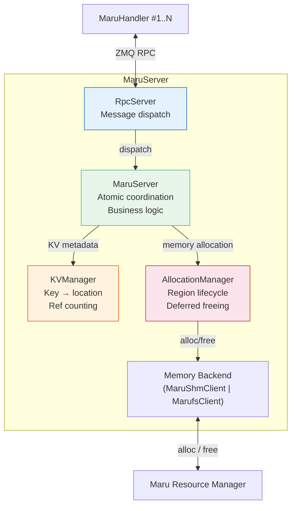
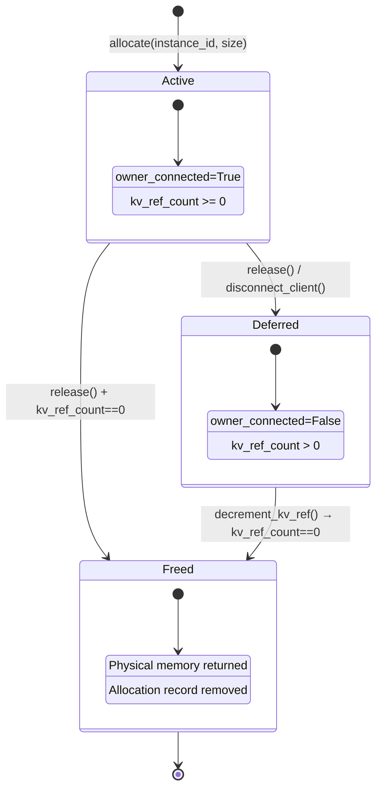

# MaruServer Architecture

The `MaruServer` is a **metadata-only server** that coordinates CXL memory allocation and KV metadata across clients. It never directly accesses KV data — all actual reads and writes happen through CXL shared memory by the clients themselves.

**Responsibilities:**
- CXL memory allocation and deallocation (via the resource manager)
- KV metadata management (key → region, offset, length)
- Brokering KV location information between clients

## 1. Component Structure

`RpcServer` accepts incoming ZeroMQ messages, dispatches to the appropriate `MaruServer` method, and returns the serialized response.

`MaruServer` is the central coordinator. It holds references to both `KVManager` and `AllocationManager`, and guarantees atomicity of cross-manager operations such as registering a KV entry and incrementing its region's reference count.

`KVManager` maintains a key-to-location mapping, where each entry records the region ID, offset, and length of a stored KV pair. Duplicate key registrations are handled idempotently.

`AllocationManager` tracks all CXL memory allocations with records that include the owner instance, a KV reference count, and a connection flag. It communicates with the Resource Manager via a memory backend (`MaruShmClient` or `MarufsClient`, selected by the server's `mount_path` configuration) to perform physical allocation and deallocation. When marufs is configured, allocation responses include the `mount_path` so clients can select the matching backend.

---

## 2. Allocation Management

Each allocation is tracked with an `AllocationInfo` that records the owning client, the number of KV entries referencing the region, and whether the owner is still connected.

The allocation lifecycle uses **deferred freeing**: a region is only physically freed when both the owner has disconnected and no KV entries reference it. This prevents premature deallocation while readers still depend on the data.

When a client calls `return_alloc` or disconnects, the allocation's `owner_connected` flag is set to false. If the KV reference count is already zero, the region is freed immediately. Otherwise, it enters the deferred state and is freed later when the last KV entry referencing it is deleted.

---

## 3. KV Registry

`KVManager` stores a mapping from string keys to location records containing the region ID, offset within the region, and data length.

When a new key is registered, an entry is created and the allocation's KV reference count is incremented. If the key already exists, the registration is treated as idempotent — no new entry is created.

When a key is deleted, the entry is removed and the allocation's KV reference count is decremented. This may trigger deferred freeing if the region's owner has already disconnected.

---

## 4. Cross-Manager Coordination

`MaruServer` ensures atomicity between `KVManager` and `AllocationManager` by executing paired operations as a single atomic unit.

For `register_kv`, the server registers the key and increments the region's KV reference count atomically. Without this, a concurrent `return_alloc` could free the region between registration and reference count increment, creating a dangling KV entry.

For `delete_kv`, the server deletes the key and decrements the reference count atomically. If this brings the count to zero and the owner has disconnected, the allocation is freed immediately.

For `lookup_kv`, the server reads the KV entry and retrieves the corresponding handle atomically, ensuring the allocation cannot be freed between the two reads.

---

## 5. RPC Interface

The server exposes the following message types:

| MessageType | Operation |
|-------------|-----------|
| `REQUEST_ALLOC` | Allocate a new CXL region for a client |
| `RETURN_ALLOC` | Release ownership of a region |
| `LIST_ALLOCATIONS` | List all active allocations |
| `REGISTER_KV` | Register a KV entry at a given location |
| `LOOKUP_KV` | Look up a KV entry's location and handle |
| `EXISTS_KV` | Check whether a key exists |
| `DELETE_KV` | Delete a KV entry |
| `BATCH_REGISTER_KV` | Batch register multiple KV entries |
| `BATCH_LOOKUP_KV` | Batch look up multiple keys |
| `BATCH_EXISTS_KV` | Batch check existence of multiple keys |
| `GET_STATS` | Retrieve server statistics |
| `HEARTBEAT` | Connection health check |
| `HANDSHAKE` | Reserved — initial client-server handshake |
| `SHUTDOWN` | Reserved — graceful server shutdown |

Batch operations allow clients to reduce RPC round-trips when operating on multiple keys.
