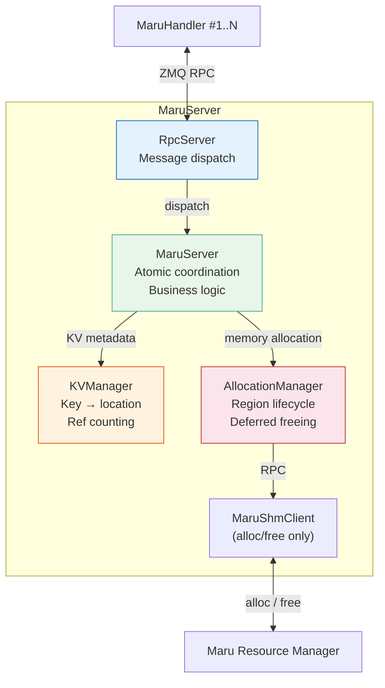
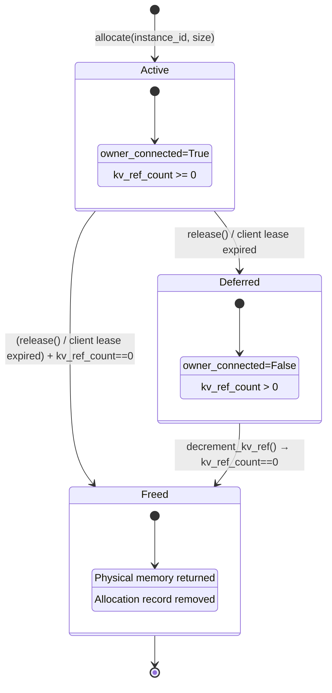

# MaruServer Architecture

The `MaruServer` is a **metadata-only server** that coordinates CXL memory allocation and KV metadata across clients. It never directly accesses KV data — all actual reads and writes happen through CXL shared memory by the clients themselves.

**Responsibilities:**
- CXL memory allocation and deallocation (via the resource manager)
- KV metadata management (key → region, offset, length)
- Brokering KV location information between clients

## 1. Component Structure

```mermaid
flowchart TB
    subgraph Server["MaruServer"]
        RpcServer["RpcServer<br/>Message dispatch"]
        MaruServer["MaruServer<br/>Atomic coordination<br/>Business logic"]
        KVManager["KVManager<br/>Key → location<br/>Ref counting"]
        AllocMgr["AllocationManager<br/>Region lifecycle<br/>Deferred freeing"]
        ShmClient["MaruShmClient<br/>(alloc/free only)"]

        RpcServer -->|"dispatch"| MaruServer
        MaruServer -->|"KV metadata"| KVManager
        MaruServer -->|"memory allocation"| AllocMgr
        AllocMgr -->|"RPC"| ShmClient
    end

    Clients["MaruHandler #1..N"]
    Clients <-->|"ZMQ RPC"| RpcServer

    RM["Maru Resource Manager"]
    ShmClient <-->|"alloc / free"| RM

    style RpcServer fill:#e3f2fd,stroke:#1565c0
    style MaruServer fill:#e8f5e9,stroke:#4a9
    style KVManager fill:#fff3e0,stroke:#e65100
    style AllocMgr fill:#fce4ec,stroke:#c62828
```

`RpcServer` accepts incoming ZeroMQ messages, dispatches to the appropriate `MaruServer` method, and returns the serialized response.

`MaruServer` is the central coordinator. It holds references to both `KVManager` and `AllocationManager`, and guarantees atomicity of cross-manager operations such as registering a KV entry and incrementing its region's reference count.

`KVManager` maintains a key-to-location mapping, where each entry records the region ID, offset, and length of a stored KV pair. Duplicate key registrations are handled idempotently.

`AllocationManager` tracks all CXL memory allocations with records that include the owner instance, a KV reference count, and a connection flag. It communicates with the Resource Manager to perform physical allocation and deallocation.

---

## 2. Allocation Management

Each allocation is tracked with an `AllocationInfo` that records the owning client, the number of KV entries referencing the region, and whether the owner is still connected.

The allocation lifecycle uses **deferred freeing**: a region is only physically freed when both the owner has disconnected and no KV entries reference it. This prevents premature deallocation while readers still depend on the data.

```mermaid
stateDiagram-v2
    [*] --> Active: allocate(instance_id, size)

    state Active {
        [*] --> Connected
        Connected: owner_connected=True
        Connected: kv_ref_count >= 0
    }

    Active --> Deferred: release() / client lease expired
    state Deferred {
        [*] --> Waiting
        Waiting: owner_connected=False
        Waiting: kv_ref_count > 0
    }

    Active --> Freed: (release() / client lease expired) + kv_ref_count==0
    Deferred --> Freed: decrement_kv_ref() → kv_ref_count==0

    state Freed {
        [*] --> Done
        Done: Physical memory returned
        Done: Allocation record removed
    }

    Freed --> [*]
```

When a client calls `return_alloc` or disconnects, the allocation's `owner_connected` flag is set to false. If the KV reference count is already zero, the region is freed immediately. Otherwise, it enters the deferred state and is freed later when the last KV entry referencing it is deleted.

A client that exits without `close()` never calls `return_alloc`. The server detects it with a **client lease**:

- On connect the handler starts a lease (a `HEARTBEAT` that names its instance and a per-connection lease id), allocates its regions under that lease, and renews it every quarter of the TTL on a dedicated connection. A clean `close()` returns the regions and then ends the lease.
- When a lease goes `--client-lease-ttl` seconds (default 30) without renewal, the next lease renewal or allocation request marks the regions of that lease as owner-disconnected, so deferred freeing applies. Expiry is per lease, so a restarted client that reuses its instance id keeps its new regions.
- Lease time counts only while the server is processing requests. Live clients renew every quarter of the TTL, so a gap of more than half the TTL with no lease activity means the server itself stalled (or no leased client was alive). The part of the gap beyond half the TTL is added to every deadline, so renewals that waited in the queue during a stall never expire a live lease, and a dead lease still expires within half the TTL once the server is active again.
- The handler stops writing before the server can reclaim: once its last accepted renewal was sent three quarters of the TTL ago, `alloc()` raises and `store()`/`batch_store()` refuse and free the pages, until a renewal succeeds again. A late renewal of an expired lease is answered with `lease_expired`, after which the handler refuses writes for good, and the server refuses keys registered into a reclaimed region.
- Clients that never start a lease, and servers started with `--client-lease-ttl 0`, keep the previous behaviour.
- Limits: the handler checks its lease in `alloc()` and `store()`, not while the caller writes into a page, so a caller that holds an allocated page for more than a quarter of the TTL before writing it is not protected. A handler that cannot start a lease at connect (for example, the server does not answer) runs without one and logs a warning. After the server has been idle for longer than the TTL, the first allocation cannot yet reclaim a dead lease (its deadline is still up to half the TTL ahead), so on a full device a client restarted right after a crash may fail its first connect and succeed when it retries about half a TTL later.

---

## 3. KV Registry

`KVManager` stores a mapping from string keys to location records containing the region ID, offset within the region, and data length.

When a new key is registered, an entry is created and the allocation's KV reference count is incremented. If the key already exists, the registration is treated as idempotent — no new entry is created.

When a key is deleted, the entry is removed and the allocation's KV reference count is decremented. This may trigger deferred freeing if the region's owner has already disconnected.

---

## 4. Cross-Manager Coordination

`MaruServer` ensures atomicity between `KVManager` and `AllocationManager` by executing paired operations as a single atomic unit.

For `register_kv`, the server registers the key and increments the region's KV reference count atomically. Without this, a concurrent `return_alloc` could free the region between registration and reference count increment, creating a dangling KV entry.

For `delete_kv`, the server deletes the key and decrements the reference count atomically. If this brings the count to zero and the owner has disconnected, the allocation is freed immediately.

For `lookup_kv`, the server reads the KV entry and retrieves the corresponding handle atomically, ensuring the allocation cannot be freed between the two reads.

---

## 5. RPC Interface

The server exposes the following message types:

| MessageType | Operation |
|-------------|-----------|
| `REQUEST_ALLOC` | Allocate a new CXL region for a client |
| `RETURN_ALLOC` | Release ownership of a region |
| `LIST_ALLOCATIONS` | List all active allocations |
| `REGISTER_KV` | Register a KV entry at a given location |
| `LOOKUP_KV` | Look up a KV entry's location and handle |
| `EXISTS_KV` | Check whether a key exists |
| `PIN_KV` | Atomically check existence and pin a KV entry |
| `UNPIN_KV` | Unpin a KV entry |
| `DELETE_KV` | Delete a KV entry |
| `BATCH_REGISTER_KV` | Batch register multiple KV entries |
| `BATCH_LOOKUP_KV` | Batch look up multiple keys |
| `BATCH_EXISTS_KV` | Batch check existence of multiple keys |
| `BATCH_PIN_KV` | Batch check existence and pin multiple entries |
| `BATCH_UNPIN_KV` | Batch unpin multiple entries |
| `GET_STATS` | Retrieve server statistics |
| `HEARTBEAT` | Connection health check; with `instance_id` and `lease_id` it starts, renews, or (`lease_release`) ends a client lease and replies `lease_ttl` and `lease_expired` |
| `HANDSHAKE` | Reserved — initial client-server handshake |
| `SHUTDOWN` | Reserved — graceful server shutdown |

Batch operations allow clients to reduce RPC round-trips when operating on multiple keys.
