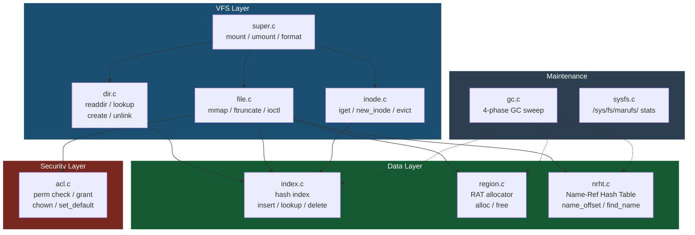
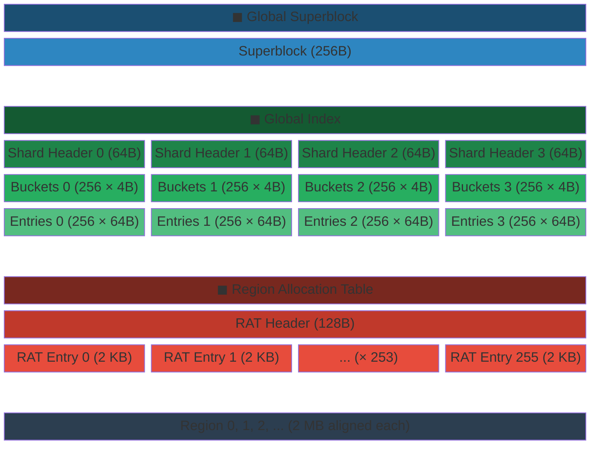
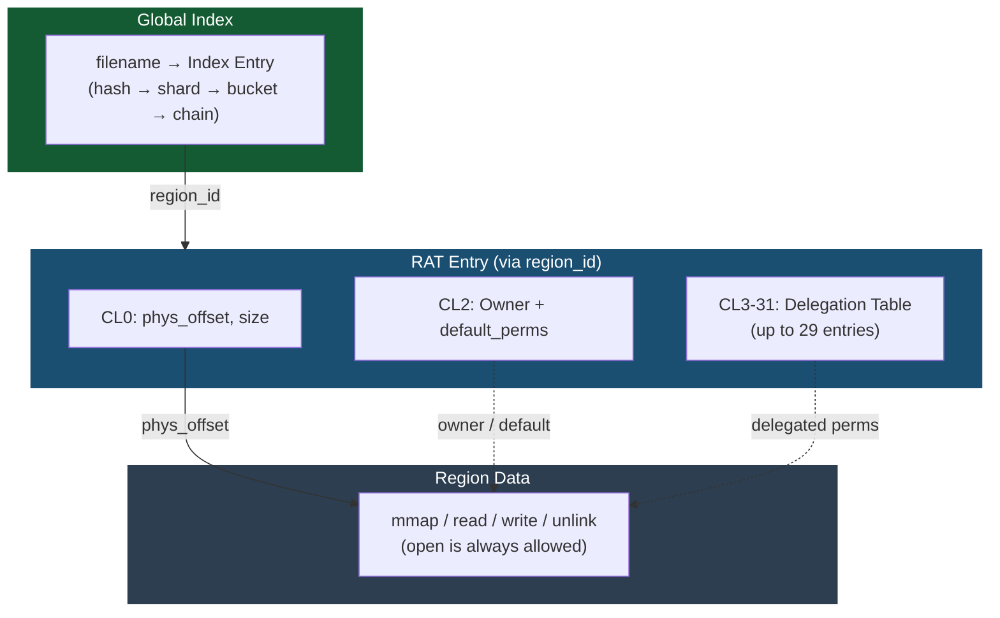
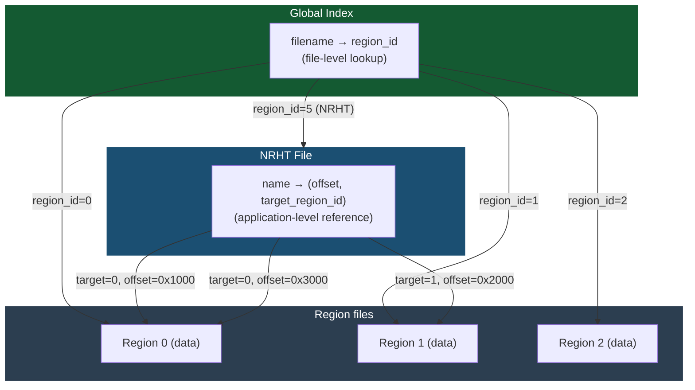

# marufs Kernel Module Architecture

## Module Components

| Layer | File | Role |
|-------|------|------|
| VFS | `super.c` | Module init, mount/umount, DAX device setup, mkfs (format) |
| VFS | `dir.c` | Directory operations: readdir, lookup, create, unlink, d_revalidate |
| VFS | `inode.c` | Inode lifecycle: iget (from CXL index), new_inode, evict |
| VFS | `file.c` | File operations: mmap (DAX fault), ftruncate (region alloc), ioctl dispatch |
| Data | `index.c` | Global partitioned index: CAS-based insert/lookup/delete, hash chain walk |
| Data | `region.c` | RAT (Region Allocation Table): contiguous space finder, alloc/free entries |
| Data | `nrht.c` | Name-Ref Hash Table: name_offset, find_name, batch operations |
| Security | `acl.c` | Permission enforcement: delegation table check, perm_grant, chown |
| Maintenance | `gc.c` | Background GC: 4-phase sweep (dead process, stale index, local tracker, NRHT) |
| Maintenance | `sysfs.c` | sysfs interface: `/sys/fs/marufs/` stats and configuration |

## CXL Memory Layout

| Block | Size | Description |
|-------|------|-------------|
| Superblock | 256B (4 CL) | FS geometry, shard count, offsets, mounted node bitmask (`active_nodes`) |
| Shard Header | 64B (1 CL) × 4 | Per-shard bucket/entry array offsets (immutable after format) |
| Buckets | 4B × 256 per shard | Hash chain head pointers (`head_entry_idx` or `BUCKET_END`) |
| Entries | 64B (1 CL) × 256 per shard | Index entries: state, name_hash, region_id, next_in_bucket |
| RAT Header | 128B (2 CL) | max_entries, alloc_lock (CAS spinlock), allocation stats |
| RAT Entry | 2 KB (32 CL) × 256 | CL0: phys_offset/size, CL1: name, CL2: ACL, CL3-31: delegation |
| Region Data | 2 MB aligned each | Actual file data, variable size |

## ACL (Access Control List)

- **Data path** (solid): `filename → Index Entry → region_id → CL0.phys_offset → Region`
- **Permission path** (dotted): Owner (implicit all) → default_perms (non-owner baseline) → Delegation Table (per-node/pid grants)
- open() always allowed — permission check at mmap / read / write / unlink
- Delegations stored on CXL — immediately visible cross-node

## NRHT (Name-Ref Hash Table)

- **Global Index**: `filename → region_id` — filesystem-level file lookup
- **NRHT**: `name → (offset, target_region_id)` — application-level intra-region references (e.g., KV cache keys)
- A single NRHT can freely reference **multiple regions** (N:M relationship)
- NRHT files are regular regions registered in the Global Index (own RAT entry)
