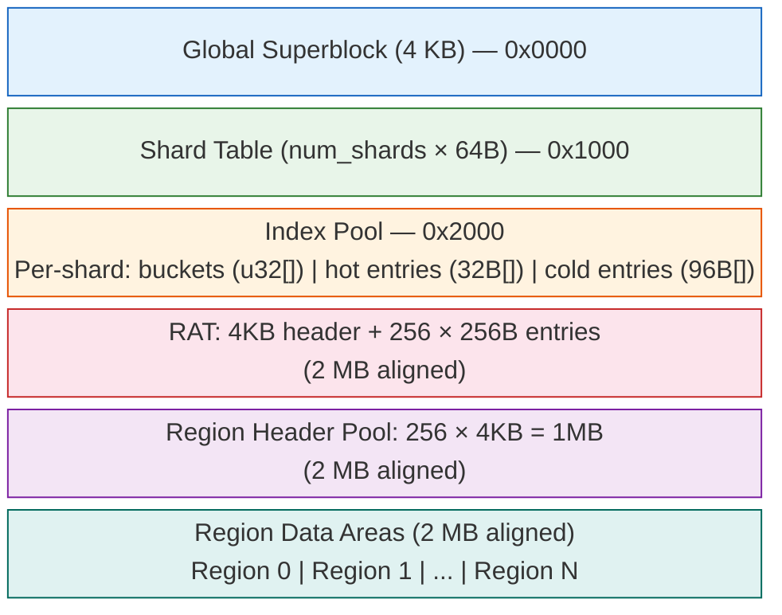
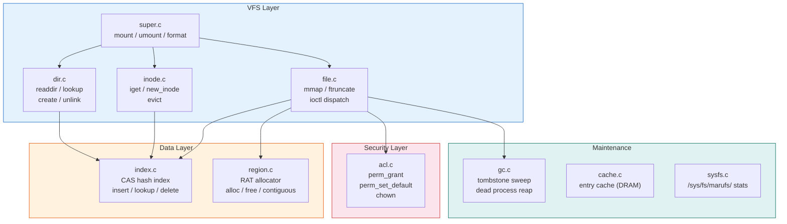
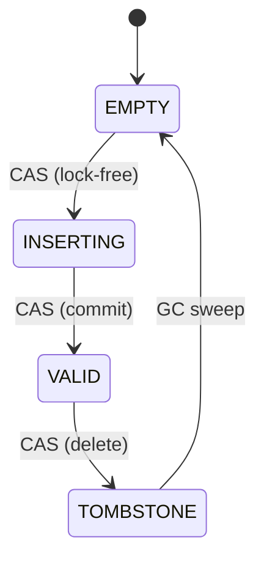
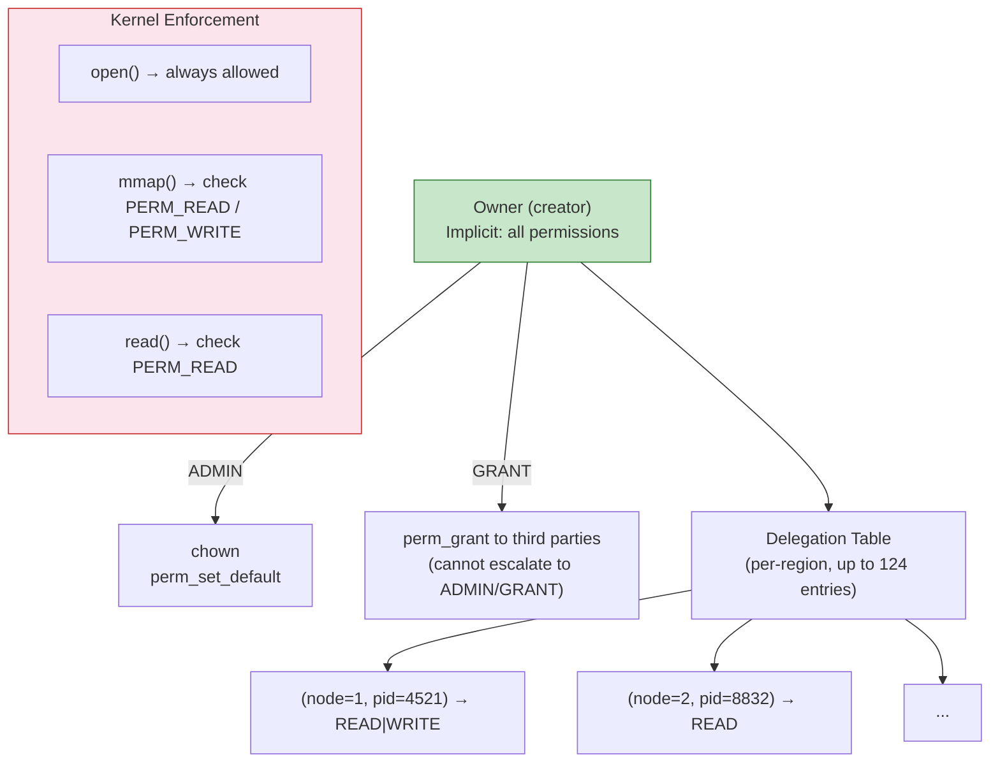

# marufs Kernel Module Architecture

## CXL Memory Layout

## Module Components

## Source Files

| File | Role |
|------|------|
| `super.c` | Module init, mount/umount, DAX device setup, mkfs (format) |
| `dir.c` | Directory operations: readdir, lookup, create, unlink, d_revalidate |
| `inode.c` | Inode lifecycle: iget (from CXL index), new_inode, evict |
| `file.c` | File operations: mmap (DAX fault), ftruncate (region alloc), ioctl dispatch |
| `index.c` | Global partitioned index: CAS-based insert/lookup/delete, hash chain walk |
| `region.c` | RAT (Region Allocation Table): contiguous space finder, alloc/free entries |
| `acl.c` | Permission enforcement: delegation table check, perm_grant, perm_set_default, chown |
| `gc.c` | Background GC: tombstone sweep, dead process region reaping |
| `cache.c` | Entry cache: DRAM-side cache for frequently accessed index entries |
| `sysfs.c` | sysfs interface: `/sys/fs/marufs/` stats and configuration |

## Key Data Structures

| Structure | Size | Location | Purpose |
|-----------|------|----------|---------|
| `marufs_superblock` | 4 KB | CXL offset 0 | Global layout descriptor |
| `marufs_shard_header` | 64 B | Shard table | Per-shard index geometry |
| `marufs_index_entry_hot` | 32 B | Index pool | Chain walk: state, hash, region_id (2 per cache line) |
| `marufs_index_entry_cold` | 96 B | Index pool | Name verify + metadata (accessed only on hash match) |
| `marufs_rat_entry` | 256 B | RAT | Region allocation: phys_offset, size, owner, perms |
| `marufs_region_header` | 4 KB | Header pool | Region metadata + delegation table (124 entries) |
| `marufs_deleg_entry` | 32 B | Region header | Per-(node_id, pid) permission grant |

## Concurrency Model

- **Lock-free index**: CAS on `entry_hot.state` (EMPTY → INSERTING → VALID, VALID → TOMBSTONE)
- **Shard partitioning**: SHA-256 upper bits select shard → independent bucket arrays reduce contention
- **RAT alloc lock**: CAS spinlock for region physical allocation (serializes ftruncate across nodes)
- **CXL 2.0 compat**: Optional `clwb`/`clflushopt` barriers via `CONFIG_MARUFS_CXL2_COMPAT`

## Permission Model

## ioctl Interface

| ioctl | Cmd | Description |
|-------|-----|-------------|
| `MARUFS_IOC_NAME_OFFSET` | X:1 | Register name-ref (name → region:offset) |
| `MARUFS_IOC_FIND_NAME` | X:2 | Global name lookup → (region_name, offset) |
| `MARUFS_IOC_CLEAR_NAME` | X:3 | Remove name-ref |
| `MARUFS_IOC_BATCH_FIND_NAME` | X:4 | Batch lookup (up to 32) |
| `MARUFS_IOC_BATCH_NAME_OFFSET` | X:6 | Batch register (up to 32) |
| `MARUFS_IOC_PERM_GRANT` | X:10 | Grant permissions to (node_id, pid) |
| `MARUFS_IOC_PERM_SET_DEFAULT` | X:13 | Set default permissions for non-owner |
| `MARUFS_IOC_CHOWN` | X:14 | Transfer ownership to caller |
| `MARUFS_IOC_DMABUF_EXPORT` | X:0x50 | Export DMA-BUF (DAXHEAP mode) |
