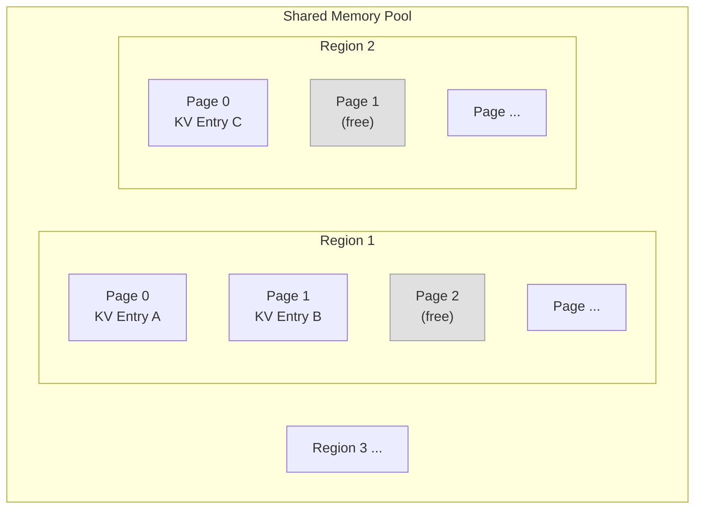
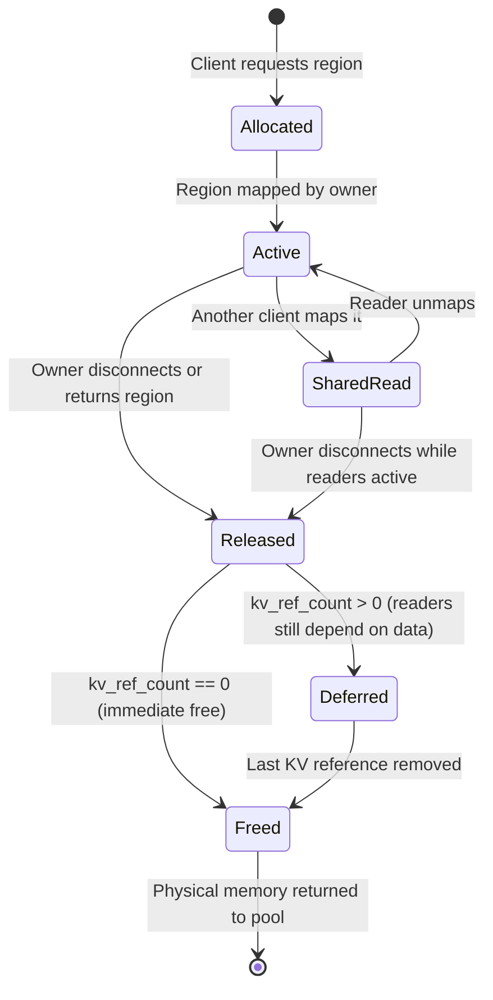
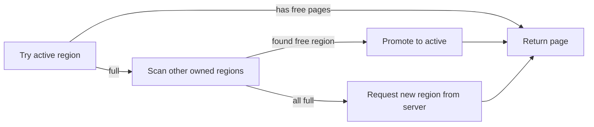
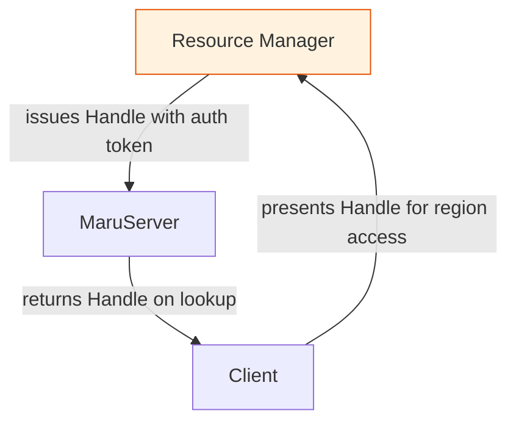

# Maru Memory Model

---

## 1. Memory Hierarchy

Maru organizes CXL shared memory into a three-level hierarchy:

```
Pool                   (entire CXL device capacity)
  └── Region           (fixed-size allocation unit)
       └── Page        (fixed-size slot within a region)
```



**Pool** — The total CXL device capacity managed by the Resource Manager. In DAX mode, pools are discovered at startup via hardware enumeration of `/dev/dax` devices. In marufs mode, pools are discovered by scanning `/proc/mounts` for `marufs` filesystem mounts. Multiple physical devices or mounts can form multiple independent pools.

**Region** — A contiguous allocation carved from a pool. Size is determined by the client's `pool_size` configuration. Regions are the unit of allocation, ownership, and shared access.

**Page** — A fixed-size slot within a region, sized by the `chunk_size_bytes` configuration. Pages are the unit of allocation within a region. A region of size `pool_size` contains `pool_size / chunk_size_bytes` pages. Any trailing bytes below one page are unused. Each page holds exactly one KV cache chunk, identified by a key and located by (region_id, page_index).

> See also: [MaruHandler — Memory Management](maru_handler.md#2-memory-management), [MaruResourceManager — Memory Management](maru_resource_manager.md#3-memory-management), [KV Cache Management](kv_cache_management.md)

---

## 2. Region Lifecycle

A region progresses through a state machine from allocation to physical deallocation.



**Allocated** — Resource Manager carves a contiguous extent from the pool's free list and returns a handle to the server.

**Active** — The owning client has mapped the region and is actively storing KV entries.

**SharedRead** — One or more non-owning clients have mapped the region for cross-instance retrieval.

**Released** — The owner has disconnected or explicitly returned the region. The `owner_connected` flag is set to false.

**Deferred** — The owner has disconnected, but the region's KV reference count is still positive. The region's data must remain accessible until all references are removed. This prevents premature deallocation while readers still depend on the data.

**Freed** — Both conditions are met: the owner has disconnected and the KV reference count has reached zero. The physical memory is returned to the Resource Manager's free list.

> See also: [MaruServer — Allocation Management](maru_server.md#2-allocation-management), [MaruResourceManager — Reaper](maru_resource_manager.md#5-reaper)

---

## 3. Page Allocation

Page allocation within a region is managed by the `PagedMemoryAllocator` using a free-list.

### Multi-Region Allocation Strategy

When a client stores a new KV entry, it must allocate a page. The allocation follows a three-tier strategy:



1. **Fast path** — Try the currently active region's allocator. This succeeds when the active region has free pages.
2. **Scan** — If the active region is full, iterate through other owned regions. Promote the first region with free pages to active.
3. **Expand** — If all owned regions are exhausted, request a new region. This is the only path that involves server communication.

### Population Policy

Physical page population is determined per region based on ownership:

| Region Ownership | Policy | Rationale |
|------------------|--------|-----------|
| Owned | Eager — all pages populated at map time via `madvise(MADV_POPULATE_WRITE)` | Avoids page faults on the write path |
| Shared | Deferred — pages faulted on first read | Most shared regions are partially read; eager population wastes memory |

> See also: [MaruHandler — Memory Management](maru_handler.md#2-memory-management)

---

## 4. Access Control

Maru enforces access control at the region level through a capability-based model: **a client must present valid authorization to access a region it does not own**.



Every allocation receives a **capability-based handle** containing a cryptographic auth token. The token is computed from the handle's fields using a server-side secret. Clients must present a valid handle to:
- Map a region's shared memory for direct access
- Free an allocation

The Resource Manager also verifies process identity at connection time, ensuring non-root clients can only free their own allocations.

### Trust Boundary

The **data path is untrusted** — clients read and write shared memory directly without server mediation. The **metadata path is trusted** — only the server can update the key-to-location index. This separation means a compromised client can corrupt data in its own regions but cannot redirect other clients' keys to arbitrary locations.

When marufs is used as the memory backend, the kernel enforces additional permission control via `perm_set_default` and `perm_grant`. The server sets default permissions on allocated regions so that only authorized clients can map them, providing stronger isolation than user-space capability tokens alone.

> See also: [MaruResourceManager — Security](maru_resource_manager.md#6-security), [Maru FS — Kernel-Level Access Control](maru_fs.md)

---

## 5. GC and Cleanup

Maru must handle the following failure and cleanup scenarios.

| Concern | Strategy |
|---------|----------|
| **Normal shutdown** | Client calls `close()`: returns all owned regions via RPC, server decrements ref counts, immediate or deferred free |
| **Client crash** | Resource Manager's reaper thread polls process liveness every 1 s; reclaims leaked allocations. Server's `disconnect_client()` marks regions as owner-disconnected |
| **Stale metadata** | Server holds KV entries pointing to deferred regions until last ref is removed; then region is freed |
| **PID reuse defense** | Reaper caches process start time; detects recycled PIDs by comparing current vs cached start time |
| **Crash recovery** | Resource Manager replays write-ahead log on restart to reconstruct allocation state |

> See also: [MaruServer — Allocation Management](maru_server.md#2-allocation-management), [MaruResourceManager — Reaper](maru_resource_manager.md#5-reaper)

