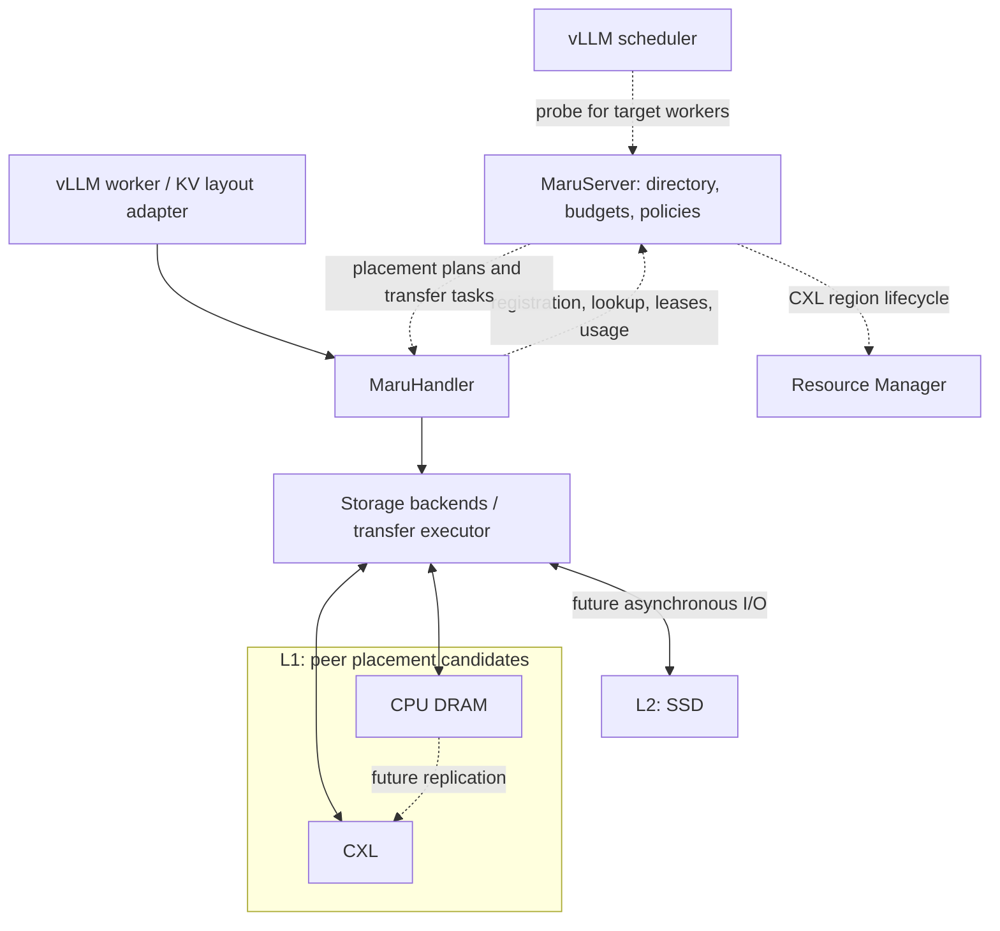
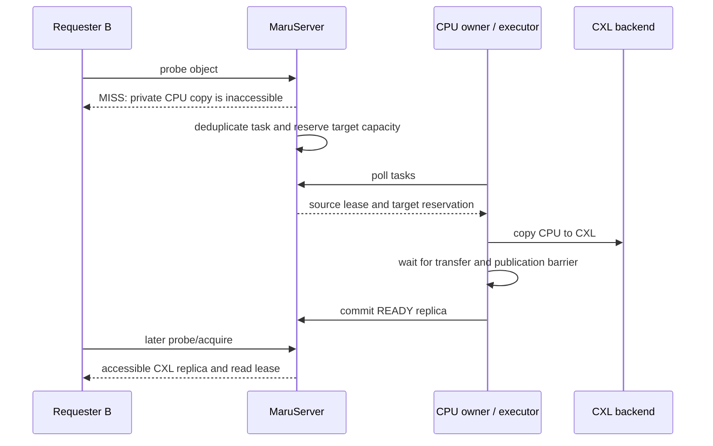

# RFC: CPU/CXL L1 and SSD L2 caching for the native vLLM connector

Discussion and implementation tracking: [RFC #87](https://github.com/xcena-dev/maru/issues/87).

Status: proposed, with a first implementation covering M0, M1, and M2a.
The remaining milestones require separate implementation and review.
See the [vLLM integration guide](../integration/vllm.md) for settings that are
actually supported; conceptual APIs in this RFC are not a compatibility promise.

The initial implementation is based on upstream
`3182e2014fc8f04f1dccc8f5b155c46011c9f68a`
(`feat(maru_vllm): own the paged-KV placement kernels (#85)`).

## Summary

Extend Maru's native vLLM connector so **CPU DRAM and CXL are peer placement
candidates in L1, with SSD added later as L2**. The GPU's execution KV cache sits
outside this naming scheme. CPU does not have to precede CXL, and CXL is not
permanently assigned the role of CPU overflow storage.

MaruServer should track locations, capacities, access scopes, replica states,
and eventually sharing demand for every registered medium. Workers and storage
backends allocate memory and execute transfers. RPCs carry metadata, not KV
payloads.

The first PR provides CPU-only operation and simultaneous CPU/CXL use by one
worker, with fixed capacities and independently configurable write/read order.
It does not claim cross-engine sharing of typed CXL pools, eviction, automatic
replication, or SSD support.

## Motivation and goals

The existing native connector assumes CXL-backed storage. This couples cache
initialization to DAX and the Resource Manager, prevents use of spare worker
DRAM without CXL, and leaves no explicit representation for multiple placements
of the same logical KV object.

The extension should:

- Run a CPU DRAM cache without a CXL device or Resource Manager.
- Use CPU and CXL together, with explicit per-medium budgets and configurable
  selection policies.
- Let the server account for CPU capacity and ownership as well as CXL.
- Distinguish a logical object from its physical replicas, so a private CPU copy
  does not prevent creation of an accessible CXL copy.
- Add sharing-driven CPU-to-CXL replication and bounded SSD demotion/restore
  without inventing a different key space for each medium.
- Preserve legacy CXL behavior for existing native, LMCache, and SGLang users.

CPU-only means that GPU inference offloads KV to CPU DRAM; it does not mean
running the model on the CPU. Direct sharing of CPU memory between processes on
the same host is a separate extension requiring export/import and lifetime
management.

## Current constraints

| Existing component | Constraint on the extension |
| --- | --- |
| Scheduler handler initialization | Metadata lookup must not allocate or map a data pool. |
| Handler connection | DAX discovery, mapping, and initial CXL allocation must be optional. |
| Server allocation manager | CPU-only server startup must not require a running RM. |
| Legacy KVManager | A single key-to-region entry cannot represent independent CPU and CXL replicas. |
| Lookup protocol | A global exists boolean and a CXL handle do not describe requester accessibility. |
| Duplicate detection | An object on another worker's private CPU is not a usable local placement. |
| Connector residency caches | A remembered hit cannot remain authoritative after expiry, restart, or eviction. |
| Layerwise completion markers | A surviving marker does not prove every required layer is still readable. |
| Transfer batching | Equal offsets or page numbers in different pools do not imply contiguous memory. |
| Completion callbacks | Source and destination lifetimes must cover the final GPU/CPU/I/O operation. |
| Prefix keys | Token hashes alone do not identify compatible weights, layouts, adapters, or shards. |

Do not encode CPU virtual addresses in fake `MaruHandle` objects. The legacy
key-level pin count is also not a substitute for a replica-specific read lease.

## Architecture and ownership



| Component | Responsibilities |
| --- | --- |
| vLLM connector | Compatible object identity, layer/shard completeness, scheduler contracts, GPU gather/scatter, completion events. |
| MaruHandler | Backend connections, descriptor resolution, buffer/read-lease ownership, execution of storage decisions. |
| Storage backend | Physical allocation, local buffer access, device-specific publication barriers, reclamation. |
| MaruServer | Object/replica directory, eligibility, capacity grants, policy state, replication/reclamation tasks. |
| Resource Manager | CXL region allocation and access capabilities. It does not allocate worker CPU DRAM. |

The server owns the metadata and budget authority. Workers enforce hard local
limits even when usage reports lag. In the initial fixed-pool implementation,
workers execute the configured write order locally within server grants; the
server records that order and selects reads. Future dynamic policies can return
plans from server metadata without making every page allocation an RPC.

The first implementation puts descriptors and static policy in
`maru_common/storage_types.py` and `storage_policy.py`, local backends in
`maru_handler/storage/`, and pool/session/replica state in
`maru_server/replica_directory.py`. Additional registries, policy modules, and
executors should be introduced when a milestone needs them.

## Data model

### Logical identity

Conceptually:

`ObjectId = (namespace, prefix_digest, shard_id, object_part)`

- **Namespace:** application/tenant boundary, exact weights/revision, adapter
  identity, KV dtype/quantization, geometry, storage format/version, chunk size,
  and parallel layout.
- **Prefix digest:** the prefix through the chunk. Salts, embeddings, and
  multimodal inputs must be represented or excluded from caching.
- **Shard:** TP rank, PP stage, and other physically distinct KV partitions.
- **Object part:** all local layers for chunkwise storage, or a layer identifier
  for layerwise storage.

Compatible engines can share a namespace. Worker/session IDs belong to
placements, not logical content identity. Unsupported inputs must be rejected
or bypass caching rather than collide under an incomplete namespace.

The first PR requires an explicit immutable-weights namespace, adds an engine
geometry fingerprint, and restricts CPU/mixed operation to one worker and
validated chunkwise layouts. Having a shard field in a proposed model does not
imply multi-rank support.

### Objects, replicas, pools, and sessions

| Record | Representative fields |
| --- | --- |
| Object | Identity, logical size, format, replicas. |
| Replica | Replica/allocation ID, pool, generation, location, state, allocated bytes. |
| Pool | Medium, tier, scope, owner session, node, access domain, capacity and budgets. |
| Session | Session token/epoch, server epoch, engine/worker role and membership. |
| Chunk manifest | Required layers/shards and the generations of their replicas. |

An object may have copies on CPU A, CPU B, and CXL simultaneously. Deduplication
is scoped to a compatible placement domain, rather than a global key. A
duplicate in one pool is a no-op; another owner's CPU copy must not suppress a
valid new placement. Namespace, size, or format incompatibility must never be
treated as a successful compatible hit.

### Medium, tier, and scope are separate

| Backend | Tier | Intended scope |
| --- | --- | --- |
| Initial CPU | L1 | Owning worker process. |
| Initial mixed CXL | L1 | Owning worker process, until cross-engine lifetime handling is implemented. |
| Shared CXL extension | L1 | An explicitly accessible CXL sharing domain. |
| Host-shared CPU extension | L1 | Authorized processes able to import the host pool. |
| Initial SSD extension | L2 | Workers served by the host/service SSD executor. |

Matching host names does not grant access to another process's CPU memory.
CXL is not automatically accessible from every host. Eligibility must use
registered capabilities and topology, and workers must still validate actual
mapping access.

CPU locations identify a pool, allocation, generation, offset, and length.
The server never receives a CPU virtual address. CXL adds a backend-owned
region capability; SSD adds an extent/object identifier and integrity metadata.
A descriptor must match its pool's medium and bounds. Allocation generations
prevent a stale offset from referring to reused storage.

### Capacity and sharing signals

Distinguish logical KV bytes, page allocation, in-flight write reservations,
retiring bytes, physical backing reservations, and actual CUDA-pinned bytes.
READY and RETIRING are subsets of allocation, not additional capacity to count
again. Physical CXL region reservation and free pages inside that region are
different quantities.

The first PR reports `capacity_bytes`, `reserved_bytes`, `allocated_bytes`,
`ready_bytes`, `ready_allocated_bytes`, `quarantined_bytes`, and
`pinned_bytes`. Here `reserved_bytes` means backing capacity reserved for the
pool, including RM alignment; it is not an additional write reservation.
Future reservation accounting must keep those meanings separate.

CPU grants are per worker and bounded by a server-configured host aggregate.
For example, four 8 GiB worker pools reserve 32 GiB. Do not advertise all system
RAM as available cache budget. Likewise, workers must not each promise the same
free CXL capacity.

Future sharing decisions should use separate signals rather than one
`is_shared` boolean:

- Physical scope and access domain.
- Distinct consuming engines in a bounded time window.
- Remote demand that could benefit from a CXL replica.
- Optional sharing hints.
- Replica count, which is not consumer count.

Deduplicate demand by engine/request/chunk. Scheduler polling and TP workers
must not artificially inflate sharing demand. Correctness must not depend on
the freshness of these statistics.

## Policy boundaries

| Decision | Inputs | Output |
| --- | --- | --- |
| Placement/admission | Object size, writing worker, eligible pools, budget, demand hints. | Ordered targets or SKIP. |
| Read selection | Requester, READY replicas, accessibility, estimated cost. | Replica or MISS/PENDING. |
| Replication | Remote demand, existing CXL copies, topology, capacity and transfer budget. | COPY or NOOP. |
| Eviction/demotion | Pressure, recency/frequency, sharing benefit, other copies, protection. | Retire a replica or create an L2 copy. |

Eligibility and lifetime checks precede ranking. A policy cannot select an
inaccessible CPU location or reclaim a protected replica. Policy code should
consume a metadata snapshot and produce a plan/reason; transfer execution and
I/O remain separate.

The initial mixed policy supports both `[cpu, cxl]` and `[cxl, cpu]` write
order, with a separately configurable read order. If both fixed pools are full,
skip admission and preserve existing hits. A successful allocation chooses one
destination; it does not automatically create two replicas.

Later policies can compare expected reuse and sharing benefit against transfer
cost and capacity opportunity cost. Measure NUMA placement, GPU connectivity,
contention, and object size rather than assume CPU is always faster. Minimum
residency, high/low watermarks, cooldown, and bandwidth budgets should prevent
repeated migration between pools.

## Replication semantics

When another engine requests an object that exists only in an inaccessible CPU
pool, and no accessible CXL replica exists, the server may ask the live CPU
owner to create a CXL replica.

**Replication leaves the CPU copy and creates a CXL copy.** Movement is a
separate sequence: copy, publish the destination, and only then optionally
retire the CPU source under the eviction policy.

| Situation | Initial sharing policy |
| --- | --- |
| Only A reuses a copy in A's CPU pool. | Read A's CPU copy. |
| B needs an object present only on A's CPU. | Return MISS to B and enqueue a replication task. |
| An accessible CXL copy already exists. | Select an eligible replica; do not replicate again. |
| CXL is full or A is unavailable. | Skip/fail replication; B recomputes. |
| CPU is under pressure and CXL is READY. | An unprotected CPU copy becomes an eviction candidate. |

Deduplicate tasks by object and target domain. The first policy can trigger on
one valid remote-engine demand, with capacity/bandwidth admission and cooldown.
Thresholds and windows can evolve after measurement.



The executor must be able to access both source and destination. Unsupported
topology must not silently introduce an unspecified remote CPU transport.
Tasks should run outside the model forward path with bounded concurrency and
bytes in flight.

The backend owns cache visibility/flush requirements. A CUDA completion event
alone does not establish cross-host CXL visibility for every transfer path.
Test byte correctness on the actual sharing topology before enabling it.

A timed-out transfer must retain source protection and destination reservation
until execution is drained or fenced. The first policy lets the triggering
request recompute; waiting on replication with a deadline is a later extension.

## Backend and metadata contracts

L1 can return a leased memory buffer. SSD cannot be required to implement an
immediate `retrieve() -> memoryview`.

| Conceptual backend operation | Contract |
| --- | --- |
| Reserve/allocate | Allocate within a granted budget or report admission failure. |
| Resolve/read | Return a protected L1 buffer or an asynchronous L2 read operation. |
| Publish READY | Verify transfer completion and backend visibility before commit. |
| Retire/reclaim | Block new acquisition, drain readers/I/O, then acknowledge reuse. |
| Copy | Execute on a backend able to access source and destination. |
| Capabilities | Describe scope, import/export, pinning, and supported transfers. |

A buffer descriptor needs backing identity, allocation generation, byte range,
lease ownership, and actual pin status. Coalescing is allowed only when backing
identity, byte adjacency, and lifetimes are all valid. Do not merge CPU and CXL
runs because their numeric offsets match.

The initial CPU pool uses a bounded anonymous mapping and page allocator.
Mixed CXL uses an RM-backed DAX mapping with the same ownership contract.
Both use synchronous copies without assuming host pinning or using a pageable
pointer in a direct-access GPU kernel. Pinning, async transfers, and overlap
require separate validation.

The first PR negotiates `cpu_storage_v1` and, on a CXL-enabled server,
`mixed_storage_v1`. It adds a metadata-only `STORAGE` message family while
preserving existing framing and legacy APIs. Current actions are `open`,
`heartbeat`, `commit`, `resolve`, `probe`, `acquire`, `release`, `close`,
and `usage`.

Future operations include manifest-aware prefix probing/acquisition,
replica retirement/reclaim acknowledgments, and replication task polling and
completion. Batch responses must preserve request order and per-item results.

Probe does not reserve a read. Acquire atomically revalidates readability and
protects the selected replica. A race between probe and acquire is an expected
miss. For a manifest, acquire must validate/protect all required parts; a failed
partial acquisition releases what it acquired.

Commit is idempotent by operation ID. `ALREADY_PRESENT` refers to the same
placement domain. An unknown RPC result is not permission to reuse an
allocation: retain it in quarantine and resolve or retry the exact operation.
In the first PR, `resolve=UNKNOWN` is not an abort, because the original request
may still be queued. Bounded ledgers/tombstones stop admission when full rather
than discard replay protection.

## Publication, leases, and recovery

The target state model is:

`RESERVED -> WRITING -> READY -> RETIRING -> FREED`

Failed writes become ABORTED only when safe to reclaim. Initial pre-commit
states may live on the worker, with the server publishing only committed
replicas.

The required invariants are:

1. READY means transfer and backend-specific visibility are complete.
2. Logical KV content is immutable; relocating it creates another replica.
3. Acquire atomically verifies READY and obtains read protection.
4. Retirement blocks new readers and invalidates relevant generations/manifests.
5. A page cannot be reused before its final GPU/CPU/I/O reader completes.
6. Server capacity is not reclaimed before the owner's physical-reclaim ACK.
7. Session/server epochs, generations, and operation IDs fence retries and late
   completion.

Store proceeds through allocation, GPU-to-host copy, completion, and metadata
commit. Load proceeds through scheduler probe, worker acquire, local resolution,
host-to-GPU copy, and explicit lease release. Keeping a tensor reference alive
is not by itself a reclamation protocol.

| Event | Required behavior |
| --- | --- |
| Worker restart | Old CPU locations become invalid under the old session. |
| Heartbeat loss | Hide replicas, but do not treat timeout as proof that DMA or mappings ended. |
| Metadata server restart | Fence old epochs; initially require workers to drain/restart with cold sessions. |
| Lost commit reply | Retain allocation and resolve/retry the original operation. |
| Replica disappears after probe | Report load failure and recompute. |
| Cancellation/preemption | Stop new work; drain already submitted transfers before release. |
| Lost transfer executor | Keep reservations/protection until completion or fencing is established. |
| Inaccessible pool | Exclude it from usable hits; use another eligible copy or recompute. |

The first PR requires explicit lease release and actual pool unmapping before
a drained close releases CPU grants and CXL regions. Exported buffers prevent
that close. Expired grants remain charged. Abrupt worker death may leave CXL
allocations reserved in the RM; restarting CPU metadata alone does not reclaim
them. Automatic crash reclamation and persistent recovery are separate work.

## vLLM integration requirements

The scheduler is a metadata-only client, not the owner of worker CPU memory.
Bind it to a worker set using an engine ID and independent worker sessions.
The first PR permits one active worker per engine and registers the worker's
actual KV schema after cache registration.

The first supported path is text-only, homogeneous, unquantized, synchronous
chunkwise storage under eager execution. TP, PP, DP, and context parallel sizes
must all be one. Unsupported layouts/model features are rejected; requests
with cache salts or prompt embeddings bypass this cache. The vLLM load failure
policy must explicitly be `recompute`.

Commit a chunk only after all local layers are complete, regardless of callback
order. A future layerwise manifest must reference the current versions of all
required layers. A future multi-rank hit must prove every required shard is
readable by its target worker; one rank's hit is insufficient.

Do not use unbounded `_known_keys` or `_stored_keys` as permanent truth.
The initial path re-probes server metadata and checks current local ownership.
Any later metadata cache must be bounded/versioned, with acquisition still
revalidating residency.

GPU layout conversion remains in the connector/layout adapter. Async store
must also protect the source GPU blocks until D2H completes and must report
completion on failure to avoid retaining those blocks indefinitely.

Preserve the existing full-prefix contract that leaves compute for vLLM.
Propagate missing replicas through load-error reporting so the scheduler can
recompute. Future deferred loads must report completion even when they fail.

## SSD L2

SSD uses the same object/replica directory. An SSD-resident object is not an
immediately usable L1 hit.

- **Demotion:** protect the L1 source, reserve an SSD extent, complete and verify
  the write, publish SSD READY, then optionally retire L1.
- **Restore:** acquire SSD, reserve bounded staging/L1 capacity, read and verify
  asynchronously, load the GPU or publish the chosen L1 replica, and report
  completion.
- Do not restore to both CPU and CXL unless policy explicitly chooses replication.
- Bound staging separately from cache capacity; account for queue depth,
  in-flight bytes, checksums, disk-full behavior, timeouts, and extent reuse.
- Start with a host-local executor and cache semantics. Warm restart and
  durability require a versioned index/journal and crash-consistent commit.

GPUDirect Storage, remote SSD, compression, and write coalescing are later
optimizations. Keep the initial API asynchronous enough to accommodate SSD
without implementing speculative adapters in the first PR.

## Implementation milestones and acceptance criteria

| Milestone | Scope | Acceptance criteria |
| --- | --- | --- |
| M0: foundation | Metadata-only connections, optional CXL initialization, typed descriptors/capability negotiation. | CPU metadata operation needs no DAX/RM; legacy regressions pass. |
| M1: CPU-only | Worker CPU pool, server ownership/capacity, commit/probe/acquire/release, sync chunkwise connector. | Real no-RM server, exact KV round trip, real vLLM reuse, owner isolation, bounded capacity, stale-session and unknown-commit tests. |
| M2a: mixed fixed L1 | Both pools in one worker, independent write/read order, full-pool fallback, per-pool replicas and usage. | CPU-first and CXL-first, split-prefix restoration, duplicate replicas/read selection, no reuse during live reads or uncertain commit, real DAX/GPU validation. |
| M2b: sharing and safe reclamation | Cross-engine CXL access domains and read lifetimes; replica eviction, retirement/reclaim ACKs; bounded metadata invalidation. | Correct foreign-reader lifetime across owner shutdown; no stale hits or reuse races; bounded saturation; baseline performance comparison. |
| M3: demand-driven replication and policies | Bounded demand signals/task queue, source leases, target reservations, deduplicated CPU-to-CXL copies, configurable dynamic policy. | No hit before publication, no duplicate CXL copy, safe failure/timeout/full-pool behavior, byte/visibility tests on actual sharing topology. |
| M4: SSD L2 | Async backend, bounded staging, demotion/restore, scheduler pending/deadline integration. | Restore after both L1 copies are absent; safe partial writes, checksum/timeout/disk-full handling; bounded queues and memory. |

The first PR combines M0, M1, and M2a into one usable baseline. M2b-M4 are not
implied by merging it. Layerwise/async/overlap should be enabled individually
after their lifetime tests pass.

Host-shared CPU is an independent extension if measurements justify it:
pool export/import, descriptor/FD permissions, owner-exit behavior, and a host
allocator are required. Multi-rank support is likewise a separate milestone
covering shard identity, membership, all-shard hit aggregation, and failure
propagation; it may be prioritized independently after the baseline.

## Configuration, observability, and evaluation

The first PR's supported mixed configuration is:

```json
{
  "maru_storage_backend": "mixed",
  "maru_cpu_pool_size": "8G",
  "maru_cxl_pool_size": "32G",
  "maru_write_order": ["cpu", "cxl"],
  "maru_read_order": ["cpu", "cxl"],
  "maru_engine_id": "inference-a",
  "maru_cache_namespace": "immutable-weights-revision"
}
```

This belongs inside `kv_connector_extra_config`; eager execution and
`kv_load_failure_policy="recompute"` are also required. Use a CXL-enabled server
for mixed mode. CPU-only uses `maru_storage_backend="cpu"` and can use
`maru-server --cpu-only`. Legacy `maru_pool_size` retains its CXL-only meaning
and is rejected in CPU/mixed configuration to prevent ambiguity.

The initial `cpu_storage` response remains CPU-only; `l1_storage` reports both
typed media. `marutop usage` displays per-pool capacity, allocations, logical KV,
and uncertain writes. Future metrics should add eligibility misses, store skips,
retiring bytes, replication/demotion traffic and failures, policy reasons, and
metadata overhead. Keep metric labels bounded rather than label by object or
request ID.

Evaluate legacy CXL-only, CPU-only, mixed fixed policy, and later sharing policy
on single-engine reuse, shared-prefix workloads, low reuse, and capacity
pressure. Compare equivalent memory budgets, or state the difference.
Record TTFT p50/p95, throughput, GPU wait, metadata load, DRAM use, and transfer
bytes. Correctness smoke tests are not performance benchmarks.

## Alternatives and review questions

- **CPU as an opaque connector-local cache:** simpler initially, but hides
  capacity and residency from MaruServer and cannot support global sharing
  decisions. Register CPU pools and replicas from the start.
- **A mandatory CPU -> CXL -> SSD chain:** fixes placement policy into topology.
  Keep CPU/CXL as peer L1 candidates and choose order explicitly.
- **Reuse the legacy CXL key directory for all media:** conflates private CPU
  existence with accessibility and mixes incompatible lifetime protocols.
  Keep typed and legacy namespaces/regions separate during migration.
- **Implement sharing, eviction, async transfer, and SSD immediately:** expands
  the correctness surface before a byte-correct baseline exists. Gate each
  milestone with explicit acceptance tests.
- **Free memory on heartbeat expiry:** risks reuse while a disconnected process
  still accesses it. Require reclaim acknowledgment or proven fencing.

Decisions proposed now are peer L1 placement, separate object/replica identity,
server-visible CPU metadata, requester-specific eligibility, metadata/data-plane
separation, independent policy and transfer execution, publication after copy,
and reader protection before reclaim.

Feedback is especially useful on:

1. The M2a-to-M2b boundary and whether cross-engine CXL access or eviction should
   be implemented first.
2. Engine/worker membership and access-domain representation for shared CXL.
3. Which measured signals should drive initial sharing and admission policy.
4. SSD executor placement and whether warm recovery should remain outside the
   initial L2 scope.

NUMA defaults, pinning granularity, page size, policy order, sharing thresholds,
watermarks, transfer budgets, metadata batch sizes, and supported vLLM/CUDA
combinations should be established by implementation measurements.
