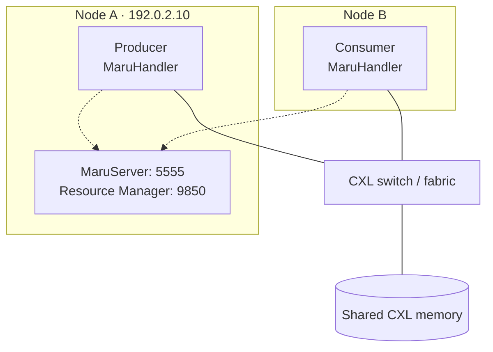

# Quick Start

Start the services for your setup, then run the same Python producer and
consumer below. No GPU or inference engine is required.

| Setup | Required environment | Where the clients run |
|-------|----------------------|-----------------------|
| {ref}`Single-host <quickstart-single-host>` | One x86 host with a CXL DEV_DAX device | Two terminals on the same host |
| {ref}`Multi-host <quickstart-multi-host>` | Two x86 hosts connected to shared CXL memory through a CXL switch/fabric | Producer on Node A, consumer on Node B |

Complete {doc}`bios_setup` and {doc}`installation` first. Activate the Maru
Python environment in each terminal. Both setups use port `9850` for the
Resource Manager and `5555` for MaruServer.

## 1. Start the services

Choose one setup below. Keep the services running while using the clients.

(quickstart-single-host)=
### Single-host

Start the Resource Manager as a systemd service:

```bash
sudo systemctl start maru-resource-manager
```

Alternatively, with the service stopped, run it in a dedicated terminal:

```bash
sudo maru-resource-manager --host 127.0.0.1 --port 9850
```

Wait until the Resource Manager logs `ready — listening on 127.0.0.1:9850` (for the systemd service, check `journalctl -u maru-resource-manager`), then start MaruServer in another terminal:

```bash
maru-server
```

In **both client terminals**, set the server address:

```bash
export MARU_SERVER_URL=tcp://127.0.0.1:5555
```

Continue to {ref}`the producer and consumer <quickstart-clients>`.

(quickstart-multi-host)=
### Multi-host

This example runs both services and the producer on **Node A**, with the
consumer on **Node B**:



Dashed lines are TCP connections to the services on Node A. Solid lines show
each host's direct access to the shared memory through its local DEV_DAX device
and the CXL fabric.

Both hosts must have read/write access to the **same physical CXL memory at
matching device offsets**. Install Maru with `./install.sh` on Node A and
`./install.sh --no-rm` on Node B.

Replace `192.0.2.10` with Node A's reachable IP. Node B must be able to reach
Node A on TCP ports `5555` and `9850`.

Run one Resource Manager for the shared pool on **Node A**. Stop the systemd service first: a service still bound to `127.0.0.1:9850` does not conflict with a second Resource Manager on `192.0.2.10:9850`, and the two would manage the same devices and state directory. Then start it in a dedicated terminal:

```bash
sudo systemctl stop maru-resource-manager
sudo maru-resource-manager --host 192.0.2.10 --port 9850
```

To run it as the systemd service instead, see the {ref}`multi-node configuration <installation-multi-node-config>`.

Wait until it logs `ready — listening on 192.0.2.10:9850`, then start MaruServer in another terminal on **Node A**:

```bash
maru-server --host 192.0.2.10 --port 5555 \
    --rm-address 192.0.2.10:9850 \
    --dax-path /dev/dax0.0
```

Replace `/dev/dax0.0` with the shared device's path on Node A. Local device
names may differ on Node B; Maru resolves them by UUID. The advertised
`--rm-address` must be reachable from Node B, so use Node A's IP here.

In **both client terminals** (one on each host), set the same server address:

```bash
export MARU_SERVER_URL=tcp://192.0.2.10:5555
```

Continue to {ref}`the producer and consumer <quickstart-clients>`.

(quickstart-clients)=
## 2. Run the producer and consumer

Use these same snippets for either setup. Keep `MARU_SERVER_URL` set as shown
above in each client terminal. For single-host, run both clients on the same
host; for multi-host, run the producer on Node A and the consumer on Node B.

### Producer: write and store

Run this first and keep it running until the consumer finishes:

```python
import os

from maru import MaruConfig, MaruHandler
from maru_shm._cxl_flush import HAVE_CLFLUSH, flush_range

assert HAVE_CLFLUSH, "This CPU example requires x86 cache-flush support"

config = MaruConfig(
    server_url=os.environ["MARU_SERVER_URL"],
    instance_id="producer",
    pool_size=100 * 1024 * 1024,
)

with MaruHandler(config) as handler:
    data = b"A" * (1024 * 1024)
    handle = handler.alloc(size=len(data))
    handle.buf[:] = data
    flush_range(handle.buf)  # Make the CPU write visible before publishing.
    handler.store(key="quickstart-demo", handle=handle)

    print("Stored 1 MiB. Run the consumer.")
    input("Press Enter after the consumer finishes...")
```

### Consumer: retrieve and verify

Run this in the other client terminal:

```python
import os

from maru import MaruConfig, MaruHandler
from maru_shm._cxl_flush import HAVE_CLFLUSH, flush_range

assert HAVE_CLFLUSH, "This CPU example requires x86 cache-flush support"

config = MaruConfig(
    server_url=os.environ["MARU_SERVER_URL"],
    instance_id="consumer",
    pool_size=100 * 1024 * 1024,
)

with MaruHandler(config) as handler:
    result = handler.retrieve(key="quickstart-demo")
    assert result is not None, "Run the producer first"
    flush_range(result.view)  # Discard local cached copies before reading.
    assert bytes(result.view) == b"A" * (1024 * 1024)
    print("Success: read the producer's data from shared CXL memory")
```

The consumer should print `Success: read the producer's data from shared CXL memory`.
The `flush_range` calls make CPU writes and reads visible across hosts and are used in both setups. They require Maru's x86 cache-flush extension; if the import fails, see {ref}`verifying the installation <installation-verify>`. See {doc}`../design_doc/consistency_and_safety` for the write-back and invalidation pattern.

## 3. Stop the example

Press Enter in the producer terminal to exit. Stop MaruServer, then stop the
Resource Manager if you started it for this example. Use Ctrl+C for foreground
processes, or `sudo systemctl stop maru-resource-manager` for the systemd service.

## Next steps

- {doc}`examples/vllm/index` — More vLLM serving examples
- {doc}`examples/dynamo/index` — Run Dynamo with Maru-backed vLLM workers
- {doc}`examples/lmcache/index` — Use Maru as a shared KV cache backend for LMCache
- {doc}`../design_doc/architecture_overview` — System architecture and component interactions
- {doc}`../api_reference/api` — Python API
- {doc}`../api_reference/config` — Configuration options
