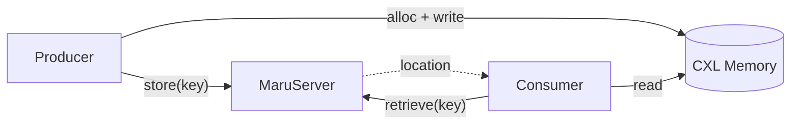

# Quickstart

## Single-Node Setup

### 1. Start the Resource Manager

The resource manager must be running before any other Maru service.

**Production** — start as a systemd daemon:

```bash
sudo systemctl start maru-resource-manager
```

**Development/debugging** — run directly with custom options:

```bash
# Default (127.0.0.1:9850)
sudo maru-resource-manager --log-level debug

# With custom host/port
sudo maru-resource-manager --host 0.0.0.0 --port 9851 --log-level debug
```

> If you change the RM port, pass the same address to `maru-server`: `maru-server --rm-address 127.0.0.1:9851`
>
> See {doc}`installation` for the full list of CLI options and systemd configuration.

### 2. Start the Metadata Server

```bash
# Default (127.0.0.1:5555, connects to resource manager at 127.0.0.1:9850)
maru-server

# With custom host/port
maru-server --host 0.0.0.0 --port 5556

# With debug logging
maru-server --log-level DEBUG
```

### 3. Run a Client Example

> Both `maru-resource-manager` and `maru-server` must be running before proceeding.

### Zero-Copy Store & Retrieve

```python
from maru import MaruConfig, MaruHandler

config = MaruConfig(
    server_url="tcp://localhost:5555",
    pool_size=1024 * 1024 * 100,  # Request 100MB from the CXL memory pool
)

with MaruHandler(config) as handler:
    data = b"A" * (1024 * 1024)  # 1MB KV chunk

    # 1. Allocate a page in CXL shared memory
    handle = handler.alloc(size=len(data))

    # 2. Write directly to CXL memory (mmap — no intermediate buffer)
    handle.buf[:] = data

    # 3. Register the key — only metadata (key → region, offset) is sent
    handler.store(key=42, handle=handle)

    # Retrieve: returns a memoryview pointing into CXL memory
    result = handler.retrieve(key=42)
    assert result is not None
    assert bytes(result.view[:5]) == b"AAAAA"
```

The three steps — `alloc()`, write to `handle.buf`, `store(handle=)` — make Maru's control/data plane separation explicit:

- **Control plane**: `alloc()` requests a memory region from the Resource Manager; `store()` registers the key's location metadata (~tens of bytes) with MaruServer.
- **Data plane**: `handle.buf[:]` reads/writes directly on mmap'd CXL memory. No server involved.

> Full runnable example: `examples/basic/single_instance.py`

### Cross-Instance Sharing

This is the core of Maru — two independent processes sharing KV cache through CXL shared memory with zero data copy. **Metadata travels, data doesn't.**



**Terminal 1** — Producer: allocate, write, register metadata:

```python
from maru import MaruConfig, MaruHandler

config = MaruConfig(
    server_url="tcp://localhost:5555",
    instance_id="producer",
    pool_size=1024 * 1024 * 100,
)

with MaruHandler(config) as handler:
    for i, key in enumerate([1001, 1002, 1003]):
        data = bytes([ord("A") + i]) * (1024 * 1024)

        handle = handler.alloc(size=len(data))
        handle.buf[:] = data
        handler.store(key=key, handle=handle)

    input("Press Enter to exit...")
```

**Terminal 2** — Consumer: retrieve from CXL (zero copy):

```python
from maru import MaruConfig, MaruHandler

config = MaruConfig(
    server_url="tcp://localhost:5555",
    instance_id="consumer",
    pool_size=1024 * 1024 * 100,
)

with MaruHandler(config) as handler:
    for key in [1001, 1002, 1003]:
        result = handler.retrieve(key=key)

        # result.view points directly into Producer's CXL region (mapped read-only).
        # No data was copied — consumer reads the same physical memory.
        assert result is not None
        print(f"key={key}: {len(result.view)} bytes, char={chr(result.view[0])!r}")
```

> Full runnable examples: `examples/basic/producer.py` + `examples/basic/consumer.py`
>
> Single-script version: `examples/basic/cross_instance.py`


## Multi-Node Setup

In a multi-node deployment, the Resource Manager, Metadata Server, and MaruHandler communicate over the network. All nodes must have direct access to the shared CXL memory pool for zero-copy mmap.

```
  ┌───────────────────┐       ┌────────────────────────┐
  │ Resource Manager  │◄──────│ Metadata Server        │
  │                   │       │  --rm-address <rm-ip>  │
  └─────────┬─────────┘       └────────────┬───────────┘
            ▲                              ▲
            │                              │
            └──────── MaruHandler ─────────┘
              (embedded in LLM instance)
```

### 1. Start the Resource Manager

Bind to `0.0.0.0` to accept remote connections (default is `127.0.0.1`, local-only):

```bash
sudo maru-resource-manager --host 0.0.0.0
```

### 2. Start the Metadata Server

Point to the Resource Manager's externally reachable address:

```bash
maru-server --host 0.0.0.0 --rm-address <rm-ip>:9850
```

MaruHandler receives the Resource Manager address from the Metadata Server automatically via handshake — no separate RM address configuration is needed on the client side.

> **Note:** The `--rm-address` passed to the Metadata Server is forwarded to all MaruHandlers via handshake. Use an externally reachable IP — if set to `127.0.0.1`, remote MaruHandlers will attempt to connect to their own loopback and fail.

> **Security:** When binding to `0.0.0.0`, auth tokens and device paths are transmitted in plaintext. Use an encrypted tunnel (WireGuard, SSH tunnel, IPsec) in production.

### 3. Run a Client Example
Multi-node end-to-end examples are coming soon.

## Next Steps

- [LMCache Examples](examples/lmcache/index.md) — Use Maru as a shared KV cache backend for LMCache/vLLM
- [Architecture Overview](../design_doc/architecture_overview.md) — System architecture and component interactions
- [API Reference](../api_reference/api.md) — Python API documentation
- [Configuration](../api_reference/config.md) — Configuration options
