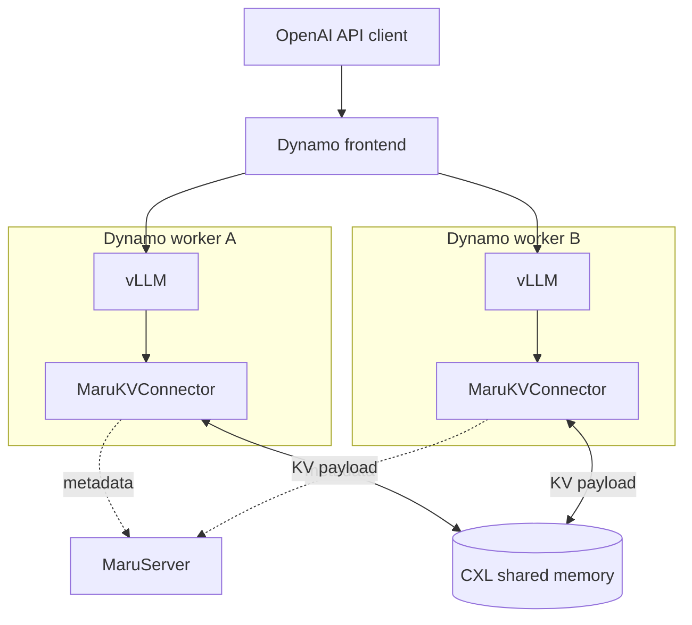

# NVIDIA Dynamo

Dynamo connects to Maru through its **vLLM backend**. Configure each
`dynamo.vllm` worker with the same `MaruKVConnector` and `--kv-transfer-config`
used for standalone vLLM. Dynamo routes requests to the workers, and the
connector handles KV cache sharing through Maru.

See {doc}`vllm` for connector settings and the
{doc}`Dynamo example <../getting_started/examples/dynamo/index>` for setup and
execution instructions.
