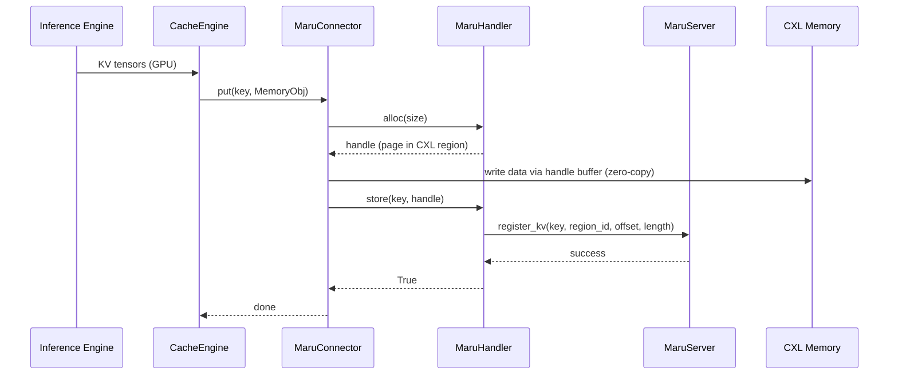
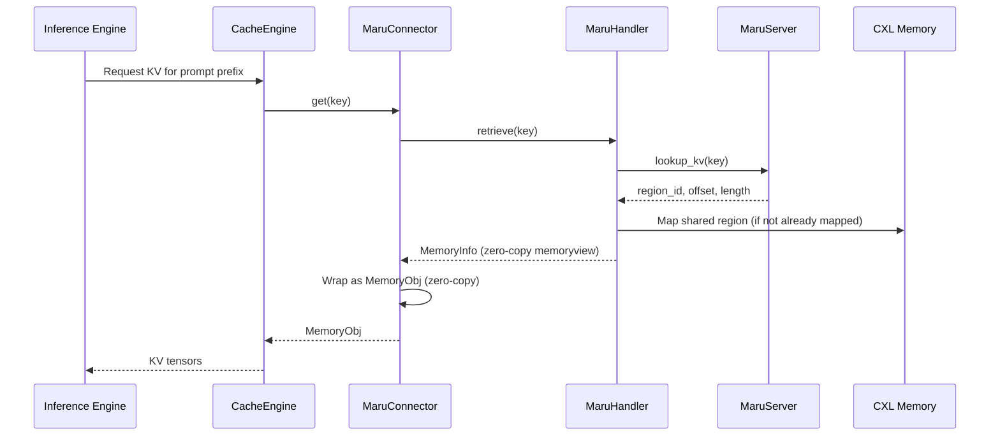

# LMCache Integration

## Integration Architecture

The full stack from inference engine to shared memory:


> **Control Plane** (dashed arrows) — metadata RPC: KV registration, region claim/release.
>
> **Data Plane** (solid arrows) — mmap direct CXL read/write, zero-copy.

### Component Architecture


**Layer responsibilities:**

| Layer | Responsibility | Scope |
|-------|---------------|-------|
| **LMCache stack** | Inference engine → CacheEngine → StorageManager → RemoteBackend | LMCache (external) |
| **MaruConnector** | Adapts LMCache's RemoteConnector to MaruHandler's API | Integration boundary |
| **MaruHandler** | Client-side KV operations, memory mapping, connection management | Maru client |
| **MaruServer** | Central metadata store, memory allocation coordinator | Maru server |

The **integration boundary** sits at MaruConnector. Everything above is LMCache;
everything below is Maru. MaruConnector is the only component that imports from
both projects.

## Connector Design

LMCache defines a `RemoteConnector` interface that all remote storage backends
must implement (`exists`, `get`, `put`, `close`, and batch variants). MaruConnector
implements this interface by delegating to MaruHandler.

**Why the connector pattern:** LMCache's RemoteBackend is designed for pluggable
storage. The same StorageManager can use Redis, S3, Mooncake, or Maru without
any change to the cache engine logic. MaruConnector slots in as one such plugin.

The key translation between the two APIs involves:

- **Key conversion** — LMCache uses structured `CacheEngineKey` objects; MaruHandler uses string keys (`CacheEngineKey.to_string()`).
- **Zero-copy bridging** — MaruHandler returns `MemoryInfo` (a memoryview wrapper) which the connector wraps as LMCache's `MemoryObj` without copying data.
- **Batch optimization** — The connector maps LMCache's batch operations to MaruHandler's batch RPC calls, reducing round-trip overhead.

## Data Path

### Store Path (write)

When the inference engine produces new KV cache data:



### Retrieve Path (read)

When the inference engine needs cached KV data:



The key design point is that **data never travels over the network**. Only metadata
(region ID, offset, length) is exchanged via RPC. The actual KV tensor data is
accessed directly from CXL shared memory through memory-mapped regions.

## Configuration

Maru is loaded as an LMCache [remote storage plugin](https://docs.lmcache.ai/developer_guide/extending_lmcache/remote_storage_plugins.html) (requires LMCache >= v0.3.14). Configuration is done via the LMCache YAML config file.

```yaml
chunk_size: 256
local_cpu: True
max_local_cpu_size: 5
enable_async_loading: True

# Disable P2P for Maru shared storage mode
enable_p2p: False
enable_controller: False

# Maru backend — format: maru://<host>:<port>[?pool_size=&pool_id=&...]
remote_url: "maru://localhost:5555"
remote_serde: "naive"
remote_storage_plugins: ["maru"]

extra_config:
  remote_storage_plugin.maru.module_path: maru_lmcache.adapter
  remote_storage_plugin.maru.class_name: MaruConnectorAdapter
  maru_pool_size: "4G"              # CXL memory pool size ("1G", "500M", etc.)
  # maru_pool_id: 1                 # Pin to specific DAX pool (default: any)
  save_chunk_meta: False
  lookup_backoff_time: 0.001
  # maru_instance_id: "my-id"       # Unique client ID (default: auto UUID)
  # maru_operation_timeout: 10.0    # Per-operation timeout in seconds
  # maru_timeout_ms: 2000           # ZMQ socket timeout (ms)
  # maru_use_async_rpc: true        # Async DEALER-ROUTER RPC
  # maru_max_inflight: 64           # Max in-flight async requests
```

### Plugin settings

| Field | Description |
| --- | --- |
| `remote_storage_plugins: ["maru"]` | Registers Maru as a plugin backend |
| `remote_storage_plugin.maru.module_path` | Python module containing the adapter class |
| `remote_storage_plugin.maru.class_name` | Adapter class name (`MaruConnectorAdapter`) |

### Maru extra_config parameters

| Parameter | Default | Description |
| --- | --- | --- |
| `maru_pool_size` | `"1G"` | CXL memory pool size. Supports human-readable strings (`"4G"`, `"500M"`) or integer bytes |
| `maru_pool_id` | `None` (any pool) | Pin allocations to a specific DAX device pool index. Can also be set via URL query: `maru://host:port?pool_id=1` |
| `maru_instance_id` | auto-generated UUID | Unique client instance identifier |
| `maru_operation_timeout` | `10.0` | Timeout in seconds for individual KV operations |
| `maru_timeout_ms` | `2000` | ZMQ socket timeout in milliseconds for RPC communication |
| `maru_use_async_rpc` | `true` | Use async DEALER-ROUTER pattern for higher throughput |
| `maru_max_inflight` | `64` | Max concurrent in-flight async RPC requests |
| `maru_server_url` | (from `remote_url`) | Override server URL. Normally not needed |
| `maru_auto_connect` | `true` | Auto-connect to MaruServer on initialization |
| `maru_eager_map` | `true` | Pre-map all shared regions on connect |

For runnable examples, see
[LMCache Examples](../getting_started/examples/lmcache/index.md).

> **See also:** [Architecture Overview](../design_doc/architecture_overview.md),
> [MaruHandler Design](../design_doc/maru_handler.md),
> [Python API Reference](../api_reference/api.md),
> [Configuration Reference](../api_reference/config.md)
