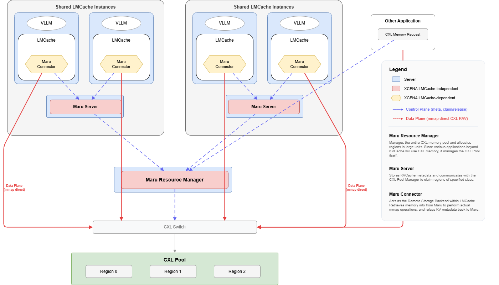
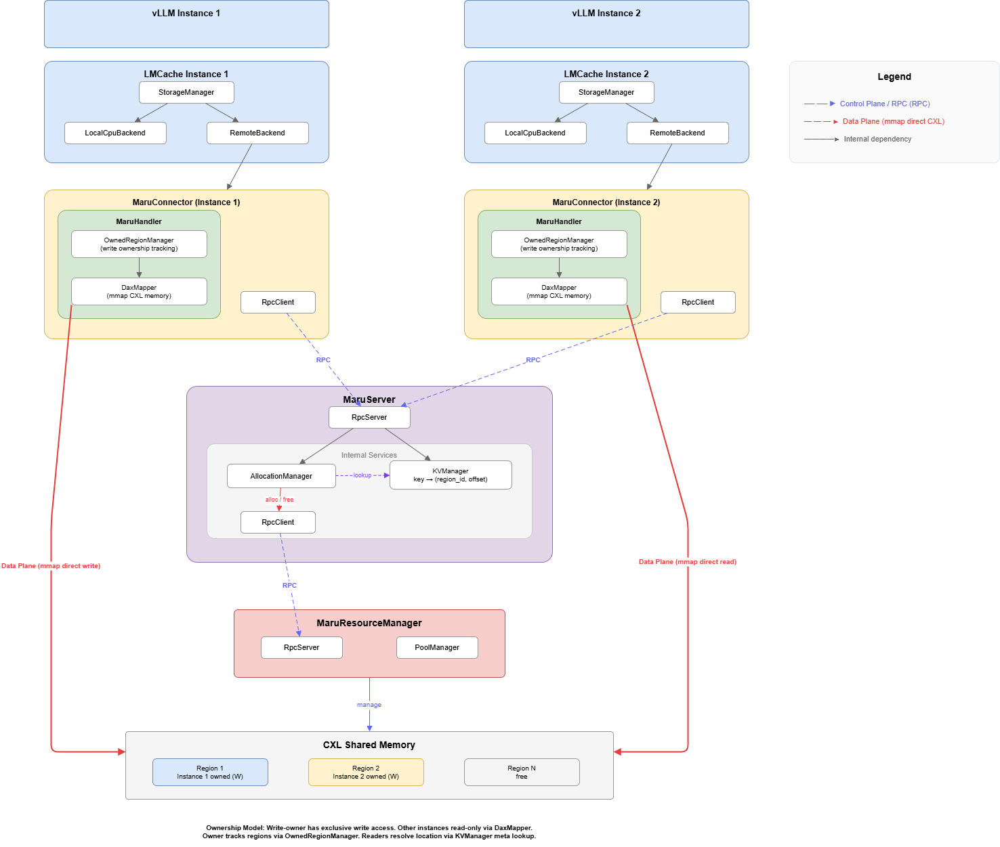
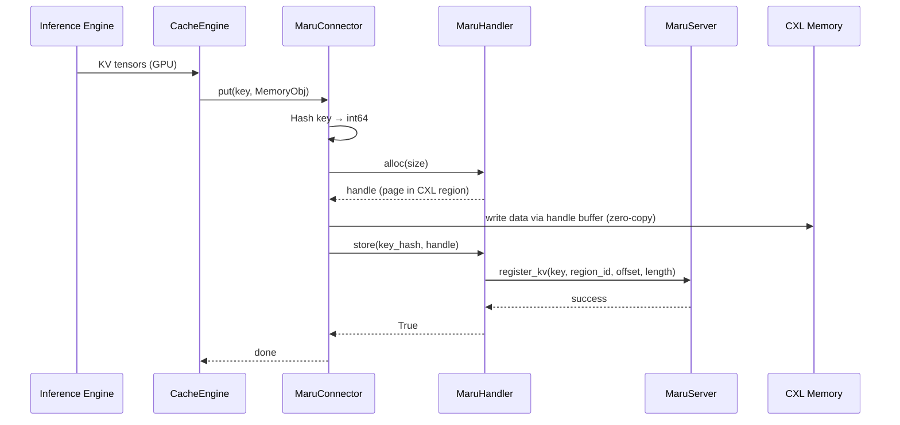
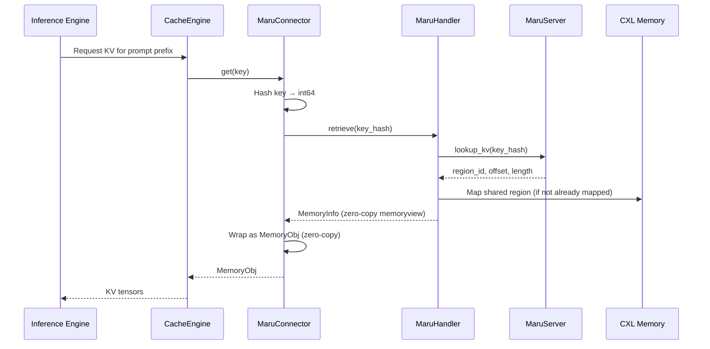
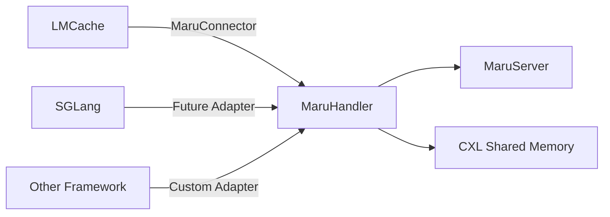

# LMCache Integration

## Integration Architecture

The full stack from inference engine to shared memory:

> **Control Plane** (dashed arrows) — metadata RPC: KV registration, region claim/release.
>
> **Data Plane** (solid arrows) — mmap direct CXL read/write, zero-copy.

### Component Architecture

**Layer responsibilities:**

| Layer | Responsibility | Scope |
|-------|---------------|-------|
| **LMCache stack** | Inference engine → CacheEngine → StorageManager → RemoteBackend | LMCache (external) |
| **MaruConnector** | Adapts LMCache's RemoteConnector to MaruHandler's API | Integration boundary |
| **MaruHandler** | Client-side KV operations, memory mapping, connection management | Maru client |
| **MaruServer** | Central metadata store, memory allocation coordinator | Maru server |

The **integration boundary** sits at MaruConnector. Everything above is LMCache;
everything below is Maru. MaruConnector is the only component that imports from
both projects.

## Connector Design

LMCache defines a `RemoteConnector` interface that all remote storage backends
must implement (`exists`, `get`, `put`, `close`, and batch variants). MaruConnector
implements this interface by delegating to MaruHandler.

**Why the connector pattern:** LMCache's RemoteBackend is designed for pluggable
storage. The same StorageManager can use Redis, S3, Mooncake, or Maru without
any change to the cache engine logic. MaruConnector slots in as one such plugin.

The key translation between the two APIs involves:

- **Key conversion** — LMCache uses structured `CacheEngineKey` objects; MaruHandler uses integer keys. The connector hashes LMCache keys via SHA-256 to produce 64-bit integer keys.
- **Zero-copy bridging** — MaruHandler returns `MemoryInfo` (a memoryview wrapper) which the connector wraps as LMCache's `MemoryObj` without copying data.
- **Batch optimization** — The connector maps LMCache's batch operations to MaruHandler's batch RPC calls, reducing round-trip overhead.

## Data Path

### Store Path (write)

When the inference engine produces new KV cache data:

### Retrieve Path (read)

When the inference engine needs cached KV data:

The key design point is that **data never travels over the network**. Only metadata
(region ID, offset, length) is exchanged via RPC. The actual KV tensor data is
accessed directly from CXL shared memory through memory-mapped regions.

## Configuration

MaruConnector accepts configuration through the LMCache YAML config file.
The `remote_url` field activates Maru as the remote backend (format: `maru://<host>:<port>`),
and fine-grained parameters can be set via `extra_config`.

For the complete parameter reference, see
[Configuration — LMCache Integration](../api_reference/config.md#lmcache-integration).
For runnable examples, see
[LMCache Examples](../getting_started/examples/lmcache/index.md).

## Extensibility

MaruHandler is designed to be **framework-independent**. It knows nothing about
LMCache, vLLM, or any specific inference engine. Its interface operates on
integer keys and memory views — a minimal, framework-neutral contract.

Any framework can integrate with Maru by writing a thin adapter layer that
converts framework-specific cache keys to integer hashes, uses the handler's
alloc/store API for zero-copy writes, and manages the handler's lifecycle.
MaruConnector serves as the reference implementation for this pattern — typically
under 200 lines of code.

> **See also:** [MaruHandler Design](../design_doc/maru_handler.md) — handler internals;
> [Architecture Overview](../design_doc/architecture_overview.md) — system-level design;
> [Python API Reference](../api_reference/api.md) — MaruHandler API;
> [Configuration Reference](../api_reference/config.md) — all config parameters
