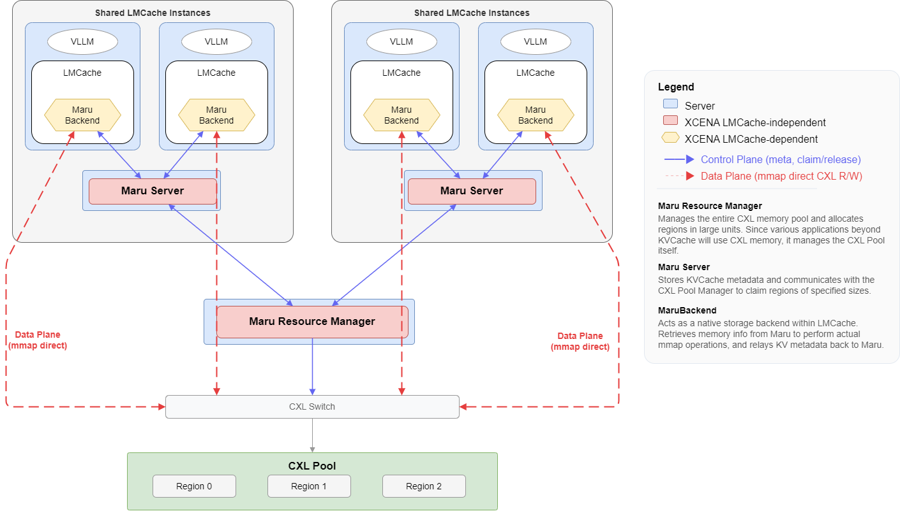
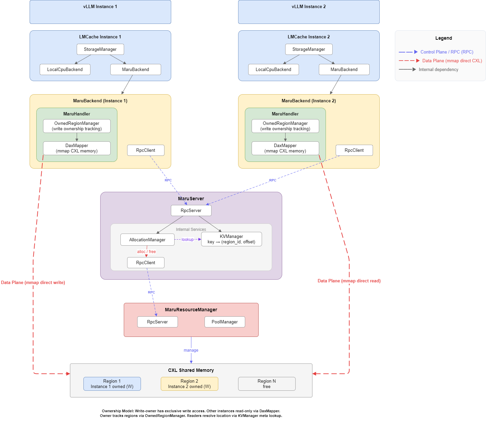
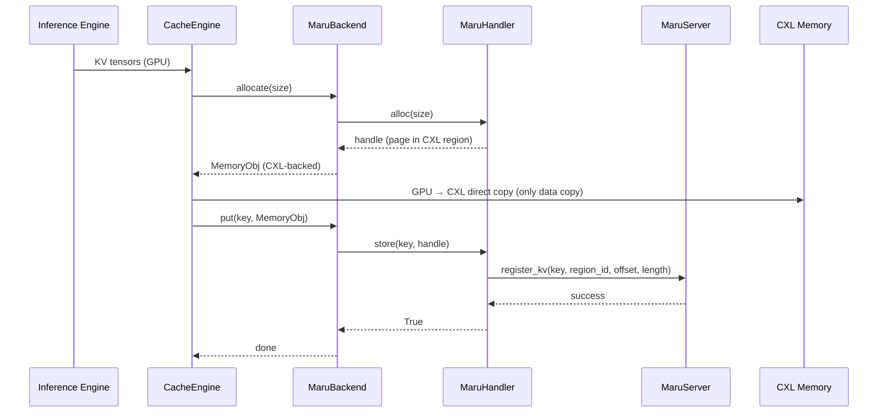
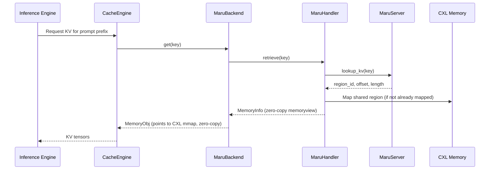

# LMCache

## Integration Architecture

The full stack from inference engine to shared memory:



> **Control Plane** (dashed arrows) — metadata RPC: KV registration, region claim/release.
>
> **Data Plane** (solid arrows) — mmap direct CXL read/write, zero-copy.

### Component Architecture



**Layer responsibilities:**

| Layer | Responsibility | Scope |
|-------|---------------|-------|
| **LMCache stack** | Inference engine → CacheEngine → StorageManager → MaruBackend | LMCache (external) |
| **MaruBackend** | LMCache `AllocatorBackendInterface` — allocates directly on CXL, async store, sync get | Integration boundary |
| **CxlMemoryAdapter** | LMCache `MemoryAllocatorInterface` — translates Maru pages to `TensorMemoryObj` pool | Integration boundary |
| **MaruHandler** | Client-side KV operations, memory mapping, connection management | Maru client |
| **MaruServer** | Central metadata store, memory allocation coordinator | Maru server |

The **integration boundary** sits at MaruBackend + CxlMemoryAdapter. Everything above is LMCache;
everything below is Maru. These two classes are the only components that import from both projects.

## Backend Design

### Two-layer integration

```
MaruBackend (AllocatorBackendInterface)
  ├── CxlMemoryAdapter (MemoryAllocatorInterface)
  │     ├── _pool: {region_id: [TensorMemoryObj per page]}
  │     └── address encoding: (rid << 32) | pid
  └── MaruHandler (Maru client)
        ├── RpcClient → MaruServer
        ├── DaxMapper (mmap management)
        └── OwnedRegionManager (page allocation)
```

**MaruHandler** manages CXL memory (regions, pages, mmap). **CxlMemoryAdapter** translates
pages into LMCache's `TensorMemoryObj` format.

## Data Path

### Store Path (write)

When the inference engine produces new KV cache data:



### Retrieve Path (read)

When the inference engine needs cached KV data:



The key design point is that **data never travels over the network**. Only metadata
(region ID, offset, length) is exchanged via RPC. The actual KV tensor data is
accessed directly from CXL shared memory through memory-mapped regions.

## Configuration

Maru is configured as a native LMCache storage backend via the `maru_path` and `maru_pool_size`
config fields. No plugin registration is needed.

```yaml
chunk_size: 256
local_cpu: False
max_local_cpu_size: 0
save_unfull_chunk: True

# Maru backend
maru_path: "maru://localhost:5555"
maru_pool_size: 4

extra_config:
  lookup_backoff_time: 0.001
  # maru_instance_id: "my-id"       # Unique client ID (default: auto UUID)
  # maru_timeout_ms: 5000           # ZMQ socket timeout (ms)
  # maru_use_async_rpc: true        # Async DEALER-ROUTER RPC
  # maru_max_inflight: 64           # Max in-flight async requests
  # maru_eager_map: true            # Pre-map shared regions on connect
```

### MaruBackend settings

| Field | Default | Description |
| --- | --- | --- |
| `maru_path` | (required) | MaruServer address. Format: `maru://<host>:<port>` |
| `maru_pool_size` | `4` | CXL memory pool size in GB |

### Maru extra_config parameters

| Parameter | Default | Description |
| --- | --- | --- |
| `maru_instance_id` | auto-generated UUID | Unique client instance identifier |
| `maru_timeout_ms` | `5000` | ZMQ socket timeout in milliseconds for RPC communication |
| `maru_use_async_rpc` | `true` | Use async DEALER-ROUTER pattern for higher throughput |
| `maru_max_inflight` | `64` | Max concurrent in-flight async RPC requests |
| `maru_eager_map` | `true` | Pre-map all shared regions on connect |

For runnable examples, see
[LMCache Examples](../getting_started/examples/lmcache/index.md).

> **See also:** [Architecture Overview](../design_doc/architecture_overview.md),
> [MaruHandler Design](../design_doc/maru_handler.md),
> [Python API Reference](../api_reference/api.md),
> [Configuration Reference](../api_reference/config.md)
