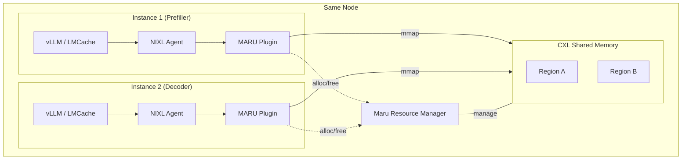

# NIXL Plugin

## Overview

Maru provides a [NIXL](https://github.com/ai-dynamo/nixl) transport backend plugin (`libplugin_MARU.so`) that exposes CXL shared memory as a NIXL-compatible transfer backend. This enables frameworks that already support NIXL — such as LMCache, vLLM, and SGLang — to share KV cache through CXL without any application code changes.

**When to use this plugin:**
- Multiple LLM inference instances on the **same node** need to share KV cache
- You want to leverage CXL shared memory bandwidth instead of network transfer
- Your deployment already uses NIXL for KV cache transfer (e.g., LMCache PD mode)

**How it works:** The plugin wraps `maru::handler::DaxMapper` to mmap CXL device memory into the process address space, then performs `std::memcpy` between user DRAM buffers and the CXL region. Multiple NIXL agents on the same node share the underlying CXL pool through the Maru Resource Manager daemon.



> Instance 1 writes KV data to CXL via `postXfer(WRITE)`. Instance 2 reads it via `postXfer(READ)`. Both access the same physical CXL memory — no network copy.

## Prerequisites

- **Maru Resource Manager** (`maru-resourced`) running and managing CXL DAX devices
- **maru-cpp** built (provides `libmaru_handler.a`, `libmaru_shm.a`, `libmaru_common.a`)
- **NIXL Python package** installed (`pip install nixl-cu12` or `pip install nixl`)
- **NIXL source tree** cloned from GitHub — the plugin requires NIXL C++ headers (`backend_engine.h`, etc.) which are **not** included in the pip package. Supported versions: **0.10.x** and **1.0.x**
- CXL DAX device (`/dev/dax*`) or emulation environment

> **Version matching is critical.** The NIXL source tree must match the installed pip package version. A mismatch causes ABI incompatibility — the plugin will silently fail to load or crash with vtable errors. Check your installed version with `pip show nixl-cu12` and checkout the matching tag:
>
> ```bash
> pip show nixl-cu12 | grep Version
> # Version: 1.0.0
>
> cd /path/to/nixl
> git checkout v1.0.0
> ```

## Build and Install

### Build the plugin

```bash
cd maru-cpp/bindings/nixl

# NIXL_ROOT: path to the NIXL source tree (cloned from GitHub, matching pip version)
# MARU_CPP_BUILD_DIR: path to maru-cpp build output (contains .a libraries)
cmake -B build \
  -DNIXL_ROOT=/path/to/nixl \
  -DMARU_CPP_BUILD_DIR=/path/to/maru-cpp/build

cmake --build build -j$(nproc)
```

The resulting `libplugin_MARU.so` is in `build/`.

> The build system auto-detects the NIXL version (0.10.x vs 1.0.x) from the source tree headers. No manual version flag is needed.
>
> If you see a warning about "NIXL runtime libraries not found", add `-DNIXL_LIB_DIR` pointing to the NIXL shared library directory. The CMake script auto-detects this from the `nixl_cu12` pip package, but manual override may be needed if the pip package is in a virtualenv:
>
> ```bash
> cmake -B build \
>   -DNIXL_ROOT=/path/to/nixl \
>   -DMARU_CPP_BUILD_DIR=/path/to/maru-cpp/build \
>   -DNIXL_LIB_DIR=$(python3 -c "import nixl_cu12, pathlib; print(pathlib.Path(nixl_cu12.__file__).parent.parent / '.nixl_cu12.mesonpy.libs')")
> ```

### Install

Place the plugin where NIXL can find it. The plugin directory is inside the pip-installed `nixl_cu12` package:

```bash
# Find the NIXL plugin directory
NIXL_PLUGIN_DIR=$(python3 -c "
import nixl_cu12, pathlib
print(pathlib.Path(nixl_cu12.__file__).parent.parent / '.nixl_cu12.mesonpy.libs/plugins')
")

# Option 1: Symlink (recommended for development)
ln -sf $(pwd)/build/libplugin_MARU.so $NIXL_PLUGIN_DIR/libplugin_MARU.so

# Option 2: Copy
cp build/libplugin_MARU.so $NIXL_PLUGIN_DIR/

# Option 3: Set NIXL_PLUGIN_DIR to a custom path
export NIXL_PLUGIN_DIR=/path/to/plugins
cp build/libplugin_MARU.so $NIXL_PLUGIN_DIR/
```

> **Note:** If the `nixl` package (non-CUDA variant) is installed instead of `nixl_cu12`, replace `nixl_cu12` with `nixl` and `.nixl_cu12.mesonpy.libs` with `.nixl.mesonpy.libs` in the paths above.

### Verify

```python
from nixl._api import nixl_agent

agent = nixl_agent("test")
plugins = agent.get_plugin_list()
assert "MARU" in plugins, f"MARU plugin not found. Available: {plugins}"
print("MARU plugin loaded successfully")
```

## Plugin Capabilities

| Feature | Value |
|---------|-------|
| Supported memory types | `DRAM_SEG` |
| Local transfers (same agent) | Yes |
| Remote transfers (cross-agent, same node) | Yes |
| Notifications (UDS) | Yes |
| Auto-allocate CXL on `registerMem` | Yes (when `metaInfo` is empty) |

## Usage with LMCache

LMCache's disaggregated prefill (PD) mode uses NIXL for KV cache transfer between prefiller and decoder. Replace `UCX` with `MARU` to route transfers through CXL shared memory.

### Prefiller config

```yaml
chunk_size: 256
local_cpu: False
save_unfull_chunk: True

enable_pd: True
transfer_channel: "nixl"
pd_role: "sender"
pd_proxy_host: "localhost"
pd_proxy_port: 7500
pd_buffer_size: 1073741824    # 1 GB
pd_buffer_device: "cpu"       # MARU requires DRAM_SEG
nixl_backends: [MARU]         # Use MARU instead of UCX

extra_config:
  nixl_backend_params:
    socket_path: "/run/maru-resourced/maru-resourced.sock"
```

### Decoder config

```yaml
chunk_size: 256
local_cpu: False
save_unfull_chunk: True

enable_pd: True
transfer_channel: "nixl"
pd_role: "receiver"
pd_peer_host: "localhost"
pd_peer_init_port: 7300
pd_peer_alloc_port: 7400
pd_buffer_size: 2147483648    # 2 GB
pd_buffer_device: "cpu"       # MARU requires DRAM_SEG
nixl_backends: [MARU]         # Use MARU instead of UCX

extra_config:
  nixl_backend_params:
    socket_path: "/run/maru-resourced/maru-resourced.sock"
```

> **Note:** `pd_buffer_device` must be `"cpu"` because the MARU plugin operates on `DRAM_SEG`. GPU KV data must be staged through a CPU buffer before CXL transfer.

### Launch

```bash
# Terminal 1: Start Maru Resource Manager (if not running via systemd)
sudo maru-resourced

# Terminal 2: Prefiller
LMCACHE_CONFIG_FILE=prefiller.yaml python3 -m vllm.entrypoints.openai.api_server \
    --model <model> --port 8100

# Terminal 3: Decoder
LMCACHE_CONFIG_FILE=decoder.yaml python3 -m vllm.entrypoints.openai.api_server \
    --model <model> --port 8200
```

## Usage with vLLM

vLLM's disaggregated prefill uses NIXL internally via `NixlConnector`. The MARU plugin is discovered automatically if installed in the NIXL plugin directory.

To use MARU as the transport backend, configure the NIXL agent to prefer the MARU backend:

```bash
# Ensure the plugin is installed
ls $NIXL_PLUGIN_DIR/libplugin_MARU.so

# Launch vLLM — NixlConnector will discover MARU automatically
vllm serve <model> \
    --kv-transfer-config '{
        "kv_connector": "NixlConnector",
        "kv_role": "kv_both",
        "kv_connector_extra_config": {}
    }'
```

> **Note:** vLLM's `NixlConnector` currently selects backends based on memory type. Since MARU registers as `DRAM_SEG`, it will be used for CPU-buffered transfers. For GPU-direct transfers, UCX is still used. The two can coexist.

## Usage with SGLang

SGLang can use the MARU NIXL plugin through its NIXL-based transfer layer. Configure the backend via SGLang's disaggregated serving:

```bash
# Ensure the plugin is installed
ls $NIXL_PLUGIN_DIR/libplugin_MARU.so

# SGLang will discover MARU via NIXL agent's plugin discovery
python3 -m sglang.launch_server \
    --model <model> \
    --disagg-mode prefill \
    --disagg-transfer-backend nixl
```

## Configuration

### Plugin Parameters

The MARU plugin accepts parameters via NIXL's backend initialization:

| Parameter | Default | Description |
|-----------|---------|-------------|
| `socket_path` | `/run/maru-resourced/maru-resourced.sock` | Path to Maru Resource Manager UDS socket |

### Memory Registration

The plugin supports two registration modes:

1. **Explicit Handle** — Caller provides a 32-byte `Handle_t` in `metaInfo`:

   ```
   metaInfo = [regionId(8B) | offset(8B) | length(8B) | authToken(8B)]
   ```

2. **Auto-allocate** — `metaInfo` is empty; the plugin allocates CXL memory via `ShmClient::alloc()` and frees it on `deregisterMem()`.

### Notification Channel

Each agent creates a UDS listener at `/tmp/nixl-maru-<agent_name>.sock` for cross-agent notifications. Connection info is exchanged via `getConnInfo()` / `loadRemoteConnInfo()`.

## Troubleshooting

### Plugin Not Found

```
AssertionError: MARU plugin not found. Available: ['UCX', 'POSIX']
```

Verify `libplugin_MARU.so` is in the NIXL plugin directory:

```bash
# Check where NIXL looks for plugins
python3 -c "
import nixl_cu12, pathlib
p = pathlib.Path(nixl_cu12.__file__).parent.parent / '.nixl_cu12.mesonpy.libs/plugins'
print(f'Plugin dir: {p}')
import os
for f in os.listdir(p):
    if 'plugin' in f.lower():
        print(f'  {f}')
"
```

If the plugin file is present but still not discovered, this is likely an **ABI mismatch** — see the ABI Mismatch section below.

### Plugin Load Failure (undefined symbol)

```
dlopen failed: undefined symbol: _ZN12nixlDescListI...
```

The plugin requires NIXL runtime libraries (`libnixl_build.so`, `libnixl_common.so`). Rebuild with `-DNIXL_LIB_DIR` pointing to the NIXL library directory:

```bash
cmake -B build \
  -DNIXL_ROOT=/path/to/nixl \
  -DNIXL_LIB_DIR=$(python3 -c "import nixl_cu12, pathlib; print(pathlib.Path(nixl_cu12.__file__).parent.parent / '.nixl_cu12.mesonpy.libs')")
```

### Abseil Log Output Missing

If the plugin loads but produces no log output, check for abseil dual-link:

```bash
ldd build/libplugin_MARU.so | grep absl
```

There should be **no** abseil entries. Abseil symbols must come from `libnixl_common.so` at runtime, not from static linking in the plugin. If you see abseil, rebuild without static abseil linking.

### registerMem Failure

```
MARU: registerMem: ShmClient::alloc(...) failed
```

The Maru Resource Manager is unreachable or has no free CXL memory. Check:

```bash
# Is the daemon running?
systemctl status maru-resourced

# Is the socket accessible?
ls -la /run/maru-resourced/maru-resourced.sock
```

### ABI Mismatch (plugin silently not loaded, or vtable errors)

```
pure virtual method called
```

Or the plugin file exists in the plugins directory but `get_plugin_list()` doesn't include `"MARU"`.

This means the NIXL source headers used to build the plugin don't match the installed NIXL pip package. The plugin's vtable layout diverges from what the runtime expects, so NIXL silently rejects it.

**Fix:** Match the NIXL source tag to the pip package version:

```bash
# Check installed version
pip show nixl-cu12 | grep Version
# Version: 1.0.0

# Checkout matching tag
cd /path/to/nixl
git fetch --tags
git checkout v1.0.0   # Must match pip version exactly

# Rebuild the plugin
cd /path/to/maru-cpp/bindings/nixl
rm -rf build
cmake -B build -DNIXL_ROOT=/path/to/nixl ...
cmake --build build -j$(nproc)
```

> **See also:** [Architecture Overview](../design_doc/architecture_overview.md),
> [LMCache Integration](./lmcache.md),
> [vLLM Integration](./vllm.md),
> [SGLang Integration](./sglang.md)
