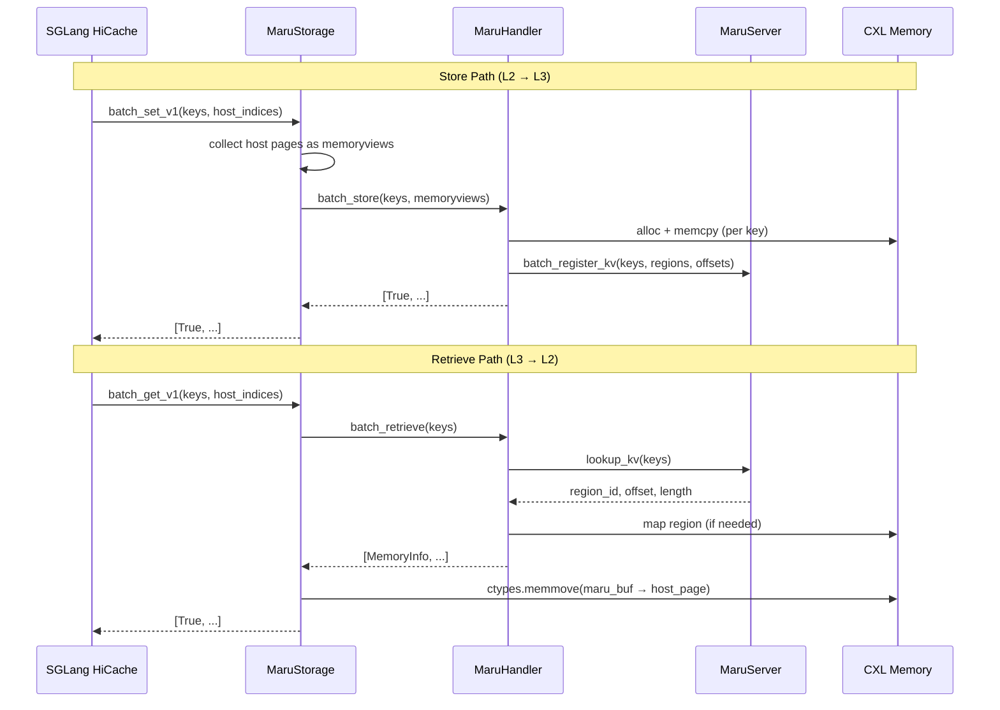

# SGLang Integration

## Overview

Maru integrates with SGLang's **Hierarchical Cache (HiCache)** as an L3 storage
backend. HiCache organizes KV cache in three tiers:

| Tier | Storage | Managed by |
|------|---------|------------|
| L1 | GPU VRAM | SGLang |
| L2 | Host DRAM | SGLang |
| **L3** | **CXL Shared Memory** | **Maru** |

When GPU memory pressure triggers eviction, KV pages flow down: L1 → L2 → L3.
On cache hit, pages flow back up.  Because Maru's L3 is shared memory, **all
SGLang instances on the same node can read each other's KV cache** — enabling
P2P sharing without network transfer.

## Prerequisites

1. **SGLang ≥ v0.5.6** — required for dynamic storage backend and v1 API.

   An additional fix is **required** for L3 store to work:
   - **Write-through idle fix** — without this, write-through events are not
     processed when the scheduler is idle, so KV pages never reach L3 storage.
     Merged to main as [`079a1fd`](https://github.com/sgl-project/sglang/commit/079a1fd)
     ([#20560](https://github.com/sgl-project/sglang/pull/20560)).
     Install from main or any release that includes it.

2. **Maru** — install with SGLang extras:
   ```bash
   cd maru/
   pip install -e ".[sglang]"
   ```

3. **MaruServer** running (for Maru CXL mode):
   ```bash
   maru-server --port 5555
   ```

## Configuration

SGLang loads Maru via the `--hicache-storage-backend dynamic` flag. All Maru
settings are passed through `--hicache-storage-backend-extra-config` as a JSON
string with `maru_`-prefixed keys.

```bash
sglang serve \
    --model-path Qwen/Qwen2.5-7B \
    --enable-hierarchical-cache \
    --hicache-ratio 2.0 \
    --hicache-write-policy write_through \
    --hicache-mem-layout page_first_direct \
    --hicache-storage-backend dynamic \
    --hicache-storage-backend-extra-config '{
        "backend_name": "maru",
        "module_path": "maru_sglang.maru_storage",
        "class_name": "MaruStorage",
        "interface_v1": 1,
        "maru_server_url": "tcp://localhost:5555",
        "maru_pool_size": "4G"
    }'
```

> **Important:** `interface_v1` must be set to `1` for the zero-copy V1 path
> (`batch_get_v1`/`batch_set_v1`) to be used. Without it, SGLang falls back to
> the legacy API which does not support `page_first_direct` layout.

### HiCache parameters

| Parameter | Description |
|-----------|-------------|
| `--enable-hierarchical-cache` | Enable the HiCache system |
| `--hicache-ratio 2.0` | Host cache = 2× GPU cache size |
| `--hicache-write-policy write_through` | Persist to L3 on cache hit |
| `--hicache-mem-layout page_first_direct` | Memory layout for zero-copy (auto-switches `io_backend` to `direct`) |
| `--hicache-storage-backend dynamic` | Load backend class dynamically |

### Maru extra-config parameters

| Parameter | Default | Description |
|-----------|---------|-------------|
| `interface_v1` | `0` | Set to `1` to enable V1 zero-copy API (required for `page_first_direct`) |
| `maru_server_url` | `tcp://localhost:5555` | MaruServer address |
| `maru_pool_size` | `4G` | CXL shared memory pool size (`"4G"`, `"500M"`, etc.) |
| `maru_chunk_size_bytes` | `1M` | Chunk size for memory allocation |
| `maru_instance_id` | auto UUID | Unique client instance identifier |
| `maru_timeout_ms` | `2000` | ZMQ socket timeout (ms) |
| `maru_use_async_rpc` | `true` | Async DEALER-ROUTER RPC |
| `maru_max_inflight` | `64` | Max concurrent in-flight async requests |
| `maru_eager_map` | `true` | Pre-map all shared regions on connect |

## Integration Architecture



The V1 API uses `batch_store` / `batch_retrieve` for single-RPC batch
operations.  For MLA models (1 chunk/key), host pages are passed as
zero-copy memoryviews.  For non-MLA models (K+V in separate buffer pools),
pages are concatenated into an owned buffer before passing to `batch_store`.

## Quick Start: Single Instance

```bash
cd examples/sglang/single/

# Start MaruServer + SGLang (Ctrl-C to stop)
bash single_example.sh

# In another terminal:
bash run_simple_query.sh
bash run_benchmark.sh
```

See [examples/sglang/single/README.md](../../../examples/sglang/single/README.md)
for details.

## P2P Sharing: Two Instances

```bash
cd examples/sglang/p2p_sharing/

# Start MaruServer + 2 SGLang instances (Ctrl-C to stop)
bash p2p_example.sh

# In another terminal:
bash run_simple_query.sh  # Send query to inst1, then inst2 (cache hit check)
bash run_benchmark.sh     # TTFT measurement
```

**Success criteria:**
- Instance 2 logs show `batch_get_v1 result: N/N hits` (100% cache hit)
- Benchmark reports TTFT speedup > 1.5×

See [examples/sglang/p2p_sharing/README.md](../../../examples/sglang/p2p_sharing/README.md)
for details on the write-through flush mechanism.

## Troubleshooting

| Symptom | Cause | Fix |
|---------|-------|-----|
| `RuntimeError: Failed to connect MaruHandler` | MaruServer not running | Start `maru-server --port 5555` |
| No cache hits on Instance 2 | Write-through not flushed | Send two queries to Instance 1 first (hit-count threshold) and wait ~3s |
| `ImportError: maru_sglang` | Package not installed | Run `pip install -e .` from `maru/` root |
| Low TTFT speedup (< 1.5×) | Prompt too short for meaningful prefill savings | Use longer prompts (> 500 tokens) |

> **See also:** [Architecture Overview](../design_doc/architecture_overview.md),
> [LMCache Integration](lmcache.md),
> [Python API Reference](../api_reference/api.md)
