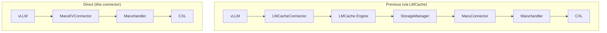
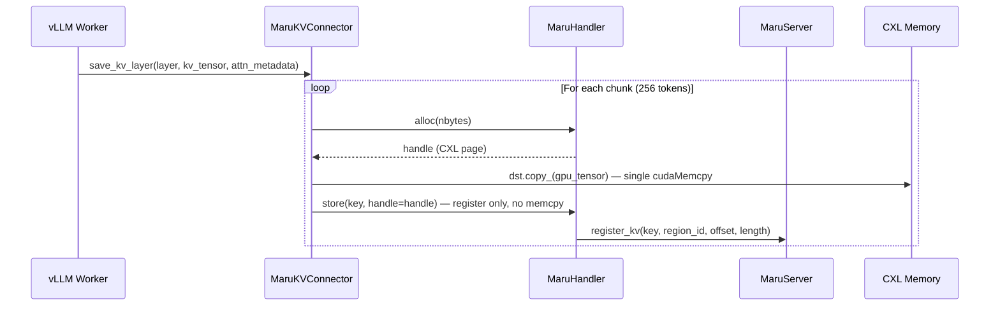
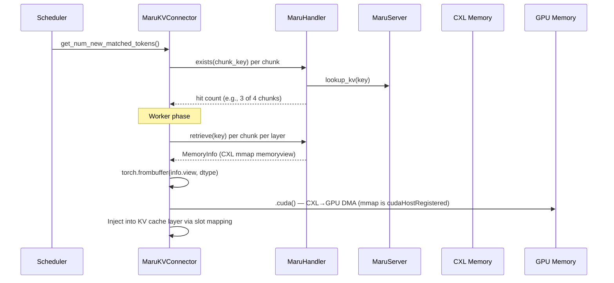

# vLLM Integration

## Integration Architecture

MaruKVConnector is a native vLLM KV connector that enables direct KV cache sharing
between vLLM instances through CXL shared memory — **without any middleware**.



By removing the LMCache middleware layer, the direct connector achieves:

- **Fewer dependencies** — only vLLM + Maru
- **Zero-copy save path** — GPU → CXL via single `cudaMemcpy` (no intermediate CPU buffer)
- **Zero-copy load path** — CXL mmap (CUDA pinned) → GPU via DMA
- **No serialization overhead** — raw tensor bytes, no `MemoryObj` conversion

### Component Roles

MaruKVConnector implements vLLM's `KVConnectorBase_V1` interface with a dual-role design:

| Role | Component | Responsibility |
|------|-----------|----------------|
| **SCHEDULER** | `MaruSchedulerConnector` | Checks chunk-by-chunk which prefix is cached; builds metadata for worker |
| **WORKER** | `MaruWorkerConnector` | Performs actual GPU ↔ CXL data transfers per chunk per layer |

Both roles share the same `MaruHandler` connection to CXL shared memory.

## Data Path

### Store Path (GPU → CXL)

When a vLLM instance completes prefill, the connector stores KV cache in chunks:



The save path uses `handler.alloc()` to get a pre-mapped CXL buffer, then copies GPU tensor
data directly into it via `torch.Tensor.copy_()`. The subsequent `store(handle=)` call
only registers the key in the metadata server — no additional data copy occurs.

### Load Path (CXL → GPU)

When a second instance receives a request with a matching prefix:



The CXL mmap region is already registered with `cudaHostRegister` by MaruHandler's
DaxMapper, so `.cuda()` triggers a direct DMA transfer from CXL to GPU memory
without any intermediate CPU copy.

### Chunk-Based Storage

Tokens are divided into fixed-size chunks (default 256 tokens) for storage:

```
Prompt: [tok0..tok255 | tok256..tok511 | tok512..tok767 | tok768..tok900]
         chunk 0        chunk 1          chunk 2          (incomplete, not stored)
```

Each chunk key = `kv_{hash(tok0..end)}_L{layer}` — a rolling prefix hash that
encodes the full context up to that chunk, enabling partial prefix reuse.

### Partial Prefix Reuse

```
Instance A:
  Request: "The quick brown fox jumps over the lazy dog. Once upon a time..."
  → Stores chunk 0, 1, 2

Instance B:
  Request: "The quick brown fox jumps over the lazy dog. In a galaxy far away..."
  → chunk 0, 1 hit (common prefix), chunk 2 miss
  → Loads chunk 0, 1 from CXL, computes the rest
```

## Setup

### Prerequisites

1. **Maru installed** (includes maru-server, maru-resourced)
2. **vLLM v0.14+** (KVConnectorBase_V1 support)
3. **CXL DAX device** with `maru-resourced` daemon running

### Installation

```bash
cd /path/to/maru
pip install -e .
```

### Launch

**Start Maru server:**

```bash
maru-server
# Listens on tcp://0.0.0.0:5555 by default
```

**Launch vLLM with MaruKVConnector (dynamic loading):**

```bash
vllm serve <model> \
    --kv-transfer-config '{
        "kv_connector": "MaruKVConnector",
        "kv_connector_module_path": "maru_vllm",
        "kv_role": "kv_both",
        "kv_connector_extra_config": {
            "maru_server_url": "tcp://localhost:5555",
            "maru_pool_size": "4G"
        }
    }'
```

The `kv_connector_module_path` tells vLLM to dynamically import `MaruKVConnector`
from the `maru_vllm` package. No vLLM source code changes are required.

**Second instance (same node):**

```bash
vllm serve <model> \
    --port 8001 \
    --kv-transfer-config '{
        "kv_connector": "MaruKVConnector",
        "kv_connector_module_path": "maru_vllm",
        "kv_role": "kv_both",
        "kv_connector_extra_config": {
            "maru_server_url": "tcp://localhost:5555",
            "maru_pool_size": "4G"
        }
    }'
```

## Configuration

Settings in `kv_connector_extra_config`:

| Parameter | Type | Default | Description |
|-----------|------|---------|-------------|
| `maru_server_url` | str | `tcp://localhost:5555` | MaruServer address |
| `maru_pool_size` | str/int | `1G` | CXL memory pool size (`4G`, `500M`, etc.) |
| `maru_chunk_size` | str/int | `4M` | Maru page size (CXL allocation unit) |
| `maru_instance_id` | str | auto | Unique instance ID (default: auto-generated UUID) |
| `maru_eager_map` | bool | `true` | Pre-map other instances' CXL regions on connect |
| `maru_kv_chunk_tokens` | int | `256` | KV cache chunk granularity (in tokens) |

### maru_kv_chunk_tokens

Controls how many tokens per chunk when storing KV cache:

- **Smaller** (64, 128): Finer prefix reuse granularity, more maru keys
- **Larger** (512, 1024): Fewer keys, but coarser reuse granularity
- **Default 256**: Good balance for most use cases
- **Auto-aligned**: Automatically adjusted to a multiple of vLLM `block_size`

### maru_pool_size

CXL memory allocated per instance. Capacity estimation:

```
pool_size ≈ num_layers × kv_head_dim × num_kv_heads × 2(K+V) × max_cached_tokens × dtype_bytes
```

Example (Llama 7B, fp16):
```
32 layers × 128 head_dim × 32 heads × 2(K+V) × 4096 tokens × 2 bytes ≈ 2GB
```

## Comparison with LMCache Path

| Aspect | Via LMCache | Direct (this connector) |
|--------|-------------|------------------------|
| Dependencies | vLLM + LMCache + maru | vLLM + maru |
| Middleware | LMCache Engine, StorageManager, RemoteBackend | None |
| Serialization | LMCache MemoryObj conversion | torch tensor ↔ bytes direct |
| Prefix matching | LMCache CacheEngineKey hashing | vLLM token prefix hashing |
| Configuration | LMCACHE_CONFIG_FILE YAML | kv_connector_extra_config JSON |
| Save path | GPU → CPU → bytes → alloc + memcpy → CXL | GPU → CXL (single DMA via alloc) |
| Load path | CXL → clone → CPU → GPU | CXL → GPU (single DMA, pinned) |

## Troubleshooting

### MaruServer Connection Failure

```
ERROR: Failed to connect to MaruServer at tcp://localhost:5555
```

Verify `maru-server` is running and accessible.

### CXL Memory Exhausted

```
ERROR: Cannot allocate page for key ...
```

Increase `maru_pool_size` or restart maru-server to free memory.

### chunk_tokens Alignment Warning

```
WARNING: maru_kv_chunk_tokens 300 not aligned to block_size 16, adjusted to 288
```

Normal behavior. Automatically adjusted to a multiple of vLLM's block_size.

### BFloat16 Store Errors

The connector uses `torch.untyped_storage()` to bypass numpy's lack of bfloat16 support.
Ensure you have the latest `maru_vllm/connector.py`.

### Garbage Output on Second Instance

KV cache data corruption usually means chunks were concatenated as 1D bytes
instead of being injected per-chunk. Ensure per-chunk injection is used
(the current connector handles this correctly).

For runnable examples, see
[vLLM Examples](../getting_started/examples/vllm/index.md).

> **See also:** [Architecture Overview](../design_doc/architecture_overview.md),
> [MaruHandler Design](../design_doc/maru_handler.md),
> [LMCache Integration](./lmcache.md)
