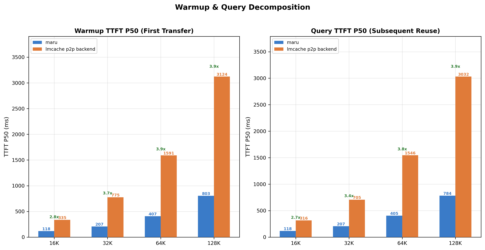
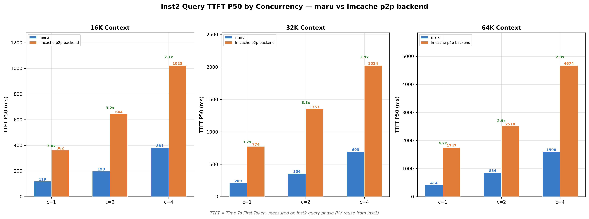
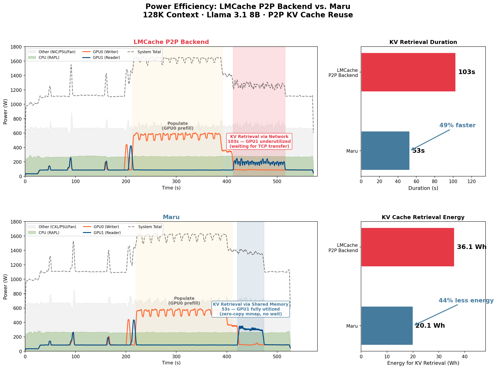

# TTFT and Power Efficiency Comparison with LMCache P2P Backend

## Overview

We evaluated MARU against the existing LMCache p2p backend in order to understand the performance impact of different remote KV storage paths.

The primary difference between the two approaches lies in how KV cache data is accessed and transferred. The LMCache p2p backend relies on CPU DRAM and network-based data transfer, whereas MARU leverages CXL-attached memory together with the MARU meta server to manage remote KV access. As a result, the two systems differ mainly in the memory tier used for KV storage and the data transfer path involved in retrieving cached KV blocks.


*Figure 1: TTFT (P50) comparison between MARU and the LMCache p2p backend across context sizes during warmup (first KV transfer) and query (KV reuse). MARU consistently achieves lower latency, with larger gains for bigger KV cache sizes.*

Figure 1 shows the TTFT (Time To First Token) P50 during the warmup phase (first KV transfer) and the query phase (subsequent KV reuse). Across all context sizes, MARU consistently achieves lower TTFT compared to the p2p backend. The gap becomes increasingly pronounced as the context size grows, indicating that the MARU remote connector handles larger KV transfers more efficiently.

## Concurrency Scaling


*Figure 2: Cache-hit TTFT (P50) under different concurrency levels. MARU maintains 2.7×–4.2× lower latency compared to the LMCache p2p backend while scaling to higher request concurrency.*

To further evaluate scalability, we measured cache-hit TTFT under different concurrency levels (Figure 2). Even as concurrency increases, MARU maintains significantly lower latency. Depending on the context size and concurrency level, MARU reduces TTFT by approximately **2.7×–4.2×** compared to the p2p backend.

These results suggest that reducing CPU-mediated network transfers and utilizing CXL-backed remote memory can significantly improve KV cache reuse latency. In particular, MARU demonstrates better scaling behavior as both context size and request concurrency increase, making it well-suited for high-throughput inference workloads with large KV cache footprints.

## Power Efficiency


*Figure 3: System-level power traces during P2P KV cache reuse (128K context). The LMCache p2p backend exhibits a prolonged KV retrieval phase (103s) with low GPU utilization, while MARU completes retrieval in 53s with higher GPU utilization throughout.*

Figure 3 compares the full power timeline for both backends during a 128K-context P2P benchmark. The populate phase (where GPU0 performs prefill and stores KV cache) is nearly identical in both duration and power draw, confirming that the two systems share the same computation workload.

The key difference emerges during the KV retrieval phase: the LMCache p2p backend requires 103 seconds for GPU1 to retrieve cached KV blocks over the network, during which GPU1 remains largely underutilized — waiting on data transfer rather than performing useful computation.

In contrast, MARU completes retrieval in 53 seconds, a 49% reduction, because GPU1 can access KV data directly from CXL shared memory via zero-copy mmap without network round-trips.

Notably, MARU draws slightly higher instantaneous power during retrieval (1,365W vs. 1,260W), which reflects higher GPU utilization — the GPU is actively computing rather than idling on network transfers. Despite the higher power draw, MARU consumes 44% less total energy for KV retrieval (20.1 Wh vs. 36.1 Wh), as the shorter retrieval time more than compensates for the increased power.

This has a direct implication for serving efficiency: by completing KV retrieval in roughly half the time, MARU frees GPU cycles sooner, allowing the system to begin processing subsequent requests earlier. In high-concurrency deployments, this means higher effective throughput — the GPU spends less time stalled on data movement and more time on useful inference computation.

## Energy Efficiency

| Length | Recompute | MARU | LMCache P2P | MARU / LMCache P2P |
|--------|-----------|------|-------------|---------------------|
| 16K    | 19.7      | 59.8 | 50.7        | 1.18                |
| 32K    | 22        | 101.2| 73.2        | 1.38                |
| 64K    | 18.2      | 130.5| 83          | 1.57                |
| 128K   | 13.6      | 173.7| 121.7       | 1.43                |

*Table 1: Tokens / Joule (active energy) at 128K. MARU can generate 18~43% more tokens using the same amount of active energy than LMCache p2p backend.*

Both MARU and the LMCache p2p backend become more energy-efficient as context size grows — MARU rises from 59.8 to 173.7 tokens/J and the p2p backend from 50.7 to 121.7 — because the energy overhead of KV transfer scales sublinearly relative to context length. This contrasts with recompute, which becomes less efficient at larger contexts (19.7 → 13.6 tokens/J) due to linearly increasing computation cost. Notably, MARU's efficiency advantage over the p2p backend widens with context size, peaking at 1.57× for 64K before slightly relaxing to 1.43× at 128K, indicating that the zero-copy CXL path benefits most when large KV transfers would otherwise bottleneck on CPU-mediated network I/O.

---

## Benchmark Setup

### Hardware Configuration

- **GPU**: NVIDIA RTX PRO 6000 (96GB) × 2
- **CPU**: AMD EPYC 9555 64-Core × 2 (128 threads)
- **DRAM**: 756 GB DDR5 DRAM
- **CXL Memory**: 6× CXL Type-3 Memory Expander (229 GB each, 1,374 GB total)
- **Topology**:
  - Single-node
  - 2 GPUs on separate NUMA nodes (GPU0→NUMA0, GPU1→NUMA1)
  - PCIe Gen5 x16
- **Transfer**: Cross-Node NIXL TCP (UCX_TLS=cuda_ipc,cuda_copy,tcp)

### Software

- **Model**: Meta-Llama/Llama-3.1-8B-Instruct (TP=1)
- **vLLM Version**: 0.13.0+cu128
- **LMCache Version**: 0.3.13.dev97
- **NIXL Version**: 0.10.1
- **Transfer Methods**:
  - **MARU**:
    - CXL shared memory pool (200 GB, /dev/dax)
    - Zero-copy mmap between vLLM instances via maru_meta_server
  - **LMCache P2P backend (NIXL)**:
    - UCX transport (cuda_ipc,cuda_copy,tcp) over TCP loopback
    - CPU DRAM storage (200 GB)
- **OS**: Ubuntu 24.04.3 LTS, Kernel 6.17.0-14-generic
- **CUDA**: 12.8.0, Driver 580.126.09

### Data

- **Dataset**: LV-Eval: A Balanced Long-Context Benchmark with 5 Length Levels Up to 256K

### vLLM Configuration

**vLLM Instance 1**

```bash
PYTHONHASHSEED=123 \
UCX_TLS=cuda_ipc,cuda_copy,tcp \
CUDA_VISIBLE_DEVICES=0 \
LMCACHE_CONFIG_FILE=/tmp/p2p_inst1_{nixl|maru}.yaml \
vllm serve meta-llama/Llama-3.1-8B-Instruct \
--port 6010 \
--gpu-memory-utilization 0.85 \
--trust-remote-code \
--disable-log-requests \
--no-enable-prefix-caching \
--kv-transfer-config '{"kv_connector":"LMCacheConnectorV1","kv_role":"kv_both"}'
```

**vLLM Instance 2**

```bash
PYTHONHASHSEED=123 \
UCX_TLS=cuda_ipc,cuda_copy,tcp \
CUDA_VISIBLE_DEVICES=1 \
LMCACHE_CONFIG_FILE=/tmp/p2p_inst2_{nixl|maru}.yaml \
vllm serve meta-llama/Llama-3.1-8B-Instruct \
--port 6020 \
--gpu-memory-utilization 0.85 \
--trust-remote-code \
--disable-log-requests \
--no-enable-prefix-caching \
--kv-transfer-config '{"kv_connector":"LMCacheConnectorV1","kv_role":"kv_both"}'
```

### LMCache Configuration

**NIXL P2P**

```yaml
chunk_size: 256
local_cpu: true
max_local_cpu_size: 64.0          # per-instance DRAM (GB)
use_layerwise: False
enable_async_loading: true

# P2P
enable_p2p: true
p2p_host: "localhost"
transfer_channel: "nixl"

# Controller
enable_controller: true
lmcache_instance_id: "lmcache_instance_{1|2}"

extra_config:
lookup_backoff_time: 0.001
p2p_socket_recv_timeout_ms: 30000
p2p_socket_send_timeout_ms: 10000
use_cxl: false
```

**Maru P2P**

```yaml
chunk_size: 256
local_cpu: true
max_local_cpu_size: 64.0          # DRAM scratch buffer
use_layerwise: true
enable_async_loading: true

# P2P/Controller disabled (Maru uses shared storage)
enable_p2p: false
enable_controller: false

# Maru remote backend
remote_url: "maru://localhost:6555?pool_size=64G"
remote_serde: "naive"

extra_config:
  save_chunk_meta: false
```
