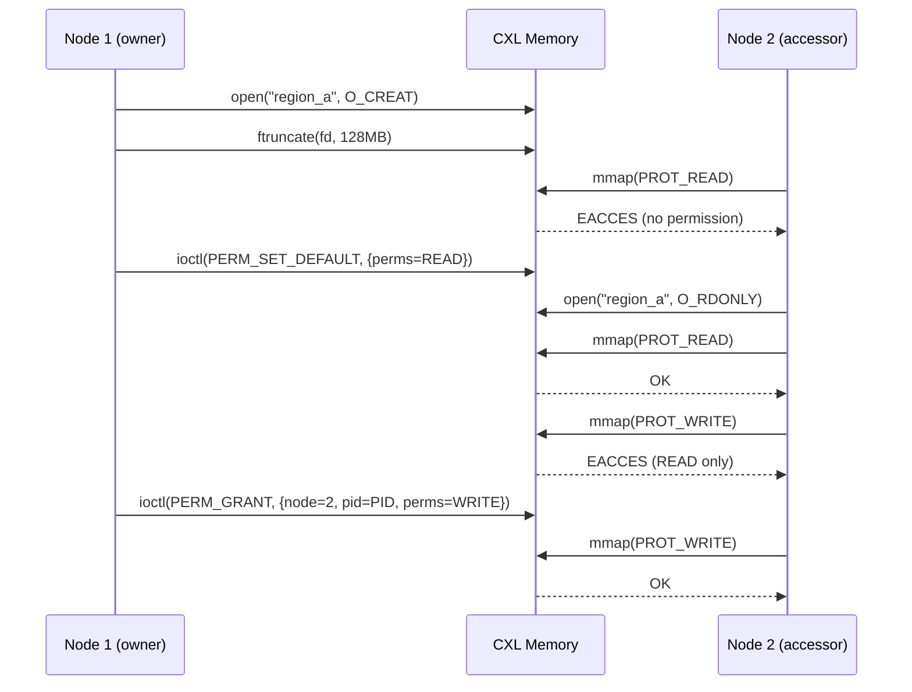

# marufs kernel module

Linux kernel filesystem module for CXL shared memory. Provides per-region access control via VFS.

## Build & Install

```bash
sudo ./install.sh                              # build + load module
sudo ./install.sh --mount /dev/dax6.0 --format # build + load + format + mount
sudo ./uninstall.sh                            # unmount + unload module
```

## Auto-load on Boot

```bash
sudo ./setup-autoload.sh                     # module auto-load only
sudo ./setup-autoload.sh --mount /dev/dax6.0 # + auto-mount at boot
sudo ./setup-autoload.sh --status            # check current config
sudo ./setup-autoload.sh --uninstall         # remove all config
```

## Tests

Tests require a CXL DAX device.

```bash
# setup → test → teardown
sudo ./tests/setup_local_multinode.sh --teardown
sudo ./tests/setup_local_multinode.sh --device /dev/dax6.0
sudo ./tests/setup_local_multinode.sh --status
sudo ./tests/test_local_multinode.sh --no-cleanup --skip-setup
sudo ./tests/setup_local_multinode.sh --teardown
```

Individual test binaries (built automatically by the test suite):

| Binary | Description |
|--------|-------------|
| `test_ioctl` | Two-phase create, name-ref, permission delegation |
| `test_mmap` | mmap data integrity (single + cross-node) |
| `test_mmap_cuda` | mmap permission + cudaHostRegister (requires CUDA) |
| `test_cross_process` | Cross-process create/truncate/mmap/unlink visibility |
| `test_chown_race` | CHOWN concurrency and race condition tests |
| `test_overlap` | Concurrent ftruncate physical overlap check |

## Documentation

Architecture docs are in `docs/`:

| Document | Description |
|----------|-------------|
| [1_arch_metadata_layout](docs/1_arch_metadata_layout.md) | CXL memory layout, superblock/shard/RAT/NRHT structs |
| [2_arch_entry_lifecycle](docs/2_arch_entry_lifecycle.md) | State machines for index, RAT, delegation entries |
| [3_arch_gc](docs/3_arch_gc.md) | GC thread: tombstone sweep, dead process reclaim, orphan tracking |
| [4_arch_nrht](docs/4_arch_nrht.md) | NRHT (Name-Ref Hash Table) structure and operations |
| [5_arch_acl](docs/5_arch_acl.md) | Permission model: owner/default_perms/delegation |
| [6_arch_mount_io](docs/6_arch_mount_io.md) | Mount/unmount flow, read/write/mmap I/O paths |

---

## Userspace API Guide

### Mount Options

```bash
# Or use install.sh (recommended):
sudo ./install.sh --mount /dev/dax0.0 --format              # node_id=1 (default)
sudo ./install.sh --mount /dev/dax0.0 --node-id 2           # second node

# Manual mount (device arg is ignored — daxdev is passed via -o):
sudo mount -t marufs -o node_id=1,daxdev=/dev/dax0.0,format none /mnt/marufs
sudo mount -t marufs -o node_id=2,daxdev=/dev/dax0.0 none /mnt/marufs2
```

| Option | Description |
|--------|-------------|
| `node_id=N` | Node identifier for this mount (required, N > 0) |
| `daxdev=/dev/daxX.Y` | DEV_DAX device path |
| `format` | Initialize CXL memory. Use only on the first mount |

### File Lifecycle

```c
#include "marufs_uapi.h"  // include/marufs_uapi.h

// Phase 1: Reserve metadata slot (no physical space)
int fd = open("/mnt/marufs/my_region", O_CREAT | O_RDWR, 0644);

// Phase 2: Allocate physical region (rounded up to 2MB)
ftruncate(fd, 128 * 1024 * 1024);  // 128MB

// Phase 3: Access data via mmap (zero-copy)
void *map = mmap(NULL, 128*1024*1024, PROT_READ | PROT_WRITE, MAP_SHARED, fd, 0);

// Option A: CPU write — requires sfence to flush WC buffers
memcpy(map, src_data, data_size);
__builtin_ia32_sfence();

// Option B: GPU write — CUDA handles coherence, no sfence needed
cudaHostRegister(map, 128*1024*1024, cudaHostRegisterDefault);
cudaMemcpy(map, device_ptr, data_size, cudaMemcpyDeviceToHost);

// Phase 4: Grant access to other nodes via ioctl
// Option A: Set default permissions (applies to all non-owners)
struct marufs_perm_req preq = {0};
preq.perms = MARUFS_PERM_READ | MARUFS_PERM_WRITE;
ioctl(fd, MARUFS_IOC_PERM_SET_DEFAULT, &preq);

// Option B: Grant specific permissions to a (node_id, pid) pair
struct marufs_perm_req greq = {0};
greq.node_id = 2;
greq.pid     = 12345;
greq.perms   = MARUFS_PERM_READ | MARUFS_PERM_WRITE;
ioctl(fd, MARUFS_IOC_PERM_GRANT, &greq);

// Phase 5: Cleanup
munmap(map, 128*1024*1024);
close(fd);
// To explicitly delete the region, call unlink() after close().
// Otherwise, the region is automatically reclaimed by GC after the owner process exits.
unlink("/mnt/marufs/my_region");
```

- Region size is immutable: a second `ftruncate()` on a file with size > 0 returns `-EACCES`
- `ftruncate(fd, 0)` is a no-op (does not enter Phase 2)
- Data writes are only possible via `mmap(PROT_WRITE)` — the `write()` syscall always returns `-EACCES`
- Up to 256 regions (files) can be created

### Permission System

marufs uses its own delegation system instead of POSIX file permissions.
Permission checks occur not at `open()` time, but at **actual data access** (mmap, read, ioctl).

**Permission bits:**

| Constant | Value | Meaning |
|----------|-------|---------|
| `MARUFS_PERM_READ` | 0x0001 | `read()`, `mmap(PROT_READ)` |
| `MARUFS_PERM_WRITE` | 0x0002 | `mmap(PROT_WRITE)` |
| `MARUFS_PERM_DELETE` | 0x0004 | `unlink()` |
| `MARUFS_PERM_ADMIN` | 0x0008 | `chown`, `perm_set_default` |
| `MARUFS_PERM_IOCTL` | 0x0010 | NRHT ioctls |
| `MARUFS_PERM_GRANT` | 0x0020 | Delegate permissions to third parties (excluding ADMIN/GRANT) |

**Check order:** Owner (all perms) → default_perms → delegation table → deny (`-EACCES`)

**Cross-node access example:**



### ioctl Reference

| Command | Direction | Struct | Required Permission |
|---------|-----------|--------|---------------------|
| `MARUFS_IOC_PERM_GRANT` | W | `marufs_perm_req` | ADMIN or GRANT |
| `MARUFS_IOC_PERM_SET_DEFAULT` | W | `marufs_perm_req` | ADMIN |

### Error Codes

| Error | Context | Meaning |
|-------|---------|---------|
| `EACCES` | mmap, read, ioctl, unlink, ftruncate | Insufficient permissions or immutable region (second ftruncate) |
| `ENODATA` | mmap | Phase 1 state (before ftruncate) |
| `ENOSPC` | open(O_CREAT), PERM_GRANT | RAT entries or delegation table full |
| `ENAMETOOLONG` | open(O_CREAT) | Filename exceeds 63 bytes |
| `EINVAL` | ioctls | Invalid parameter |
| `EAGAIN` | PERM_GRANT | CAS conflict (retry needed) |
