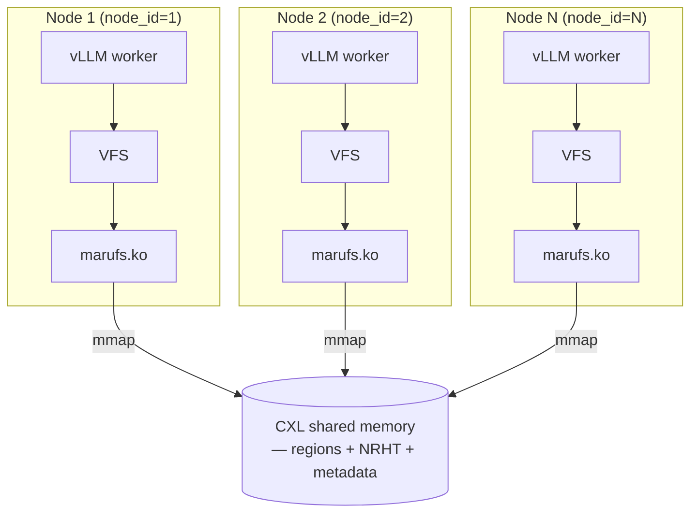
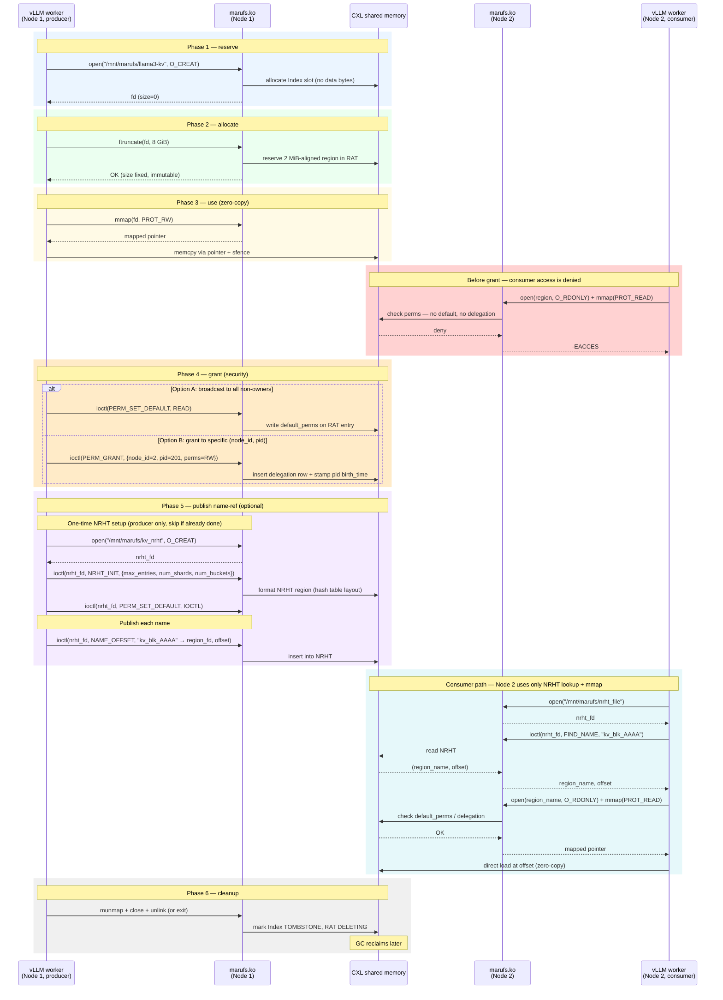
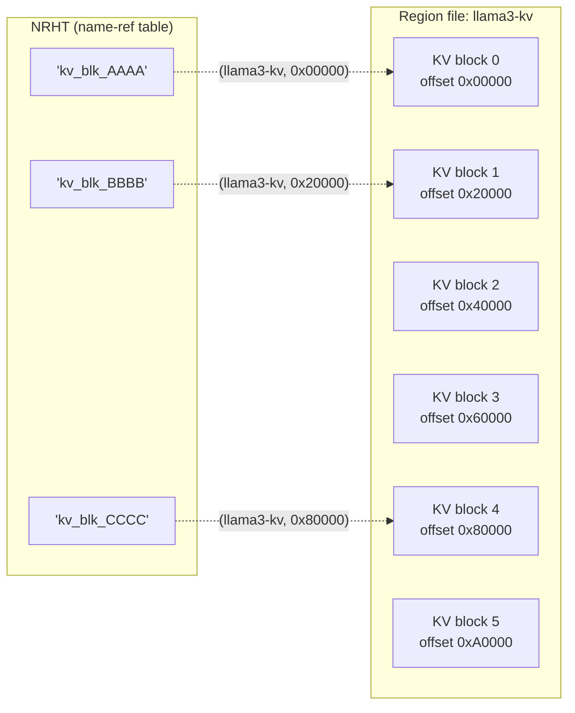
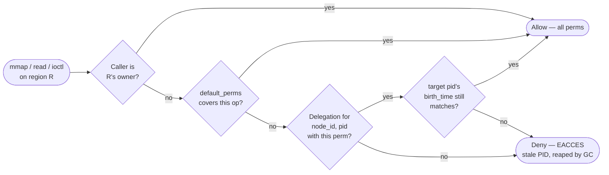

# MARUFS User Guide — vLLM / LMCache Scenario

Audience: cluster admins bringing up marufs on multiple nodes, and
application developers (e.g., LMCache backends) using marufs to share
KV cache through CXL memory.

This guide describes *what* happens from the user's point of view and
*why* each step exists. For byte layouts, locking protocols, and GC
internals, follow the links in each section to the architecture docs.

---

## 1. Actors and the mental model

Three roles interact with a single CXL shared memory pool:

| Role | Does | Example |
|------|------|---------|
| **Admin** | Formats the CXL device once, mounts marufs on every node | Cluster operator |
| **Producer app** | Creates a region, writes KV data via `mmap`, publishes a name | vLLM prefill instance |
| **Consumer app** | Looks up the name on another node, `mmap`s the same physical memory, reads zero-copy | vLLM decode instance |

Key invariants the user can rely on:

- All nodes see the same bytes — marufs is a filesystem view of shared
  physical memory, not a replicated store. No data is copied between nodes.
- Regions are the unit of allocation. A region has an owner (the node
  that created it) and a size that is fixed after first `ftruncate()`.
- Permissions live on the region, not on the file's POSIX mode. `open()`
  always succeeds; the kernel denies at `mmap`/`read`/`ioctl` time.

### Deployment topology

Every node runs its own kernel with the marufs module loaded, and
every node mounts the **same** CXL DAX device. There is no server,
no replication daemon, no network path between nodes — coordination
happens inside the CXL pool itself.

Every node mounts at the same path (default `/mnt/marufs`; configurable
per node with `--mount-point`).



What to notice on this picture:

- **Every kernel sees the same physical bytes.** The arrows to the
  CXL pool are not network hops; they are load/store through the
  DAX mapping.
- **This generalizes.** One vLLM worker per node is the minimum; a
  node can run many workers — they all share the single marufs
  mount and are distinguished by PID. Delegations are
  `(node_id, pid)`-scoped, so each process is addressable
  independently.
- **Node failure is isolated.** If Node 1 crashes, its owned regions
  and delegations become reclaimable by GC on the surviving nodes;
  Node 2 keeps operating on its mmap'd pointers.

---

## 2. Admin flow — bringing up a multi-node cluster

The CXL pool is formatted **once** by the first node. Every other node
mounts the same device without `format`.

```bash
# Node 1 (first boot, one-time format)
sudo ./install.sh --mount /dev/dax0.0 --node-id 1 --format

# Node 2, 3, ... (format is omitted)
sudo ./install.sh --mount /dev/dax0.0 --node-id 2
sudo ./install.sh --mount /dev/dax0.0 --node-id 3

# Custom mount directory (default: /mnt/marufs)
sudo ./install.sh --mount /dev/dax0.0 --node-id 2 --mount-point /data/marufs
```

Requirements:

- Every node must use a **distinct `node_id`** (`N > 0`). The ID is
  stamped into every region the node creates and is used for
  cross-node permission targeting and crash detection.
- The same physical DAX device must be exposed on every node (CXL
  pool). Mount point paths can differ per node, but using an identical
  path (e.g. `/mnt/marufs`) everywhere simplifies scripts that open
  regions by absolute path.
- No shared network filesystem, no ZooKeeper, no coordinator daemon —
  coordination uses CXL memory itself.

Key `install.sh` options:

| Flag | Meaning |
|------|---------|
| `--mount <dev>` | DAX device to bind (e.g. `/dev/dax0.0`) |
| `--node-id <N>` | Unique node identifier, `N > 0` (default: `1`) |
| `--mount-point <path>` | Filesystem mount directory (default: `/mnt/marufs`) |
| `--format` | Initialize CXL memory. Only on the *first* node, *first* boot |

Additional mount options (pass via `mount -o` or `/etc/fstab`):

| Option | Meaning |
|--------|---------|
| `me_strategy=<order\|request>` | Cross-node write coordination strategy for NRHT (default: `request`). Per-NRHT override via `marufs_nrht_init_req.me_strategy`. |

See: [6_arch_mount_io.md](6_arch_mount_io.md) for the on-mount
discovery and bootstrapping logic.

---

## 3. Application flow — region lifecycle

marufs regions are created in phases. Only the producer node goes
through the full sequence; consumers skip to the mmap step.

```
Phase 1: reserve     open(O_CREAT)        → metadata slot only, no bytes
Phase 2: allocate    ftruncate(size)      → physical region pinned (2MB aligned, rounded up)
Phase 3: use         mmap(...) / memcpy   → zero-copy access
Phase 4: grant       ioctl(PERM_*)        → grant cross-node access
(Phase 5: publish)   ioctl(NAME_OFFSET)   → register a name in NRHT (optional, see §4)
Phase 6: cleanup     munmap + close + unlink (or wait for GC)
```

Mapped onto the deployment topology, each phase touches a different
slice of CXL shared memory:



Phase boundaries are meaningful:

- `open(O_CREAT)` reserves only an index slot. Before `ftruncate()`,
  `mmap()` returns `-ENODATA`.
- The first successful `ftruncate()` fixes the size permanently. A
  second `ftruncate()` with a non-zero size returns `-EACCES`.
- `write()` is not supported — data must flow through `mmap`. This
  enforces the zero-copy contract with CXL memory.
- For CPU writes the application is responsible for `sfence` (WC
  buffer flush) after `memcpy`. CUDA handles its own coherence for
  GPU-originated writes.
- No KV bytes traverse the network — only the `name → (region, offset)`
  metadata is exchanged via ioctl; the data itself is a direct CXL load.
- If a consumer also needs to write (e.g. store evicted blocks), the
  producer issues `PERM_GRANT` for that `(node_id, pid)`, or sets
  `default_perms = READ|WRITE` for broad write-back.
- If the producer exits without `unlink`, GC reclaims the region after
  owner-process death is detected. Consumers that still hold `mmap`
  mappings keep working until they `munmap`.

See: [2_arch_entry_lifecycle.md](2_arch_entry_lifecycle.md) for the
per-state CAS transitions, and the README "Userspace API Guide" for
a complete C code example.

---

## 4. Name-ref (NRHT) — publishing and peer lookup

Regions are identified by POSIX filenames (`/mnt/marufs/my_region`).
For LMCache-style workloads that share *ranges* of a big region
(one region per model → many KV blocks inside it), marufs provides
a name-ref table (NRHT) that maps an arbitrary string key to
`(region, offset)`.



A region is the unit of allocation (big, 2 MiB-aligned). An NRHT entry
is just a named pointer into that region — many names can coexist
inside one region. This is the core pattern LMCache uses: one region
per model, N name-refs per block.

### 4.1 One-time setup — creating the NRHT file

An NRHT is itself a marufs region, but with a special internal layout
(hash table instead of flat data). It must be created and formatted
once by the producer (or an admin tool), then reused by every peer
that wants to look up or publish names.

```c
/* Producer, one-time setup: create + format the NRHT region. */
int nrht_fd = open("/mnt/marufs/kv_nrht", O_CREAT | O_RDWR, 0644);

struct marufs_nrht_init_req init = {
    .max_entries = 0,   /* 0 → default (524288)   */
    .num_shards  = 0,   /* 0 → default (64, pow2) */
    .num_buckets = 0,   /* 0 → default (max_entries / 4) */
    .me_strategy = 1,   /* 0 = order-driven, 1 = request-driven (default). */
};
ioctl(nrht_fd, MARUFS_IOC_NRHT_INIT, &init);  /* requires PERM_ADMIN */

/* Optionally grant IOCTL perm to consumers so they can FIND_NAME. */
struct marufs_perm_req preq = { .perms = MARUFS_PERM_IOCTL };
ioctl(nrht_fd, MARUFS_IOC_PERM_SET_DEFAULT, &preq);
```

After this, every node just does `open("/mnt/marufs/kv_nrht")` to get
an `nrht_fd`; no further init is needed (idempotent creation only
happens the first time). `NRHT_INIT` is ADMIN-gated, so only the
region's owner (or a delegated admin) can format it.

Peers lazily join the NRHT's cross-node coordination ring on their
first `NAME_OFFSET` / `FIND_NAME` call, which adds a one-time setup
latency (~ms). Latency-sensitive consumers can pre-warm that path:

```c
/* Optional: join the NRHT ring up front. Idempotent — safe to call
 * repeatedly; the first call bears the full join cost. */
ioctl(nrht_fd, MARUFS_IOC_NRHT_JOIN);
```

### 4.2 Publishing and looking up names

Producer-side publish (`nrht_fd` obtained via `open(nrht_path)`):

```c
struct marufs_name_offset_req req = {0};
strncpy(req.name, "kv_blk_AAAA", sizeof(req.name) - 1);
req.target_region_fd = region_fd;
req.offset           = kv_block_offset;  // bytes within region data area
ioctl(nrht_fd, MARUFS_IOC_NAME_OFFSET, &req);
```

Consumer-side lookup on another node (same `nrht_fd` step):

```c
struct marufs_find_name_req req = {0};
strncpy(req.name, "kv_blk_AAAA", sizeof(req.name) - 1);
if (ioctl(nrht_fd, MARUFS_IOC_FIND_NAME, &req) < 0) {
    /* -ENOENT = name not published; -EACCES = no IOCTL perm */
    return -errno;
}
/* On success the kernel fills:
 *   req.region_name — target region filename (no leading slash)
 *   req.offset      — byte offset within that region's data area
 */

/* Step 2: open the region and mmap the byte range you need. */
char path[PATH_MAX];
snprintf(path, sizeof(path), "/mnt/marufs/%s", req.region_name);
int region_fd = open(path, O_RDONLY);

/* mmap offset must be page-aligned; round down and adjust if needed. */
void *base = mmap(NULL, kv_block_size, PROT_READ, MAP_SHARED,
                  region_fd, req.offset);
/* `base` is a direct pointer into CXL memory — zero-copy read.
 * If the owner has not granted READ to this (node_id, pid),
 * mmap returns MAP_FAILED with errno = EACCES (see §5).
 */
```

Batch variants (`MARUFS_IOC_BATCH_FIND_NAME`, `MARUFS_IOC_BATCH_NAME_OFFSET`)
process multiple entries per syscall — preferred for LMCache
block-level access patterns.

See: [4_arch_nrht.md](4_arch_nrht.md).

---

## 5. Security — who can read/write a region

marufs uses a **delegation model**, not POSIX file bits. The check
happens at data-access time (`mmap`, `read`, permission-gated ioctls),
not at `open()`.

Owner (the node that created the region) always has full access.
For everyone else, the kernel consults, in order:

1. **Default permissions** — set once via `PERM_SET_DEFAULT`; applies
   to every non-owner accessor.
2. **Delegation table** — per `(node_id, pid)` grants via `PERM_GRANT`.
3. **Deny** — returns `-EACCES`.



Permission bits:

| Bit | Syscall |
|-----|---------|
| `MARUFS_PERM_READ` | `mmap(PROT_READ)`, `read()` |
| `MARUFS_PERM_WRITE` | `mmap(PROT_WRITE)` |
| `MARUFS_PERM_DELETE` | `unlink()` |
| `MARUFS_PERM_ADMIN` | `chown`, `PERM_SET_DEFAULT` |
| `MARUFS_PERM_IOCTL` | NRHT ioctls |
| `MARUFS_PERM_GRANT` | Delegate further (ADMIN/GRANT themselves cannot be re-delegated) |

PID reuse is handled by stamping each delegation with the target
process's birth time: a reborn PID does not inherit old grants.
Delegations from a dead process are reclaimed by the GC thread.

See: [5_arch_acl.md](5_arch_acl.md) for the check order in code,
and [3_arch_gc.md](3_arch_gc.md) for dead-process reclaim.

---

## 6. Where to go next

| If you want to know... | Read |
|---|---|
| The exact on-disk layout (superblock, shards, RAT, NRHT) | [1_arch_metadata_layout](1_arch_metadata_layout.md) |
| State machines for index/RAT/delegation entries | [2_arch_entry_lifecycle](2_arch_entry_lifecycle.md) |
| How dead regions and stale delegations are reclaimed | [3_arch_gc](3_arch_gc.md) |
| NRHT shard/bucket structure and insert protocol | [4_arch_nrht](4_arch_nrht.md) |
| ACL check path and delegation internals | [5_arch_acl](5_arch_acl.md) |
| Mount bootstrap, VFS read/write/mmap paths | [6_arch_mount_io](6_arch_mount_io.md) |
