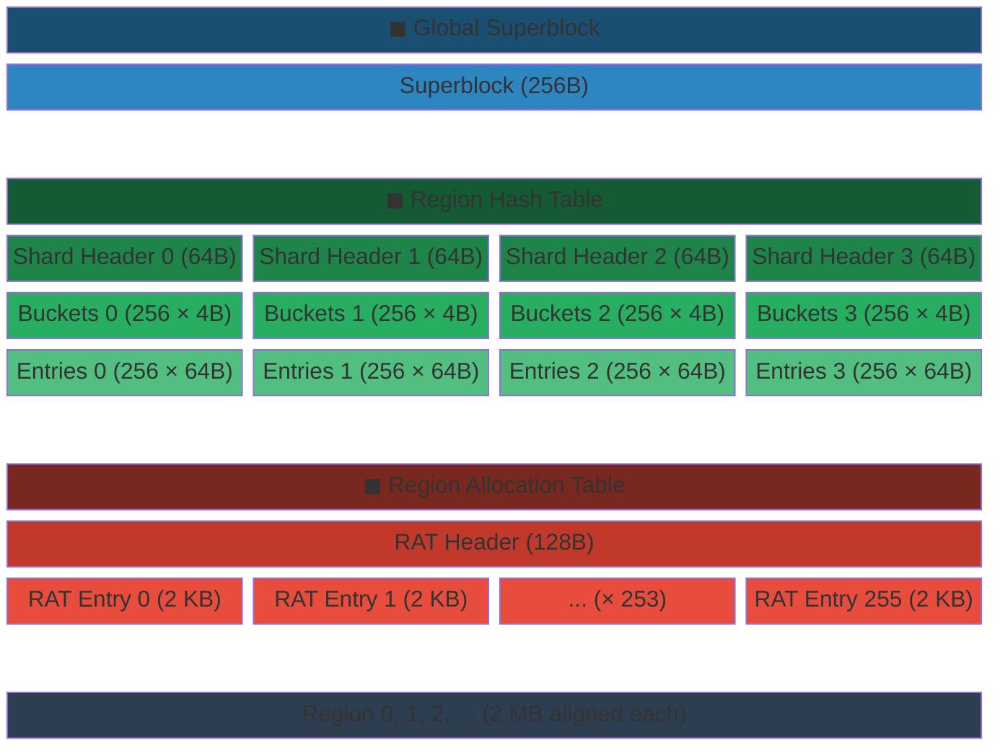
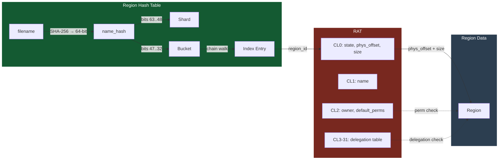

# Doc 1: CXL Metadata Layout

> **Source files**: `marufs_layout.h` (all struct definitions, `enum marufs_layout`), `marufs.h` (`marufs_sb_info`, `shard_cache`)

---

## 1. CXL Memory Physical Layout

Default configuration: 4 shards, 256 buckets/shard, 256 entries/shard, 256 RAT entries.



### Category Overview

| Category | Color | Description |
|----------|:-----:|-------------|
| **Global Superblock** | 🔵 Blue | Describes the entire FS geometry. Read once at mount time and cached in an in-memory struct. Single instance |
| **Region Hash Table** | 🟢 Green | Sharded hash index for filename → region_id mapping. Shard Header (immutable pointers) → Bucket (chain head) → Entry (state-managed) hierarchy |
| **Region Allocation Table** | 🔴 Red | Per-region (per-file) metadata storage. RAT Header (global alloc management) + RAT Entry (physical allocation, name, ACL, delegation unified) |
| **Region Data** | ⚫ Gray | Actual file data. Variable size, 2 MB aligned |

### Key Fields by Block

| Category | Block | Key Fields | Role |
|:--------:|-------|------------|------|
| 🔵 | **Superblock** | `magic`, `num_shards`, `buckets_per_shard`, `entries_per_shard`, `active_nodes` | FS geometry + mounted node management |
| 🟢 | **Shard Header** | `bucket_array_offset`, `entry_array_offset` | Per-shard array positions (immutable after format) |
| 🟢 | **Bucket** | `head_entry_idx` | Hash chain start (entry index or `BUCKET_END`) |
| 🟢 | **Index Entry** | `state`, `name_hash`, `region_id`, `next_in_bucket` | filename → region mapping |
| 🔴 | **RAT Header** | `magic`, `max_entries`, `alloc_lock` | Region allocation table meta + global lock |
| 🔴 | **RAT Entry** | CL0: `state`, `phys_offset`, `size` / CL1: `name` / CL2: ACL / CL3-31: delegation | Unified file metadata (32 CL) |
| ⚫ | **Region** | *(raw data)* | Actual file data (variable size, 2 MB aligned) |

---

## 2. Filename → Region Data Access Path

Full path from a filename to the actual Region data. Traverses Region Hash Table → RAT → Region Data.



- **Region Hash Table path**: `filename` → SHA-256 hash → shard selection (upper bits) → bucket selection (middle bits) → entry chain walk → `name_hash` match → extract `region_id`
- **RAT access**: Direct indexing via `rat.entries[region_id]` → get `phys_offset`/`size` from CL0
- **ACL check**: Check owner/`default_perms` in CL2 → if insufficient, scan delegation table in CL3-31 → grant or deny Region access

---

## 3. Struct Details

### 3.1 `marufs_superblock` (256 B = 4 CL)

Single instance describing the entire filesystem geometry.

**Purpose**: Shard count, offsets of each area, mounted node management.

**Usage**:
- **mount**: `marufs_read_superblock()` validates magic/version then copies to `sbi`
- **format**: `marufs_format_device()` initializes all fields
- **active_nodes**: `marufs_le64_cas()` sets/clears bits at mount/unmount (node registration)
- **runtime**: `marufs_gsb_get()` accesses directly from CXL (includes RMB)

```c
struct marufs_superblock {              /* 256B = 4 CL */
    /* ── CL0: identity + layout + integrity ── */
    uint32  magic;                      /* 0x4D415255 ("MARU") */
    uint32  version;
    uint64  total_size;                 /* Total CXL memory size */
    uint64  shard_table_offset;
    uint64  rat_offset;
    uint64  active_nodes;               /* Mounted node bitmask, CAS */
    uint32  num_shards;                 /* power of 2 */
    uint32  buckets_per_shard;          /* power of 2 */
    uint32  entries_per_shard;
    uint32  checksum;                   /* CRC32 */
    /* ── CL1–CL3: reserved ── */
    uint8   reserved[200];
};
```
---

### 3.2 `marufs_shard_header` (64 B = 1 CL)

**Immutable** metadata describing the hash bucket/entry array locations for each shard.

**Purpose**: Stores absolute offsets of bucket array and entry array per shard.

**Usage**:
- **mount**: `marufs_init_shard_table()` validates then caches pointers in `shard_cache` (DRAM)
- **runtime**: Index insert/lookup/delete access via `shard_cache` → avoids CXL round-trip
- Never modified after format (read-only)

```c
struct marufs_shard_header {            /* 64B = 1 CL */
    uint32  magic;                      /* 0x4D534844 ("MSHD") */
    uint32  shard_id;                   /* [0..num_shards) */
    uint32  num_buckets;                /* power of 2 */
    uint32  num_entries;
    uint64  bucket_array_offset;        /* Absolute offset within device */
    uint64  entry_array_offset;
    uint8   reserved[32];
};
```
---

### 3.3 `marufs_index_entry` (64 B = 1 CL)

Core unit of the Global Index. Maps filename → region_id.

**Purpose**: Hash-chain based file lookup. `state` field is the CAS target.

**Usage**:
- **insert**: `marufs_index_insert()` — `CAS(state, EMPTY, INSERTING)` → fill fields → bucket prepend → `WRITE_ONCE(state, VALID)`
- **lookup**: `marufs_index_lookup()` — chain walk + `name_hash` matching
- **delete**: `marufs_index_delete()` — `CAS(VALID, TOMBSTONE)` (stays in chain, reused by insert path)
- **GC**: Reclaims stale INSERTING/TOMBSTONE entries (`gc.c`)

```c
struct marufs_index_entry {             /* 64B = 1 CL */
    uint32  state;                      /* EMPTY(0)/INSERTING(1)/VALID(2)/TOMBSTONE(3) */
    uint32  next_in_bucket;             /* Hash chain link (0xFFFFFFFF = end) */
    uint64  name_hash;                  /* SHA-256 → 64-bit truncate */
    uint32  region_id;                  /* RAT entry ID */
    uint32  node_id;                    /* Inserting node (for stale detection) */
    uint64  created_at;                 /* Creation time ns (for stale detection) */
    uint8   reserved[32];
};
```
---

### 3.4 `marufs_rat_entry` (2,048 B = 32 CL)

Per-region (per-file) metadata. Unifies physical allocation, name, ownership, permissions, and delegation into a single entry.

**Purpose**: Manages all file metadata within a single RAT entry.

**Usage**:
- **alloc**: `marufs_rat_alloc_entry()` — CAS `FREE→ALLOCATING` + `alloc_lock`
- **init**: `marufs_region_init()` — sets phys_offset/size via ftruncate path → `WRITE_ONCE(state, ALLOCATED)`
- **inode load**: `marufs_iget()` — restores inode metadata from RAT entry
- **ACL**: `acl.c` — reads owner/default_perms/delegation
- **I/O**: `file.c` — syncs `modified_at`, `size` (CL0 access)
- **GC**: `gc.c` — orphan detection and reclaim, `marufs_rat_free_entry()`

```c
struct marufs_rat_entry {               /* 2048B = 32 CL */
    /* ── CL0: Hot I/O metadata ── */
    uint32  state;                      /* FREE(0)/ALLOCATING(1)/ALLOCATED(2)/DELETING(3) */
    uint32  region_type;                /* DATA(0)/NRHT(1) */
    uint64  phys_offset;               /* Data area offset (0 = unallocated) */
    uint64  size;                       /* Region size (variable, 2 MB aligned) */
    uint64  alloc_time;                 /* Allocation time (ns) */
    uint64  modified_at;                /* Last modification time (ns) */
    uint8   reserved0[24];

    /* ── CL1: Name — cold ── */
    char    name[64];                   /* null-terminated (MARUFS_NAME_MAX+1) */

    /* ── CL2: ACL ── */
    uint16  default_perms;              /* Default permissions for non-owners */
    uint16  owner_node_id;              /* Owning node (max 64) */
    uint32  owner_pid;
    uint64  owner_birth_time;           /* PID reuse prevention */
    uint32  uid;
    uint32  gid;
    uint16  mode;
    uint16  deleg_num_entries;          /* Active delegation count (max 29) */
    uint8   reserved2[36];

    /* ── CL3-CL31: Delegation table ── */
    struct marufs_deleg_entry deleg_entries[29];
};
```

> CL0 is the hot path accessed on every I/O path. `marufs_rat_entry_get()` issues RMB for CL0 only.
> CL1 (name) is accessed only on hash match. No CL miss during chain walk.
---

### 3.5 `marufs_deleg_entry` (64 B = 1 CL)

A slot that delegates fine-grained permissions to a specific `(node_id, pid)` pair.

**Purpose**: Dynamic delegation of individual permissions such as READ/WRITE/DELETE.

**Usage**:
- **grant**: `marufs_perm_grant()` — CAS `EMPTY→GRANTING` → fill fields → `WRITE_ONCE(state, ACTIVE)`, existing entries use CAS-loop to OR perms (upsert)
- **check**: `marufs_check_permission()` — scans delegation table
- **GC**: Cleans up stale delegations from dead processes (`ACTIVE→EMPTY`)

```c
struct marufs_deleg_entry {             /* 64B = 1 CL */
    uint32  state;                      /* EMPTY(0)/GRANTING(1)/ACTIVE(2) */
    uint32  node_id;                    /* Target node */
    uint32  pid;                        /* Target PID */
    uint32  perms;                      /* Permission bitmask */
    uint64  birth_time;                 /* PID reuse prevention */
    uint64  granted_at;                 /* Grant time (ns) */
    uint8   reserved[32];
};
```
---

### 3.6 `marufs_rat` (RAT Header, 128 B = 2 CL)

RAT header. Located immediately before the entry array.

```c
struct marufs_rat {                     /* 128B header + entries */
    uint32  magic;                      /* 0x4D524154 ("MRAT") */
    uint32  version;
    uint32  num_entries;                /* Allocated entry count */
    uint32  max_entries;                /* Maximum (256) */
    uint64  device_size;
    uint64  rat_offset;
    uint64  regions_start;              /* Region data start offset */
    uint64  total_allocated;
    uint64  total_free;
    uint32  alloc_lock;                 /* CAS spinlock (0=unlocked) */
    uint8   reserved[68];
    struct marufs_rat_entry entries[256];
};
```
---

## 4. Cacheline Boundary Summary

All CXL structs are designed with cacheline (64 B) boundaries in mind:

| Struct | Size | CL Count | Key CL Separation |
|--------|------|----------|-------------------|
| `marufs_superblock` | 256 B | 4 | CL0: all live fields, CL1-3: reserved |
| `marufs_shard_header` | 64 B | 1 | Entire struct in a single CL |
| `marufs_index_entry` | 64 B | 1 | Entire struct in a single CL (CAS target = `state`) |
| `marufs_rat_entry` | 2,048 B | 32 | CL0: hot I/O, CL1: name (cold), CL2: ACL, CL3-31: delegation |
| `marufs_deleg_entry` | 64 B | 1 | Entire struct in a single CL |
| `marufs_rat` header | 128 B | 2 | CL0: identity+stats, CL1: reserved |

> CL separation rationale: CXL memory access is cacheline-granular. Separating hot path (state checks, I/O metadata) from cold data (name, delegation) prevents unnecessary cacheline transfers.
