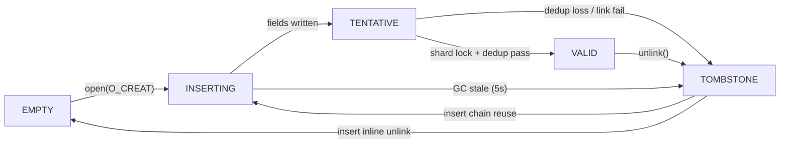
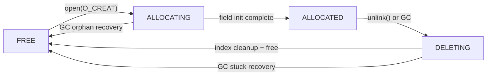
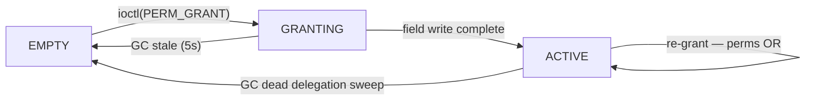

# Doc 2: Entry Lifecycle (State Machines)

> **Source files**: `index.c` (Global Index insert/lookup/delete), `region.c` (RAT alloc/init/free), `acl.c` (delegation grant/check), `gc.c` (3-phase GC sweep), `marufs_layout.h` (state enum definitions)

---

## Overview

All state transitions are performed via CAS (compare-and-swap), providing lock-free operation within a single node. In multi-node environments, the atomicity guarantee of CAS varies depending on CXL hardware cache coherence level (CXL 3.0 vs 2.0), so cross-node lock-free operation is not fully guaranteed.

| Entry Type | Location | States | Definition |
|------------|----------|--------|------------|
| Global Index Entry | Shard Entry Array | 5 | `enum marufs_entry_state` |
| RAT Entry | Region Allocation Table | 4 | `enum marufs_rat_entry_state` |
| Delegation Entry | Inside RAT Entry (CL3-31) | 3 | `enum marufs_deleg_state` |

---

## 2-1. Global Index Entry

Core unit of the filename → region_id mapping. `marufs_index_entry` (64B = 1CL).

### State Transition Diagram



- **INSERTING**: Slot claimed, fields being written. Other nodes ignore it. Stale detection via `node_id` + `created_at`.
- **TENTATIVE**: Fields written, entry linked to chain. Visible to dedup but not to lookup. Transitions to VALID under shard lock after dedup passes.
- **TOMBSTONE**: `unlink()` performs `CAS(VALID, TOMBSTONE)` for logical deletion. Stays in chain; cleaned up during next insert's dup check.

### Transition Details

| Transition | Event | CAS Condition | Function |
|------------|-------|---------------|----------|
| EMPTY → INSERTING | `open(O_CREAT)` → index insert | `CAS(state, EMPTY, INSERTING)` | `__marufs_index_insert()` step 3b (flat scan) |
| TOMBSTONE → INSERTING | `open(O_CREAT)` → chain reuse | `CAS(state, TOMBSTONE, INSERTING)` | `__marufs_index_insert()` step 3a |
| INSERTING → TENTATIVE | Insert: fields written | `WRITE_LE32(entry->state, MARUFS_ENTRY_TENTATIVE)` | `__marufs_index_insert()` step 5 |
| TENTATIVE → VALID | Insert: shard lock + dedup pass | `WRITE_LE32(entry->state, MARUFS_ENTRY_VALID)` | `__marufs_index_insert()` step 9 (under lock) |
| TENTATIVE → TOMBSTONE | Insert: dedup loss or link failure | `WRITE_LE32(entry->state, MARUFS_ENTRY_TOMBSTONE)` | `__marufs_index_insert()` (under lock) |
| VALID → TOMBSTONE | `unlink()` → logical delete (stays in chain) | `CAS(VALID, TOMBSTONE)` | `marufs_index_delete()` |
| TOMBSTONE → EMPTY | Inline unlink during insert dup check chain walk | `CAS(state, TOMBSTONE, EMPTY)` + `CAS(prev_next, cur, next)` | `marufs_index_check_duplicate()` |
| INSERTING → TOMBSTONE | GC Phase 2: stale timeout exceeds 5s | `CAS(state, INSERTING, TOMBSTONE)` | `marufs_gc_sweep_stale_entries()` → `marufs_entry_reclaim_slot()` |

### Insert Protocol (Shard-Lock Serialized)

1. **Pre-insert dup check** (lock-free, best-effort): Walk bucket chain for existing VALID entry
2. **Slot claim**: CAS EMPTY/TOMBSTONE → INSERTING. Stamp `node_id` and `created_at` (for GC stale detection)
3. **Field write**: Write `name_hash`, `region_id`. While INSERTING, exclusive ownership
4. **TENTATIVE**: `WRITE_LE32(state, TENTATIVE)` — visible to dedup walkers but not to lookup
5. **Acquire shard lock** (`spin_lock` in DRAM `marufs_shard_cache.insert_lock`)
6. **Bucket prepend**: `marufs_index_link_to_bucket()` — `CAS(bucket_head, old_head, entry_idx)` (skip if chain-reuse)
7. **Post-insert dedup**: Re-walk chain for VALID duplicates. Loser (higher `entry_idx`) → TOMBSTONE
8. **Publish**: Winner `WRITE_LE32(state, VALID)` — visible to lookup
9. **Release shard lock**

Chain reuse path (step 3a): TOMBSTONE slot is already linked in the chain, so bucket prepend is skipped.

### TOCTOU Defense: Post-insert Dedup (Under Lock)

The shard lock serializes link + dedup + publish within a node, eliminating the window where two VALID entries with the same name are visible to lookup. Cross-node serialization is handled by the token ring protocol.

- **Winner determination**: Lower `entry_idx` wins
- **Loser rollback**: Higher `entry_idx` transitions to TOMBSTONE (under lock), returns `-EEXIST`

### Stale INSERTING Detection (`marufs_is_stale_inserting()`)

| Condition | Action |
|-----------|--------|
| `node_id == this_node` + `created_at > 5s` | Immediate reclaim |
| `node_id == this_node` + `created_at == 0` | Register in local tracker, check timeout on next GC |
| `node_id == 0` (orphan) | Register in local tracker (no CXL write — prevents cacheline clobbering) |
| `node_id != this_node` | Skip — that node's GC handles it |

---

## 2-2. RAT Entry

Per-region (per-file) metadata. `marufs_rat_entry` (2048B = 32CL).

### State Transition Diagram



- **ALLOCATING**: Fields being initialized (`owner_pid`, `owner_birth_time`, `name`, `phys_offset`). GC reclaims to FREE if owner is dead.
- **DELETING**: Deletion in progress. Transitions to FREE after index entry cleanup. GC performs full cleanup then FREE if owner is dead.

### Transition Details

| Transition | Event | CAS Condition | Function |
|------------|-------|---------------|----------|
| FREE → ALLOCATING | `open(O_CREAT)` → region alloc | `CAS(state, FREE, ALLOCATING)` | `marufs_rat_alloc_entry()` |
| ALLOCATING → ALLOCATED | Alloc: after field init complete | `WRITE_ONCE(state, ALLOCATED)` | `marufs_rat_alloc_entry()` |
| ALLOCATED → DELETING | `unlink()` or GC dead process reclaim | `CAS(state, ALLOCATED, DELETING)` | `marufs_unlink()` or `marufs_gc_reclaim_dead_regions()` |
| DELETING → FREE | After index entry cleanup, RAT release | Multi-stage CAS: CAS(DELETING→FREE), fallback CAS(ALLOCATED→FREE), fallback CAS(ALLOCATING→FREE) | `marufs_rat_free_entry()` |
| ALLOCATING → FREE | GC Phase 1: owner dead, not yet registered in index | `marufs_gc_cleanup_rat_entry()` | `marufs_gc_reclaim_dead_regions()` |
| DELETING → FREE | GC Phase 1: owner dead + stuck DELETING recovery | `marufs_gc_cleanup_rat_entry()` | `marufs_gc_reclaim_dead_regions()` |

### 2-Phase Allocation

RAT allocation proceeds in two phases:

1. **`open(O_CREAT)`** → `marufs_rat_alloc_entry()`: `CAS(FREE→ALLOCATING)` → field init (`name`, `owner_pid`, `owner_birth_time`, `alloc_time`) → `WRITE_ONCE(ALLOCATED)`. At this point `phys_offset=0`, `size=0` (reservation state)
2. **`ftruncate(N)`** → `marufs_region_init()`: Acquire `alloc_lock` → search for contiguous space → write `phys_offset`, `size`. Physical space is actually allocated at this point

`alloc_lock` is used only during `region_init()`. CAS alone cannot prevent races between contiguous space search and allocation (stale lock is force-released after 5s timeout).

### DELETING Path

Deletion order matters:

1. Index entry: `CAS(VALID→TOMBSTONE)` — no longer found by lookup
2. RAT entry: `CAS(ALLOCATED→DELETING)` — marks deletion in progress
3. RAT entry: field reset + multi-stage CAS to FREE — slot available for reuse

Reversing the order (FREE RAT first) would create a dangling reference where the index entry points to a freed RAT.

### Orphan Recovery (`marufs_is_orphaned()`)

`marufs_is_orphaned()` is a pure predicate; node_id filtering is the caller's responsibility (`gc.c:marufs_gc_reclaim_dead_regions()`). Conditions checked by this function:

1. Owner process is dead (`marufs_owner_is_dead()`: pid lookup → `task_struct` → `birth_time` comparison)
2. `owner_pid == 0` (crash during ALLOCATING): `alloc_time` exceeds 5s
3. No active delegations (`marufs_has_active_delegations()` = false)

All conditions must be met for reclaim to proceed.

---

## 2-3. Delegation Entry

A slot that delegates permissions to a specific (node_id, pid). `marufs_deleg_entry` (64B = 1CL).
Fixed array inside RAT entry (`deleg_entries[29]`, CL3-CL31).

### State Transition Diagram



- **GRANTING**: Slot claimed, fields being written (`node_id`, `pid`, `perms`, `granted_at`). `birth_time` is 0 — lazy stamped on first access.
- **ACTIVE**: Valid delegation. Permission check matches `(node_id, pid, birth_time)`. Re-grant to same target uses CAS-loop to OR perms.

### Transition Details

| Transition | Event | CAS Condition | Function |
|------------|-------|---------------|----------|
| EMPTY → GRANTING | Owner calls `ioctl(PERM_GRANT)` | `CAS(state, EMPTY, GRANTING)` | `marufs_deleg_grant()` |
| GRANTING → ACTIVE | Grant: after field write + WMB complete | `WRITE_ONCE(state, ACTIVE)` | `marufs_deleg_grant()` |
| ACTIVE → EMPTY | GC Phase 1: delegated process deemed dead | `CAS(state, ACTIVE, EMPTY)` | `marufs_gc_sweep_dead_delegations()` |
| GRANTING → EMPTY | GC: stale GRANTING timeout (5s, crash during grant) | `CAS(state, GRANTING, EMPTY)` | `marufs_gc_sweep_dead_delegations()` |
| ACTIVE → ACTIVE | Owner re-grants to same (node_id, pid) | `CAS-loop(perms, old, old\|new)` | `marufs_deleg_try_upsert()` |

### Upsert Pattern

When an existing (node_id, pid) match is found, instead of allocating a new slot, `perms` bits are OR'd via CAS-loop:

```
do {
    old_perms = READ_LE32(de->perms);
    new_perms = old_perms | req->perms;
} while (CAS(&de->perms, old_perms, new_perms) != old_perms);
```

### Lazy birth_time

`birth_time` is set to `0` at grant time. When the delegated process first undergoes a permission check, it is stamped via `CAS(birth_time, 0, current->start_boottime)`. This means:

- No need to know the target process's `birth_time` at grant time
- PID reuse detection activates only after the first access

### Dead Process Detection

Conditions for GC to clean up a delegation (`marufs_gc_sweep_dead_delegations()`):

1. `de->node_id == sbi->node_id` (only clean up this node's delegations)
2. `de->pid != 0`
3. `marufs_owner_is_dead(de_pid, de_birth)` = true
4. Cleanup: `CAS(ACTIVE→EMPTY)` → `deleg_num_entries` atomic dec
