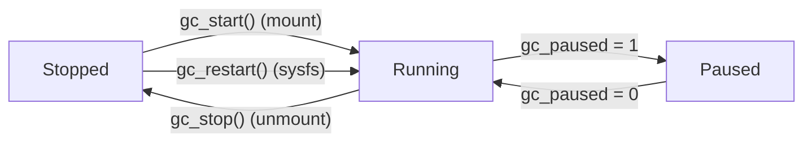
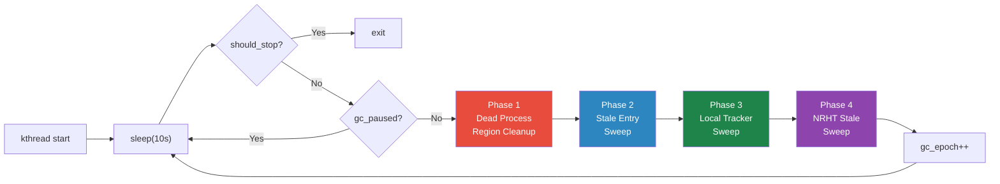
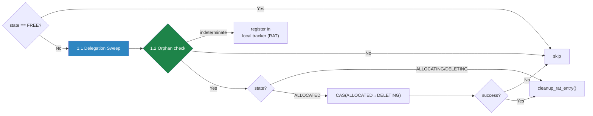
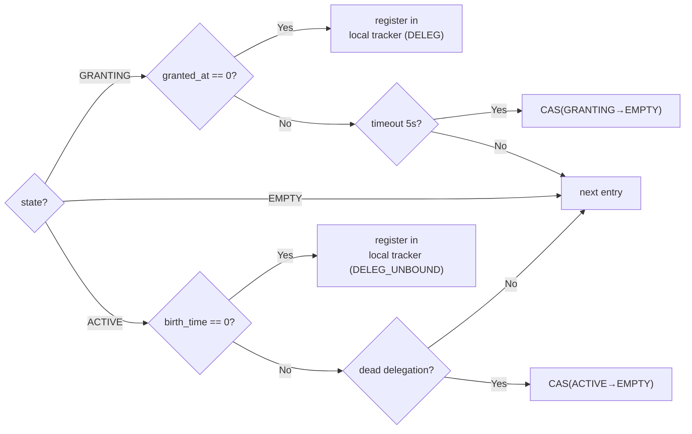
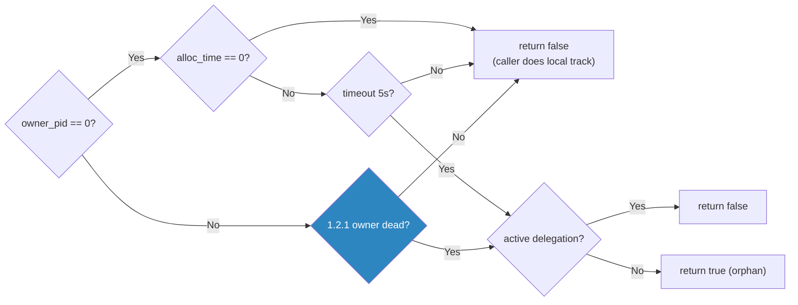
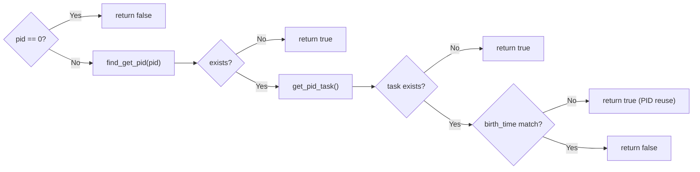
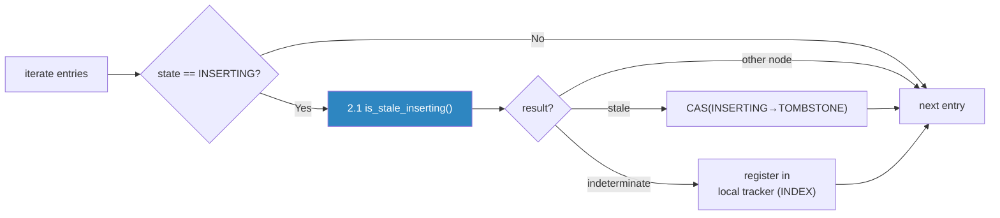
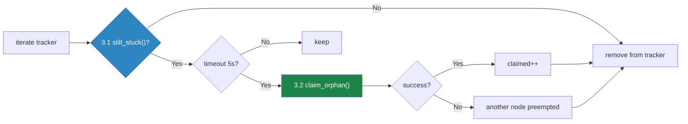

# Doc 3: GC Logic

> **Source files**: `gc.c` (full GC implementation), `acl.c` (`marufs_owner_is_dead()`, delegation sweep), `index.c` (`marufs_is_stale_inserting()` calls), `sysfs.c` (GC manual control interface)

---

## Overview

marufs GC is a crash-safe 3-phase sweep structure where a 10-second periodic kthread reclaims orphaned resources left by dead processes in CXL shared memory.

Core design principles:

- **Each node reclaims only its own resources** — `node_id` comparison prevents cross-node interference
- **CAS-based state transitions** — safe under concurrent GC/insert/delete races
- **Admin node (node_id==1) handles orphans exclusively** — `node_id==0` orphan entries are tracked and claimed only by the admin node via local tracker, eliminating CAS contention
- **2-phase orphan reclaim** — local track (5s) → claim (node_id preemption + timestamp) → normal path reclaim (5s)

| Property | Value |
|----------|-------|
| Interval | 10s (`MARUFS_GC_INTERVAL_MS`) |
| kthread name | `marufs-gc-{node_id}` |
| Stale timeout | 5s (`MARUFS_STALE_TIMEOUT_NS`) |
| Shard sweep ratio | 1/4 per cycle (`MARUFS_GC_SHARD_DIVISOR`) |
| Local tracker capacity | 64 (`MARUFS_GC_ORPHAN_MAX`) |

---

## GC Architecture Overview

### Thread Lifecycle



- **`gc_paused`**: Atomic flag. When 1, sweep is skipped (used for testing)
- **`gc_epoch`**: Incremented each cycle. Liveness check via sysfs `gc_status`
- **Module reference**: `try_module_get()`/`module_put()` prevents rmmod during GC execution

### sysfs Control Interface (`/sys/fs/marufs/`)

| File | Permissions | Purpose |
|------|-------------|---------|
| `gc_trigger` | W(0200) | Manually trigger dead-process region reclaim |
| `gc_pause` | RW(0644) | `echo 1` pause / `echo 0` resume / `echo {node_id}:{0\|1}` per-node |
| `gc_stop` | W(0200) | `echo {node_id}` or `echo all` to stop GC thread |
| `gc_restart` | W(0200) | `echo {node_id}` or `echo all` to restart GC thread |
| `gc_status` | R(0444) | Outputs liveness as `node{id}:{running\|stopped} epoch={N}` |

### Full GC Cycle Flow



---

## Phase 1: Dead Process Region Cleanup

**Function**: `marufs_gc_reclaim_dead_regions()`

Iterates over the entire RAT (256 entries), reclaiming regions owned by dead processes.

### Full Flow



### 1.1 Delegation Sweep

**Function**: `marufs_gc_sweep_dead_delegations()`

Runs for every ALLOCATED RAT entry. Cleans up this node's dead delegations and stale GRANTING entries.

#### Sweep Flow



**Design rationale**: Each node only cleans up its own ACTIVE delegations → all delegations must be cleared before a region can be reclaimed. GRANTING is timeout-based so any node can clean it. ACTIVE + `birth_time==0` (before lazy init) causes `owner_is_dead()` false-positives, so it's routed to the local tracker (`DELEG_UNBOUND`). After timeout, a sentinel (`birth_time=1`) is written → reclaimed via normal path on next cycle.

### 1.2 Orphan Check (`marufs_is_orphaned()`)

Pure predicate — no side effects. state/node_id filtering is the caller's responsibility.



### 1.2.1 `marufs_owner_is_dead()` Logic

**Function**: `acl.c` — Detects PID reuse via `birth_time` (`start_boottime`).



---

## Phase 2: Stale Entry Sweep

**Function**: `marufs_gc_sweep_stale_entries()`

Sweeps `num_shards / 4` shards per cycle. Rotates `gc_next_shard` to cover all shards across 4 cycles.

Transitions stale INSERTING entries to TOMBSTONE. The reason for TOMBSTONE instead of EMPTY: if a crash occurs after `link_to_bucket` but before `publish(VALID)`, the INSERTING entry may already be linked in the chain. An EMPTY entry in the chain could be claimed by flat scan for a different bucket, causing chain corruption. TOMBSTONE ensures safe in-place reuse by the insert path. TOMBSTONE entries are not processed in this phase — they are reused in-place by the insert path's `check_duplicate`.

### Sweep Flow



### 2.1 Stale INSERTING Detection (`marufs_is_stale_inserting()`)

Pure function — no side effects. Safe to call from both GC thread and syscall path (index.c insert dup check). Local tracking is handled by the caller (`marufs_gc_sweep_stale_entries`).

| Condition | Return | Meaning |
|-----------|--------|---------|
| `node_id == 0` (admin) | 0 | orphan — only admin node (node_id==1) registers in tracker |
| `node_id == 0` (non-admin) | -1 | orphan but this node is not admin — skip |
| `node_id != this node` | -1 | owned by another node — skip |
| `node_id == this`, `created_at == 0` | 0 | timestamp not recorded — indeterminate |
| `node_id == this`, `created_at > 5s` | 1 | confirmed stale |
| `node_id == this`, `created_at ≤ 5s` | 0 | still valid |

---

## Phase 3: Local Tracker Sweep

**Function**: `marufs_gc_sweep_orphans()`

Tracks entries in DRAM that couldn't be determined via normal paths (timeout comparison, `owner_is_dead`, etc.) in Phase 1/2. On timeout expiry, **claims** the entry to transition it into a state processable by the normal path. Actual reclaim occurs in the next GC cycle's normal path.

### DRAM Tracker Structure

```c
enum marufs_orphan_type {
    MARUFS_ORPHAN_INDEX,          /* stale INSERTING index entry */
    MARUFS_ORPHAN_DELEG,          /* stale GRANTING delegation entry */
    MARUFS_ORPHAN_DELEG_UNBOUND,  /* ACTIVE deleg, birth_time not yet bound */
    MARUFS_ORPHAN_RAT,            /* stuck ALLOCATING RAT entry */
    MARUFS_ORPHAN_NRHT,           /* stale INSERTING NRHT entry */
};

struct marufs_orphan_tracker {
    void *entry;             /* CXL entry pointer */
    u64 discovered_at;       /* first discovery time (ns) */
    enum marufs_orphan_type type;
};
```

- **Registration**: `marufs_gc_track_orphan()` — GC thread only (must not be called from syscall path)
- **Dedup**: Pointer comparison skips already-registered entries
- **Capacity overflow**: When full at 64, registration is abandoned → retry after sweep on next cycle

### Sweep Flow



### 3.1 `still_stuck()` — Per-type Detection

| Type | Stuck condition | Reason |
|------|----------------|--------|
| INDEX | `state == INSERTING && node_id == 0` | Crash during insert before node_id was written. Only admin node (node_id==1) registers in tracker |
| DELEG | `state == GRANTING && (node_id == 0 \|\| granted_at == 0)` | Crash during grant. `node_id == 0`: target node not recorded. `granted_at == 0`: timestamp not recorded. Admin node only tracks `node_id==0` case |
| DELEG_UNBOUND | `state == ACTIVE && birth_time == 0` | Grant complete (ACTIVE) but delegated process hasn't made first access yet. `birth_time=0` causes `owner_is_dead()` false-positive — cannot process via normal path |
| RAT | `state == ALLOCATING && owner_node_id == 0` | Crash during alloc before owner node_id was written. Only admin node (node_id==1) registers in tracker |
| NRHT | `state == INSERTING && inserter_node == 0` | Crash during NRHT insert before inserter_node was written. Only admin node (node_id==1) registers in tracker |

If state has changed or the relevant field has been populated → not stuck → remove from tracker → normal path handles it.

### 3.2 `claim_orphan()` — Per-type Preemption

After timeout expires, preempts `node_id` via CAS and stamps timestamp. Actual reclaim is handled by the next GC cycle's normal path.

| Type | Claim target | Timestamp target | Next cycle reclaim path |
|------|-------------|-----------------|------------------------|
| INDEX | `CAS(e->node_id, 0, mine)` | `e->created_at = now` | `stale_sweep` → `is_stale_inserting` = 1 → `entry_reclaim_slot` (INSERTING→TOMBSTONE) |
| DELEG | `CAS(de->node_id, 0, mine)` or ownership check | `de->granted_at = now` | `sweep_dead_delegations` → timeout → clear + CAS(GRANTING→EMPTY) |
| DELEG_UNBOUND | `CAS(de->birth_time, 0, 1)` (sentinel) | — | `sweep_dead_delegations` → `owner_is_dead(pid, 1)` → birth_time mismatch → CAS(ACTIVE→EMPTY) |
| RAT | `CAS(re->owner_node_id, 0, mine)` | `re->alloc_time = now` | `dead_process_regions` → `is_orphaned` → `cleanup_rat_entry` |
| NRHT | `CAS(e->inserter_node, 0, mine)` | `e->created_at = now` | `nrht_gc_sweep_all` → `nrht_is_stale` = 1 → CAS(INSERTING→TOMBSTONE) |

**DELEG special case**: The grant path writes `node_id` first and `granted_at` later, so `node_id != 0` but `granted_at == 0` can occur. During claim, if `node_id != 0`, only ownership is verified (`de_node == sbi->node_id`) and only the timestamp is updated.

### Orphan Lifecycle (2-phase timeout, admin node only)

`node_id==0` orphans are tracked and claimed **only by admin node (node_id==1)**. Non-admin nodes skip `node_id==0` entries.

```
[Discovery] node_id=0 or timestamp=0  (admin node only)
  → register in local tracker (no CXL write)
  → wait 5s
  ↓
[Claim] CAS(node_id, 0, 1) + timestamp = now
  → remove from tracker
  → discovered by next GC cycle's normal path (owned by node_id==1)
  → wait 5s
  ↓
[Reclaim] final reclaim via normal path
  → total max ~60s (2 × timeout)
```

**2-phase design rationale**:
- 1st timeout: a live writer may still be writing, so observe without writing to CXL
- Admin-only claim: only node_id==1 attempts CAS → single preemptor, no contention
- 2nd timeout: after claim, other nodes may still be reading this entry, so don't reclaim immediately

---

## Edge Cases

### GC vs Concurrent insert/delete Races

| Race scenario | Safety guarantee |
|---------------|-----------------|
| GC reclaim vs insert (same slot) | CAS atomicity: GC does `CAS(INSERTING, TOMBSTONE)`, insert does `CAS(state, INSERTING)`. Only one succeeds |
| GC cleanup vs unlink (same region) | GC preempts with `CAS(ALLOCATED, DELETING)`. unlink's CAS fails, skip |
| GC delegation sweep vs perm_grant | ACTIVE clear: state is ACTIVE during clear → grant upsert doesn't match. After CAS transition, even if grant takes EMPTY, all fields are overwritten |
| Phase 2 stale reclaim vs live inserter | `node_id`/`created_at` comparison avoids touching live entries. 5s timeout far exceeds normal insert time |

### Cross-node Visibility

- **WMB before CAS**: `marufs_entry_reclaim_slot()` writes `name_hash=0` → WMB → CAS
- **RMB before state read**: All phases issue RMB before reading entries → ensures fresh data even on CXL 2.0
- **CAS failure = skip**: Another node/path already handled it. Proceed to next without retry

### `marufs_is_stale_inserting()` — Thread Safety

Pure function (no side effects). Callable from both GC thread and syscall path (index.c insert dup check). Local tracking is performed only in GC thread-exclusive function `marufs_gc_track_orphan()` — no concurrent access to `gc_orphans[]` array.

### `marufs_can_force_unlink()` — dir.c unlink fallback

On permission check failure, uses `marufs_is_orphaned()` for orphan detection. `is_orphaned` is a pure predicate, safe for syscall path. `owner_node == sbi->node_id` filter allows force unlink only for orphans owned by this node.

### GC Phase Dependencies

Phase 1 → 2 → 3 → 4 order is priority-based:

- **Phase 1 (region reclaim)**: Free dead process regions quickly → available for other nodes. Side task: during RAT scan, records `region_type == NRHT` entries in DRAM bitmap (`gc_nrht_bitmap`) for Phase 4
- **Phase 2 (stale INSERTING)**: Global Index slot reclaim (INSERTING→TOMBSTONE) + register orphans in tracker when found
- **Phase 3 (orphan sweep)**: Processes trackers registered by Phase 1/2/4
- **Phase 4 (NRHT stale sweep)**: Iterates NRHT regions via DRAM bitmap, transitions stale INSERTING entries to TOMBSTONE. `gc_epoch`-based round-robin sweeps ~25% of shards per cycle. See Doc 4 for NRHT structure and state transition details

Each phase can fail independently without affecting the overall GC cycle (errors ignored, retried on next cycle).
