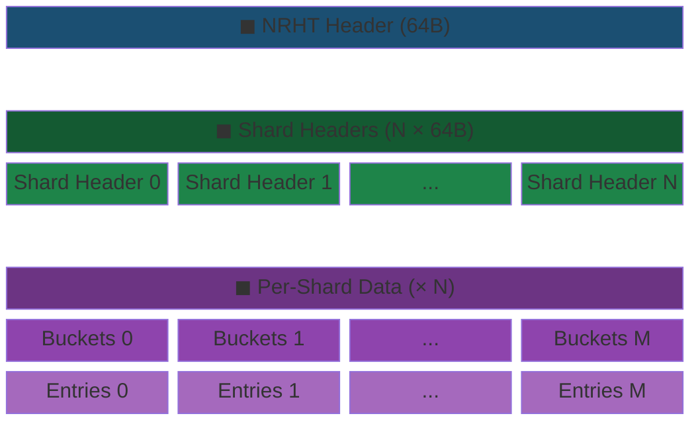
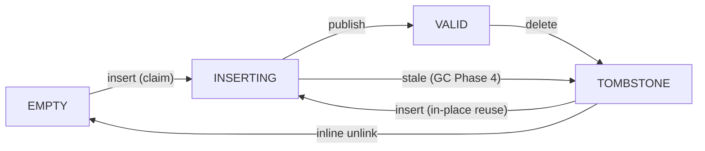
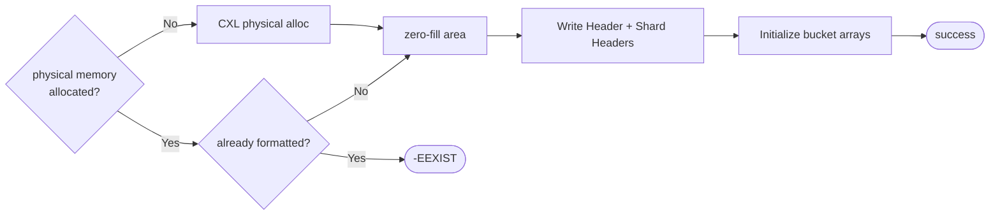
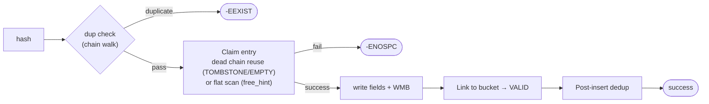
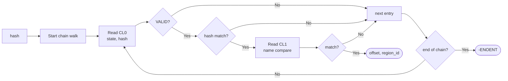
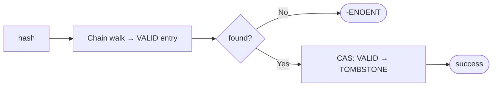
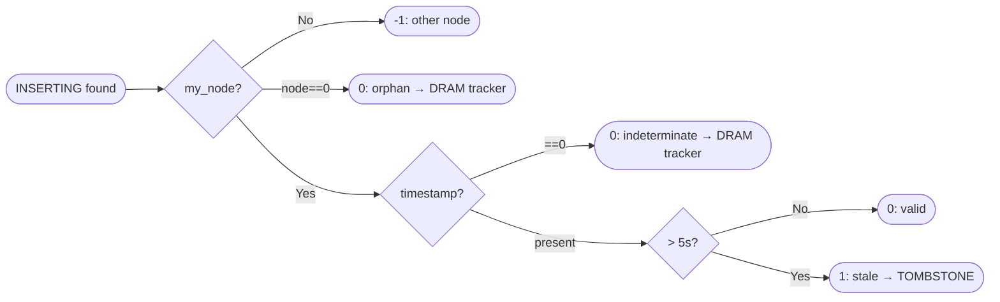
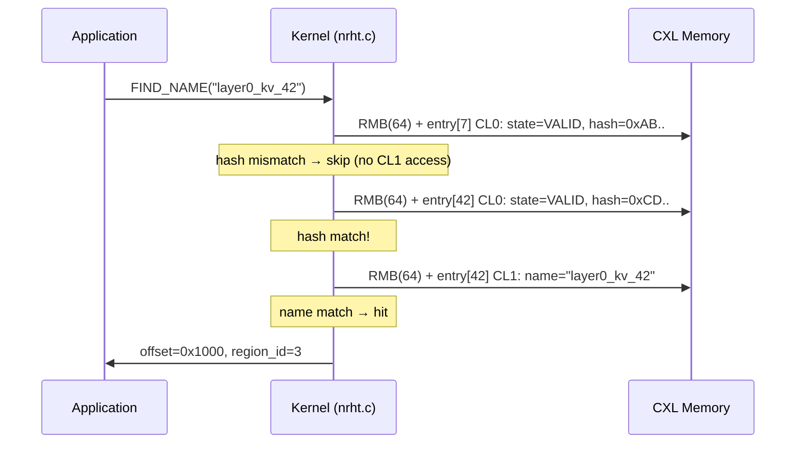
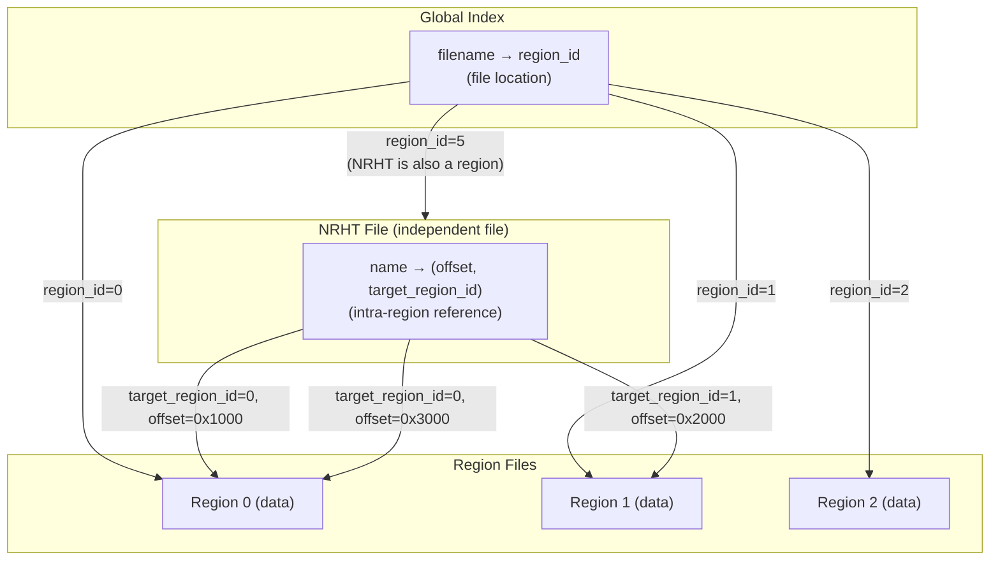
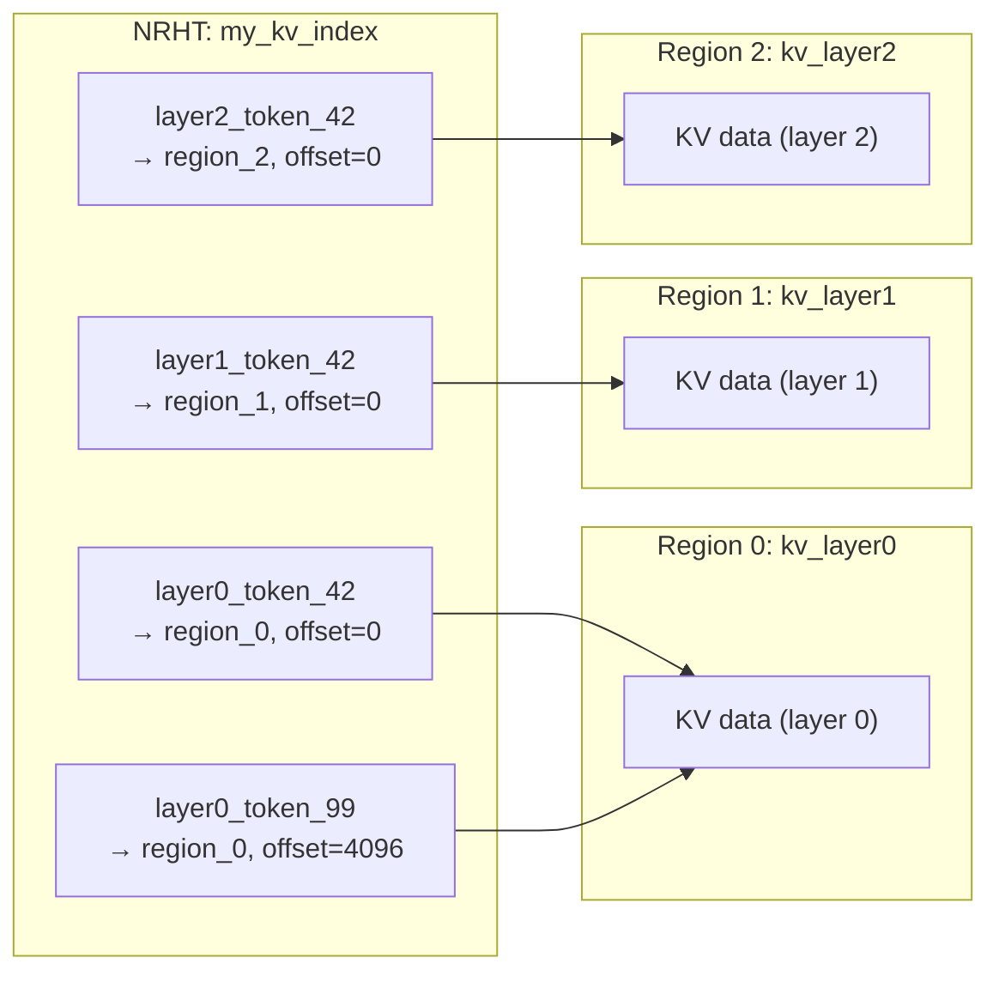

# Doc 4: NRHT Structure and Operations

> **Source files**: `nrht.c` (full implementation), `marufs_layout.h` (NRHT structs), `marufs_uapi.h` (ioctl definitions)

---

## 1. Overview

NRHT (Name-Ref Hash Table) is an independent CXL file that stores **name → (offset, target_region_id)** mappings. As an independent region with its own RAT entry, it can freely reference multiple data regions (N:M). Unlike the Global Index (file-level `filename → region_id`), NRHT manages application-level (KV cache keys, etc.) name-refs.

---

## 2. Physical Layout

An NRHT file is allocated as a regular region entry, with the hash table formatted inside its data area.



Hash routing (shard/bucket selection) and bucket chain structure are identical to the Global Index — see Doc 1.

---

## 3. Struct Details

### 3.1 NRHT Header (64B, 1 CL)

`marufs_nrht_header` — First 64B of the NRHT file. Describes the overall hash table geometry.

| Size | Field | Description |
|------|-------|-------------|
| 4B | `magic` | `MARUFS_NRHT_MAGIC` (0x4E524854 "NRHT") |
| 4B | `version` | Format version (1) |
| 4B | `num_shards` | Shard count (power of 2, max 64) |
| 4B | `buckets_per_shard` | Buckets per shard (power of 2) |
| 4B | `entries_per_shard` | Max entries per shard |
| 4B | `owner_region_id` | RAT entry ID of this NRHT file |
| 8B | `table_size` | Total NRHT allocation size (bytes) |
| 32B | `reserved` | Padding (64B alignment) |

**Usage**: `nrht_get_header()` — look up `phys_offset` from RAT entry → convert to DAX pointer → validate magic/version.

### 3.2 NRHT Shard Header (64B, 1 CL)

`marufs_nrht_shard_header` — Per-shard geometry + absolute offsets.

| Size | Field | Description |
|------|-------|-------------|
| 4B | `num_entries` | Max entries in this shard |
| 4B | `num_buckets` | Bucket count in this shard |
| 8B | `bucket_array_offset` | **Absolute** device offset of bucket array |
| 8B | `entry_array_offset` | Absolute offset of entry array |
| 4B | `free_hint` | Flat scan start hint (best-effort, no CAS needed) |
| 36B | `reserved` | Padding |

**Usage**: `nrht_get_shard_ctx()` — read shard header → convert offsets to DAX pointers → cache in `nrht_shard_ctx` struct. `free_hint` is read and updated by insert's flat scan (only advances on insert, delete does not touch it).

### 3.3 NRHT Entry (128B, 2 CL)

`marufs_nrht_entry` — Unified entry. CL0 is accessed on every chain walk, CL1 only on hash match.

| CL | Size | Field | Description |
|----|------|-------|-------------|
| CL0 | 4B | `state` | CAS target: EMPTY(0) / INSERTING(1) / VALID(2) / TOMBSTONE(3) |
| CL0 | 4B | `next_in_bucket` | Chain link (`BUCKET_END` = end) |
| CL0 | 8B | `name_hash` | 64-bit SHA-256 truncated hash |
| CL0 | 8B | `offset` | Offset within target region's data area |
| CL0 | 4B | `target_region_id` | RAT entry ID of referenced region |
| CL0 | 4B | `inserter_node` | Inserting node_id (for stale detection) |
| CL0 | 8B | `created_at` | Creation time ns (stale INSERTING timeout) |
| CL0 | 24B | `reserved0` | Padding (64B CL boundary) |
| CL1 | 64B | `name` | Null-terminated name (max 63 chars + NUL) |

The CPU fetches only the CLs actually accessed, so on hash mismatch during chain walk, only CL0 (64B) is read and CL1 (name) is not accessed. This achieves the same CL access pattern without separating into distinct arrays.

---

## 4. NRHT Entry Lifecycle

Same 4-state pattern as Global Index. Delete only transitions to TOMBSTONE; TOMBSTONE entries are reused in-place by the insert path.

### 4.1 State Transition Diagram



**Invariant**: Only INSERTING, VALID, TOMBSTONE exist in chains. EMPTY is always outside chains (flat scan only).

### 4.2 State Transition Details

| Transition | Event | CAS condition | Function |
|------------|-------|---------------|----------|
| EMPTY → INSERTING | Insert: flat scan | `CAS(state, EMPTY, INSERTING)` | `nrht_claim_entry()` |
| TOMBSTONE → INSERTING | Insert: chain reuse (in-place) | `CAS(state, TOMBSTONE, INSERTING)` | `nrht_claim_entry()` |
| INSERTING → VALID | Insert: publish after bucket link | `WRITE_ONCE(state, VALID)` | `marufs_nrht_insert()` |
| VALID → TOMBSTONE | Delete: logical delete | `CAS(state, VALID, TOMBSTONE)` | `marufs_nrht_delete()` |
| TOMBSTONE → EMPTY | Dup check: inline unlink (after removing from chain) | `CAS(state, TOMBSTONE, EMPTY)` | `nrht_check_duplicate()` |
| INSERTING → TOMBSTONE | GC Phase 4: stale reclaim | `CAS(state, INSERTING, TOMBSTONE)` | `marufs_nrht_gc_sweep_all()` |

### 4.3 Lifecycle Consistency with Global Index

| Item | Global Index | NRHT |
|------|-------------|------|
| Delete | CAS VALID→TOMBSTONE (stays in chain) | Same |
| Chain reuse targets | TOMBSTONE/EMPTY (first dead entry in-place reuse) | Same |
| TOMBSTONE → EMPTY | `check_duplicate` inline unlink (after removing from chain) | Same |
| Stale INSERTING | GC Phase 2: INSERTING→TOMBSTONE | GC Phase 4: INSERTING→TOMBSTONE |
| Orphan tracking | Phase 3 DRAM tracker | Same (MARUFS_ORPHAN_NRHT) |
| Post-insert dedup | `marufs_index_post_insert_dedup()` | `nrht_post_insert_dedup()` |
| Flat scan optimization | DRAM `atomic free_hint` | CXL shard header `free_hint` |

---

## 5. Operation Flowcharts

### 5.1 Init

`marufs_nrht_init()` — Format NRHT file.



**Two initialization paths**:
- **ftruncate path**: `ftruncate()` → CXL physical alloc → `NRHT_INIT` → format. Double-init prevention (magic check).
- **Direct alloc path**: `NRHT_INIT` detects no physical memory → auto-calls `marufs_region_init()`. Double-init check skipped in this case (stale magic from recycled region possible).

### 5.2 Insert

`marufs_nrht_insert()` — Register name → (offset, target_region_id).



**Slot claim priority**: Chain reuse (first dead entry — TOMBSTONE or EMPTY — in-place reuse, remaining dead entries are inline unlinked + transitioned to EMPTY) → Flat scan (starting from `free_hint`, O(1) amortized). Same pattern as Global Index `check_duplicate`.

**Post-insert dedup**: Concurrent insert race can publish two entries with the same name. Chain walk determines winner — **lower entry_idx wins**, higher one transitions itself to TOMBSTONE.

### 5.3 Lookup

`marufs_nrht_lookup()` — Look up (offset, target_region_id) by name.



### 5.4 Delete

`marufs_nrht_delete()` — CAS VALID → TOMBSTONE (logical delete only).



Delete only performs TOMBSTONE transition. Chain unlink and entry reuse are handled by the insert path's `check_duplicate` (in-place reuse or inline unlink). Completes in a single CXL write (CAS), and CAS includes an implicit full barrier so no separate WMB is needed.

---

## 6. Stale INSERTING Detection and GC

`nrht_is_stale()` — Pure function (no side effects) that determines staleness of INSERTING entries. Used in GC Phase 4.



**GC Phase 4** (`marufs_nrht_gc_sweep_all`): Enumerates NRHT regions from DRAM bitmap (`gc_nrht_bitmap`), sweeps ~25% of shards per cycle via `gc_epoch`-based round-robin. Stale entries are transitioned to TOMBSTONE (not EMPTY, because if a crash occurs after `link_to_bucket` but before `publish`, the entry may already be linked in the chain, and an EMPTY in the chain could be claimed by flat scan for a cross-bucket, causing chain corruption).

**Orphan handling**: Indeterminate cases where `node==0` or `created_at==0` are registered in the DRAM tracker via `marufs_gc_track_orphan(MARUFS_ORPHAN_NRHT)`. Claimed and reclaimed after 2-phase timeout in Phase 3 (see Doc 3).

---

## 7. CL0/CL1 Access Pattern

### 7.1 Access Sequence



Although each entry is 128B (2 CL), the CPU **fetches only the CLs actually accessed**.
During chain walk, if only CL0 is accessed, CL1 (name) is not fetched.
CL1 is read only on hash match for name comparison.
RMB is also applied selectively: `MARUFS_CXL_RMB(e, 64)` (CL0) / `MARUFS_CXL_RMB(&e->name, 64)` (CL1).

### 7.2 CL Access Comparison

| Scenario | CL0 reads | CL1 reads | Total CL reads |
|----------|-----------|-----------|----------------|
| Lookup miss (chain 3 hops) | 3 | 0 | 3 |
| Lookup hit (hit on 2nd hop) | 2 | 1 | 3 |
| Insert (dup check 3 hops + entry claim) | 3~4 | 0~1 | 4~5 |

---

## 8. Relationship with Global Index



- **Global Index**: `filename → region_id` (filesystem level — `open()`, `unlink()`, etc.)
- **NRHT**: `name → (offset, target_region_id)` (application level — KV cache keys, etc.)
- A single NRHT can **freely reference multiple regions** (N:M relationship)
- The NRHT file itself is a **regular region** registered in the Global Index (has its own RAT entry)

---

## 9. Multi-Region Binding Example

KV cache scenario: distribute per-layer KV tensors across multiple regions, unified indexing via a single NRHT.



**Usage flow**:

```
1. Create regions (per layer)
   fd_r0 = open("/mnt/marufs/kv_layer0", O_CREAT); ftruncate(fd_r0, 128MB);
   fd_r1 = open("/mnt/marufs/kv_layer1", O_CREAT); ftruncate(fd_r1, 128MB);

2. Create NRHT file + initialize
   fd_nrht = open("/mnt/marufs/my_kv_index", O_CREAT);
   ioctl(fd_nrht, MARUFS_IOC_NRHT_INIT, {max_entries: 8192, num_shards: 4});

3. Register name-ref
   ioctl(fd_nrht, MARUFS_IOC_NAME_OFFSET, {
       name: "layer0_token_42", offset: 0, target_region_fd: fd_r0
   });

4. Look up name-ref
   ioctl(fd_nrht, MARUFS_IOC_FIND_NAME, {name: "layer0_token_42"});
   // → offset=0, region_name="kv_layer0"
```

---

## 10. Sizing

Default configuration (num_shards=64). `bucket_array_size` is 64B boundary aligned.

| total entries | entries/shard | buckets/shard | NRHT Header + Shard Headers | Per-shard size | Total size |
|---------------|---------------|---------------|-------|-------|-------|
| 4,096 | 64 | 16 | 4,160B | 64B + 8KB = ~8KB | ~520KB |
| 32,768 | 512 | 128 | 4,160B | 512B + 64KB = ~65KB | ~4MB |
| 524,288 (default) | 8,192 | 2,048 | 4,160B | 8KB + 1MB = ~1MB | ~65MB |

- `entries_per_shard = max_entries / num_shards`
- `buckets_per_shard = entries_per_shard / 4` (default load factor), `roundup_pow_of_two()`
- Per-shard = `bucket_array(CL-aligned)` + `entries(E × 128B)`
- `num_shards` is specified in `NRHT_INIT` (default 64, max 64)

---

## 11. Dangling Reference Handling

If the region referenced by `target_region_id` in NRHT is deleted, a dangling reference occurs.

**Handling approach: Lazy validation**
- On insert: validates that `target_region_id`'s RAT state is `ALLOCATED` → otherwise `-EINVAL`
- On lookup: current implementation has no dangling check (caller's responsibility)
- NRHT file and region lifecycles are **completely independent** — deleting a region does not automatically clean up NRHT entries referencing it

---

## 12. Internal Function Summary

| Function | Role |
|----------|------|
| `nrht_get_header()` | RAT → phys_offset → DAX pointer → magic/version validation |
| `nrht_get_shard_ctx()` | Read shard header → entry array DAX pointer → `nrht_shard_ctx` |
| `nrht_resolve_bucket()` | Common prologue: hash → shard → determine bucket_head |
| `nrht_name_matches()` | CL1 RMB + hash compare + name compare |
| `nrht_is_stale()` | Same-node stale INSERTING detection (pure function, for GC integration) |
| `nrht_claim_entry()` | CAS INSERTING + inserter_node/created_at stamp |
| `nrht_check_duplicate()` | Chain walk: dup detection + record first dead entry (TOMBSTONE/EMPTY) for in-place reuse + inline unlink remaining dead entries |
| `nrht_find_chain()` | Chain walk: search VALID entry + return prev_next (prefetch optimized) |
| `nrht_link_to_bucket()` | CAS bucket prepend (publish is caller's responsibility) |
| `nrht_post_insert_dedup()` | Concurrent dup detection: higher entry_idx loses → TOMBSTONE |
| `marufs_nrht_init()` | NRHT format: parameter validation → size calculation → zero + header/shard/bucket init |
| `marufs_nrht_insert()` | Dup check → claim entry (dead chain reuse / flat scan with free_hint) → write fields → link → publish → dedup |
| `marufs_nrht_lookup()` | Resolve bucket → find chain → return offset/region_id |
| `marufs_nrht_delete()` | Resolve bucket → find chain → CAS VALID→TOMBSTONE (stays in chain) |
| `marufs_nrht_gc_sweep_all()` | Enumerate NRHT via RAT bitmap → shard round-robin sweep → stale INSERTING→TOMBSTONE + orphan tracking |
