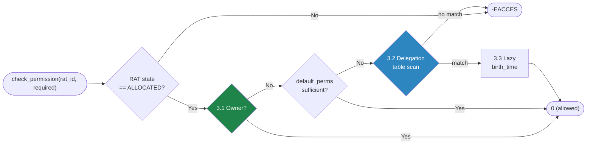
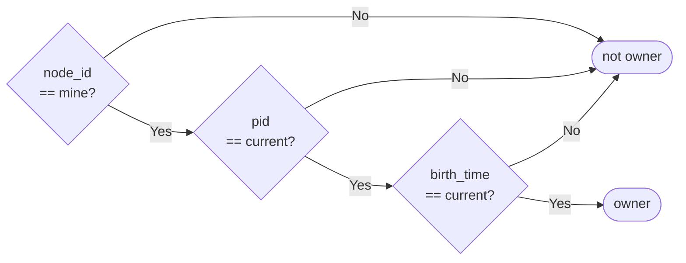
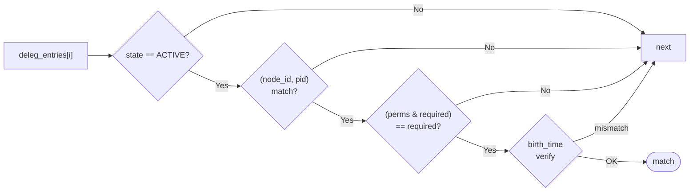
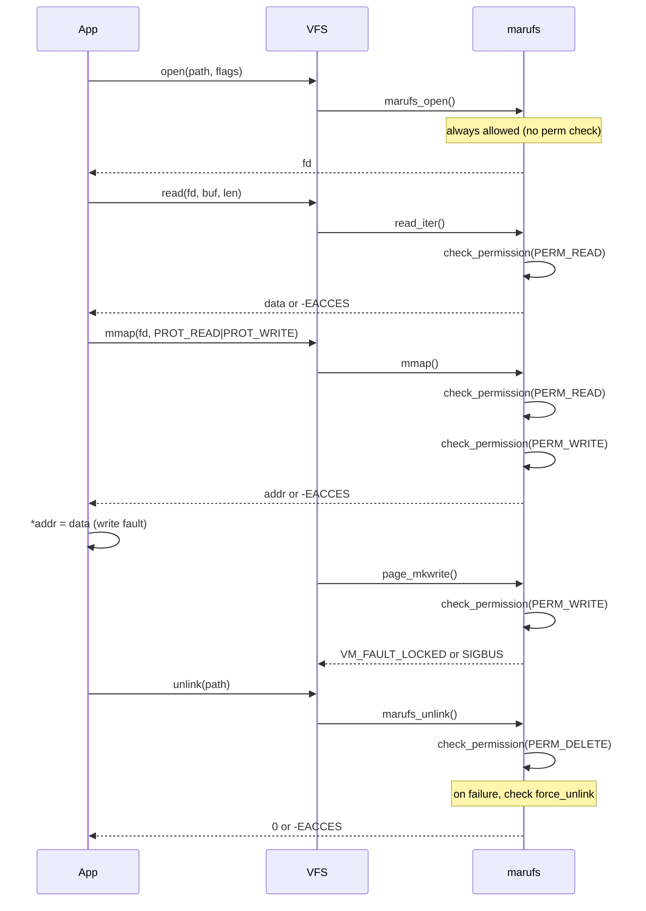
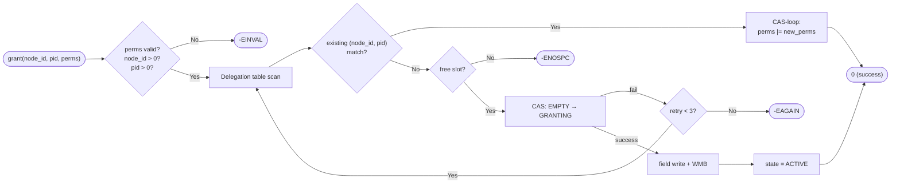
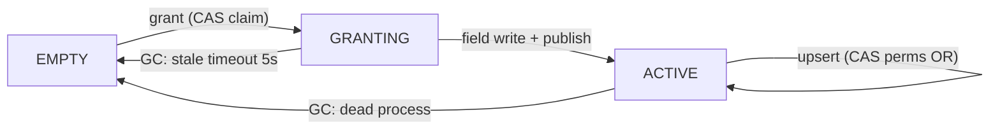
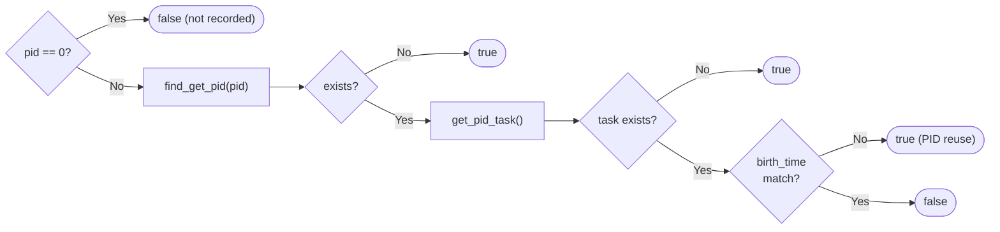

# Doc 5: ACL / Permission Model

> **Source files**: `acl.c` (permission check, delegation grant), `file.c` (check call sites, chown, perm_set_default), `dir.c` (unlink permission), `gc.c` (dead delegation sweep)

---

## 1. Overview

marufs access control operates at the **RAT entry level**. Each file (region) has one RAT entry, and ownership, default permission, and delegation table are all stored in that RAT entry's cachelines.

Key characteristics:
- **Permission check occurs at actual access time**, not at open() (mmap, read, page_mkwrite, etc.)
- **open() is always allowed** — supports challenge-response auth patterns
- **Owner has implicit ALL** — no separate permission bit check needed
- **Delegations are stored on CXL** — immediately visible cross-node

---

## 2. Permission Bits

| Bit | Value | Meaning | Check point |
|-----|-------|---------|-------------|
| `PERM_READ` | 0x01 | read(), mmap(PROT_READ) | `read_iter`, `mmap` |
| `PERM_WRITE` | 0x02 | mmap(PROT_WRITE), page_mkwrite | `mmap`, `page_mkwrite` |
| `PERM_DELETE` | 0x04 | unlink | `unlink` |
| `PERM_ADMIN` | 0x08 | chown, perm_set_default | `ioctl(CHOWN)`, `ioctl(PERM_SET_DEFAULT)` |
| `PERM_IOCTL` | 0x10 | name_offset, clear_name, etc. | `ioctl(NAME_OFFSET)`, `ioctl(CLEAR_NAME)` |
| `PERM_GRANT` | 0x20 | delegate to third parties | `ioctl(PERM_GRANT)` |
| `PERM_ALL` | 0x3F | all | — |

---

## 3. Permission Check Flow

**Function**: `marufs_check_permission()`



### 3.1 Owner Check (`marufs_is_owner`)

3-stage comparison defending against PID reuse:



- Reads `owner_node_id`, `owner_pid`, `owner_birth_time` from CL2
- RMB ensures fresh read from CXL

### 3.2 Delegation Table Scan

RAT entry CL3-CL31 holds up to 29 delegation entries. Sequential scan:



When `birth_time == 0`: delegation has been granted but the delegated process hasn't made its first access yet. Treated as match and lazy init is performed (3.3).

### 3.3 Lazy birth_time Init

Since the delegated process's `birth_time` may not be known at grant time (it could be a process on another node), it is stamped via CAS on first access:

```c
if (de->birth_time == 0)
    CAS(de->birth_time, 0, current->start_boottime);
```

After this, GC can determine dead processes via `birth_time`.

---

## 4. Permission Check Timing



**Why open() is always allowed**: In the pattern where a daemon creates a region and passes the fd to another process, the receiving process may not have a delegation at open time. After open, delegation is granted → permission check at subsequent mmap/read.

---

## 5. Delegation Grant Flow

**Function**: `marufs_deleg_grant()`, **ioctl**: `MARUFS_IOC_PERM_GRANT`

### 5.1 Permission Validation

The scope of grantable permissions depends on the requester's permissions:

| Requester permission | Grantable scope |
|---------------------|-----------------|
| Owner or ADMIN | All permissions (including ADMIN, GRANT) |
| GRANT | READ, WRITE, DELETE, IOCTL only (cannot grant ADMIN or GRANT itself) |
| Other | -EACCES |

### 5.2 Grant Flow



### 5.3 Delegation Entry State Transitions



| Transition | CAS condition | Function |
|------------|---------------|----------|
| EMPTY → GRANTING | `CAS(state, EMPTY, GRANTING)` | `marufs_deleg_grant()` |
| GRANTING → ACTIVE | `WRITE_ONCE(state, ACTIVE)` | `marufs_deleg_grant()` |
| ACTIVE → ACTIVE | `CAS-loop(perms, old, old\|new)` | `marufs_deleg_try_upsert()` |
| ACTIVE → EMPTY | `CAS(state, ACTIVE, EMPTY)` | `gc.c` delegation sweep |
| GRANTING → EMPTY | `CAS(state, GRANTING, EMPTY)` | `gc.c` delegation sweep |

---

## 6. Default Permission

**Function**: `marufs_ioctl_perm_set_default()`, **ioctl**: `MARUFS_IOC_PERM_SET_DEFAULT`

Requires ADMIN permission. Sets the `default_perms` field of the RAT entry, granting baseline permissions to all non-owners without delegation.

```c
WRITE_LE16(rat_entry->default_perms, perms);
MARUFS_CXL_WMB(rat_entry, sizeof(*rat_entry));
```

Common usage patterns:
- `default_perms = PERM_READ`: allow read from all nodes
- `default_perms = PERM_READ | PERM_WRITE`: allow read/write from all nodes
- `default_perms = 0`: only owner and delegated processes can access

---

## 7. Dead Process Detection

**Function**: `marufs_owner_is_dead()`



Detects PID reuse via `birth_time` comparison. Uses `start_boottime` (monotonic from boot), so collision probability is extremely low even after reboot.

---

## 8. CXL Storage Locations

Permission-related fields are distributed across the RAT entry:

| CL | Field | Purpose |
|----|-------|---------|
| CL2 | `default_perms` (2B) | non-owner baseline |
| CL2 | `owner_node_id` (2B) | owner node |
| CL2 | `owner_pid` (4B) | owner process |
| CL2 | `owner_birth_time` (8B) | PID reuse defense |
| CL2 | `uid`, `gid`, `mode` (8B) | POSIX compatibility (future) |
| CL2 | `deleg_num_entries` (2B) | active delegation count |
| CL3-CL31 | `deleg_entries[29]` (29 × 64B) | delegation table |

Owner check (CL2) and delegation scan (CL3+) are in separate CLs, so the owner fast-path fetches only CL2.

---

## 9. Internal Function Summary

| Function | Role |
|----------|------|
| `marufs_check_permission()` | Unified permission check: owner → default → delegation |
| `marufs_is_owner()` | 3-stage owner detection (node_id → pid → birth_time) |
| `marufs_deleg_matches()` | Delegation entry matching (node_id + pid + birth_time + perms) |
| `marufs_deleg_grant()` | Delegation grant: upsert or new entry CAS claim |
| `marufs_deleg_try_upsert()` | Delegation table scan: perms OR on existing match, else return free slot |
| `marufs_deleg_entry_clear()` | Delegation entry field reset (state is caller's responsibility) |
| `marufs_owner_is_dead()` | PID lookup + birth_time comparison for dead process detection |
| `marufs_ioctl_perm_set_default()` | Set default_perms (requires ADMIN) |
