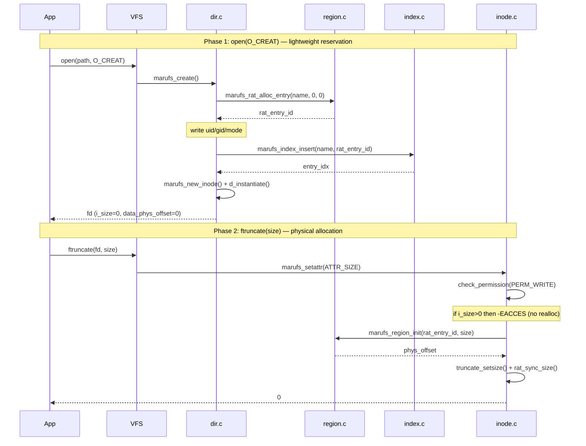
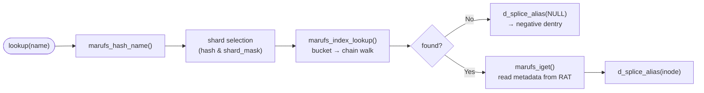
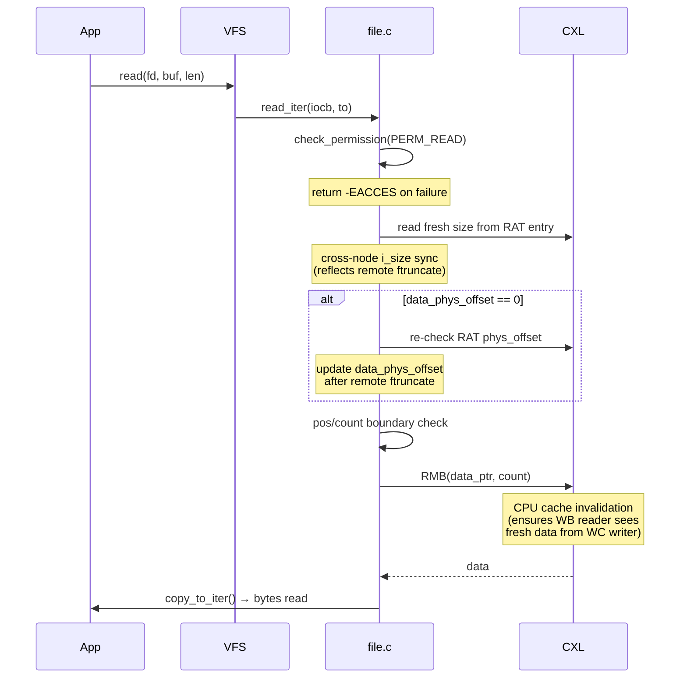
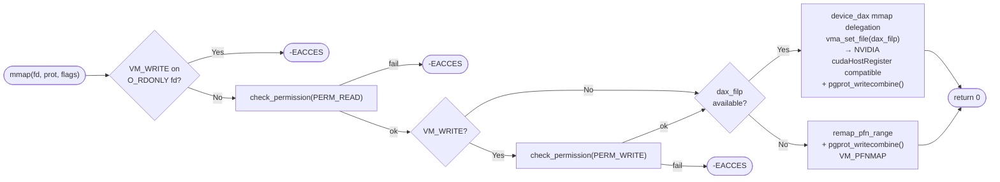
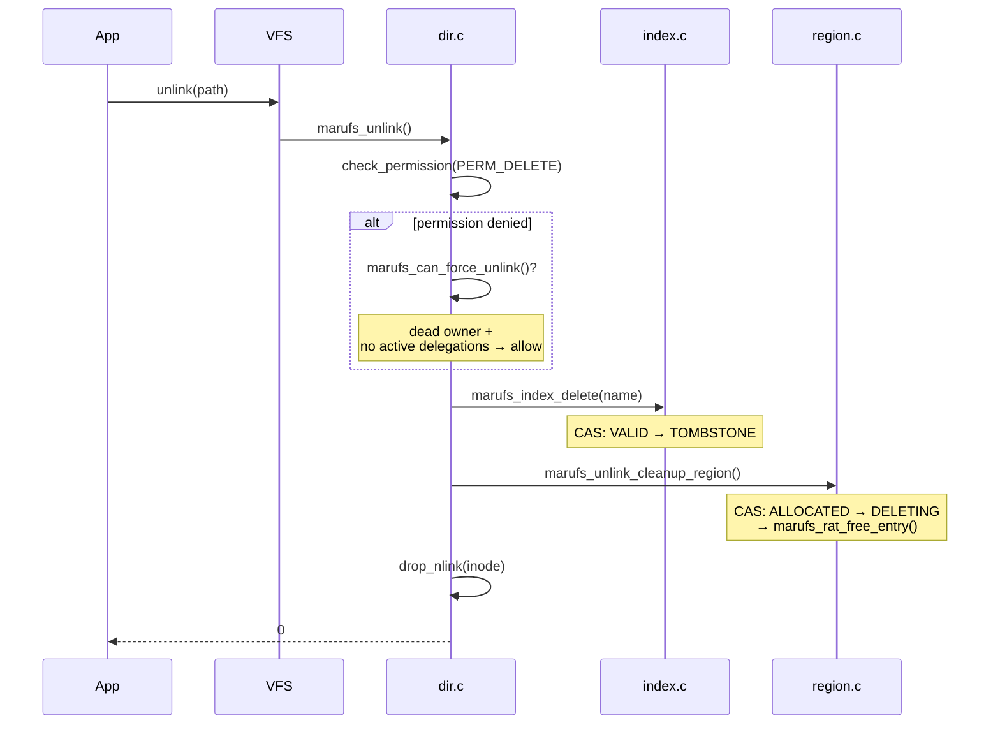
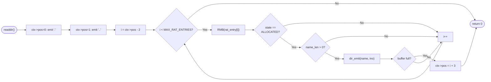
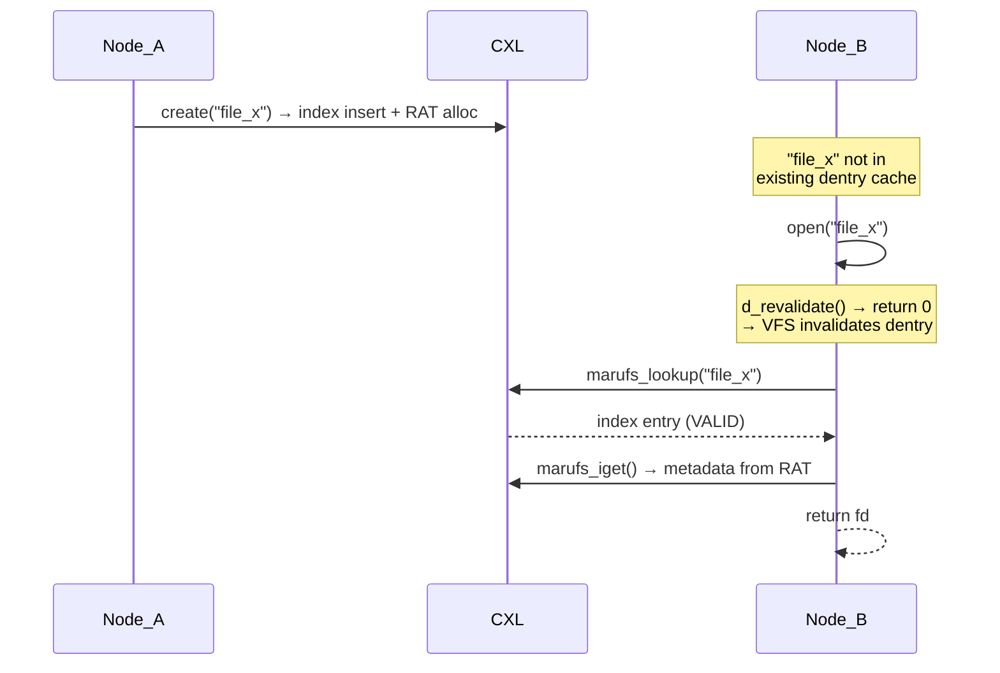

# Doc 6: Mount/Unmount & I/O Flow

> **Source files**: `super.c` (mount/unmount, format), `file.c` (read_iter, mmap, open/release), `dir.c` (create, unlink, readdir, lookup), `inode.c` (iget, setattr, cross-node i_size sync)

---

## 1. Overview

The system-level lifecycle of marufs consists of **mount → file I/O → unmount**. At mount, CXL memory is mapped and metadata structures are validated; at unmount, resources are released in reverse order.

Key characteristics:
- **CXL DAX device based**: DEV_DAX character device (`/dev/daxN.M`) directly mapped via `memremap`
- **Two-phase create**: `open(O_CREAT)` → RAT reservation + index insert (lightweight), `ftruncate()` → region allocation (physical space)
- **d_revalidate=0**: VFS dentry cache invalidation ensures cross-node consistency

---

## 2. Mount Options

| Option | Format | Description |
|--------|--------|-------------|
| `node_id` | `node_id=N` (N > 0) | Node ID for multi-node access control |
| `daxdev` | `daxdev=/dev/daxN.M` | DEV_DAX character device path |
| `format` | `format` | Perform format at mount time |

---

## 3. Mount Flow

**Function**: `marufs_fill_super()` → `marufs_fill_super_common()`

```mermaid
flowchart LR
  Parse["Parse mount options"] --> DevDAX["DEV_DAX init"]

  DevDAX --> Format{"format option?"}
  Format -->|Yes| DoFormat["marufs_format_device()"]
  Format -->|No| SkipFormat["Skip (preserve existing data)"]

  DoFormat --> ReadSB
  SkipFormat --> ReadSB

  ReadSB["Load + validate superblock"] --> ActiveNodes["active_nodes_set<br/>(duplicate mount detection)"]

  ActiveNodes --> ShardTable["Build shard_cache (DRAM)"]

  ShardTable --> RAT["Load + validate RAT"]

  RAT --> VFS["Configure VFS superblock"]

  VFS --> RootInode["Create root inode"]

  RootInode --> Cache["Init entry cache"]

  Cache --> Sysfs["Register sysfs"]

  Sysfs --> GC["Start GC thread"]
```

### 3.1 DEV_DAX Memory Mapping

`marufs_dax_acquire_devdax()`:

1. Read physical address (`resource`) and size (`size`) from sysfs
2. `memremap(phys_addr, dev_size, MEMREMAP_WB)` → `sbi->dax_base`
3. `pfn_valid()` → detect ZONE_DEVICE struct pages (determines `VM_MIXEDMAP` for GPU DMA)
4. Open DAX device file (`sbi->dax_filp`) → for mmap delegation to device_dax driver
5. Store `sbi->phys_base` (for remap_pfn_range fallback)

User mmap delegates to device_dax driver for WC (Write-Combining) pgprot. NVIDIA driver recognizes device_dax VMAs, enabling `cudaHostRegister`.

### 3.2 Format Procedure (`marufs_format_device`)

Initializes the entire CXL memory metadata area during format:

1. **Zero clear**: `memset` + WMB
2. **Superblock**: magic, version, total_size, shard geometry
3. **Shard table**: per-shard header (magic, bucket/entry array offsets)
4. **Bucket arrays**: initialize all to `MARUFS_BUCKET_END`
5. **Entry arrays**: zero (ENTRY_EMPTY = 0)
6. **RAT**: magic, version, regions_start, total_free
7. **Verification readback**: RMB then re-verify critical fields

---

## 4. Unmount Flow

**Function**: `marufs_kill_sb()`

Key ordering constraints:
- **GC must stop first**: If GC is iterating RAT/index when the mapping is released → panic
- **active_nodes_clear → sysfs/cache release → DAX release**: Notify other nodes of unmount before releasing resources

---

## 5. File I/O Paths

### 5.1 Create (Two-Phase Model)

**Function**: `marufs_create()` (Phase 1), `marufs_setattr()` (Phase 2)

Phase 1 failure rollback:
- index insert failure → `marufs_rat_free_entry()`
- inode creation failure → `marufs_index_delete()` + `marufs_rat_free_entry()`

### 5.2 Lookup

**Function**: `marufs_lookup()`

`marufs_iget()` **always performs a fresh read from CXL**:
- Even cached inodes re-read `i_size`, `data_phys_offset`, ownership from RAT
- Returns `-ESTALE` if GC has freed the RAT entry

### 5.3 Read

**Function**: `marufs_read_iter()`

**Direct read** — bypasses page cache, copies directly from CXL memory via `copy_to_iter()`:
- Copies directly from `sbi->dax_base + data_phys_offset + pos`
- RMB ensures cross-node freshness

### 5.4 mmap

**Function**: `marufs_mmap()`

Page fault paths after mmap:

| Fault type | Handler | Behavior |
|-----------|---------|----------|
| Read fault | `marufs_fault()` → `filemap_fault()` | Map page from page cache |
| Write fault | `marufs_page_mkwrite()` | `check_permission(PERM_WRITE)` → page lock → dirty marking |

### 5.5 Unlink

**Function**: `marufs_unlink()`

Deletion order constraint: **index TOMBSTONE first → RAT FREE** (reversing would create dangling reference). If CAS `ALLOCATED→DELETING` fails in `marufs_unlink_cleanup_region()`, GC is assumed to have already handled it, skip.

---

## 6. Readdir

**Function**: `marufs_iterate()`

RAT-based readdir — iterates only the RAT entry array (256 entries) instead of the index entry array (4 shards × 256 = 1024):

`ctx->pos` encoding: `0`=`.`, `1`=`..`, `2+i`=RAT entry[i]. When VFS re-enters after buffer full, it resumes from the saved pos.

---

## 7. d_revalidate=0 — Cross-Node Consistency

Since `marufs_d_revalidate()` always returns 0, **every open() performs a fresh lookup from CXL**. This means:
- create/unlink from other nodes is immediately visible
- Dentry cache performance loss exists, but CXL latency (~200ns) makes it practical
- `i_size` for already-opened fds is separately refreshed from RAT in `read_iter()`

---

## 8. Cross-Node i_size Synchronization

Path for a local node to observe size set by a remote node's `ftruncate()`:

| Timing | Function | Behavior |
|--------|----------|----------|
| `open()` → lookup | `marufs_iget()` → `marufs_inode_fill_from_entry()` | RAT `size` field → `inode->i_size` |
| `read()` | `marufs_read_iter()` | RAT `size` re-read → `i_size_write()` |
| `stat()` | `marufs_getattr()` | RAT `size` re-read → `inode->i_size` |
| write-back | `marufs_write_inode()` → `marufs_rat_sync_size()` | `inode->i_size` → RAT `size` + `modified_at` |

`data_phys_offset` is refreshed the same way: in `read_iter()`, if `xi->data_phys_offset == 0`, RAT `phys_offset` is re-checked to detect whether the region has been initialized after a remote ftruncate.

---

## 9. Internal Function Summary

### Mount/Unmount

| Function | Role |
|----------|------|
| `marufs_fill_super()` | Mount entry point: option parsing, DAX init, format, call common |
| `marufs_fill_super_common()` | superblock → active_nodes_set → shard table → RAT → VFS → root inode → cache → sysfs → GC |
| `marufs_kill_sb()` | Unmount: GC stop → active_nodes_clear → sysfs → cache → shard resources → dax_filp close → DAX memunmap |
| `marufs_dax_acquire_devdax()` | Read sysfs phys/size → memremap(WB) → ZONE_DEVICE detection |
| `marufs_dax_release()` | `memunmap(dax_base)` |
| `marufs_format_device()` | superblock/shard/bucket/RAT init + WMB + readback verification |
| `marufs_read_superblock()` | magic/version validation, geometry copy to sbi |
| `marufs_init_shard_table()` | shard header validation, build shard_cache (DRAM) |
| `marufs_load_rat()` | RAT magic/version validation, set sbi->rat |
| `marufs_active_nodes_set()` | CAS to set active_nodes bit (duplicate mount detection) |
| `marufs_active_nodes_clear()` | CAS to clear active_nodes bit |

### File I/O

| Function | Role |
|----------|------|
| `marufs_open()` | `generic_file_open()` + allocate batch buffer (`marufs_file_priv`) |
| `marufs_release()` | Free batch buffer (`kvfree(private_data)`) |
| `marufs_read_iter()` | PERM_READ check → cross-node size sync → CXL direct copy |
| `marufs_write_iter()` | Rejects `write()` syscall (`-EACCES`) |
| `marufs_mmap()` | PERM_READ/WRITE check → device_dax mmap delegation |
| `marufs_fault()` | Delegates to `filemap_fault()` (page cache read fault) |
| `marufs_page_mkwrite()` | PERM_WRITE check → page lock → dirty marking |
| `marufs_read_folio()` | zero-fill (data is populated via mmap write) |
| `marufs_ioctl()` | NRHT, permission, chown, etc. |

### Directory

| Function | Role |
|----------|------|
| `marufs_lookup()` | Global index hash lookup → `marufs_iget()` |
| `marufs_create()` | Two-phase Phase 1: RAT reservation + index insert |
| `marufs_unlink()` | PERM_DELETE check → index TOMBSTONE → RAT DELETING→FREE |
| `marufs_iterate()` | RAT-based readdir (iterate 256 entries) |

### Inode

| Function | Role |
|----------|------|
| `marufs_iget()` | index entry + RAT → create/refresh VFS inode (cross-node fresh read) |
| `marufs_new_inode()` | Create new VFS inode (caller fills region_id, etc.) |
| `marufs_setattr()` | Two-phase Phase 2: realloc check → `marufs_region_init()` → size sync |
| `marufs_getattr()` | Fresh size read from RAT → `generic_fillattr()` |
| `marufs_write_inode()` | `marufs_rat_sync_size()` — write size + modified_at to RAT |
| `marufs_evict_inode()` | Page cache truncate + `clear_inode()` |
