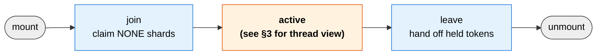
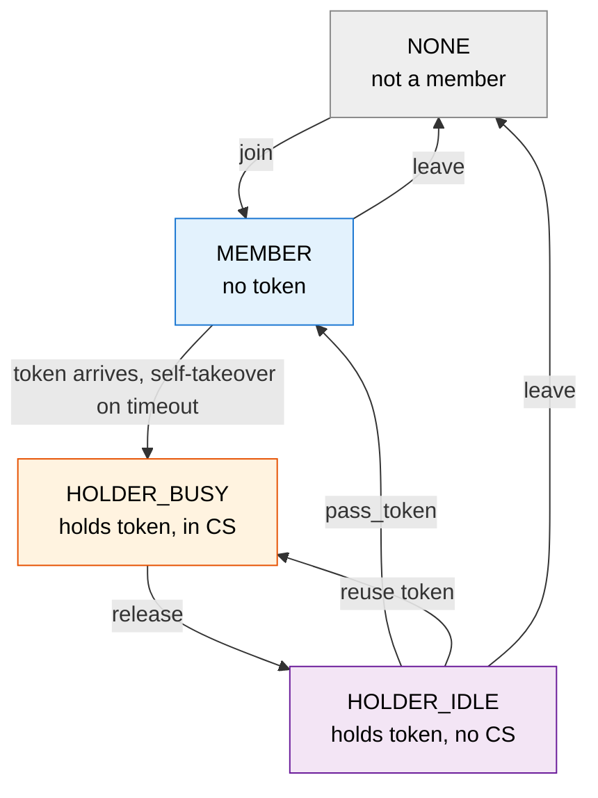
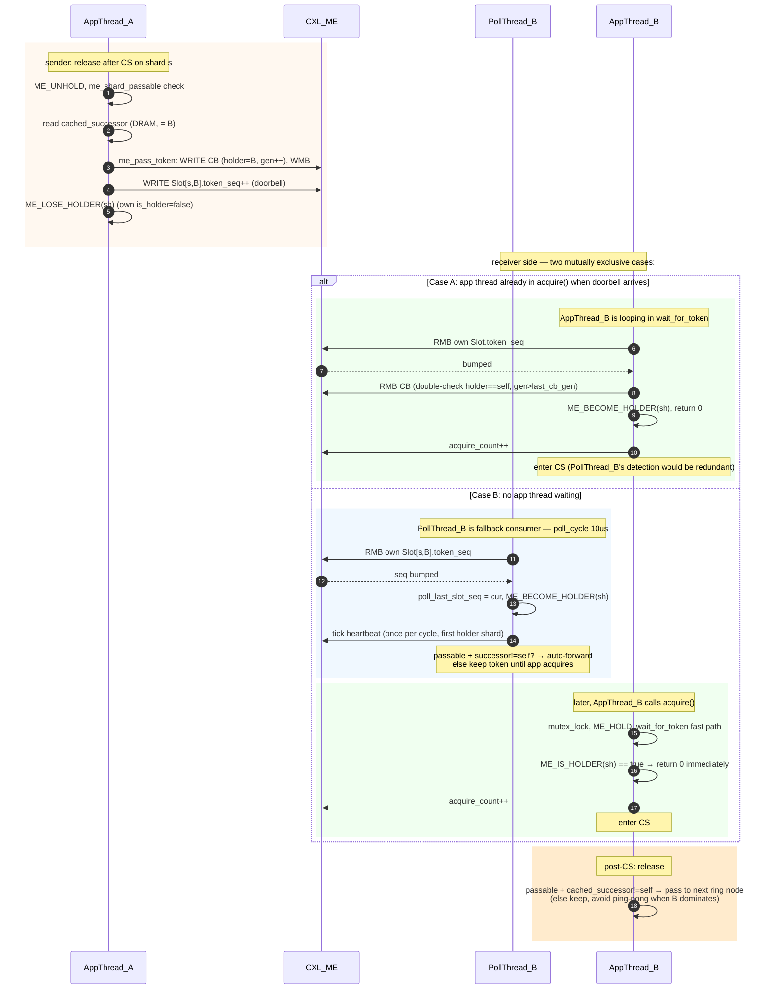
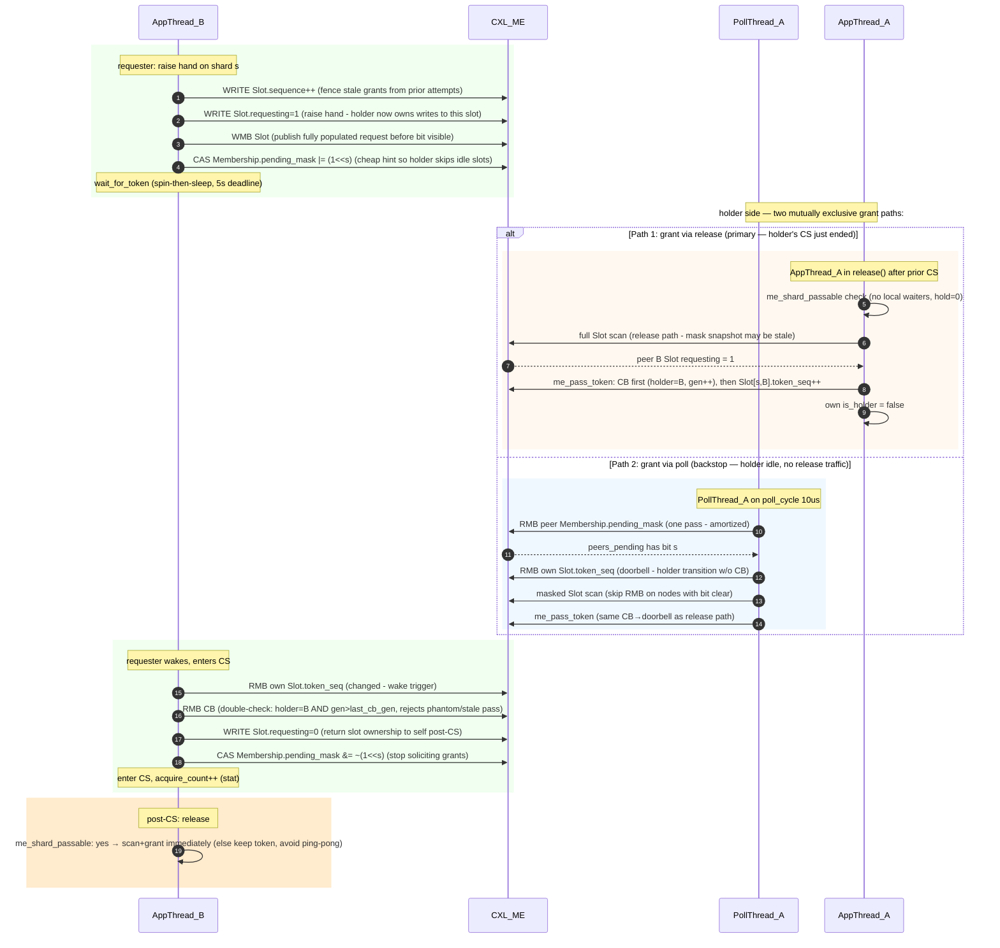
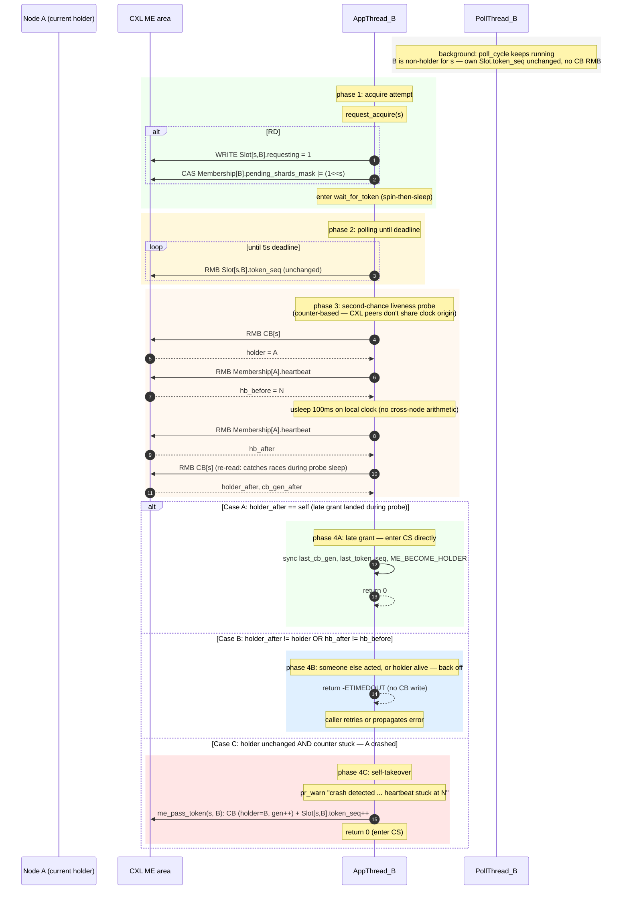

# ME Protocol: Token Lifecycle

Cross-node mutual exclusion via CXL shared memory. Two strategies (order-driven, request-driven) share the same layout and differ only in **who's-next** decision.

Source: `src/me.h`, `src/me.c`, `src/me_order.c`, `src/me_request.c`.

---

## 1. Shared State Layout

Physical byte layout:

```
[Header 64B] [CB × S] [Membership × N] [Slot × S × N]
```

| Struct | Scope | Writer | Reader | Purpose |
|---|---|---|---|---|
| `marufs_me_header` | area | formatter | all | magic/offsets/`format_generation` |
| `marufs_me_cb` | per-shard | current holder | all | `magic`, `holder`, `generation`, `acquire_count` (reserved `state` field is on-disk but currently unused) |
| `marufs_me_membership_slot` | per-node | own node | all | `magic`, `status`, `node_id`, `joined_at`, `heartbeat`, `heartbeat_ts`, `pending_shards_mask` |
| `marufs_me_slot` | per-(shard, node) | see below | target node | `magic`, `from_node`, doorbell (`token_seq`, `cb_gen_at_write`) + request payload (`sequence`, `requesting`, `requested_at`, `granted_at`) |

**Slot writer rule**:
- OD (token arrival): **current holder** writes successor's slot (`token_seq`, `cb_gen_at_write`).
- RD (hand-raise): **requester** writes own slot (`requesting=1`, `sequence`, `requested_at`).
- RD (grant): **current holder** writes requester's slot (`granted_at`, then OD-style `token_seq` bump).

Invariant: each slot has at most **1 writer / 1 reader** at any moment → no multi-host hot-polling of a shared CL.

---

## 2. Overview

Two abstraction levels: per-node lifecycle (coarse phases from mount to unmount) and per-(shard, node) state machine (fine-grained token ownership states within steady state). Thread-level sequence and memory-level byte evolution live in §3.

### 2.1 Lifecycle (per node)

Coarse-grained phases of a single node from mount to unmount. The `steady state` phase is where all useful work happens — §2.2 defines per-shard states within that phase.



### 2.2 State Machine (per shard, per node)



Crash recovery: no dedicated state transition on remote-holder death. A thread calling `acquire` in the MEMBER state times out in `wait_for_token`, checks the holder's `heartbeat_ts` stall, runs `me_pass_token(self)`, and transitions to HOLDER_BUSY. No distributed watcher — the blocked acquirer is the only trigger.

## 3. Thread Interaction & Memory Access

### 3.1 Order-Driven: Token Pass (A → B)

OD token circulates autonomously — receiver doesn't ask. PollThread_B has real work (flip `is_holder` even when no app thread waits).



**Memory access summary**:
- A reads: own `CB[s].holder` (confirm self), `cached_successor` (DRAM).
- A writes: `CB[s]` (holder, gen), then `Slot[s,B]` (doorbell). CB first so any reader seeing new `token_seq` is guaranteed to see fresh CB.
- B reads: `Slot[s,B].token_seq` (poll), `CB[s]` (double-check).
- B writes: nothing until post-CS release.

**OD-specific characteristics**:
- No `requesting` / `pending_shards_mask` writes — token flows purely on ring order.
- Holder picks successor from `cached_successor` (DRAM, refreshed by poll's `next_active` scan) — no request slot scan.
- Release decision: pass if passable AND `cached_successor != self`; keep-token if local app hot (avoid cross-node ping-pong).
- **Receiver-side detection is shared**: both RD and OD use the same `wait_for_token` — if an app thread is already waiting when the doorbell arrives, it detects the `token_seq` bump itself (slow-path loop) and flips `is_holder`. Poll thread's detection is redundant in that case.
- **Poll thread's OD-unique role**: token can arrive at a node with **no local waiter** (OD doesn't require a request). PollThread_B is then the sole consumer — flips `is_holder`, ticks heartbeat, and may auto-forward to the next ring node (autonomous circulation). If an app thread shows up later, `wait_for_token` fast path (`ME_IS_HOLDER`) returns immediately without CB RMB.

---

### 3.2 Request-Driven: Request + Grant (B wants token from A)

app thread = VFS-side `acquire/release`. poll thread = `poll_cycle` on `MAppThread_BUFS_ME_DEFAULT_POLL_US` period (10µs default). **CB is written only on grant, read only on grant/takeover check**. Steady-state path polls per-node slot + membership only.



**Memory access summary**:
- B writes (raise hand): `Slot[s,B].{sequence, requesting, requested_at}`, then `Membership[B].pending_shards_mask` bit.
- A reads (scan): `Slot[s, idx].requesting` for `idx = me_idx+1 .. max_nodes` (round-robin).
- A writes (grant): `Slot[s,B].granted_at`, then CB (`holder`, `gen++`), then `Slot[s,B].token_seq++` (doorbell).
- B reads (wake): `Slot[s,B].token_seq`, `CB[s]`.
- B writes (post-CS): `Slot[s,B].requesting = 0`, then clear mask bit.

**Writer ownership split of `Slot[s,B]`** (governed by `requesting`):
- `requesting == 0` → **owner B** writes (raise hand).
- `requesting == 1` → **holder A** writes (grant + doorbell).

**RD-specific characteristics**:
- Requester: single app-thread path — set `pending_shards_mask` bit after slot WMB (CAS, 64-retry bound).
- Holder: `release()` immediate path = **full slot scan** (avoids missing a request due to mask snapshot skip), `poll_cycle` path = **mask-filtered scan** (skip slot RMB on nodes with bit clear).
- poll thread: detects holder transition via own slot `token_seq` bump (no CB RMB). After `is_holder=true` flip, takes on heartbeat + grant duties from the same cycle onward.
- Crash detection: no distributed watch in poll. A blocked acquirer hits `wait_for_token` timeout, checks holder's `heartbeat_ts` stall → self-takeover (`me_pass_token(s, self)`).

---

### 3.3 Cacheline Snapshot — Before / After 1 Token Pass

Concrete CL value transitions, complementing §3.1/3.2 sequence diagrams. 2-node example (A=1, B=2) for some shard s, starting gen=5, starting `token_seq` at B = 99.

**Order-driven: A holds, passes to B (A idle, poll_cycle)**

| CL | Field | Before | After step 1 (CB) | After step 2 (doorbell) | Writer |
|---|---|---|---|---|---|
| CB | `holder` | 1 | **2** | 2 | A |
| CB | `generation` | 5 | **6** | 6 | A |
| CB | `acquire_count` | 42 | 42 | 42 | — |
| Slot[A] | `token_seq` | 100 | 100 | 100 | — |
| Slot[B] | `token_seq` | 99 | 99 | **100** | A |
| Slot[B] | `cb_gen_at_write` | 4 | 4 | **6** | A |
| Slot[B] | `from_node` | — | — | **1** | A |
| A DRAM | `sh.is_holder` | true | true | **false** | A (local) |
| B DRAM | `sh.is_holder` | false | false | false → **true** (on next poll) | B (local) |

Ordering: CB WMB precedes Slot WMB. Any reader seeing the new `token_seq` on Slot[B] is guaranteed to see `holder=2, gen=6` on CB.

**Request-driven: B raises hand, A grants**

| CL | Field | T0 (idle) | T1 (raise hand) | T2 (grant) | T3 (post-CS) | Writer |
|---|---|---|---|---|---|---|
| Slot[B] | `sequence` | n | **n+1** | n+1 | n+1 | B |
| Slot[B] | `requesting` | 0 | **1** | 1 | **0** | B |
| Slot[B] | `requested_at` | — | **now_ns** | now_ns | now_ns | B |
| Slot[B] | `granted_at` | — | — | **now_ns** | now_ns | A |
| Slot[B] | `token_seq` | 99 | 99 | **100** | 100 | A |
| Slot[B] | `cb_gen_at_write` | 4 | 4 | **6** | 6 | A |
| Slot[B] | `from_node` | — | — | **1** | 1 | A |
| Membership[B] | `pending_shards_mask` | old | **old \| (1<<s)** | old \| (1<<s) | **old & ~(1<<s)** | B |
| CB | `holder` | 1 | 1 | **2** | 2 | A |
| CB | `generation` | 5 | 5 | **6** | 6 | A |
| CB | `acquire_count` | 42 | 42 | 42 | **43** | B |

Writer rotation on Slot[B] (governed by `requesting`):
- T1: **B** writes (owner raises hand).
- T2: **A** writes (holder grants; B's `requesting=1` is a barrier — B won't touch slot).
- T3: **B** writes again (post-CS cleanup).

Ordering invariant: B's `pending_shards_mask` bit is set AFTER Slot WMB, so any A that sees the bit is guaranteed to see `requesting=1` on targeted RMB.

---

### 3.4 Acquire Timeout: Crash vs. Busy Holder

Scenario: B's app thread calls `acquire(s)` but 5s deadline expires without token arrival. Two causes, distinguished by holder's heartbeat freshness.



Key properties:
- **No distributed watch**. poll_cycle RMBs only own doorbell slot + peer membership (for successor+pending). It never touches CB.
- **Acquirer is the detector**. An idle shard with no waiter is not monitored; first acquirer arrival triggers the check.
- **Counter-based liveness**. Compares holder's `heartbeat` counter before/after a 100ms observer-local sleep. Counter advance ⇒ alive; stuck ⇒ crashed. `heartbeat_ts` is observability-only — not used for decision since CXL peers don't share a `ktime_get_ns()` zero point (per-node boot times differ, direct subtraction is meaningless).
- **Why 100ms probe**. Holder ticks heartbeat on every poll cycle (10µs default). 100ms = 10000× safety margin — survives severe scheduler stalls, preemption, brief IRQ storms. Longer window delays takeover but avoids false-positive crash calls.
- **Generation-fence safety** (Case A only). `me_pass_token(s, self)` bumps `cb->generation` — any in-flight doorbell from A (if A revives) fails the reader's `cb_gen > last_cb_gen` check and is rejected as stale.
- **Heartbeat location**. Lives in `Membership[A]`, not CB — A's liveness ticks (when alive) don't invalidate CB's read-mostly CL.

---

## 4. Stats & Bench Integration

Three sysfs entries expose ME runtime counters, per-sbi and aggregated across registered MEs. Writing any value resets the writable ones.

| Sysfs attr | Mode | Scope |
|---|---|---|
| `/sys/fs/marufs/me_info` | rw | per-instance snapshot (holder/gen/heartbeat) |
| `/sys/fs/marufs/me_poll_stats` | rw | coarse poll-thread cost (RMB counts, cycle ns) |
| `/sys/fs/marufs/me_fine_stats` | rw | per-CPU fine-grained — wait latencies, poll-phase breakdown, lock hold, grant age |
| `/sys/fs/marufs/me_per_shard_acquire` | ro | per-shard acquire counter (hotspot detection) |
| `/sys/fs/marufs/me_poll_thread_cpu` | ro | poll kthread CPU usage |

### 4.1 `me_poll_stats` (coarse)

| Counter | Increment site |
|---|---|
| `poll_cycles` | once per `poll_cycle` invocation |
| `poll_ns_total` | ktime delta summed per cycle |
| `poll_rmb_cb` | `me_pass_token` CB magic check — **not** on steady-state poll path |
| `poll_rmb_slot` | every `RMB(Slot[...])` (own doorbell + grant scan + pass-token) |
| `poll_rmb_membership` | every `RMB(Membership[...])` (heartbeat tick + peer pass) |

### 4.2 `me_fine_stats` (per-CPU, aggregated on read)

From `struct marufs_me_stats_pcpu`:

| Counter | Meaning |
|---|---|
| `wait_count`, `wait_wall_ns`, `wait_cpu_ns` | `wait_for_token` invocations, wall + on-CPU time |
| `wait_fast_hit` | `ME_IS_HOLDER` early-return (no token wait) |
| `wait_spin_hit` / `wait_sleep_hit` / `wait_deadline_hit` | exit-reason split |
| `wait_lat_buckets[12]` | log2(ns) histogram, [<128ns .. ≥128ms] |
| `poll_ns_membership` / `poll_ns_doorbell` / `poll_ns_scan` | poll-cycle phase breakdown |
| `lock_hold_count`, `lock_hold_ns_total`, `lock_hold_buckets[12]` | CS hold time (mutex_lock → mutex_unlock) |
| `grant_age_count`, `grant_age_buckets[12]` | RD `granted_at - requested_at` histogram |

### 4.3 Bench Integration

`tests/test_nrht_race --sweep` reads counters before/after each run and reports per-cycle rates — `cb/c`, `slot/c`, `mem/c` from `me_poll_stats`; `wait_avg`, `spin%`, `fast%`, `hold_avg`, `grant`, `poll_cpu%`, `mem%`/`door%`/`scan%` from `me_fine_stats`. Per-cycle rates are the fair comparison metric — absolute totals shift with cycle count (faster poll = more cycles even if the RMB-per-cycle workload dropped).

Steady-state expectation after doorbell + mask optimizations:
- `cb/c` ≈ 0 (CB RMB only on grant/takeover/invalidate/crash-probe)
- `slot/c` ≈ `S` (own doorbell per shard) + grant scans (masked)
- `mem/c` ≈ `N` (one membership pass per cycle) + 1 (holder heartbeat RMB)
- `fast%` > 0 under keep-token-dominant workloads; `wait_deadline_hit` ≈ 0 in healthy runs.

---

## References

- `src/me.h` — CXL structs, DRAM companion `struct marufs_me_shard`, inlines, vtable, pending-mask CAS.
- `src/me.c` — lifecycle, common primitives, poll registry, `wait_for_token` + `me_handle_acquire_deadline` (counter-based crash probe).
- `src/me_order.c` — order-driven vtable.
- `src/me_request.c` — request-driven vtable, masked/full scan variants.
- `src/sysfs.c` — `me_poll_stats`, `me_info`.
- `tests/test_nrht_race.c` — bench harness with poll-stats integration.
- `docs/4_arch_nrht.md` — NRHT ME integration (per-shard ME instances).
