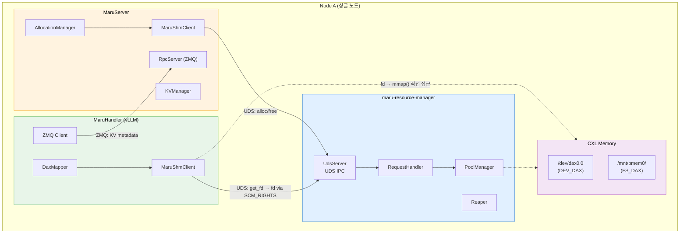
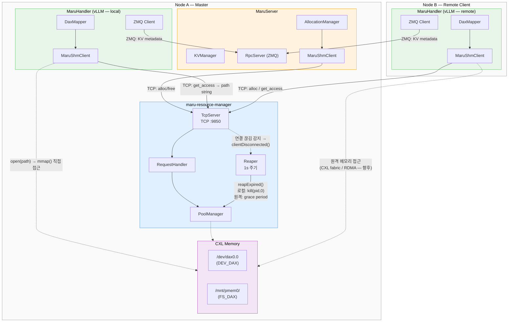
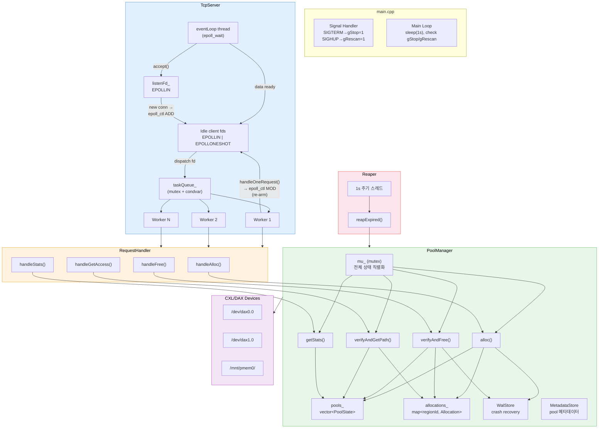
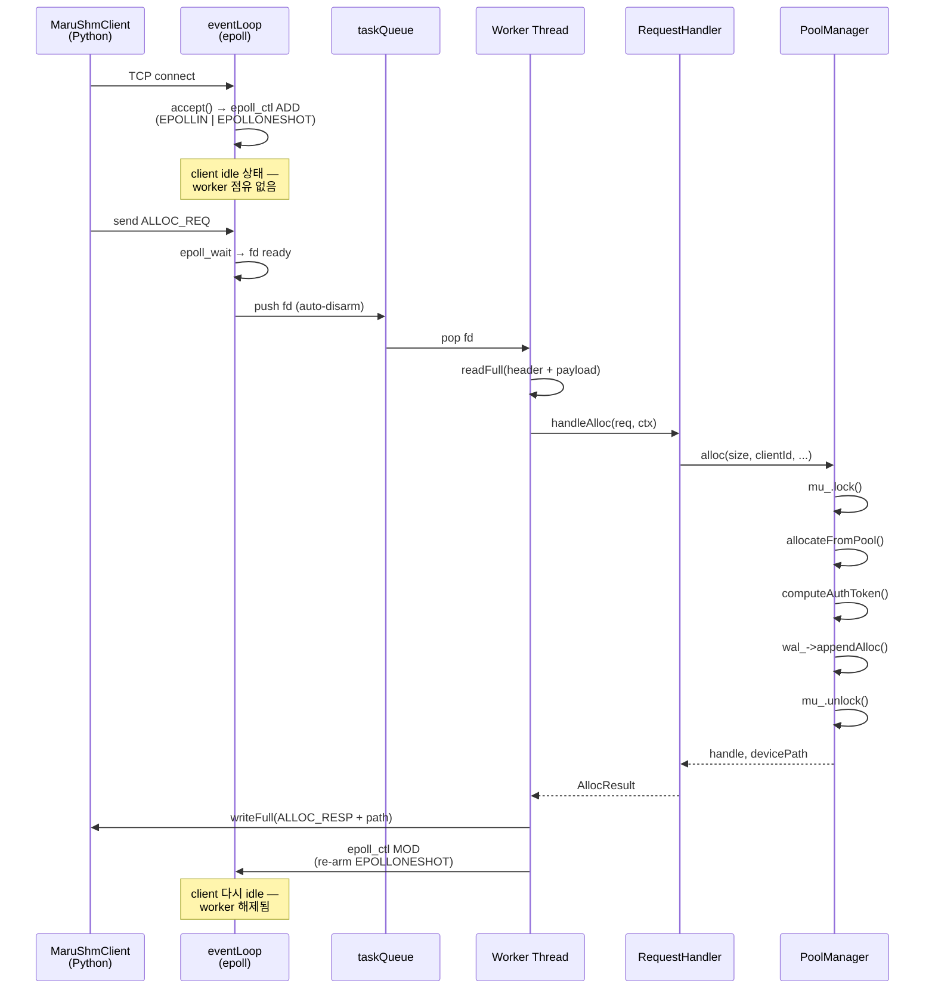
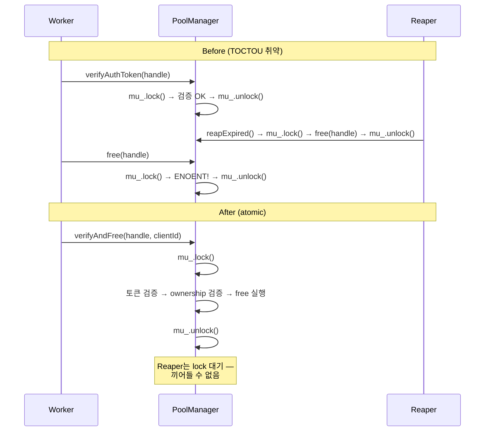
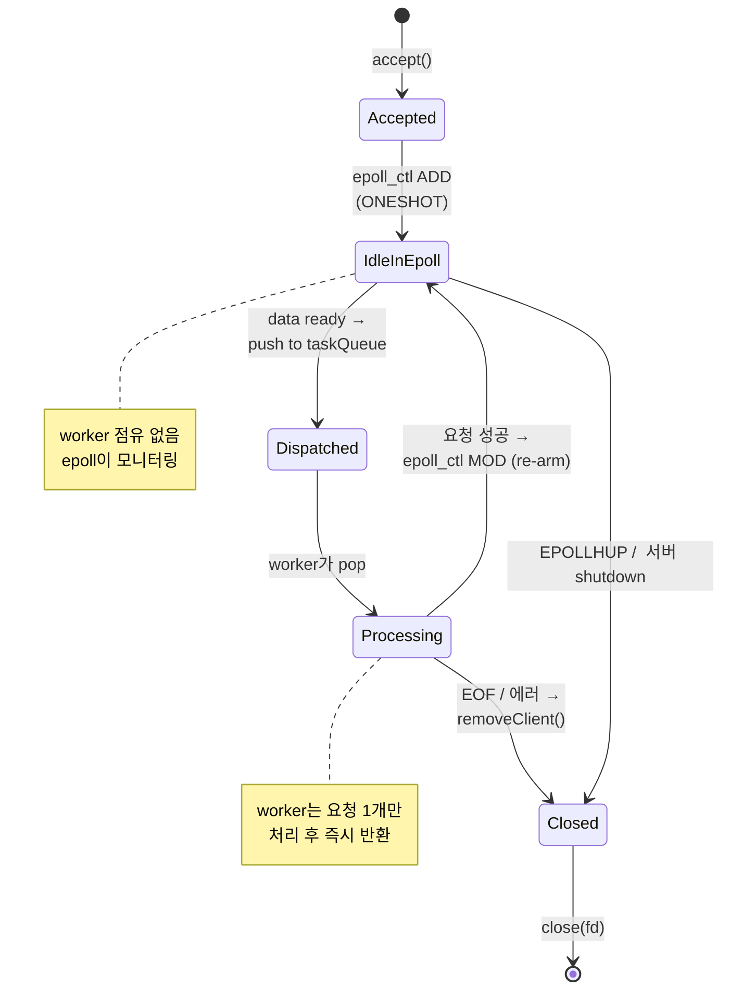
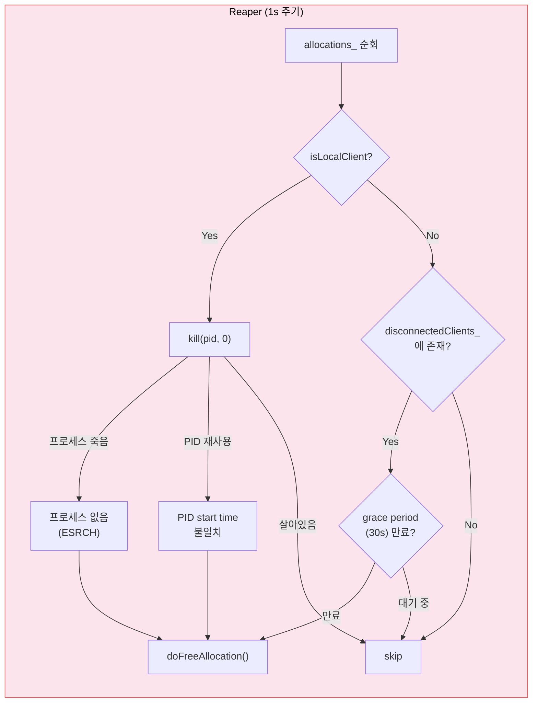
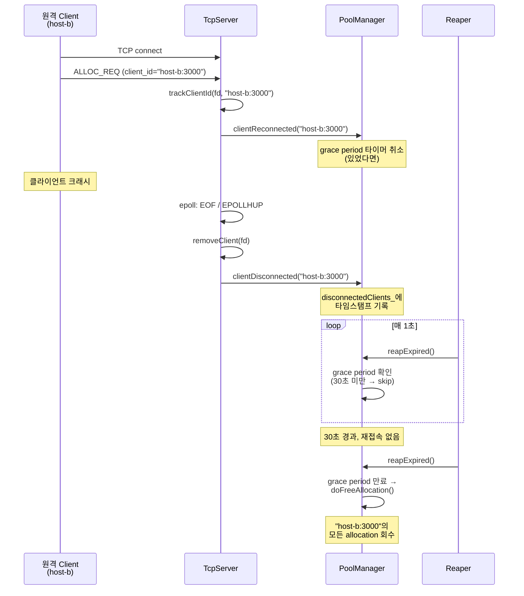

#### Before: 싱글 노드 (UDS)



#### After: 멀티 노드 (TCP)



## 13. 상세 내부 아키텍처

### 13.1 C++ Resource Manager 내부 구조



### 13.2 요청 처리 흐름 (Alloc 예시)



### 13.3 TOCTOU 방지: verifyAndFree 단일 lock



### 13.4 epoll 기반 연결 생명주기



### 13.5 Reaper: 클라이언트 사망 감지 및 자원 회수

Reaper는 1초 주기로 `reapExpired()`를 호출하여, 죽은 클라이언트의 allocation을 자동 회수합니다.

#### 로컬 클라이언트 vs 원격 클라이언트

| | 로컬 클라이언트 | 원격 클라이언트 |
|--|--|--|
| client_id 예시 | `host-a:2000` (같은 호스트) | `host-b:3000` (다른 호스트) |
| 사망 감지 방식 | `kill(pid, 0)` + PID start time 비교 | TCP 연결 끊김 + grace period |
| PID 재사용 방지 | `/proc/pid/stat` start time 비교 | 해당 없음 |

#### 동작 흐름



#### 원격 클라이언트 연결 끊김 처리 (TCP disconnect + grace period)



#### Reaper 입장에서의 "client"

일반적인 LMCache 배포에서 Resource Manager에 직접 alloc/free를 요청하는 주체는 **Maru Server 프로세스**입니다. LMCache의 prefiller/decoder는 Maru Server의 고객이지, Resource Manager의 client가 아닙니다.

```
Prefiller (PID 1000) → Maru Server (PID 2000) → Resource Manager
                              ↑
                      MaruShmClient 소유
                      client_id = "host-a:2000"
```

- Prefiller가 죽어도 → Reaper는 모름 (Maru Server가 관리)
- **Maru Server가 죽으면** → Reaper가 PID 2000의 모든 allocation 회수
- **원격 Maru Server가 끊기면** → TCP disconnect 감지 → grace period 후 회수