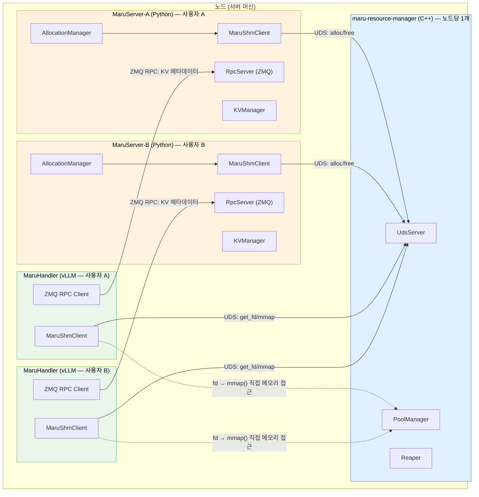

# Maru Resource Manager: Daemon → Standalone Server 전환 설계 문서

## Before / After 요약

| 항목 | Before (systemd daemon) | After (standalone server) |
|------|------------------------|--------------------------|
| **바이너리 이름** | `maru_resourced` | `maru-resource-manager` |
| **설치** | `sudo install-maru-resource-manager` (root 필수, systemd/udev 등록) | `install-maru-resource-manager` (빌드+바이너리만) |
| **시작** | `sudo systemctl start maru-resourced` | MaruServer가 자동 시작, 또는 수동 `maru-resource-manager` |
| **종료** | `sudo systemctl stop maru-resourced` | idle timeout 자동 종료, 또는 `Ctrl+C` / `kill <pid>` |
| **설정** | 환경변수 (`MARU_SOCKET_PATH` 등) | CLI 인자 (`--socket-path`, `--state-dir`, `--log-level`, `--idle-timeout`) |
| **기본 경로 (socket)** | `/run/maru-resourced/maru-resourced.sock` (root 전용) | `/tmp/maru-resourced/maru-resourced.sock` (누구나 가능) |
| **기본 경로 (state)** | `/var/lib/maru-resourced/` (root 전용) | `/var/lib/maru-resourced/` (유지 — WAL/크래시 복구에 영속성 필요) |
| **로그** | `journalctl -u maru-resourced` | stderr 직접 출력 |
| **Hotplug** | udev → `systemctl kill --signal=HUP` (자동) | `kill -HUP $(pgrep maru-resource-manager)` (수동) |
| **크래시 재시작** | systemd `Restart=always` | 다음 MaruServer 시작 시 자동 재시작 |
| **IPC 프로토콜** | 수제 바이너리 (UDS) | protobuf (UDS), 향후 TCP/ZMQ 확장 가능 |
| **Python 클라이언트** | 변경 없음 — `MaruShmClient()` | 동일 API, 내부 protobuf로 교체 |

### 실행 비교

```bash
# Before
sudo systemctl start maru-resourced
sudo systemctl status maru-resourced
sudo systemctl stop maru-resourced

# After — 수동 실행
maru-resource-manager                                  # 기본값
maru-resource-manager --log-level debug                # 디버그
maru-resource-manager --socket-path ./maru.sock \
                      --state-dir ./maru-state \
                      --idle-timeout 120               # 커스텀

# After — 자동 실행 (권장)
maru-server --port 5555                                # MaruServer 시작 시 자동으로 resource manager 시작
```

---

## 1. 배경

### 1.1 현재 구조

`maru_resourced`는 CXL/DAX 물리 메모리 풀을 관리하는 C++ 바이너리로, 현재 **systemd 서비스**로 배포/운영된다.

```
[systemd] ──manages──> [maru_resourced]
                            ├── UdsServer (Unix Domain Socket, /run/maru-resourced/maru-resourced.sock)
                            ├── PoolManager (CXL/DAX 디바이스 탐색, 메모리 할당)
                            ├── Reaper (죽은 프로세스 감지, 메모리 회수)
                            ├── MetadataStore (체크포인트 저장)
                            └── WalStore (WAL 크래시 복구)
```

Python 클라이언트(`maru_shm.MaruShmClient`)가 UDS를 통해 연결하며, `SCM_RIGHTS`로 디바이스 fd를 전달받아 `mmap()`으로 직접 공유 메모리에 접근한다.

> **Deprecation Notice** (기존 문서에서 발췌):
> *The local systemd daemon (maru-resourced) will be replaced by an RPC-based Resource Manager server
> in a future release. This change enables multi-node resource management without requiring a daemon
> on each node.*
>
> 이 전환은 2단계로 진행된다:
> 1. **이번 리팩토링**: systemd daemon → standalone CLI server (UDS 유지)
> 2. **향후**: UDS → TCP/ZMQ RPC 기반 서버 (멀티 노드 대응, 섹션 10 참조)

#### 현재 설치 및 시작 흐름

```
install.sh 실행:
  Step 1: pip install -e .
          → maru-server 명령어 등록 (Python, maru_server.server:main)
          → install-maru-resource-manager 명령어 등록 (Python, maru_common.resource_manager_installer:main)

  Step 2: sudo install-maru-resource-manager
          → cmake 빌드 → /usr/local/bin/maru_resourced
          → /etc/systemd/system/maru-resourced.service 설치
          → /etc/udev/rules.d/99-maru-resourced.rules 설치
          → systemctl enable maru-resourced     ← 부팅 시 자동 시작 등록
          → systemctl restart maru-resourced    ← 지금 바로 시작
```

두 프로세스는 **완전히 독립적**으로 설치/시작된다:

| | maru_resourced (C++) | maru-server (Python) |
|---|---|---|
| 설치 | `sudo install-maru-resource-manager` | `pip install -e .` |
| 시작 | systemd 자동 시작 (부팅 시 + 설치 시) | 사용자가 수동으로 `maru-server` 실행 |
| 종료 | systemd 관리 (`Restart=always`) | 사용자가 Ctrl+C |
| 상호 의존 | MaruServer 존재를 모름 | resource manager를 시작하지 않음 |

`maru-server`를 실행할 때 resource manager가 "저절로" 뜨는 것이 아니라,
`install.sh`에서 **systemd로 미리 등록/시작해놓은 것**이다.

#### 리팩토링 후 변경

| | 현재 (systemd) | 리팩토링 후 (standalone) |
|---|---|---|
| resource manager 시작 | systemd가 부팅 시 자동 시작 | MaruServer가 시작 시 자동 시작 (섹션 9.2) |
| resource manager 종료 | systemd 관리 (`Restart=always`) | idle timeout 시 자동 종료 (섹션 9.3) |
| 설치 | `sudo` 필요 (systemd, udev) | `sudo` 불필요 (빌드 + 바이너리만) |
| 설정 | 환경변수 (발견하기 어려움) | CLI 인자 (`--socket-path`, `--state-dir` 등) |
| hotplug | udev rules → `systemctl kill --signal=HUP` | 수동 `kill -HUP <pid>` |

### 1.2 전환 목표

`maru_resourced`를 `maru-server`와 동일한 방식의 **사용자가 직접 실행하는 foreground 서버 프로세스**로 전환한다.

**목표:**
- systemd 의존성 완전 제거
- CLI 인자로 설정 가능 (소켓 경로, 상태 디렉토리, 로그 레벨 등)
- 설정을 전역 함수가 아닌 명시적 주입 방식으로 전달하여 구조 정리
- 깔끔한 시작/종료 lifecycle

**비목표 (이번 스코프 외, 향후 로드맵은 섹션 10 참조):**
- Transport 변경 (UDS → TCP/ZMQ — 멀티 노드 대응 시 변경)
- 원격 메모리 접근 메커니즘 (RDMA, CXL fabric 등)
- MaruServer와의 통합
- 스레드 모델 변경

### 1.3 현재 상태 분석

좋은 소식: **`maru_resourced`는 이미 foreground 프로세스**이다. `fork()`, `setsid()` 등 daemonization 코드가 없다. `main()`이 시그널 체크 루프에서 블록된다.

systemd가 제공하는 것은 4가지뿐이다:

| systemd 기능 | 제거 후 대안 |
|---|---|
| `RuntimeDirectory` → `/run/maru-resourced/` 자동 생성 | 서버가 직접 `mkdir -p` |
| `After=systemd-udev-settle.service` (디바이스 준비 보장) | 시작 시 retry 또는 수동 `SIGHUP` |
| `Restart=always` (자동 재시작) | 제거 — 사용자 책임 |
| udev rules → `systemctl kill --signal=HUP` (hotplug) | 제거 — 수동 `kill -HUP <pid>` |

---

## 2. 변경 범위

### 2.1 파일별 변경 사항

```
변경:
  maru_resource_manager/src/main.cpp              ← CLI 파싱, 설정 주입, 디렉토리 생성, 배너/종료 로깅
  maru_resource_manager/src/pool_manager.h/cpp    ← 생성자에 stateDir 인자 추가
  maru_resource_manager/src/uds_server.h/cpp      ← 생성자에 socketPath 인자 추가, 디렉토리 자동 생성
  maru_resource_manager/src/util.h/cpp            ← ensureDirExists() 추가, defaultSocketPath()/defaultStateDir() 제거
  maru_resource_manager/CMakeLists.txt            ← systemd 관련 코드 전부 제거, 바이너리 이름 변경
  maru_common/resource_manager_installer.py       ← systemd 로직 제거, 단순 빌드+설치로 간소화

삭제:
  maru_resource_manager/systemd/                  ← 디렉토리 전체 삭제 (서비스 파일, udev rules)

변경 없음:
  maru_resource_manager/include/ipc.h             ← IPC 프로토콜
  maru_resource_manager/include/types.h           ← 타입 정의
  maru_resource_manager/src/reaper.*              ← 리퍼 로직
  maru_resource_manager/src/metadata.*            ← 메타데이터 저장
  maru_resource_manager/src/wal.*                 ← WAL 로직
  maru_resource_manager/src/log.*                 ← 로깅 (LogLevel enum 이미 지원)
  maru_shm/*                                      ← Python 클라이언트
```

---

## 3. 상세 설계

### 3.1 CLI 인자 파싱 (`main.cpp`)

현재 `main.cpp`는 `argc`/`argv`를 완전히 무시한다. `getopt_long`으로 CLI 인자를 추가한다.

```
maru-resource-manager [OPTIONS]

Options:
  -s, --socket-path PATH    UDS 소켓 경로 (기본: /tmp/maru-resourced/maru-resourced.sock)
  -d, --state-dir PATH      상태 디렉토리 (기본: /var/lib/maru-resourced)
  -l, --log-level LEVEL     로그 레벨: debug, info, warn, error (기본: info)
  -h, --help                도움말 출력
  -v, --version             버전 출력
```

**기본 경로 변경**: `/run/maru-resourced/` → `/tmp/maru-resourced/`
- `/run/`은 root 전용 — 개발 서버에 부적합
- `/tmp/`는 누구나 쓸 수 있고 재부팅 시 정리됨
- 프로덕션 배포 시 `--socket-path`, `--state-dir`로 원하는 경로 지정

**환경변수 지원 제거**: CLI 인자만 지원한다. `MARU_SOCKET_PATH`, `MARU_STATE_DIR` 환경변수는 제거한다. 설정 경로가 하나(CLI)로 단순화된다.

#### 구현

```cpp
#include <getopt.h>

struct ServerConfig {
    std::string socketPath = "/tmp/maru-resourced/maru-resourced.sock";
    std::string stateDir   = "/var/lib/maru-resourced";
    LogLevel logLevel      = LogLevel::Info;
};

static ServerConfig parseArgs(int argc, char* argv[]) {
    ServerConfig cfg;
    static struct option longOpts[] = {
        {"socket-path", required_argument, nullptr, 's'},
        {"state-dir",   required_argument, nullptr, 'd'},
        {"log-level",   required_argument, nullptr, 'l'},
        {"help",        no_argument,       nullptr, 'h'},
        {"version",     no_argument,       nullptr, 'v'},
        {nullptr, 0, nullptr, 0}
    };

    int opt;
    while ((opt = getopt_long(argc, argv, "s:d:l:hv", longOpts, nullptr)) != -1) {
        switch (opt) {
        case 's': cfg.socketPath = optarg; break;
        case 'd': cfg.stateDir = optarg; break;
        case 'l': cfg.logLevel = parseLogLevel(optarg); break;
        case 'h': printUsage(); exit(0);
        case 'v': printVersion(); exit(0);
        default:  printUsage(); exit(1);
        }
    }
    return cfg;
}

int main(int argc, char* argv[]) {
    ServerConfig cfg = parseArgs(argc, argv);
    setLogLevel(cfg.logLevel);

    // 디렉토리 보장
    ensureDirExists(parentDir(cfg.socketPath));
    ensureDirExists(cfg.stateDir);

    // 시작 배너
    logBanner(cfg);

    // 시그널 핸들러 (기존과 동일)
    std::signal(SIGINT, [](int) { gStop = 1; });
    std::signal(SIGTERM, [](int) { gStop = 1; });
    std::signal(SIGHUP, [](int) { gRescan = 1; });

    // 초기화 — 설정을 명시적으로 주입
    PoolManager pm(cfg.stateDir);
    if (!pm.loadPools()) {
        logf(Warn, "no CXL/DAX devices found — starting with empty pool");
    }

    UdsServer server(pm, cfg.socketPath);
    server.start();

    Reaper reaper(pm);
    reaper.start();

    logf(Info, "ready — listening on %s", cfg.socketPath.c_str());

    // 메인 루프
    while (!gStop) {
        if (gRescan) { pm.rescanDevices(); gRescan = 0; }
        std::this_thread::sleep_for(std::chrono::seconds(1));
    }

    // 종료
    logf(Info, "shutting down...");
    reaper.stop();
    server.stop();
    logf(Info, "shutdown complete");
    return 0;
}
```

### 3.2 설정 주입 방식으로 리팩토링

**현재**: 각 컴포넌트가 전역 함수 `defaultSocketPath()` / `defaultStateDir()`를 내부에서 호출한다.

**변경**: `main()`에서 설정을 파싱한 뒤 생성자 인자로 전달한다. 전역 함수는 제거한다.

```
[Before]
main.cpp     → PoolManager()                   // 내부에서 defaultStateDir() 호출
             → UdsServer(pm)                    // start() 내부에서 defaultSocketPath() 호출
pool_manager → MetadataStore(defaultStateDir())
             → WalStore(defaultStateDir())

[After]
main.cpp     → PoolManager(cfg.stateDir)        // stateDir 명시 전달
             → UdsServer(pm, cfg.socketPath)     // socketPath 명시 전달
pool_manager → MetadataStore(stateDir)           // 전달받은 값 사용
             → WalStore(stateDir)
```

#### 변경되는 인터페이스

| 클래스 | Before | After |
|--------|--------|-------|
| `PoolManager` | `PoolManager()` | `PoolManager(const std::string& stateDir)` |
| `UdsServer` | `UdsServer(PoolManager& pm)` | `UdsServer(PoolManager& pm, const std::string& socketPath)` |

| 함수 | Before | After |
|-------|--------|-------|
| `defaultSocketPath()` | 존재 (환경변수 + 하드코딩 기본값) | **삭제** |
| `defaultStateDir()` | 존재 (환경변수 + 하드코딩 기본값) | **삭제** |

### 3.3 소켓 디렉토리 자동 생성

`UdsServer::start()`에서 `bind()` 전에 소켓의 부모 디렉토리를 자동 생성한다.

```cpp
// util.h에 추가
bool ensureDirExists(const std::string& path);
std::string parentDir(const std::string& path);

// util.cpp 구현
std::string parentDir(const std::string& path) {
    auto pos = path.rfind('/');
    if (pos == std::string::npos || pos == 0) return "/";
    return path.substr(0, pos);
}

bool ensureDirExists(const std::string& path) {
    struct stat st;
    if (stat(path.c_str(), &st) == 0) return S_ISDIR(st.st_mode);

    // 재귀적 생성
    ensureDirExists(parentDir(path));
    if (mkdir(path.c_str(), 0755) != 0 && errno != EEXIST) {
        logf(Error, "failed to create directory %s: %s", path.c_str(), strerror(errno));
        return false;
    }
    return true;
}
```

### 3.4 로그 레벨 설정

현재: `setLogLevel(LogLevel::Debug)` 하드코딩

변경: `setLogLevel(cfg.logLevel)` — CLI `--log-level` 또는 기본값 `Info`

`log.h`의 `LogLevel` enum은 이미 `Debug, Info, Warn, Error`를 지원하므로 추가 변경 없음.

`parseLogLevel()` 헬퍼만 추가:

```cpp
LogLevel parseLogLevel(const std::string& s) {
    if (s == "debug") return LogLevel::Debug;
    if (s == "info")  return LogLevel::Info;
    if (s == "warn")  return LogLevel::Warn;
    if (s == "error") return LogLevel::Error;
    fprintf(stderr, "unknown log level: %s (using info)\n", s.c_str());
    return LogLevel::Info;
}
```

### 3.5 시작 배너

`maru-server`처럼 시작 시 주요 설정을 로깅한다.

```
[INFO] maru-resource-manager starting
[INFO]   socket    : /tmp/maru-resourced/maru-resourced.sock
[INFO]   state dir : /var/lib/maru-resourced
[INFO]   log level : info
[INFO]   pools     : 2 (DEV_DAX: 1, FS_DAX: 1), total: 8.0 GB, free: 8.0 GB
[INFO] ready — listening on /tmp/maru-resourced/maru-resourced.sock
```

### 3.6 Graceful Shutdown 로깅

```
[INFO] received SIGTERM, shutting down...
[INFO] stopping reaper...
[INFO] stopping UDS server (draining 3 active clients)...
[INFO] shutdown complete
```

### 3.7 CMakeLists.txt — systemd 완전 제거

systemd 관련 코드를 모두 제거한다. `MARU_INSTALL_SYSTEMD` 옵션 자체를 삭제한다.

```cmake
cmake_minimum_required(VERSION 3.16)
project(maru_resource_manager LANGUAGES CXX)
set(CMAKE_CXX_STANDARD 17)

find_package(OpenSSL REQUIRED)

add_executable(maru_resource_manager
    src/main.cpp
    src/pool_manager.cpp
    src/uds_server.cpp
    src/reaper.cpp
    src/metadata.cpp
    src/wal.cpp
    src/util.cpp
    src/log.cpp
)

target_include_directories(maru_resource_manager PRIVATE include src)
target_link_libraries(maru_resource_manager PRIVATE pthread OpenSSL::Crypto)

# 바이너리 이름: maru-resource-manager
set_target_properties(maru_resource_manager PROPERTIES OUTPUT_NAME "maru-resource-manager")

install(TARGETS maru_resource_manager RUNTIME DESTINATION ${CMAKE_INSTALL_BINDIR})
```

삭제하는 것:
- `option(MARU_INSTALL_SYSTEMD ...)` 옵션
- `configure_file(systemd/maru-resourced.service.in ...)` 블록
- `install(FILES ... /etc/systemd/system/)` 블록
- `install(FILES ... /etc/udev/rules.d/)` 블록
- `install(CODE "execute_process(COMMAND systemctl ...)")` 블록

### 3.8 systemd 디렉토리 삭제

```
삭제:
  maru_resource_manager/systemd/maru-resourced.service    (또는 .service.in)
  maru_resource_manager/systemd/99-maru-resourced.rules
  maru_resource_manager/systemd/                          (빈 디렉토리)
```

### 3.9 Installer 스크립트 간소화

`resource_manager_installer.py`에서 systemd 관련 로직을 전부 제거한다.

```python
# 제거할 것:
# - --no-systemd 옵션 (더 이상 필요 없음)
# - systemctl stop/disable/daemon-reload 호출
# - udev rules 관련 코드
# - /etc/systemd/system/ 파일 삭제 로직

# 남는 것:
# - cmake 빌드 + 설치
# - --prefix 옵션
# - --clean, --uninstall (바이너리만 삭제)
```

### 3.10 Python 클라이언트 상수 업데이트

`maru_shm/constants.py`의 기본 경로를 C++ 서버와 일치시킨다.

```python
# Before
DEFAULT_SOCKET_PATH = os.environ.get("MARU_SOCKET_PATH", "/run/maru-resourced/maru-resourced.sock")
DEFAULT_STATE_DIR = os.environ.get("MARU_STATE_DIR", "/var/lib/maru-resourced")

# After
DEFAULT_SOCKET_PATH = "/tmp/maru-resourced/maru-resourced.sock"
DEFAULT_STATE_DIR = "/var/lib/maru-resourced"
```

환경변수 오버라이드도 제거한다. 클라이언트가 다른 경로를 쓰려면 `MaruShmClient(socket_path="...")` 생성자 인자를 사용한다.

### 3.11 `defaultSocketPath()` / `defaultStateDir()` 제거 파급 범위

이 함수들을 사용하는 곳을 모두 정리한다:

| 호출 위치 | 현재 사용 | 변경 |
|-----------|-----------|------|
| `main.cpp` | 없음 (현재는 직접 사용 안 함) | `ServerConfig` 기본값으로 대체 |
| `PoolManager::PoolManager()` | `defaultStateDir()` 호출 | 생성자 인자로 받음 |
| `UdsServer::start()` | `defaultSocketPath()` 호출 | 생성자 인자로 받음 |
| `util.cpp` 내 `initSecret()` | `defaultStateDir()` 간접 사용 | `stateDir` 인자로 받도록 변경 |
| `maru_test_client.cpp` | `defaultSocketPath()` 호출 | 하드코딩 기본값 또는 CLI 인자로 변경 |
| `maru_shm/constants.py` | `os.environ.get("MARU_SOCKET_PATH", ...)` | 하드코딩 기본값으로 변경 |

---

## 4. 변경하지 않는 것

| 구성요소 | 이유 |
|----------|------|
| IPC 프로토콜 (`ipc.h`, `types.h`) | 와이어 포맷 변경 없음 (후속 TCP/ZMQ 전환 시 변경) |
| SCM_RIGHTS fd 패싱 | UDS 기반 fd 전달 유지 |
| 스레드 모델 | accept thread + handler threads + reaper 유지 |
| WAL / Metadata 포맷 | 바이너리 포맷 변경 없음 |
| HMAC 인증 | 토큰 생성/검증 로직 유지 |
| 디바이스 탐색 | sysfs/procfs 기반 자동 탐색 유지 |
| PoolManager 할당/해제/리퍼 로직 | 변경 없음 |
| Python 클라이언트 (`maru_shm`) IPC 로직 | `client.py`, `ipc.py`, `uds_helpers.py`, `types.py` 변경 없음 |

---

## 5. 구현 순서

Phase 순서는 **의존성과 코드 중복 최소화**를 기준으로 결정했다:
- Phase 1 (systemd 제거)은 순수 삭제 — 다른 Phase에 영향 없이 즉시 가능
- Phase 2 (IPC 프로토콜)를 Phase 3 (서버 구조) 전에 하는 이유: UdsServer를 protobuf로 재구성한 뒤 설정 주입을 하면 같은 코드를 두 번 수정하지 않아도 됨

```
Phase 1: systemd 제거          Phase 2: IPC 프로토콜 구조화      Phase 3: 서버 구조 전환
(순수 삭제, 저위험)              (가장 큰 변경, UdsServer 재구성)   (기능 추가, 깔끔한 코드 위에)
─────────────────── ──────────→ ────────────────────────────── → ──────────────────────────
systemd/ 삭제                   protobuf 스키마 정의              ServerConfig + CLI 파싱
CMakeLists 정리                 C++ 서버 프로토콜 교체            설정 주입 (생성자 인자)
installer 간소화                Python 클라이언트 프로토콜 교체   자동 시작 / idle 종료
기본 경로 업데이트               LocalAccess/RemoteAccess 분리    시작 배너 / graceful shutdown
```

### Phase 1: systemd 제거 + 경로 정리

순수 삭제 작업. 기존 동작을 변경하지 않으면서 systemd 의존성을 제거한다.

1. `maru_resource_manager/systemd/` 디렉토리 전체 삭제
2. `CMakeLists.txt` — systemd 관련 코드 전부 제거, 바이너리 이름 `maru-resource-manager`로 변경
3. `resource_manager_installer.py` — systemd 로직 전부 제거, 간소화
4. `maru_shm/constants.py` — 기본 경로 업데이트 (`/run` → `/tmp`), 환경변수 오버라이드 제거
5. `maru_resource_manager/src/util.cpp` — `defaultSocketPath()`, `defaultStateDir()` 기본값을 `/tmp`로 변경
6. `maru_test_client.cpp` — `defaultSocketPath()` 호출 제거, 하드코딩 기본값으로 변경

**이 Phase 완료 후**: systemd 없이 기존 바이너리를 수동으로 실행할 수 있는 상태.

### Phase 2: 코드 레이어 분리 (멀티 노드 대비)

기존 바이너리 프로토콜을 유지하면서, `UdsServer`의 비즈니스 로직을 `RequestHandler`로 분리한다.
새 의존성 없이 코드 구조만 개선. 향후 ZMQ/TCP transport 추가 시 `RequestHandler`를 그대로 재사용.

> **왜 protobuf를 쓰지 않는가**: 메시지 타입 5개, 고정 크기 구조체 — protobuf의 이점 대비
> 의존성 추가 + 빌드 복잡도가 과함. 멀티 노드 실제 구현 시 도입해도 늦지 않음.
>
> **왜 UDS를 ZMQ로 바꾸지 않는가**: `SCM_RIGHTS`(fd passing)는 UDS 전용 기능.
> 로컬 클라이언트가 CXL 메모리를 mmap하려면 fd가 필요하므로 UDS를 유지해야 한다.
> 멀티 노드에서는 원격 클라이언트에게 fd가 아닌 RDMA 정보를 보내므로 ZMQ/TCP가 가능하며,
> 그때 `RequestHandler`는 변경 없이 `ZmqServer`에서 재사용한다.

```
[변경 전: 일체형]
UdsServer::handleClient() — 소켓 I/O + 메시지 파싱 + 비즈니스 로직 혼재

[변경 후: 분리]
UdsServer (Transport)          RequestHandler (Business Logic)
  소켓 accept/read/write  ──►   handleAlloc(req, cred) → resp
  SCM_RIGHTS fd passing   ◄──   handleFree(req, cred) → resp
  MsgHeader 파싱                 handleGetFd(req, cred) → resp
  인증 (SO_PEERCRED)             handleStats() → resp

[향후 멀티 노드]
UdsServer (로컬)  ──►│
                     │ RequestHandler (동일한 코드)
ZmqServer (원격)  ──►│
```

7. `request_handler.h/cpp` 생성 — 비즈니스 로직 추출 (`PoolManager`에만 의존, 소켓 코드 없음)
8. `uds_server.cpp` — `handleClient()`에서 비즈니스 로직 분리, transport만 담당
9. `ipc.h` — `AccessType` enum 추가 (LOCAL=0, REMOTE=1), `AllocResp._pad` → `accessType`으로 활용 (바이너리 호환 유지)
10. `CMakeLists.txt` — `request_handler.cpp` 추가

**이 Phase 완료 후**: Transport/Handler 분리 완료, 향후 ZMQ transport 추가 시 Handler 재사용 가능.

### Phase 3: 서버 구조 전환

Phase 2에서 재구성된 깨끗한 코드 위에 서버 기능을 추가한다.

11. `main.cpp` — `ServerConfig` + `getopt_long` 파싱 추가 (`--socket-path`, `--state-dir`, `--log-level`, `--idle-timeout`)
12. `PoolManager` — 생성자에 `stateDir` 인자 추가
13. `UdsServer` — 생성자에 `socketPath` 인자 추가
14. `util.cpp` — `ensureDirExists()`, `parentDir()` 추가, `defaultSocketPath()` / `defaultStateDir()` 삭제
15. `util.cpp` — `initSecret()`이 `stateDir`를 인자로 받도록 변경
16. `log.cpp` — `parseLogLevel()` 추가
17. `main.cpp` — 시작 배너 + graceful shutdown 로깅
18. `main.cpp` — idle timeout 로직 추가 (할당 0개 시 자동 종료)
19. `MaruServer` 측 — `AllocationManager` 초기화 시 resource manager 자동 시작 + 크래시 복구 로직 추가

**이 Phase 완료 후**: 최종 목표 상태 — standalone CLI server, 자동 시작/종료, Transport/Handler 분리.

---

## 6. 사용 시나리오

### 6.1 개발/테스트 (기본값 — root 불필요)

```bash
maru-resource-manager
# socket: /tmp/maru-resourced/maru-resourced.sock
# state:  /var/lib/maru-resourced
# log:    info
```

### 6.2 커스텀 경로

```bash
maru-resource-manager \
    --socket-path /var/run/maru/maru.sock \
    --state-dir /var/lib/maru \
    --log-level debug
```

### 6.3 Hotplug (수동)

```bash
# 디바이스 추가 후 rescan
kill -HUP $(pgrep maru-resource-manager)
```

---

## 7. 최종 디렉토리 구조 (변경 후)

```
maru_resource_manager/
├── CMakeLists.txt                    # systemd 코드 제거됨
├── include/
│   ├── ipc.h                         # 변경 없음
│   └── types.h                       # 변경 없음
├── src/
│   ├── main.cpp                      # CLI 파싱, 설정 주입, 배너/종료 로깅
│   ├── pool_manager.h/cpp            # 생성자에 stateDir 인자 추가
│   ├── uds_server.h/cpp              # 생성자에 socketPath 인자 추가, 디렉토리 자동 생성
│   ├── reaper.h/cpp                  # 변경 없음
│   ├── metadata.h/cpp                # 변경 없음
│   ├── wal.h/cpp                     # 변경 없음
│   ├── util.h/cpp                    # ensureDirExists 추가, default*() 삭제
│   └── log.h/cpp                     # parseLogLevel 추가
└── tools/
    └── maru_test_client.cpp          # defaultSocketPath() 호출 제거
```

`systemd/` 디렉토리는 삭제됨.

---

## 8. 전체 Server-Client 구조

### 8.1 컴포넌트 관계도

Maru 시스템은 **2개의 서버**와 **2종류의 클라이언트**로 구성된다.



### 8.2 서버 2개, 역할 분리

| | maru-resource-manager | MaruServer |
|---|---|---|
| **언어** | C++ | Python |
| **역할** | CXL/DAX 물리 메모리 풀 관리 | KV 캐시 메타데이터 관리 |
| **통신** | UDS (Unix Domain Socket) | ZMQ TCP RPC |
| **인스턴스 수** | 노드당 1개 (싱글톤) | 사용자당 1개 (여러 개 가능) |
| **상태 추적** | PID 기반 할당 소유권 | instance_id 기반 KV 소유권 |
| **크래시 복구** | Reaper (PID 생존 확인) | AllocationManager (deferred free) |

### 8.3 클라이언트: MaruShmClient의 정체

`MaruShmClient`는 **maru-resource-manager의 클라이언트**이다 (MaruServer의 클라이언트가 아님).

이름의 의미: Maru **S**hared **M**emory Client — 공유 메모리(CXL/DAX)를 관리하는 resource manager와 통신하는 클라이언트.

`MaruShmClient`는 두 곳에서 사용된다:

| 사용 위치 | 용도 | 호출하는 API |
|-----------|------|-------------|
| `AllocationManager` (MaruServer 내부) | 물리 메모리 할당/해제 | `alloc()`, `free()` |
| `MaruHandler` (vLLM 프로세스) | FD 획득 + mmap으로 직접 메모리 접근 | `mmap()`, `get_fd()`, `munmap()` |

**통신 방식**: 매 RPC마다 새 UDS 연결을 생성하고 즉시 닫는 **stateless** 모델.
영구 연결이 없으므로, resource manager는 "누가 연결되어 있는지"를 알 수 없다.

```python
# MaruShmClient 사용 예시 — 내부적으로 매번 connect/close
handle = client.alloc(size=4096)      # connect → ALLOC_REQ → ALLOC_RESP(+fd) → close
mm = client.mmap(handle, PROT_WRITE)  # connect → GET_FD_REQ → GET_FD_RESP(+fd) → close (fd/mmap 캐시)
client.free(handle)                   # connect → FREE_REQ → FREE_RESP → close
```

### 8.4 MaruHandler의 이중 클라이언트 구조

`MaruHandler`(vLLM 프로세스)는 **두 개의 서버에 동시에 접속**한다:

```
MaruHandler
  ├── ZMQ RPC → MaruServer
  │     "key-abc에 해당하는 KV가 어디에 있어?"
  │     → { region_id=42, offset=0, length=4096 }
  │
  └── MaruShmClient (UDS) → maru-resource-manager
        "region_id=42의 fd를 줘, mmap할게"
        → fd via SCM_RIGHTS → mmap() → 직접 메모리 읽기/쓰기
```

- **MaruServer**: "무엇이 어디에 있는지" (메타데이터)
- **maru-resource-manager**: "물리 메모리에 접근" (fd 전달, 할당/해제)

### 8.5 노드당 싱글톤 구조

CXL/DAX 물리 메모리는 노드 레벨 자원이므로, resource manager는 **노드당 1개**만 실행한다.
여러 사용자가 각자 독립적인 MaruServer를 띄우더라도, 같은 resource manager를 공유한다.

```
[노드]
maru-resource-manager (1개)
    ↑ UDS
    ├── MaruServer-A (사용자 A)
    │     ↑ ZMQ
    │     ├── MaruHandler (vLLM)
    │     └── MaruHandler (vLLM)
    │
    └── MaruServer-B (사용자 B)
          ↑ ZMQ
          ├── MaruHandler (vLLM)
          └── MaruHandler (vLLM)
```

### 8.6 소유권 2계층 모델

| 계층 | 추적 기준 | 관리 주체 |
|------|-----------|-----------|
| CXL 물리 메모리 | PID (커널 검증, `SO_PEERCRED`) | maru-resource-manager |
| KV 메타데이터 | instance_id (UUID, 핸들러별 고유) | MaruServer |

### 8.7 독립 MaruServer 다중 실행 시 안전성

각 사용자가 독립적인 vLLM 인스턴스를 돌리는 경우 (KV 캐시 공유 없음):

| 항목 | 상태 | 설명 |
|------|------|------|
| 할당 | **안전** | 각자 다른 PID로 요청, 겹치지 않음 |
| KV 메타데이터 | **격리됨** | 각 MaruServer가 별도 KVManager 보유, 서로의 KV를 모름 |
| Reaper | **안전** | PID 기반 회수 — A가 죽어도 A의 메모리만 회수, B에 영향 없음 |
| 풀 파티셔닝 | **없음** | 선착순 할당, 한쪽이 과다 할당하면 다른 쪽 ENOMEM (향후 개선 가능) |

> **주의**: 여러 vLLM 인스턴스가 KV 캐시를 **공유**하려면, 같은 MaruServer에 연결해야 한다.
> MaruServer 내부의 AllocationManager가 instance_id별로 소유권을 관리하고,
> `list_allocations(exclude_instance_id=...)` + `DaxMapper.map_region()`으로 다른 핸들러의 데이터를 읽을 수 있다.

### 8.8 MaruServer와 동일한 서버 패턴

Resource manager도 MaruServer와 동일한 CLI foreground 서버 패턴을 따른다:

| | MaruServer (현재) | maru-resource-manager (목표) |
|---|---|---|
| **진입점** | `server.py:main()` | `main.cpp:main()` |
| **CLI 파싱** | `argparse` | `getopt_long` |
| **설정** | `--host`, `--port`, `--log-level` | `--socket-path`, `--state-dir`, `--log-level`, `--idle-timeout` |
| **초기화** | `MaruServer()` → `RpcServer()` | `PoolManager(stateDir)` → `UdsServer(pm, socketPath)` → `Reaper(pm)` |
| **시그널** | `SIGINT/SIGTERM` → `rpc_server.stop()` | `SIGINT/SIGTERM` → `gStop=1`, `SIGHUP` → rescan |
| **시작 로그** | `"Starting MaruServer on %s:%d"` | `"ready — listening on %s"` |
| **종료** | signal → graceful stop | signal 또는 idle timeout → graceful stop |

```bash
# MaruServer 시작
maru-server --host 127.0.0.1 --port 5555 --log-level INFO

# Resource Manager 시작 (동일한 패턴)
maru-resource-manager --socket-path /tmp/maru-resourced/maru-resourced.sock \
                      --state-dir /var/lib/maru-resourced \
                      --log-level info \
                      --idle-timeout 60
```

---

## 9. Lifecycle: 자동 시작 / 자동 종료

### 9.1 설계 원칙

- 사용자가 resource manager를 직접 관리할 필요 없어야 한다
- 첫 번째 MaruServer가 시작할 때 자동으로 띄우고, 아무도 안 쓰면 자동으로 종료한다
- resource manager가 크래시해도 다음 RPC 호출 시 자동으로 재시작한다
- `MaruShmClient`는 **stateless** (매 RPC마다 connect → send → recv → close)이므로, "연결된 클라이언트 수"가 아닌 **활성 할당(allocations) 수**로 종료를 판단한다

### 9.2 `_ensure_resource_manager()` — 핵심 로직

자동 시작과 크래시 복구 모두 동일한 로직을 사용한다.
`MaruShmClient`에 `_ensure_resource_manager()` 메서드를 추가한다:

```
_ensure_resource_manager():
  1. flock(/tmp/maru-resourced/rm.lock) 획득  ← race condition 방지
  2. 소켓에 connect() 시도
  3. 성공 → flock 해제, 리턴 (다른 프로세스가 이미 시작함)
  4. 실패 → maru-resource-manager를 백그라운드로 시작
  5. 소켓이 나타날 때까지 retry (최대 5초, 100ms 간격)
  6. flock 해제
```

이 로직이 호출되는 두 시점:

| 시점 | 트리거 | 용도 |
|------|--------|------|
| `AllocationManager.__init__()` | MaruServer 시작 | **자동 시작** — resource manager가 없으면 띄움 |
| `MaruShmClient._connect()` | 매 RPC 호출 시 connect 실패 | **크래시 복구** — resource manager가 죽었으면 재시작 |

### 9.3 자동 시작 (MaruServer 시작 시)

```python
class AllocationManager:
    def __init__(self):
        self._client = MaruShmClient()
        self._client._ensure_resource_manager()  # eager: 시작 시 바로 확인
```

- **첫 번째 MaruServer**가 resource manager를 자동으로 띄움
- **이후 MaruServer**들은 이미 떠있는 resource manager를 그냥 사용
- `flock`으로 여러 MaruServer가 동시에 시작해도 하나만 resource manager를 띄움

### 9.4 크래시 자동 복구 (운영 중)

```python
class MaruShmClient:
    def _connect(self) -> socket.socket:
        sock = socket.socket(socket.AF_UNIX, socket.SOCK_STREAM)
        try:
            sock.connect(self._socket_path)
        except OSError:
            sock.close()
            self._ensure_resource_manager()   # 크래시 감지 → 재시작
            sock = socket.socket(socket.AF_UNIX, socket.SOCK_STREAM)
            sock.connect(self._socket_path)   # 재시도
        return sock
```

`MaruShmClient`가 stateless이므로 매 호출마다 connect를 시도한다.
connect 실패 = resource manager가 죽었거나 아직 안 떴다는 의미.
`_ensure_resource_manager()`로 재시작한 뒤 재시도한다.

```
[크래시 복구 흐름]
MaruServer 운영 중 → resource manager 크래시
  → 다음 alloc()/free() 호출
  → _connect() 실패 (ECONNREFUSED)
  → _ensure_resource_manager()
    → flock 획득 → resource manager 백그라운드 시작 → 소켓 대기 → flock 해제
  → _connect() 재시도 → 성공
  → RPC 정상 수행
```

> **참고**: resource manager는 시작 시 WAL에서 크래시 이전 상태를 복구한다.
> 단, 크래시 시점에 존재하던 할당은 Reaper가 PID 생존 확인 후 처리한다.

### 9.3 자동 종료 (Idle Shutdown)

Resource manager의 메인 루프에 idle 감지 로직을 추가한다:

```
[메인 루프 — 기존]
while (!gStop):
    if (gRescan): pm.rescanDevices(); gRescan = 0
    sleep(1초)

[메인 루프 — 변경]
while (!gStop):
    if (gRescan): pm.rescanDevices(); gRescan = 0

    if pm.allocationCount() == 0:
        idleSeconds++
    else:
        idleSeconds = 0

    if idleSeconds >= IDLE_TIMEOUT:    # 기본값: 60초
        logf(Info, "no active allocations for %ds, shutting down", IDLE_TIMEOUT)
        gStop = 1

    sleep(1초)
```

**판단 기준: `PoolManager::allocationCount() == 0`**

- `allocations_` 맵이 비어있으면 = CXL 메모리를 사용 중인 프로세스가 없음
- Reaper가 죽은 프로세스의 할당을 회수한 뒤에도 반영됨
- 연결 수가 아닌 할당 수를 보므로, stateless RPC 모델과 호환됨

**타임아웃 설계:**

| 상황 | 동작 |
|------|------|
| 할당 존재 | `idleSeconds = 0` (즉시 리셋) |
| 할당 0개, 60초 미만 | 대기 (새 MaruServer가 올 수 있음) |
| 할당 0개, 60초 이상 | 자동 종료 |
| 시작 직후 디바이스 없음 | 풀이 비어있어도 종료하지 않음 (할당 가능 상태이면 유지) |

CLI 옵션으로 타임아웃을 설정할 수 있게 한다:

```
--idle-timeout SECONDS    유휴 시 자동 종료 대기 시간 (기본: 60, 0=비활성화)
```

### 9.6 전체 Lifecycle 요약

```
[시작]
MaruServer-A 시작 → _ensure_resource_manager() → 소켓 없음 → flock → RM 시작 → 연결
MaruServer-B 시작 → _ensure_resource_manager() → 소켓 있음 → 바로 연결

[운영]
MaruServer-A, B가 각자 독립적으로 alloc/free 수행
Resource manager는 PID 기반으로 할당 추적, Reaper가 죽은 프로세스 메모리 회수

[크래시 복구]
Resource manager 크래시 → 다음 alloc()/free() 호출 시 connect 실패
→ _ensure_resource_manager() → flock → RM 재시작 (WAL 복구) → 연결
→ RPC 정상 수행 (호출자는 크래시를 인지하지 못함)

[종료]
MaruServer-A 종료 → Reaper가 A의 할당 회수
MaruServer-B 종료 → Reaper가 B의 할당 회수
할당 0개 상태 60초 유지 → resource manager 자동 종료 (idle timeout)

[재시작]
다음 MaruServer 시작 시 → _ensure_resource_manager() → 다시 자동 시작
```

---

## 10. 향후 로드맵: 멀티 노드 대응

### 10.1 왜 daemon → server 인가

이번 리팩토링의 궁극적 목표는 **멀티 노드 환경 대응**이다.
MaruServer처럼, resource manager도 원격 노드에서 접근할 수 있는 서버가 되어야 한다.

```
[현재: 싱글 노드]
Node A:
  maru-resource-manager ◄──UDS── MaruShmClient (로컬만)

[향후: 멀티 노드]
Node A:
  maru-resource-manager ◄──TCP/ZMQ── Node B의 클라이언트 (원격 접근)
                        ◄──UDS────── Node A의 클라이언트 (로컬 접근)
```

### 10.2 싱글 노드 → 멀티 노드에서 달라지는 것

| 항목 | 싱글 노드 (이번 스코프) | 멀티 노드 (향후) |
|------|------------------------|------------------|
| 제어 채널 | UDS | TCP/ZMQ (원격 가능) |
| 메모리 접근 | `SCM_RIGHTS` fd passing → `mmap()` | RDMA, CXL fabric, 또는 소프트웨어 기반 원격 메모리 |
| fd passing | 필요 (로컬 mmap용) | 불필요 (원격에서 fd를 받아도 mmap 불가) |
| 소유권 추적 | PID (`SO_PEERCRED`) | 노드 ID + PID 또는 세션 기반 |
| Reaper | `kill(pid, 0)`으로 생존 확인 | 원격 노드 heartbeat 필요 |

### 10.3 이번 리팩토링이 멀티 노드를 준비하는 방법

이번 리팩토링에서 코드 레이어를 분리하면, 멀티 노드 전환 시 **비즈니스 로직을 그대로 재사용**할 수 있다.
핵심은 **요청 처리(무엇을 하는가)**와 **transport(어떻게 전달하는가)**, **메모리 접근(어떻게 읽는가)**의 분리이다:

```
┌──────────────────────────────────────────────────────┐
│ RequestHandler (비즈니스 로직)                         │
│ handleAlloc(), handleFree(), handleGetFd(), ...      │
│ → Phase 2에서 추출, 이후 변경 없음                     │
├──────────────────────────────────────────────────────┤
│ Transport                 │ 메모리 접근               │
│ 이번: UDS                 │ 이번: LOCAL (fd passing)   │
│ 향후: TCP/ZMQ 추가        │ 향후: REMOTE 추가          │
└──────────────────────────────────────────────────────┘
```

**마이그레이션 경로:**

| 단계 | Transport | 프로토콜 | 메모리 접근 |
|------|-----------|----------|------------|
| 현재 | UDS | 수제 바이너리 | fd (SCM_RIGHTS) |
| **이번 리팩토링** | UDS | 수제 바이너리 (동일) | fd (SCM_RIGHTS) — `AccessType::LOCAL` |
| **멀티 노드 (향후)** | **TCP/ZMQ 추가** | 수제 바이너리 또는 protobuf | **`AccessType::REMOTE` 추가** |

바이너리 프로토콜은 현재 5개의 고정 크기 메시지 타입으로 안정적이므로, 이번에는 변경하지 않는다.
멀티 노드 전환 시 메시지 타입이 늘어나면 그때 protobuf 도입을 검토한다.
Transport를 TCP로 바꿔도 RequestHandler 코드는 그대로이고, 메모리 접근 부분만 달라진다.

### 10.4 멀티 노드 전환 시 예상 작업 (참고용)

이번 리팩토링 완료 후, 향후 작업 목록:

1. TCP/ZMQ transport 추가 (`UdsServer` 옆에 `TcpServer` 구현, `RequestHandler`는 공유)
2. `AccessType::REMOTE` 구현 — 원격 메모리 접근 메커니즘 (RDMA 또는 소프트웨어 기반)
3. 원격 노드 Reaper (heartbeat 기반 생존 확인)
4. 소유권 추적 확장 (PID → 노드 ID + 세션 기반)
5. 노드 간 풀 연합 (Node A의 메모리를 Node B에서 할당 요청)
6. 프로토콜 확장 검토 — 메시지 타입 증가 시 protobuf 도입 고려